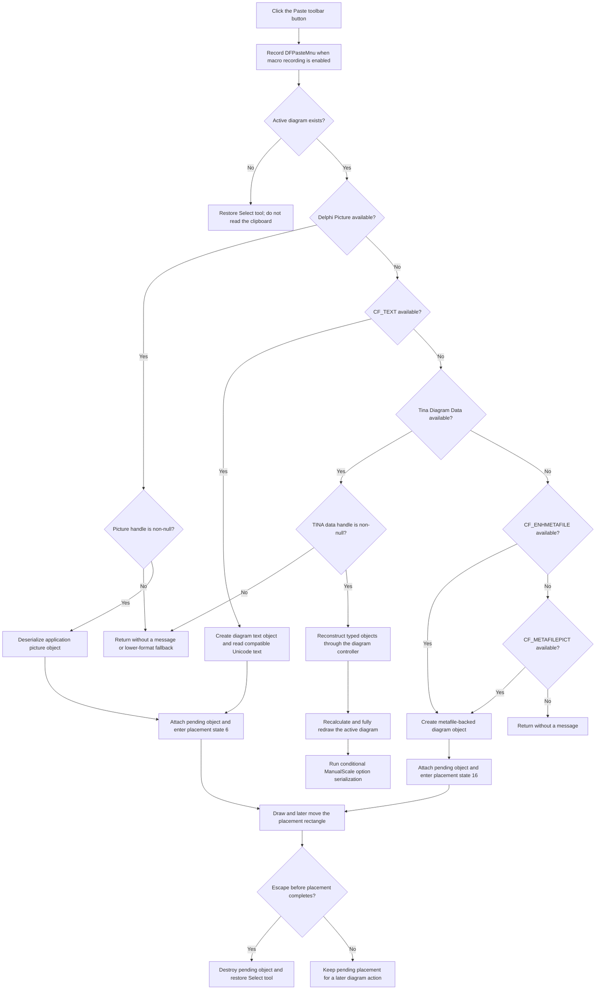

# Paste clipboard content from the diagram toolbar

> Analysis status: Source reviewed and behavior traced.

## Control

| Property | Recovered value |
| --- | --- |
| Form | `DFWindow` (`TDFWindow`) |
| Component path | `DFWindow.DFToolPanel.ToolNoteBook.Diagram.DFPasteBtn` |
| Control class | `TSpeedButton` |
| Position and size | Left `25`, Top `1`, Width `25`, Height `25` |
| Caption | Not present in the recovered resource. |
| Hint | `Paste` (`ShowHint=true`) |
| Glyph | Two-frame, 40×20 clipboard-and-document bitmap strip |
| Handler name | `DFPasteMnuClick` |
| Handler address | `01a7ee10` |
| Graph node | `resource:dfm:DFWindow/DFWindow.DFToolPanel.ToolNoteBook.Diagram.DFPasteBtn` |
| Handler node | `function:01a7ee10` |
| Graph layer | UI |

The DFM sets `NumGlyphs=2`. The extracted raster contains a colored clipboard
and document frame and a second muted frame. This supports the Paste identity
together with the `Paste` hint. The accepted formats and reconstruction rules
come from the handler source, not from the glyph.

## Shared toolbar and menu route

This speed button and **Edit > Paste** bind directly to the same handler,
`FUN_01a7ee10`. The handler does not inspect the initiating control and does
not use a toolbar-only adapter. It also records the literal command name
`DFPasteMnu`, so macro recording identifies a toolbar click as the shared menu
command rather than as `DFPasteBtn`.

The handler first checks the active-diagram field at `DFWindow +0x798`. If it
is null, it does not inspect the clipboard. It enables the recovered Select
control at `+0xA90`, invokes the Select-tool handler, and returns. It does not
create a diagram page or display a Paste error.

## Clipboard format priority

With an active diagram, the first available format wins:

| Priority | Format | Result |
| --- | --- | --- |
| 1 | Registered `Delphi Picture` | Deserialize one application text/picture object and enter placement state `6`. |
| 2 | `CF_TEXT` (`1`) | Create a diagram text object, read compatible Unicode text into it, and enter placement state `6`. |
| 3 | Registered `&Tina Diagram Data` | Reconstruct the typed TINA object graph immediately in the active diagram. |
| 4 | `CF_ENHMETAFILE` (`14`) | Create a metafile-backed diagram object and enter placement state `16`. |
| 5 | `CF_METAFILEPICT` (`3`) | Use the same metafile placement path when no enhanced metafile is available. |

The VCL owns registration of `Delphi Picture`. TINA registers
`&Tina Diagram Data`; the Copy analysis documents that private round trip and
the shared format-query and handle helpers. See
[Copy and clipboard helper analysis](dfcopymnu-c333bf53b7.md).

The handler does not combine formats. It does not fall back after it selects a
higher-priority branch. If no supported format is available, it returns
without a message. If a selected registered format reports available but its
native data handle is null, that branch also returns without trying a lower
format.

## Immediate TINA object reconstruction

The `&Tina Diagram Data` branch retrieves and locks the native clipboard
block, copies it into a temporary memory stream, and creates the application
object reader. It reads the recovered two-byte stream header and calls the
diagram controller at `DFWindow +0x7A0` through its object-read virtual method.

The matching Copy path emits this format for exact selection categories `2`
and `8`. It serializes registered object classes, selected-object records, and
their dependencies. Paste therefore reconstructs typed diagram objects and
stored relationships. It does not flatten the selection into an image or ask
the user to choose an axis again.

After the controller returns, the handler recalculates the active diagram,
redraws its coordinate systems, axes, curves, and figures, and calls the
conditional ManualScale option-serialization path. It then destroys the
temporary reader and stream. The active diagram owns the reconstructed
objects.

This branch changes the in-memory diagram immediately. It has no placement
rectangle and no later click-to-accept step. The option serialization is not a
document Save command, and this handler does not write a new diagram file.

## Picture and text placement

The Delphi Picture and text branches create the same recovered application
diagram-object class in `DFWindow` pending field `+0xFF0`. Picture data is
deserialized from the clipboard stream. The text branch creates an empty
object and copies compatible Unicode clipboard text into its inner text
object.

Both branches set placement and visibility flags, assign the active diagram as
owner, calculate the object's size, and initialize it at `(-100, -100)`. They
select the placement tool, draw the pending rectangle, and set interaction
state `6`.

The Paste click does not finish placement. Later mouse movement changes the
pending coordinates and redraws the rectangle. Escape erases the rectangle,
destroys the pending object, restores the Select tool, and clears the
interaction state. A later placement action, not this click handler, decides
the final diagram position.

## Metafile placement

For `CF_ENHMETAFILE` or `CF_METAFILEPICT`, the handler creates a
metafile-backed object in pending field `+0xFF8`. It assigns the shared VCL
Clipboard graphic, reads its width and height, assigns the active diagram as
owner, and initializes a rectangle at `(0, 0)`.

The handler selects the recovered metafile placement tool, draws the pending
rectangle, and sets interaction state `16`. Mouse movement and Escape use the
same placement and cancellation framework as state `6`. This path places a
graphic object; it does not reconstruct curves, axes, or the original editable
TINA object graph.

## Toolbar paste flow

## No-data, error, and partial-state boundaries

- Command logging occurs before the active-diagram and clipboard checks. A
  no-data or no-active-diagram click can still leave a macro record.
- No active diagram selects the Select tool and returns without reading or
  changing clipboard content.
- No supported format returns silently. The handler does not show a format or
  empty-clipboard message.
- Format checks are ordered. A null or malformed payload in the chosen branch
  does not cause a retry with a lower-priority representation.
- The TINA branch has no local transaction, rollback, or reader-error message.
  A malformed stream or exception can leave objects that were reconstructed
  before the failure. A failure during its later refresh can leave the model
  changed even when the full redraw did not finish.
- The picture, text, and metafile branches allocate and attach a pending object
  before placement completes. Escape destroys it on the normal cancellation
  path. An exception before interaction state is fully installed can leave a
  partly initialized object or pending field; the handler has no local cleanup
  or undo-stack call for this case.
- The placement branches draw only their temporary rectangle at click time.
  The custom TINA branch performs the immediate full diagram recalculation and
  redraw. Unsupported-data paths do neither.
- All successfully reconstructed or finally placed objects are in-memory
  diagram state. Persistence requires a separate Save operation. The only
  additional call here is the conditional ManualScale option serializer after
  immediate TINA reconstruction.

The canonical [Paste menu analysis](dfpastemnu-fc6c74c7ff.md) contains the
full object ownership, later movement, cancellation, and persistence trace.

## Evidence

- [Shared Paste handler `FUN_01a7ee10`](../../../DecompiledSources/Tina16/functions/0000000001A7EE10__FUN_01a7ee10.c)
  contains the active-diagram guard, five ordered format tests, reconstruction
  calls, pending-object setup, and interaction-state writes.
- [Matching Copy handler `FUN_01a7e760`](../../../DecompiledSources/Tina16/functions/0000000001A7E760__FUN_01a7e760.c)
  proves the producer and selected-object semantics of the private TINA format.
- [Clipboard format query `FUN_006a5ff0`](../../../DecompiledSources/Tina16/functions/00000000006A5FF0__FUN_006a5ff0.c)
  tests the requested native format and the VCL picture fallback.
- [Clipboard handle reader `FUN_006a5da0`](../../../DecompiledSources/Tina16/functions/00000000006A5DA0__FUN_006a5da0.c)
  opens the VCL clipboard wrapper and retrieves a requested native handle.
- [Diagram recalculation `FUN_01acfc60`](../../../DecompiledSources/Tina16/functions/0000000001ACFC60__FUN_01acfc60.c)
  and [diagram redraw `FUN_01aceb90`](../../../DecompiledSources/Tina16/functions/0000000001ACEB90__FUN_01aceb90.c)
  are called after immediate TINA reconstruction.
- [Placement movement `FUN_01a74a50`](../../../DecompiledSources/Tina16/functions/0000000001A74A50__FUN_01a74a50.c)
  and [placement cancellation `FUN_01a7d1a0`](../../../DecompiledSources/Tina16/functions/0000000001A7D1A0__FUN_01a7d1a0.c)
  consume the pending objects and states installed by Paste.
- [Extracted Paste glyph](../../../glyph/0084_DFWindow_DFWindow_DFToolPanel_ToolNoteBook_Diagram_DFPasteBtn_Glyph_Data.png)
  shows the two clipboard-and-document frames used by the speed button.
- [Glyph manifest](../../../glyph/manifest.json) records the 40×20 Delphi BMP
  source and the extracted PNG metadata.
- [Recovered UI evidence](../../../DecompiledSources/Tina16/resources/dfm/ui-evidence.json)
  identifies the button position, `Paste` hint, two glyph frames, and direct
  handler binding.

## Analysis limits

- The text branch tests `CF_TEXT` but its shared reader requests
  `CF_UNICODETEXT`. The exact VCL compatibility behavior between those formats
  is not implemented in this handler.
- The selected category-8 TINA class and the exact business names of the
  pending-object fields are not recovered.
- The custom stream header's two-byte semantic name is not recovered.
- No live clipboard or placement test was performed. The conclusions use the
  DFM binding, extracted glyph, read-only graph, clipboard helpers, recovered
  handler, and later placement consumers.

## Annotation scope

`TIARA-diz.6.7.276` is the canonical owner of shared handler `FUN_01a7ee10`.
This fragment duplicates its complete handler annotation exactly because
empty function lists are invalid. `TIARA-diz.6.7.274` owns the shared Copy,
clipboard-format, handle, registration, and serializer annotations. This Bead
only cites those helpers and does not duplicate their entries.
