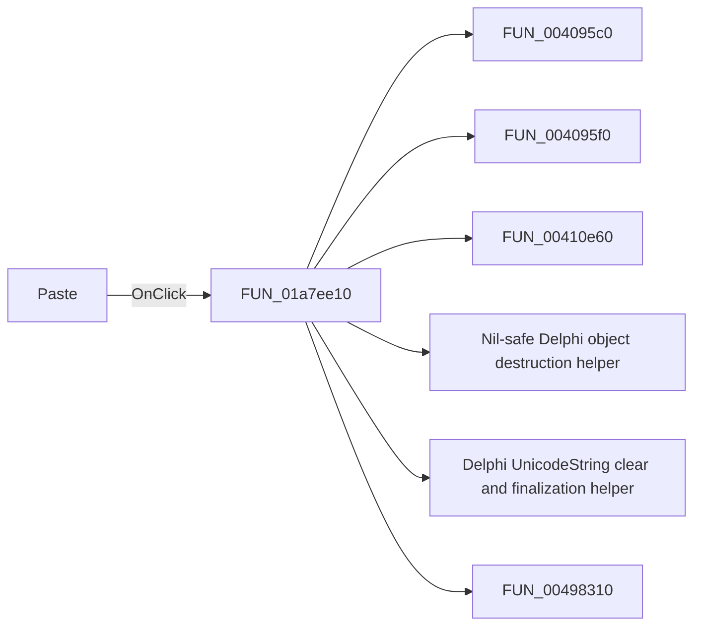

# Paste

> Analysis status: Pending individual source review.

## Control

| Property | Recovered value |
| --- | --- |
| Form | DFWindow |
| Component path | DFWindow.DFToolPanel.ToolNoteBook.Diagram.DFPasteBtn |
| Control class | TSpeedButton |
| Caption | Not present in the recovered resource. |
| Hint | Paste |
| Text | Not present in the recovered resource. |
| Handler name | DFPasteMnuClick |
| Handler address | 01a7ee10 |
| Graph node | `resource:dfm:DFWindow/DFWindow.DFToolPanel.ToolNoteBook.Diagram.DFPasteBtn` |
| Handler node | `function:01a7ee10` |
| Graph layer | UI |

## What happens when clicked

Pending individual analysis. An agent must read the recovered handler source and its relevant callees before it replaces this text.

## Click flow

## Handler evidence

- Source: [DecompiledSources/Tina16/functions/0000000001A7EE10__FUN_01a7ee10.c](../../../DecompiledSources/Tina16/functions/0000000001A7EE10__FUN_01a7ee10.c)
- Recovered role: Not present in the recovered resource.
- Current graph summary: Handles 2 Delphi UI events: DFWindow.DFToolPanel.ToolNoteBook.Diagram.DFPasteBtn.OnClick, DFWindow.DFMainMenu.DFEditMnu.DFPasteMnu.OnClick.
- Current graph behavior: Not present in the recovered resource.
- Current graph evidence: Not present in the recovered resource.
- Complexity: complex
- Distinct outgoing calls: 29

## Direct calls

- `function:004095c0` — FUN_004095c0
- `function:004095f0` — FUN_004095f0
- `function:00410e60` — FUN_00410e60
- `function:00410f20` — Nil-safe Delphi object destruction helper
- `function:00414480` — Delphi UnicodeString clear and finalization helper
- `function:00498310` — FUN_00498310
- `function:00498350` — FUN_00498350
- `function:004b89e0` — Delphi complete stream-write helper
- `function:0064e140` — FUN_0064e140
- `function:006a5710` — FUN_006a5710
- `function:006a5da0` — FUN_006a5da0
- `function:006a5ff0` — FUN_006a5ff0
- `function:006a6030` — FUN_006a6030
- `function:0082a6c0` — FUN_0082a6c0
- `function:010f0500` — FUN_010f0500
- `function:01a5d940` — FUN_01a5d940
- `function:01a5ee60` — FUN_01a5ee60
- `function:01a5eed0` — FUN_01a5eed0
- `function:01a5f250` — FUN_01a5f250
- `function:01a794b0` — Handles 1 Delphi UI event: DFWindow.DFToolPanel.ToolNoteBook.Diagram.DFSelectBtn.OnClick.
- `function:01a8dd40` — FUN_01a8dd40
- `function:01aceb90` — FUN_01aceb90
- `function:01acfc60` — FUN_01acfc60
- `function:01add6f0` — FUN_01add6f0
- `function:01aed550` — FUN_01aed550
- `function:01aee720` — FUN_01aee720
- `function:01d30b30` — FUN_01d30b30
- `function:01d30e90` — FUN_01d30e90
- `function:01d331a0` — FUN_01d331a0

## Resource evidence

- Kind: Not present in the recovered resource.
- Modal result: Not present in the recovered resource.
- Checked state: Not present in the recovered resource.
- List items: Not present in the recovered resource.
- Image reference: Not present in the recovered resource.
- Extracted glyph: [`0084_DFWindow_DFWindow_DFToolPanel_ToolNoteBook_Diagram_DFPasteBtn_Glyph_Data.png`](../../../glyph/0084_DFWindow_DFWindow_DFToolPanel_ToolNoteBook_Diagram_DFPasteBtn_Glyph_Data.png)

## Nearby label candidates

Nearby labels are layout candidates only. They are not proof of behavior.

- No same-parent label candidate is available.

## Analysis limits

- Do not infer behavior from the control class, caption, hint, glyph, or nearby label alone.
- Do not replace the pending status until the handler source and relevant call path provide enough evidence.
