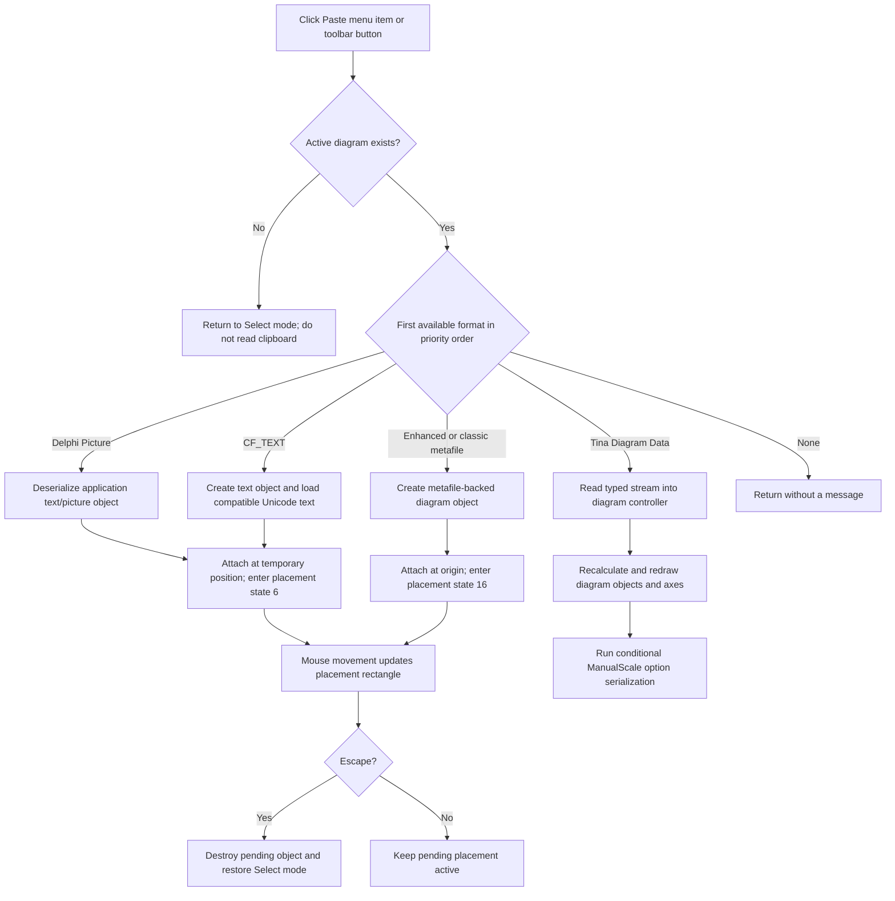

# Paste supported clipboard content into the diagram

> Analysis status: Evidence-backed source review complete.

## Control

| Property | Recovered value |
| --- | --- |
| Form | DFWindow |
| Component path | DFWindow.DFMainMenu.DFEditMnu.DFPasteMnu |
| Control class | TMenuItem |
| Caption | &Paste |
| Hint | Not present in the recovered menu resource. |
| Handler name | DFPasteMnuClick |
| Handler address | 01a7ee10 |
| Graph node | `resource:dfm:DFWindow/DFWindow.DFMainMenu.DFEditMnu.DFPasteMnu` |
| Handler node | `function:01a7ee10` |
| Graph layer | UI |

## What happens when clicked

`FUN_01a7ee10` records the `DFPasteMnu` command, checks that DFWindow has an
active diagram at form offset `+0x798`, and selects the first supported
clipboard representation in a fixed order. The menu item and the toolbar
speed button `DFPasteBtn` use the same handler.

If there is no active diagram, the handler does not read the clipboard. It
enables the control at `+0xa90`, calls the Select-tool handler, and returns.
The Select-tool handler clears the diagram interaction state. The source does
not create a page or show a paste error on this path.

## Clipboard formats and priority

The first format that reports available wins:

| Priority | Format | Recovered behavior |
| --- | --- | --- |
| 1 | Registered `Delphi Picture` | Deserializes one application text/picture diagram object and starts interactive placement. |
| 2 | `CF_TEXT` (`1`) | Reads compatible Unicode clipboard text into a new diagram text object and starts interactive placement. |
| 3 | Registered `&Tina Diagram Data` | Reconstructs the serialized selected diagram objects directly in the active diagram. |
| 4 | `CF_ENHMETAFILE` (`14`) | Copies the clipboard graphic into a new metafile-backed diagram object and starts interactive placement. |
| 5 | `CF_METAFILEPICT` (`3`) | Uses the same metafile-object path when no enhanced metafile is available. |

The VCL registers the first format as `Delphi Picture`. TINA separately
registers `&Tina Diagram Data`. The text branch tests `CF_TEXT`, but its shared
reader requests `CF_UNICODETEXT` (`13`) and copies that text into the new
object. There is no separate Unicode-format availability test in this handler.

If no supported format is available, the handler returns after command
logging. If the selected registered format reports available but returns a
null data handle, the branch also returns without a message. It does not try a
lower-priority format after it has selected a branch.

## TINA diagram-data reconstruction

The custom TINA branch is the only branch that inserts the clipboard data
immediately rather than entering placement mode:

1. It copies the `&Tina Diagram Data` global-memory block to a temporary
   stream and creates the application object reader.
2. It reads the stream header and passes the reader plus the recovered
   two-byte header value to the diagram controller at form offset `+0x7a0`,
   virtual slot `+0x30`.
3. The controller reconstructs the serialized object set. The matching Copy
   command writes this format only for recovered selection classes `2` and
   `8`; its serializer writes the selected objects through their class-specific
   stream writers. Registered-class loading constructs objects from their
   stored class identifiers rather than flattening them to an image.
4. The handler recalculates the active diagram, redraws coordinate systems,
   axes, curves, and figures, and requests diagram-option serialization.
5. It destroys the temporary reader and memory stream. The reconstructed
   objects remain owned by the active diagram model.

The handler does not create an axis, choose an axis, or assign a curve to an
axis in a separate paste step. Object ownership and stored curve-to-axis
relationships are restored by the typed object reconstruction. This is also
why the custom branch does not use the `(-100, -100)` placement fields used by
the other application-object branches.

The final serialization call is conditional. `FUN_01add6f0` writes diagram,
coordinate-system, axis, curve, and figure options only when `Diagram Page
Setup / ManualScale` is enabled in `TINA.INI`. This is not a document Save
command.

## Text and Delphi-picture placement

Both branches produce the same application diagram-object class. The Delphi
Picture branch constructs it from the clipboard stream. The text branch
constructs an empty object and writes the recovered Unicode text into its
inner text object.

The handler then:

- sets the object's recovered visibility/placement flags;
- initializes its position and DFWindow's placement coordinates to
  `(-100, -100)`;
- calculates its displayed width and height against the current diagram
  canvas;
- sets its owner pointer to the active diagram model and invokes the object's
  attach/initialization virtual method;
- calculates its display scale from the diagram and font metrics;
- selects interaction mode `5`, redraws the pending rectangle, and writes
  interaction state `6`.

State `6` is a placement state. DFWindow's mouse-move handler erases the old
rectangle, updates the pending X and Y fields to the pointer coordinates, and
draws the rectangle at the new position. The Escape/cancel handler erases the
rectangle, destroys the pending object at `+0xff0`, restores the Select mode,
and clears the interaction state. The paste click itself does not finish this
placement and does not call the ManualScale serializer on these branches.

## Metafile placement

For `CF_ENHMETAFILE` or `CF_METAFILEPICT`, the handler creates a metafile-backed
diagram object at form offset `+0xff8` and assigns the shared Clipboard object
to its internal graphic. It obtains the graphic width and height, initializes
the rectangle at `(0, 0)`, assigns the active diagram model as owner, and calls
the object's attach/initialization method.

It then selects interaction mode `-12`, redraws the pending rectangle, and
sets interaction state `16`. Mouse movement updates the same placement
coordinates and rectangle. The Escape/cancel path treats states `6` and `16`
alike: it destroys both pending-object fields and returns to Select mode. No
curve or axis is reconstructed from a standard metafile.

## Click flow

## Handler and supporting evidence

- Paste handler: [FUN_01a7ee10](../../../DecompiledSources/Tina16/functions/0000000001A7EE10__FUN_01a7ee10.c)
- Matching Copy command and custom-format writer:
  [FUN_01a7e760](../../../DecompiledSources/Tina16/functions/0000000001A7E760__FUN_01a7e760.c)
- Selected-object stream serializer:
  [FUN_01cedda0](../../../DecompiledSources/Tina16/functions/0000000001CEDDA0__FUN_01cedda0.c)
- Registered-class object loader used by the diagram controller class:
  [FUN_01ced260](../../../DecompiledSources/Tina16/functions/0000000001CED260__FUN_01ced260.c)
- Clipboard format checks, handles, and text reader:
  [FUN_006a5ff0](../../../DecompiledSources/Tina16/functions/00000000006A5FF0__FUN_006a5ff0.c),
  [FUN_006a5da0](../../../DecompiledSources/Tina16/functions/00000000006A5DA0__FUN_006a5da0.c), and
  [FUN_006a5710](../../../DecompiledSources/Tina16/functions/00000000006A5710__FUN_006a5710.c)
- Diagram recalculation and redraw:
  [FUN_01acfc60](../../../DecompiledSources/Tina16/functions/0000000001ACFC60__FUN_01acfc60.c) and
  [FUN_01aceb90](../../../DecompiledSources/Tina16/functions/0000000001ACEB90__FUN_01aceb90.c)
- Conditional diagram-option serialization:
  [FUN_01add6f0](../../../DecompiledSources/Tina16/functions/0000000001ADD6F0__FUN_01add6f0.c)
- Placement movement and cancellation:
  [FUN_01a74a50](../../../DecompiledSources/Tina16/functions/0000000001A74A50__FUN_01a74a50.c) and
  [FUN_01a7d1a0](../../../DecompiledSources/Tina16/functions/0000000001A7D1A0__FUN_01a7d1a0.c)
- [DFWindow Edit menu](dfeditmnu-acd28845e8.md) documents the shared menu-state
  updater that can disable Paste. That helper does not execute the command.

## Resource and glyph evidence

- The menu item has caption **Paste** with mnemonic `P`. It has no hint,
  action, image reference, or embedded glyph.
- `DFPasteBtn` is a `TSpeedButton` that resolves to the same handler and has
  hint **Paste**.
- [The toolbar glyph](../../../glyph/0084_DFWindow_DFWindow_DFToolPanel_ToolNoteBook_Diagram_DFPasteBtn_Glyph_Data.png)
  is a 40-by-20 two-state raster strip. Its active frame shows a clipboard and
  document motif, and the second frame is the muted state. This supports the
  Paste identity, while the handler source establishes the accepted formats
  and effects.

## Errors, ownership, and evidence limits

- The handler has no local exception handler, format-validation message, or
  transaction rollback. A malformed typed stream, failed allocation, or
  exception during reconstruction can leave already-created model objects or
  refresh state in place.
- Once a higher-priority format is selected, a null or malformed payload does
  not cause a retry with a lower-priority format.
- The text and picture branches allocate and attach their pending object before
  placement completes. Escape explicitly destroys that object. The source
  does not expose a recovered undo-stack operation for the paste click.
- The custom TINA branch transfers temporary stream ownership to no model
  object: it destroys the reader and stream after reconstruction. The diagram
  owns the reconstructed objects. The standard placement branches keep their
  object in DFWindow's pending field until later placement or cancellation.
- The exact meaning of the custom stream's two-byte header value and the
  Delphi names of DFWindow fields `+0xff0`, `+0xff8`, and `+0x1010` through
  `+0x101c` are not recovered. Their roles are described from call-site data
  flow and later readers.
