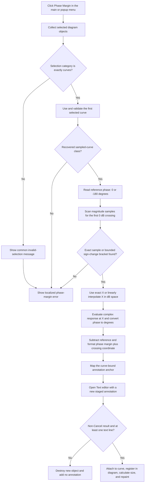

# Add a phase-margin annotation at the 0 dB crossing

> Analysis status: Evidence-backed source review complete.

## Control

| Property | Recovered value |
| --- | --- |
| Form | DFWindow |
| Component path | DFWindow.DFMainMenu.DFProcessingMnu.DFPhaseMarginMnu |
| Control class | TMenuItem |
| Caption | Phase Margin ... |
| Hint | Not present on this item. The parent Processing menu has `Select a curve first!`. |
| Handler name | DFPhaseMarginMnuClick |
| Handler address | 01a86890 |
| Graph node | `resource:dfm:DFWindow/DFWindow.DFMainMenu.DFProcessingMnu.DFPhaseMarginMnu` |
| Handler node | `function:01a86890` |
| Graph layer | UI |

## What happens when clicked

`FUN_01a86890` calculates phase margin from the first selected curve and starts a curve-bound text annotation. The annotation initially has two localized lines: the phase-margin value (`DrawWind.PhaseMargin`) and its crossing coordinate (`DrawWind.MFreqTxt`). The handler then opens the common **Text** editor. The user can edit or reject this staged annotation before it enters the diagram.

`DFWindow.DFPopupMnu.PhasemarginPuMnu` has caption `Phase margin ...` and uses the same handler. The main-menu and popup-menu commands therefore run the same calculation and annotation path.

## Selection guard

The shared selection classifier must return exactly category `2`. Other DFWindow call sites establish category `2` as the curve category. Because the classifier combines the category bits of all selected objects, a mixed selection does not pass this test.

`FUN_01ae6c10` then reads only list index zero and verifies that this object has the recovered sampled-curve class. A selection of several curves can pass, but only the first curve is analyzed and linked to the result. The other selected curves do not affect this click path.

If the selection category is not `2`, the helper shows the common invalid-selection message and returns false. The click handler then also shows `DrawWind.PhaseMarginError`. If category `2` passes but the first object fails the class test, or if the calculation cannot find a crossing, only the phase-margin error is shown.

## Phase-margin calculation

The handler reads the configured **Gain & phase margin reference phase (degrees)** option. The recovered combo box contains `0` and `-180`. It passes `-180` when the stored option byte equals `1`; otherwise it passes `0`.

`FUN_01abeac0` builds a complex-response adapter for the selected curve. It asks the common crossing scanner to find target `0.0` in the displayed magnitude data:

- For each complex sample, the scanner calculates its magnitude and converts it to `20 * log10(magnitude)`.
- An exact 0 dB sample supplies its horizontal coordinate directly.
- Otherwise, the scanner finds the first adjacent pair on opposite sides of 0 dB, checks the provider domain bounds, and linearly interpolates the crossing coordinate in horizontal-coordinate/dB space.
- It fails when it cannot find a valid exact value or bounded sign-change bracket.

After a crossing is found, the adapter evaluates the complex response at that coordinate. The calculator obtains its phase angle, converts radians to degrees with factor `57.29577951308232`, and subtracts the configured reference:

`reported phase margin = phase angle in degrees at the 0 dB crossing - reference phase`

For reference `-180`, this is phase angle plus 180 degrees. For reference `0`, it is the raw phase angle in degrees. The handler formats both numbers with the application's engineering-number formatter. The phase result is in degrees. The crossing value remains in the curve's horizontal-axis units; this handler does not convert it to a fixed unit such as hertz.

The crossing scanner returns only its first accepted result in provider order. The command does not offer a choice when the curve has several 0 dB crossings.

## Annotation anchor and result dialog

The handler refreshes the selected curve's data provider before it chooses the annotation anchor. For the normal provider branch, the anchor uses the crossing coordinate as X and evaluates the curve value there for Y. For the special recovered provider class, its coordinate-mapping method returns both anchor coordinates.

The shared `FUN_01a8a3c0` helper creates a new staged system-text object, copies the two generated lines into it, and opens `CSysTextDlg`:

- Modal result `2` (Cancel) destroys the new object, clears the current-object field, and resets the recovered tool-state byte to `0`.
- A non-Cancel result with zero staged text lines is rejected in the same way.
- A non-Cancel result with at least one line copies the edited text and style, stores the selected curve and anchor coordinates, attaches the object to that curve, registers and finalizes it in the active diagram, calculates its display size, and repaints its rectangle. The recovered tool-state byte becomes `6`.

There is no phase-margin-result lookup or duplicate check before the helper allocates the new object. Each successful invocation starts a separate staged annotation. The recovered path does not show whether a later diagram registration rule merges equivalent objects, so automatic deduplication is not established.

## Click flow

## Handler and helper evidence

- Click handler, reference choice, formatting, and anchor selection: [FUN_01a86890](../../../DecompiledSources/Tina16/functions/0000000001A86890__FUN_01a86890.c)
- Selection and curve-class guard: [FUN_01ae6c10](../../../DecompiledSources/Tina16/functions/0000000001AE6C10__FUN_01ae6c10.c)
- Selected-curve data wrapper: [FUN_01ab5700](../../../DecompiledSources/Tina16/functions/0000000001AB5700__FUN_01ab5700.c)
- Crossing, phase evaluation, degree conversion, and reference subtraction: [FUN_01abeac0](../../../DecompiledSources/Tina16/functions/0000000001ABEAC0__FUN_01abeac0.c)
- Exact crossing and linear interpolation: [FUN_01abe710](../../../DecompiledSources/Tina16/functions/0000000001ABE710__FUN_01abe710.c)
- Result-annotation editor, commit, and repaint path: [FUN_01a8a3c0](../../../DecompiledSources/Tina16/functions/0000000001A8A3C0__FUN_01a8a3c0.c)
- Shared selection classifier: [FUN_01acff30](../../../DecompiledSources/Tina16/functions/0000000001ACFF30__FUN_01acff30.c)
- Recovered form, menu, and reference-option resources: [ui-evidence.json](../../../DecompiledSources/Tina16/resources/dfm/ui-evidence.json)

`FUN_01abe710` and `FUN_01a8a3c0` use the canonical descriptions owned by the crossover-frequency analysis (`TIARA-diz.6.7.293`). This control's annotation fragment does not redefine them.

## Resource and glyph evidence

- The main item has caption `Phase Margin ...`; the popup item has `Phase margin ...`. Their ellipses agree with the proven text-editor path, but the handler source establishes that path.
- The Analysis Options form labels the setting **Gain & phase margin reference phase (degrees)** and offers values `0` and `-180`.
- Neither phase-margin menu item has its own hint, action, shortcut, image-list reference, embedded glyph, or same-parent label candidate.
- The Processing parent menu hint, `Select a curve first!`, agrees with the recovered selection guard. It does not identify which curve is used; the source proves that list index zero is used.

## Boundaries, errors, and persistence

- A failed selection or calculation creates no staged annotation and performs no result repaint. Cancel or empty staged text destroys only the newly created object and adds no new annotation.
- The magnitude-to-dB helper returns its fallback value `0` when magnitude is not positive. Consequently, the recovered scanner can treat such a sample as an exact 0 dB target. The source does not show whether upstream curve data excludes this case.
- A successful acceptance changes the live diagram. This click path contains no file-save, INI-write, database-write, or explicit undo-stack call. Later document serialization can be responsible for persistence, but it is outside this recovered path.
- The handler and analysis helpers have no local exception handler or transactional rollback. An exception during text-object creation or diagram registration can leave partial in-memory state until outer Delphi cleanup runs.
- The handler passes the active diagram field to the selection classifier without a local null check. The recovered source does not establish behavior for a direct invocation with no active diagram; normal menu enablement is outside this handler.
- The original Delphi field names, exact translated result prefixes, and any downstream duplicate-merging policy are not recovered.
