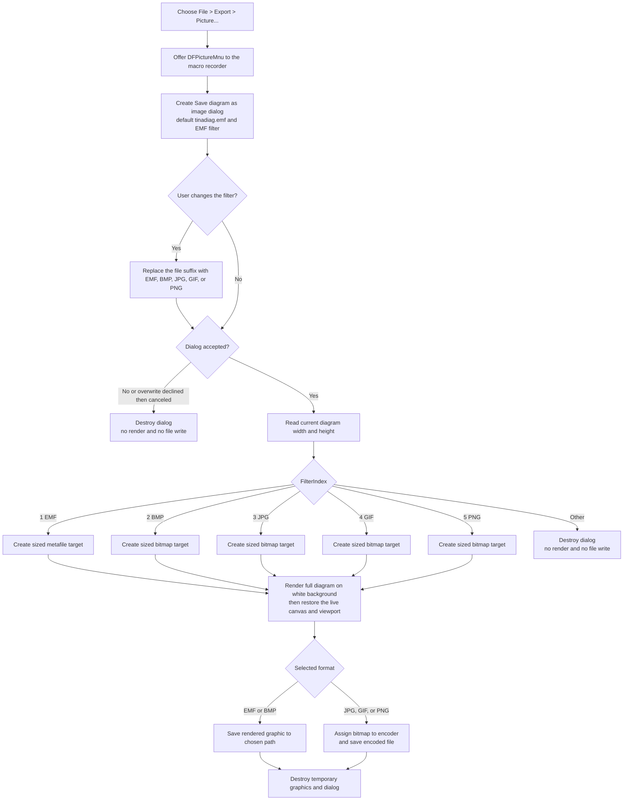

# Export the diagram as an image

> Analysis status: Source reviewed and behavior traced.

## Control

| Property | Recovered value |
| --- | --- |
| Form | DFWindow |
| Menu path | File > Export > Picture... |
| Component path | DFWindow.DFMainMenu.DFFileMnu.DFExportMnu.DFPictureMnu |
| Control class | TMenuItem |
| Caption | Picture... |
| Hint | Not present in the recovered resource. |
| Handler name | DFPictureMnuClick |
| Handler address | 01a86fd0 |
| Graph node | `resource:dfm:DFWindow/DFWindow.DFMainMenu.DFFileMnu.DFExportMnu.DFPictureMnu` |
| Handler node | `function:01a86fd0` |
| Graph layer | UI |

The command renders the current diagram to a user-selected graphics file. It
does not export editable TINA diagram objects.

## Save dialog

`FUN_01a86fd0` creates a new save dialog for each click and configures it as
follows:

| Setting | Recovered value |
| --- | --- |
| Title | `Save diagram as image` |
| Default extension | `emf` |
| Default file name | `tinadiag.emf` |
| Default filter index | 1, Windows Metafile |
| Options | Overwrite prompt, hide read-only, show Help, and require an existing path |

The handler does not set an initial directory and does not load a previously
used export path. The dialog object is destroyed after this click.

The filter-change callback `FUN_01a86d00` preserves the current directory and
base file name, replaces the extension, and updates the file-name edit control:

| FilterIndex | Dialog filter | Replacement extension | Writer |
| ---: | --- | --- | --- |
| 1 | Windows Metafile | `.EMF` | Enhanced metafile object |
| 2 | Bitmap File | `.BMP` | Bitmap object |
| 3 | JPEG File | `.JPG` | JPEG encoder fed from a bitmap |
| 4 | GIF File | `.GIF` | GIF encoder fed from a bitmap |
| 5 | PNG File | `.PNG` | PNG encoder fed from a bitmap |

The selected filter index chooses the writer. The handler does not inspect the
final suffix before it writes. The callback normally keeps the suffix aligned
when the user changes the filter, but a later manually edited suffix does not
change the selected encoder.

## Rendering and output size

After the dialog returns success, the handler reads the current diagram manager
at `DFWindow +0x798`. It calculates the output dimensions from the manager's
active drawing rectangle:

- width = `right (+0x1C) - left (+0x14)`;
- height = `bottom (+0x20) - top (+0x18)`.

For BMP, JPEG, GIF, and PNG, these values become the raster width and height in
pixels. The EMF object receives the same width and height. The command has no
separate DPI, scale, quality, compression, color-depth, or resolution dialog.
It also has no explicit positive-size validation.

`FUN_01a80e70` renders to an off-screen target with an export rectangle from
`(0, 0)` to `(width, height)`. It temporarily replaces the form canvas at
`DFWindow +0x780`, applies the export viewport, recalculates the diagram layout,
and calls the common diagram painter. The painter fills the drawing rectangle
with color `0xFFFFFF`, so every format receives a white background. The GIF and
PNG paths do not request transparency.

The regular diagram painter traverses the diagram members, overlay objects, and
cursor objects. This command does not collect a selected object set, crop to a
selection, or set the special selection-render flag used by the separate Copy
command. It therefore exports the full current diagram drawing area, not only
the selected object or selected region.

When rendering completes, the helper restores the original form canvas,
recomputes the current screen viewport through `FUN_01a782f0`, recalculates the
screen layout, and repaints the live display. The file writer runs only after
this normal restoration has completed.

## Format-specific file creation

- EMF creates a metafile at the calculated size, renders directly to its
  canvas, and calls its file-save method.
- BMP creates a bitmap at the calculated size, renders to its canvas, and saves
  that bitmap directly.
- JPEG, GIF, and PNG first render the same-size bitmap. The handler then creates
  the selected encoder, assigns the bitmap to it, and calls the encoder's
  file-save method.

No branch changes image-quality or compression properties after it constructs
the graphics object. The output uses the recovered VCL or graphics-library
defaults for that format.

## Export flow

## Cancel, overwrite, and invalid state

- Cancel makes the dialog return false. The handler skips the manager read,
  allocation, render, encoder, and file-write paths. The command has already
  been offered to the macro-recorder path before the dialog opens.
- The `ofOverwritePrompt` option makes the common save dialog request
  confirmation before it returns success for an existing file. There is no
  second overwrite question after the dialog succeeds.
- A filter index outside 1 through 5 enters no output branch. The accepted
  dialog is destroyed without rendering or writing a file.
- If the returned file name is empty, the selected image is rendered, but the
  guarded file-save call is skipped. A normal accepted save dialog is expected
  to provide a non-empty name.
- The handler does not check the diagram-manager pointer before it reads the
  drawing rectangle. A stale or direct invocation with no manager can fail
  after the user accepts the dialog.
- Zero or negative dimensions have no handler-level error message or fallback.
  A graphics constructor, size setter, or renderer can reject them.

## Error and partial-state behavior

The recovered handler has no local exception message, retry, rollback, or
transactional temp-file rename. An allocation, render, encoder, or file-write
exception propagates to the surrounding Delphi/VCL exception path.

The render helper restores the live canvas and screen viewport before the
normal file-save call. Thus, a file-write failure happens after normal display
restoration. A render failure can occur while the temporary canvas and export
viewport are still installed; the recovered path does not prove that those
state changes have already been reversed when control unwinds.

Once an overwrite is accepted, the image object's save method can create or
truncate the target before all encoded data is written. Because this handler
has no temporary-file commit or rollback step, an exception can leave no old
file or can leave a partial output file. The source does not report success or
failure in the diagram model and does not remember the output path.

On success, temporary image, bitmap, canvas, encoder, and dialog objects are
destroyed. The diagram data, selection, curves, axes, and cursor positions are
not changed by this command. Rendering can update layout or drawing caches, but
the helper restores and redraws the live diagram before it returns.

## Evidence

- [Picture export handler `FUN_01a86fd0`](../../../DecompiledSources/Tina16/functions/0000000001A86FD0__FUN_01a86fd0.c)
  configures the dialog, maps all five filter indexes, derives the dimensions,
  renders the graphics objects, and dispatches their file-save methods.
- [Filter-change callback `FUN_01a86d00`](../../../DecompiledSources/Tina16/functions/0000000001A86D00__FUN_01a86d00.c)
  keeps the current directory and base name and replaces the suffix for the
  selected format.
- [Off-screen diagram renderer `FUN_01a80e70`](../../../DecompiledSources/Tina16/functions/0000000001A80E70__FUN_01a80e70.c)
  installs the export canvas and viewport, draws, and restores the live canvas
  and recalculated screen viewport.
- [Common diagram painter `FUN_01aceb90`](../../../DecompiledSources/Tina16/functions/0000000001ACEB90__FUN_01aceb90.c)
  fills the active rectangle white and traverses diagram, overlay, and cursor
  objects.
- [Screen viewport calculator `FUN_01a782f0`](../../../DecompiledSources/Tina16/functions/0000000001A782F0__FUN_01a782f0.c)
  rebuilds the live drawing rectangle after the export render.
- [Graphics format registration `FUN_00a44b20`](../../../DecompiledSources/Tina16/functions/0000000000A44B20__FUN_00a44b20.c)
  identifies the Bitmap, GIF, JPEG, PNG, and Windows Metafile graphic families.
- [Recovered UI evidence](../../../DecompiledSources/Tina16/resources/dfm/ui-evidence.json)
  binds the `Picture...` item under the `File > Export` menu to this handler.

## Evidence limits and annotation scope

- The runtime literal referenced as `DAT_01a87828` resolves to `emf`; the
  decompiled C file keeps the data label instead of printing the literal.
- The source proves the writer classes from the filter order, branch-specific
  construction, bitmap-to-encoder assignments, and graphics registration. It
  does not expose user-facing encoder option names because this command does
  not open an encoder-settings dialog.
- The annotation fragment owns the unique menu handler, its unique
  filter-change callback, and its dedicated off-screen export renderer. Shared
  VCL dialogs, image classes, diagram-layout routines, and painters are cited
  without duplicate annotations.
- No live export was run. File content, encoder defaults, and failure behavior
  are documented from the recovered dialog, graphics, render, and writer paths.
