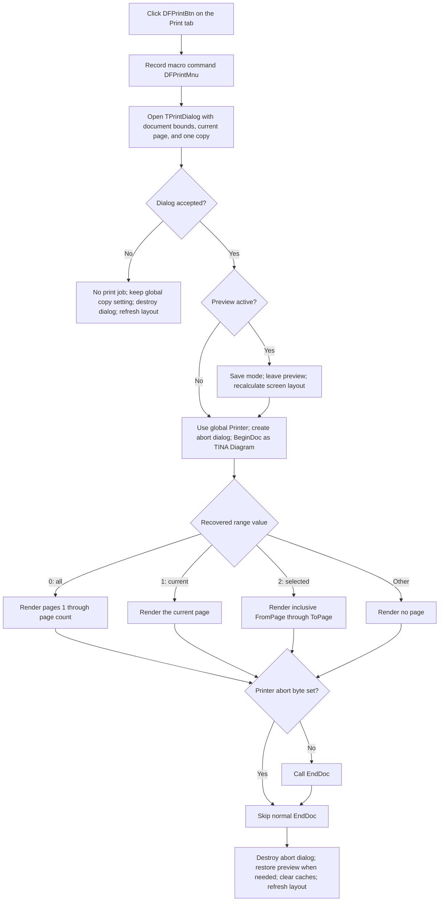

# Print diagram pages from the Print toolbar

> Analysis status: Evidence-backed source review complete.

## Control

| Property | Recovered value |
| --- | --- |
| Form | DFWindow |
| Component path | DFWindow.DFToolPanel.ToolNoteBook.Print.DFPrintBtn |
| Control class | TSpeedButton |
| Caption | Not present in the recovered resource. |
| Hint | Print |
| Handler name | DFPrintMnuClick |
| Handler address | 01a7ab10 |
| Graph node | `resource:dfm:DFWindow/DFWindow.DFToolPanel.ToolNoteBook.Print.DFPrintBtn` |
| Handler node | `function:01a7ab10` |
| Handler graph layer | UI |

## What happens when clicked

`DFPrintBtn` is the Print-tab toolbar route to the shared print command. The
separate print-preview handler selects this tab when preview is enabled. The
button click itself does not select a notebook page and does not test which page
is visible. It calls `FUN_01a7ab10`, the same handler as the File menu item
`DFPrintMnu`.

The shared handler first records the macro command as `DFPrintMnu`, even when
the toolbar button is the sender. It creates a temporary `TPrintDialog`, sets
the document page bounds, selects the current-page range, sets one copy, assigns
help context `0x1fc`, and opens the dialog. It never sends a document directly
to the printer without this dialog.

## Page range and copy handling

After the user accepts the dialog, the recovered range byte has three handled
values:

- `0` sends all pages, from page 1 through the document page count.
- `1` sends only the current page. The handler converts the document's
  zero-based current-page index to a one-based print page number.
- `2` sends the inclusive `FromPage` through `ToPage` range from the dialog.

Before opening the dialog, `FUN_00725ea0` writes one copy to both the dialog and
the process-wide Delphi printer. The recovered application copy loop is also
fixed to one iteration. It does not implement application-level collation or a
second copy loop. A printer driver can still apply behavior that is not visible
in the recovered application code.

For each requested page, shared renderer `FUN_01ceca50` replaces the active
drawing surface with the global printer canvas, changes the page to printer
mode `2`, lays it out against the printer width and height, draws it, and then
restores its prior geometry, mode, and drawing surface. It calls `NewPage`
between pages. The renderer and its canonical annotation belong to
`TIARA-diz.6.7.285`; this control article cites that shared role but does not
publish a duplicate renderer annotation.

## Print-preview and global printer state

If print preview is active, the accepted path temporarily unchecks the preview
control, changes the active diagram from preview mode to normal mode `0`, and
recalculates the screen layout before it begins the print job. After the print
path returns normally, it restores the saved page mode, rechecks preview, and
recalculates the preview layout.

The command uses the lazily created, process-wide Delphi `Printer` object. It
sets its job title to `TINA Diagram` and calls `BeginDoc`. It also creates the
modeless `PrinterAbortDlg`, stores that form in the global abort-dialog pointer,
fills its file and printer labels, shows it, and processes pending application
messages. On normal cleanup it destroys that dialog and clears the global
pointer. The printer singleton itself remains alive for later print and setup
commands.

The abort button calls the printer abort operation and closes the abort dialog.
After rendering, `FUN_01a7ab10` tests the printer's abort byte. It calls the
normal `EndDoc` operation only when that byte is clear. The page renderer does
not visibly test the abort byte between its own page-loop iterations, so the
exact page on which the native print system stops is not established.

## Cancel, no-op, and error paths

If the user cancels the print dialog, the handler does not call `BeginDoc`,
does not create the abort dialog, and does not render a page. The copy setter
has already fetched or created the global printer and set its copy count to one
before the dialog opens. Cancel does not
undo that change. The handler destroys the temporary print dialog, clears the
cached width and height of every diagram page, and calls the normal DFWindow
resize/layout handler. Thus Cancel can change shared printer and layout-cache
state, but it cannot create printer output.

The dialog normally restricts the range to valid document pages. The handler
does not independently validate the active diagram pointer, current-page index,
or accepted page numbers. An unexpected range value other than `0`, `1`, or
`2` reaches the job cleanup without calling the page renderer. If an
inconsistent document state reaches the all-pages dispatch with a zero page
count, the renderer receives an empty `1..0` range and skips it. Other invalid
page indexes can reach the page-list lookup.

The handler does not test whether `BeginDoc` successfully made the printer
active. It has no recovered local exception handler, retry, rollback, or
user-facing print-error message. A failure after preview state, global drawing
state, or the abort-dialog pointer changes can therefore leave partial
transient state until a higher-level VCL cleanup path runs. The recovered code
does not prove such higher-level recovery.

## Document and persistence effects

Printing is an output operation. This handler does not add, remove, or edit a
diagram object, does not set the document-modified state, does not call the Save
command, and does not serialize the document. It changes printer-job state,
temporary preview and drawing state, and page-layout caches. The normal return
path restores the temporary page state and rebuilds the screen layout. The
selected global printer and its native settings are shared with the separate
Print Setup command rather than owned by this button.

## Click flow

## Handler and helper evidence

- Shared print handler:
  [FUN_01a7ab10](../../../DecompiledSources/Tina16/functions/0000000001A7AB10__FUN_01a7ab10.c)
- Canonical menu-command analysis:
  [DFPrintMnu](dfprintmnu-44edd8f753.md)
- Shared page-range renderer:
  [FUN_01ceca50](../../../DecompiledSources/Tina16/functions/0000000001CECA50__FUN_01ceca50.c)
- Global printer getter and copy setter:
  [FUN_0069e8a0](../../../DecompiledSources/Tina16/functions/000000000069E8A0__FUN_0069e8a0.c)
  and
  [FUN_00725ea0](../../../DecompiledSources/Tina16/functions/0000000000725EA0__FUN_00725ea0.c)
- Printer `BeginDoc`, `EndDoc`, `NewPage`, and abort operations:
  [FUN_0069d590](../../../DecompiledSources/Tina16/functions/000000000069D590__FUN_0069d590.c),
  [FUN_0069d650](../../../DecompiledSources/Tina16/functions/000000000069D650__FUN_0069d650.c),
  [FUN_0069d690](../../../DecompiledSources/Tina16/functions/000000000069D690__FUN_0069d690.c),
  and
  [FUN_0069d550](../../../DecompiledSources/Tina16/functions/000000000069D550__FUN_0069d550.c)
- Abort button handler:
  [FUN_01800670](../../../DecompiledSources/Tina16/functions/0000000001800670__FUN_01800670.c)
- Print-preview handler that selects the Print tab:
  [FUN_01a7ce40](../../../DecompiledSources/Tina16/functions/0000000001A7CE40__FUN_01a7ce40.c)
- Screen layout restoration:
  [FUN_01a77f90](../../../DecompiledSources/Tina16/functions/0000000001A77F90__FUN_01a77f90.c)
- Recovered form and control resource evidence:
  [ui-evidence.json](../../../DecompiledSources/Tina16/resources/dfm/ui-evidence.json)

## Resource and glyph evidence

- `DFPrintBtn` is a 25 by 25 `TSpeedButton` under the `Print` tab. It has hint
  `Print`, no caption, `NumGlyphs = 2`, and a 1,882-byte embedded bitmap.
- The extracted 40 by 20 PNG contains two printer-state frames:
  [printer glyph](../../../glyph/0109_DFWindow_DFWindow_DFToolPanel_ToolNoteBook_Print_DFPrintBtn_Glyph_Data.png).
  The hint and glyph support the print interpretation; the shared handler and
  printer calls prove it.
- The graph contains a `triggers` edge from this button to `function:01a7ab10`
  and another from the File-menu Print item to the same function. The handler
  is in the `UI` layer. No same-parent label candidate is available.

## Annotation ownership

- `TIARA-diz.6.7.285` owns the canonical annotations for shared handler
  `FUN_01a7ab10` and renderer `FUN_01ceca50`.
- This fragment duplicates the complete `FUN_01a7ab10` annotation exactly so
  both controls that bind the handler carry identical graph information. It
  omits `FUN_01ceca50` as coordinated.
