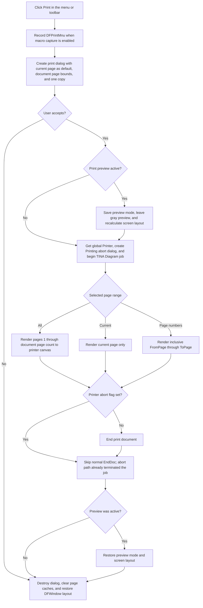

# Print diagram pages

> Analysis status: Evidence-backed source review complete.

## Control

| Property | Recovered value |
| --- | --- |
| Form | DFWindow |
| Component path | DFWindow.DFMainMenu.DFFileMnu.DFPrintMnu |
| Control class | TMenuItem |
| Caption | &Print... |
| Hint | Not present in the recovered resource. |
| Handler name | DFPrintMnuClick |
| Handler address | 01a7ab10 |
| Graph node | `resource:dfm:DFWindow/DFWindow.DFMainMenu.DFFileMnu.DFPrintMnu` |
| Handler node | `function:01a7ab10` |
| Graph layer | UI |

## What happens when clicked

`FUN_01a7ab10` records the `DFPrintMnu` command for the optional macro recorder and creates a temporary `TPrintDialog`. It sets the available page range to the document page count, sets one copy, gives the dialog help context `0x1fc`, and opens the dialog. The command has no direct-print branch: physical printing starts only when the user accepts this dialog.

The toolbar control `DFWindow.DFToolPanel.ToolNoteBook.Print.DFPrintBtn` uses the same handler. The menu command and toolbar button therefore have the same dialog and print behavior.

## Page range and copies

The dialog starts with range value `1`. The later branches show how DFWindow interprets the three recovered range values:

- Value `0` prints all document pages, from page 1 through the current page count.
- Value `1` prints the current page. The handler converts the zero-based current-page index at document offset `+0x18` to a one-based print page number.
- Value `2` prints the inclusive `FromPage` to `ToPage` range returned by the dialog.

The handler sets the dialog and global printer copy count to one before it opens the dialog. The recovered outer copy loop is also fixed to one iteration. There is no separate application-level collate or repeated-copy loop in this path. Printer-driver behavior outside this code is not recovered.

If the user cancels the print dialog, the handler does not create an abort dialog, does not start a print document, and does not render a page. It still destroys the temporary print dialog, clears cached page dimensions, and runs the normal DFWindow resize/layout handler.

## Print-preview and background state

Physical printing does not render the current preview bitmap. When print preview is active, the handler temporarily unchecks the preview control, saves the page mode byte at diagram offset `+0xb0`, changes that byte to normal mode `0`, and recalculates the screen layout before it starts the print job. After the job, it checks the preview control again, restores the saved mode, and recalculates the layout again.

The separate print-preview handler uses a gray window background and page mode `1`. The page renderer uses printer mode `2`, replaces the active drawing surface with the printer canvas, and lays out each page against the printer page width and height. It therefore does not explicitly paint the gray preview background to the printer. The recovered print handler has no color or monochrome option. Color output is controlled by the current drawing data and printer configuration; the source does not prove a separate background-color setting for paper.

## Printer setup, margins, and scaling

The command uses the process-wide Delphi `Printer` singleton returned by `FUN_0069e8a0`. The helper creates this object lazily and keeps it globally. `FUN_01a7ab10` does not destroy it. The temporary print dialog and temporary abort dialog are owned by this command and are destroyed after use.

Page setup is not part of this click path. `DFPrintSetupMnu` has a separate handler that opens `TPrinterSetupDialog`. The margin command also has a separate handler and dialog. Print uses the current printer and current diagram settings that those commands have already changed.

For each requested page, `FUN_01ceca50`:

1. Gets the page object by its one-based print number.
2. Updates the print-job title and the abort dialog's current-page label.
3. Saves the page geometry, page mode, and active drawing surface.
4. Attaches the global printer canvas and changes the page to print mode `2`.
5. Reads the printer page width and height and recalculates the page layout for the full printer rectangle.
6. Draws the page to the printer canvas.
7. Restores the prior page mode, drawing surface, geometry, and screen layout.
8. Calls `NewPage` between requested pages.

This proves that the renderer scales and lays out each page for the current printer surface. No explicit margin values are read in this handler or renderer. The recovered source does not establish how the printer driver and the separate margin settings combine into the final printable area.

## Progress, abort, and completion

After the user accepts the print dialog, the handler starts a Delphi print document with title `TINA Diagram`. It creates a modeless `PrinterAbortDlg`, fills its file and printer labels, shows it, and processes application messages. The resource identifies this form as `Printing`; it contains `[file]` and `[printer]` labels and a `bkAbort` button.

The abort button's handler `FUN_01800670` gets the same global printer object, calls its abort operation, and closes the abort dialog. The abort operation marks the printer as aborted and terminates the active print document. After page rendering returns, `FUN_01a7ab10` checks that abort flag. It calls the normal `EndDoc` operation only when the flag is clear. It then destroys the abort dialog and clears the global pointer to it.

The renderer itself does not test the abort flag between its recovered page-loop iterations. The VCL printer abort path and native print system can stop the job, but this source does not prove the exact page on which an abort takes effect.

On the normal accepted path, the handler restores preview state when required, clears the cached width and height of every document page, and runs the DFWindow resize/layout handler. The printed document is an output operation; this path does not change the saved diagram model or invoke the document Save command.

## Click flow

## Handler and helper evidence

- Print command handler: [FUN_01a7ab10](../../../DecompiledSources/Tina16/functions/0000000001A7AB10__FUN_01a7ab10.c)
- Page-range printer renderer: [FUN_01ceca50](../../../DecompiledSources/Tina16/functions/0000000001CECA50__FUN_01ceca50.c)
- Global Delphi Printer getter: [FUN_0069e8a0](../../../DecompiledSources/Tina16/functions/000000000069E8A0__FUN_0069e8a0.c)
- Printer BeginDoc, EndDoc, NewPage, and Abort operations: [FUN_0069d590](../../../DecompiledSources/Tina16/functions/000000000069D590__FUN_0069d590.c), [FUN_0069d650](../../../DecompiledSources/Tina16/functions/000000000069D650__FUN_0069d650.c), [FUN_0069d690](../../../DecompiledSources/Tina16/functions/000000000069D690__FUN_0069d690.c), and [FUN_0069d550](../../../DecompiledSources/Tina16/functions/000000000069D550__FUN_0069d550.c)
- Abort button handler: [FUN_01800670](../../../DecompiledSources/Tina16/functions/0000000001800670__FUN_01800670.c)
- Print setup, preview, and margin commands: [FUN_01a7b2b0](../../../DecompiledSources/Tina16/functions/0000000001A7B2B0__FUN_01a7b2b0.c), [FUN_01a7ce40](../../../DecompiledSources/Tina16/functions/0000000001A7CE40__FUN_01a7ce40.c), and [FUN_01a80db0](../../../DecompiledSources/Tina16/functions/0000000001A80DB0__FUN_01a80db0.c)
- Screen layout restoration: [FUN_01a77f90](../../../DecompiledSources/Tina16/functions/0000000001A77F90__FUN_01a77f90.c)
- Recovered form and control resource evidence: [ui-evidence.json](../../../DecompiledSources/Tina16/resources/dfm/ui-evidence.json)

## Resource and glyph evidence

- The menu caption is `&Print...`, and the ellipsis agrees with the proven print-dialog path.
- The toolbar counterpart has hint `Print`, resolves to the same handler, and contains a 40 by 20 PNG with two small printer frames: [printer glyph](../../../glyph/0109_DFWindow_DFWindow_DFToolPanel_ToolNoteBook_Print_DFPrintBtn_Glyph_Data.png).
- The menu item has no hint, image reference, embedded glyph, or same-parent label candidate.
- The abort-dialog resource supplies the `Printing`, `[file]`, `on`, and `[printer]` text and identifies its button as `bkAbort`.

## Error and evidence limits

- The recovered handler has no local exception handler, user-facing print-error message, or rollback block. An exception after preview is disabled or after `BeginDoc` can leave temporary UI or printer state until higher-level VCL cleanup runs.
- A nearby recovered cleanup routine destroys the global abort dialog, but the decompiler does not expose an exception-table link from this handler. This article does not treat that routine as proven exception coverage.
- The print-dialog cancel path is a clean no-print path. The abort button is different: it acts after `BeginDoc` and terminates the active printer job.
- The source proves printer-page width and height based layout, but it does not expose the final printer-driver clipping rectangle, DPI policy, spooler errors, paper margins, or color conversion.
