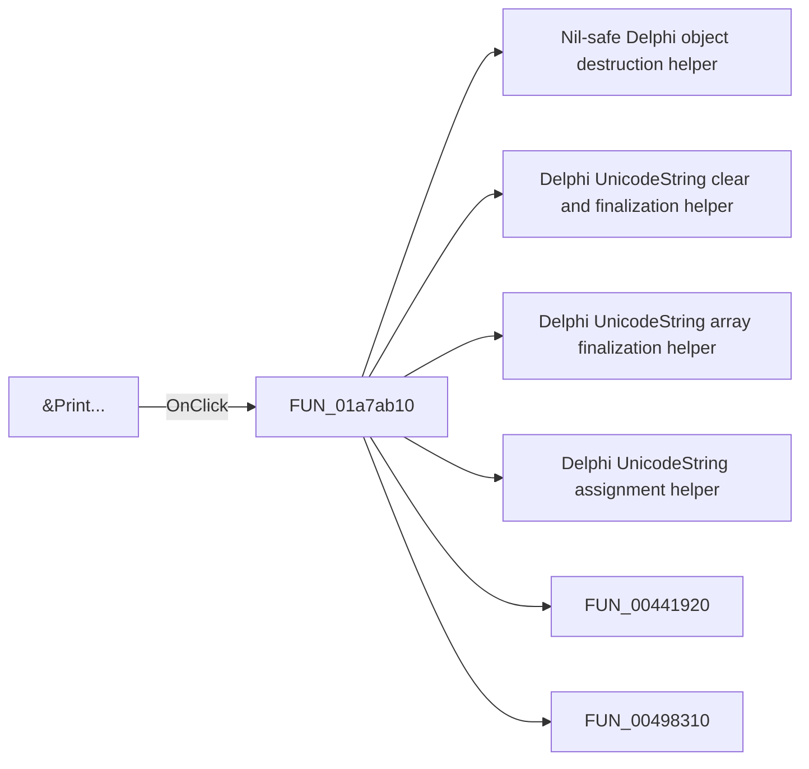

# &Print...

> Analysis status: Pending individual source review.

## Control

| Property | Recovered value |
| --- | --- |
| Form | DFWindow |
| Component path | DFWindow.DFMainMenu.DFFileMnu.DFPrintMnu |
| Control class | TMenuItem |
| Caption | &Print... |
| Hint | Not present in the recovered resource. |
| Text | Not present in the recovered resource. |
| Handler name | DFPrintMnuClick |
| Handler address | 01a7ab10 |
| Graph node | `resource:dfm:DFWindow/DFWindow.DFMainMenu.DFFileMnu.DFPrintMnu` |
| Handler node | `function:01a7ab10` |
| Graph layer | UI |

## What happens when clicked

Pending individual analysis. An agent must read the recovered handler source and its relevant callees before it replaces this text.

## Click flow

## Handler evidence

- Source: [DecompiledSources/Tina16/functions/0000000001A7AB10__FUN_01a7ab10.c](../../../DecompiledSources/Tina16/functions/0000000001A7AB10__FUN_01a7ab10.c)
- Recovered role: Not present in the recovered resource.
- Current graph summary: Handles 2 Delphi UI events: DFWindow.DFToolPanel.ToolNoteBook.Print.DFPrintBtn.OnClick, DFWindow.DFMainMenu.DFFileMnu.DFPrintMnu.OnClick.
- Current graph behavior: Not present in the recovered resource.
- Current graph evidence: Not present in the recovered resource.
- Complexity: complex
- Distinct outgoing calls: 27

## Direct calls

- `function:00410f20` — Nil-safe Delphi object destruction helper
- `function:00414480` — Delphi UnicodeString clear and finalization helper
- `function:00414560` — Delphi UnicodeString array finalization helper
- `function:00414ad0` — Delphi UnicodeString assignment helper
- `function:00441920` — FUN_00441920
- `function:00498310` — FUN_00498310
- `function:0064de00` — VCL control text setter with change suppression
- `function:0069d590` — FUN_0069d590
- `function:0069d650` — FUN_0069d650
- `function:0069d690` — FUN_0069d690
- `function:0069df70` — FUN_0069df70
- `function:0069e100` — FUN_0069e100
- `function:0069e8a0` — FUN_0069e8a0
- `function:00722380` — FUN_00722380
- `function:00725ea0` — FUN_00725ea0
- `function:007e2d20` — FUN_007e2d20
- `function:007fc180` — FUN_007fc180
- `function:008059a0` — FUN_008059a0
- `function:0080cc70` — FUN_0080cc70
- `function:01a77f90` — Handles 1 Delphi UI event: DFWindow.OnResize.
- `function:01a782f0` — FUN_01a782f0
- `function:01ace140` — FUN_01ace140
- `function:01acf9e0` — FUN_01acf9e0
- `function:01acfa60` — FUN_01acfa60
- `function:01aed550` — FUN_01aed550
- `function:01aee720` — FUN_01aee720
- `function:01ceca50` — FUN_01ceca50

## Resource evidence

- Kind: Not present in the recovered resource.
- Modal result: Not present in the recovered resource.
- Checked state: Not present in the recovered resource.
- List items: Not present in the recovered resource.
- Image reference: Not present in the recovered resource.
- Extracted glyph: None.

## Nearby label candidates

Nearby labels are layout candidates only. They are not proof of behavior.

- No same-parent label candidate is available.

## Analysis limits

- Do not infer behavior from the control class, caption, hint, glyph, or nearby label alone.
- Do not replace the pending status until the handler source and relevant call path provide enough evidence.
