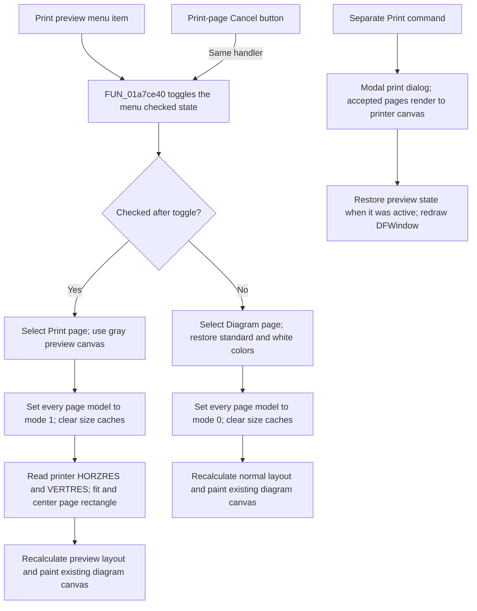

# Toggle diagram print preview

> Analysis status: Source reviewed through mode selection, page layout,
> rendering, printer-capability use, print integration, and failure boundaries.

## Control

| Property | Recovered value |
| --- | --- |
| Form | DFWindow |
| Component path | DFWindow.DFMainMenu.DFFileMnu.DFPrintpreviewMnu |
| Control class | TMenuItem |
| Caption | Print pre&view |
| Hint | Not present in the recovered resource. |
| Text | Not present in the recovered resource. |
| Handler name | DFPrintpreviewMnuClick |
| Handler address | 01a7ce40 |
| Graph node | `resource:dfm:DFWindow/DFWindow.DFMainMenu.DFFileMnu.DFPrintpreviewMnu` |
| Handler node | `function:01a7ce40` |
| Graph layer | UI |

## What happens when clicked

The command toggles a print-preview mode inside the existing diagram window.
It does not create a preview form or a new diagram. It changes the checked
state of **Print preview**, selects one of the existing `ToolNoteBook` pages,
updates the rendering mode of every diagram page, clears their cached sizes,
and redraws the active diagram.

`FUN_007e2d20` changes the menu item's checked state. It does not change a
control's visibility. The handler reads the new checked state after this call:

- When the item becomes checked, the handler selects notebook page 1, whose
  recovered caption is **Print**. It changes the window and canvas background
  to gray, sets byte `0xb0` to 1 in every diagram-page model, clears cached
  dimensions at offsets `0x100` and `0x104`, and calls `FUN_01a77f90`.
- When the item becomes unchecked, the handler selects notebook page 0, whose
  recovered caption is **Diagram**. It restores a standard window background
  and a white canvas, sets every page-model byte `0xb0` to 0, clears the same
  caches, and calls the same redraw routine.

The handler also clears the current canvas before the full redraw. A repeated
menu click therefore enters preview, then leaves preview on the next click.

## Preview layout and rendering

`FUN_01a77f90` uses the existing DFWindow canvas. It does not allocate or own a
preview window. For an active diagram, it sets a busy cursor, computes a target
rectangle, binds the diagram model to the form and canvas, recalculates the
layout, paints the diagram, stores the new client dimensions in the model
cache, and restores the cursor.

In preview mode, `FUN_01a782f0` obtains the printer's printable pixel width and
height. The lower calls use `GetDeviceCaps` indexes 8 and 10, which are
`HORZRES` and `VERTRES`. The routine fits that aspect ratio into the available
DFWindow client area, applies a five-pixel inset on the limiting dimension,
and centers the page rectangle. The preview scale is therefore an automatic
fit. This click handler does not read a zoom, scale, paper, orientation, or
margin control.

The page-model mode byte selects the preview layout path. Mode 1 uses
`FUN_01acfa60` before `FUN_01aceb90` draws the coordinate systems, axes,
curves, and figures into the page-shaped canvas rectangle. Mode 0 selects the
normal diagram layout path instead.

The preview uses the current printer capabilities and the current page model.
It does not write either one. The separate **Margin** button opens the shared
Border window as a modeless form. Its editors update normalized page margins
and redraw the diagrams when the user leaves a valid numeric field. See
[Border settings](../borderwindow/okbtn-981b09eeaa.md). The separate **Print
Setup...** command creates a standard modal printer-setup dialog and refreshes
the diagram caches after that dialog returns.

## Modeless state, Cancel, and Print

Preview is a modeless state of DFWindow. The command returns after it updates
and redraws the existing form. There is no modal result and no preview-object
ownership transfer.

The `DFCancelBtn` speed button on the **Print** notebook page has hint
**Cancel** and resolves to this same handler. It does not cancel a print job or
close a dialog. It unchecks **Print preview**, switches back to the **Diagram**
page, restores normal rendering mode, and redraws.

The menu item **Print...** and the Print-page button have a different handler,
`FUN_01a7ab10`. That handler creates a standard modal print dialog. Only an
accepted dialog starts a printer document and sends selected pages to the
printer canvas through `FUN_01ceca50`. If preview is active, the print handler
temporarily clears the preview checked state and page mode for printing, then
restores them and redraws the window. The preview handler itself does not show
the print dialog, begin or end a printer document, or render to the printer
canvas.

## Empty state, persistence, and errors

The shared command-state updater normally disables print-preview commands when
there is no active diagram. `FUN_01a7ce40` has no equivalent local guard. The
redraw routine can return after layout work when no active diagram exists, so
the checked state and notebook page can still change without a diagram paint.

This handler does not save page settings, printer settings, or the document.
Its changes are view state plus the per-page rendering-mode and size-cache
fields. The normal and preview branches update every page in the current
diagram manager, not only the visible page.

There is no local exception handler and no rollback. The menu item is toggled
before the notebook, canvas, page-model, and redraw operations. An exception
during printer initialization, layout, or painting can therefore leave the
checked state, selected notebook page, page-mode bytes, or caches partly
updated. The handler does not report a recovered user-facing error.

## Click flow

## Handler evidence

- Source: [FUN_01a7ce40](../../../DecompiledSources/Tina16/functions/0000000001A7CE40__FUN_01a7ce40.c)
- Recovered role: Toggles DFWindow between its Diagram and print-preview
  notebook pages and rendering modes.
- Current graph summary: Handles two Delphi UI events:
  `DFWindow.DFMainMenu.DFFileMnu.DFPrintpreviewMnu.OnClick` and
  `DFWindow.DFToolPanel.ToolNoteBook.Print.DFCancelBtn.OnClick`.
- Input evidence: The handler reads and changes the checked byte of the menu
  item at DFWindow offset `0x910`.
- State evidence: It writes mode byte `0xb0` and clears dimensions `0x100` and
  `0x104` for each page model in the manager at DFWindow offset `0x7a0`.
- Output evidence: It changes the selected notebook page, canvas colors, and
  page modes before it calls the common DFWindow redraw path.
- Complexity: complex
- Distinct outgoing calls: 13

## Relevant calls

- [`FUN_007e2d20`](../../../DecompiledSources/Tina16/functions/00000000007E2D20__FUN_007e2d20.c)
  changes the checked state of the preview menu item and its native menu state.
- [`FUN_006d8180`](../../../DecompiledSources/Tina16/functions/00000000006D8180__FUN_006d8180.c)
  selects the zero-based notebook page.
- [`FUN_01a77f90`](../../../DecompiledSources/Tina16/functions/0000000001A77F90__FUN_01a77f90.c)
  lays out and repaints the active DFWindow diagram.
- [`FUN_01a782f0`](../../../DecompiledSources/Tina16/functions/0000000001A782F0__FUN_01a782f0.c)
  computes the available canvas rectangle and, in preview, fits it to the
  printer's printable aspect ratio.
- [`FUN_01acfa60`](../../../DecompiledSources/Tina16/functions/0000000001ACFA60__FUN_01acfa60.c)
  recalculates the page model for the preview rectangle.
- [`FUN_01aceb90`](../../../DecompiledSources/Tina16/functions/0000000001ACEB90__FUN_01aceb90.c)
  paints the diagram content on the bound canvas.
- [`FUN_01a7ab10`](../../../DecompiledSources/Tina16/functions/0000000001A7AB10__FUN_01a7ab10.c)
  is the separate Print command and owns the modal print-dialog path.
- [`FUN_01ceca50`](../../../DecompiledSources/Tina16/functions/0000000001CECA50__FUN_01ceca50.c)
  renders selected diagram pages to the printer canvas in printer mode 2.
- [`FUN_01a7b2b0`](../../../DecompiledSources/Tina16/functions/0000000001A7B2B0__FUN_01a7b2b0.c)
  is the separate modal Print Setup command.
- [`FUN_01a80db0`](../../../DecompiledSources/Tina16/functions/0000000001A80DB0__FUN_01a80db0.c)
  shows and refreshes the shared modeless Border window for margin editing.

## Resource and glyph evidence

- The menu item has caption **Print preview** after accelerator removal. It has
  no recovered hint, action, image reference, or embedded glyph.
- The same handler is bound to `DFCancelBtn` on the **Print** notebook page.
  That speed button has hint **Cancel** and an
  [extracted two-state red-X glyph](../../../glyph/0110_DFWindow_DFWindow_DFToolPanel_ToolNoteBook_Print_DFCancelBtn_Glyph_Data.png).
- The neighboring Print-page buttons are **Margin** and **Print**. Their
  [page-border glyph](../../../glyph/0108_DFWindow_DFWindow_DFToolPanel_ToolNoteBook_Print_DFMarginsBtn_Glyph_Data.png)
  and [printer glyph](../../../glyph/0109_DFWindow_DFWindow_DFToolPanel_ToolNoteBook_Print_DFPrintBtn_Glyph_Data.png)
  support the recovered page-setup and print roles. The handler paths, not the
  glyphs alone, prove those operations.

## Analysis limits

- The recovered Delphi field names for DFWindow offsets `0x780`, `0x7a0`,
  `0x910`, and `0xa70` are not present. Their roles come from the DFM bindings,
  call behavior, page order, and repeated readers.
- The exact Delphi class name of each page-model object is not recovered.
- The source proves use of the printer's printable pixel dimensions. It does
  not prove a specific paper size, orientation, physical margin, or DPI for a
  given machine.
