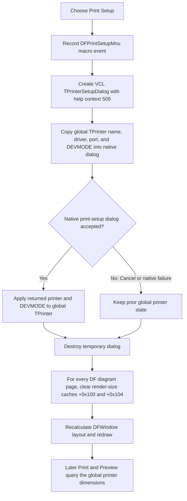

# Configure the active printer

> Analysis status: Reviewed from recovered source, component-resource, VCL dialog, and downstream print-path evidence.

## Control

| Property | Recovered value |
| --- | --- |
| Form | DFWindow |
| Component path | DFWindow.DFMainMenu.DFFileMnu.DFPrintSetupMnu |
| Control class | TMenuItem |
| Caption | P&rint Setup... |
| Hint | Not present in the recovered resource. |
| Handler name | DFPrintSetupMnuClick |
| Handler address | 01a7b2b0 |
| Graph node | `resource:dfm:DFWindow/DFWindow.DFMainMenu.DFFileMnu.DFPrintSetupMnu` |
| Handler node | `function:01a7b2b0` |
| Graph layer | UI |

## What happens when clicked

`TDFWindow.DFPrintSetupMnuClick` records the command for the application's macro stream, creates a VCL `TPrinterSetupDialog`, assigns help context `509` (`0x1fd`), and executes it modally. This is the standard printer-setup dialog, not the application's separate `TPageSetupDlg` form.

The dialog starts from the process-wide Delphi `TPrinter` object. Its recovered `Execute` path copies the active printer name, driver, port, and `DEVMODE` into a native print-dialog structure. On native acceptance, it copies the returned selection and `DEVMODE` back into that same global `TPrinter` object. The accepted driver data can include the selected printer, paper size and source, and page orientation.

The handler destroys the temporary dialog after `Execute`. The selected printer state remains in the global `TPrinter` singleton and is available to later Print and Print Preview commands.

## Acceptance and cancellation

The VCL dialog implementation tests the native result:

- a nonzero result applies the returned printer and `DEVMODE` to the global `TPrinter` object;
- a zero result frees the temporary native handles without updating `TPrinter`.

A zero result covers both user cancellation and a native dialog failure. `DFPrintSetupMnuClick` does not inspect the Boolean `Execute` result, so it has no separate Cancel branch and no native-error message.

After either result, the handler iterates every diagram page in `DFWindow`'s page collection. It writes zero to page fields `+0x100` and `+0x104`, then calls the shared DFWindow layout and redraw routine. These fields are render-size caches: the redraw path later stores current output width and height in the same offsets. They are not margin values.

Cancel therefore preserves the prior global printer settings, but it still invalidates the page-size caches and requests a redraw.

## Page size, orientation, and margins

The accepted native `DEVMODE` is the only page-configuration payload in this click path. Later code queries the active printer device context for horizontal and vertical printable raster sizes. Changes to printer, paper, or orientation can therefore change the dimensions and aspect ratio used for rendering.

The handler does not read or write top, bottom, left, or right application-margin fields. It does not create `TPageSetupDlg`, whose recovered resource contains paper-size, orientation, margin, scale, and schematic-print controls. The Print Preview fit routine uses a fixed five-pixel display inset while it fits the printer aspect ratio into the window. That inset is a preview-layout detail, not a saved print margin.

## Later Print and Print Preview consumers

`TDFWindow.DFPrintMnuClick` creates a VCL `TPrintDialog` from the same global `TPrinter` state. If the user accepts that second dialog, the print path gets the global printer canvas, starts a document, and renders the chosen page range. `FUN_01ceca50` queries the printer's horizontal and vertical raster resolutions when it builds each printed page. Thus, an accepted printer-setup change is carried into the next Print command without another application-level copy step.

Print Preview also uses the global printer dimensions. When preview mode is active, `FUN_01a782f0` compares printer width and height with the available DFWindow rectangle and fits the page to that aspect ratio. The setup handler's cache invalidation and redraw let an accepted paper or orientation change affect the preview layout immediately. A later preview toggle repeats the invalidation and redraw.

Neither consumer reads application margins from this handler because this handler does not store any.

## Click flow

## Global state and persistence

`FUN_0069e8a0` lazily creates and returns one process-wide printer object. `TPrinterSetupDialog.Execute` updates that object only after native acceptance. Destroying the dialog does not restore an earlier printer object or `DEVMODE`.

The click path has no project, diagram-settings, registry, or application-preference writer. The recovered application code therefore proves process-wide reuse by later print consumers, but it does not prove application-managed persistence across a TINA restart. Any persistence performed by Windows or the printer driver is outside this handler.

## Empty, guarded, and repeated cases

- The handler has no check for an empty page collection. When the count is zero, the invalidation loop runs zero times and the shared redraw is still called.
- The handler does not require a current diagram before it opens the printer setup dialog. The shared redraw routine has its own current-diagram guards.
- Reopening the command seeds the dialog from the current global printer state, including a prior accepted choice from this process.
- Repeated cancellation leaves the printer state unchanged but repeats cache invalidation and redraw.

## Error and partial-state behavior

- The handler has no confirmation, local exception handler, validation message, or rollback branch.
- Native Cancel and native failure both return false from the recovered dialog implementation. The handler does not distinguish them or report a separate error.
- If the dialog accepts, the global printer state changes before page-cache invalidation begins. A later failure can therefore leave the new printer active while only part of the page collection has been invalidated or the redraw is incomplete.
- If invalidation fails before the redraw call, some pages can retain old cached sizes. The handler has no repair loop.
- Printer-object and driver routines can raise deeper errors. No recovered statement in this handler converts them to a control-specific status message.

## Handler evidence

- Primary handler: [FUN_01a7b2b0](../../../DecompiledSources/Tina16/functions/0000000001A7B2B0__FUN_01a7b2b0.c) records the macro event, constructs the printer setup dialog, sets help context `0x1fd`, executes and destroys it, clears both page cache fields, and calls the shared redraw.
- VCL common-dialog constructor: [FUN_00722380](../../../DecompiledSources/Tina16/functions/0000000000722380__FUN_00722380.c) initializes the dynamically created common-dialog instance and its modal callback state.
- Printer setup execution: [FUN_00725d80](../../../DecompiledSources/Tina16/functions/0000000000725D80__FUN_00725d80.c) builds the native print-dialog data with print-setup flags, seeds it from `TPrinter`, applies returned data only on success, and returns the native Boolean result.
- Printer-state seed: [FUN_00725a30](../../../DecompiledSources/Tina16/functions/0000000000725A30__FUN_00725a30.c) obtains the active printer's device, driver, port, and `DEVMODE` and constructs native dialog handles.
- Accepted-state application: [FUN_00725bf0](../../../DecompiledSources/Tina16/functions/0000000000725BF0__FUN_00725bf0.c) passes accepted native printer data to the global printer setter and releases the native handles.
- Global printer getter: [FUN_0069e8a0](../../../DecompiledSources/Tina16/functions/000000000069E8A0__FUN_0069e8a0.c) lazily creates the process-wide printer singleton.
- Global printer setter: [FUN_0069d7c0](../../../DecompiledSources/Tina16/functions/000000000069D7C0__FUN_0069d7c0.c) replaces the active device-mode state and selects or creates the matching printer entry.
- DFWindow redraw: [FUN_01a77f90](../../../DecompiledSources/Tina16/functions/0000000001A77F90__FUN_01a77f90.c) rebuilds the current diagram view and writes current output dimensions to diagram cache fields `+0x100` and `+0x104`.
- Preview fitting: [FUN_01a782f0](../../../DecompiledSources/Tina16/functions/0000000001A782F0__FUN_01a782f0.c) reads the active printer's horizontal and vertical raster sizes and fits their aspect ratio into the preview area.
- Print handler: [FUN_01a7ab10](../../../DecompiledSources/Tina16/functions/0000000001A7AB10__FUN_01a7ab10.c) creates the standard Print dialog, uses the process-wide printer after acceptance, and dispatches the requested pages.
- Printed-page renderer: [FUN_01ceca50](../../../DecompiledSources/Tina16/functions/0000000001CECA50__FUN_01ceca50.c) queries the active printer canvas and its horizontal and vertical raster sizes for each printed diagram page.
- Preview command: [FUN_01a7ce40](../../../DecompiledSources/Tina16/functions/0000000001A7CE40__FUN_01a7ce40.c) toggles preview mode, clears page caches, and redraws the DFWindow.
- Macro text builder and sink: [FUN_01aee720](../../../DecompiledSources/Tina16/functions/0000000001AEE720__FUN_01aee720.c) builds the localized command record, and [FUN_01aed550](../../../DecompiledSources/Tina16/functions/0000000001AED550__FUN_01aed550.c) sends it to the macro recorder when recording is active.
- Recovered component tree: [ui-evidence.json](../../../DecompiledSources/Tina16/resources/dfm/ui-evidence.json) supplies the menu caption, handler binding, sibling Print and Print Preview commands, and the separate `TPageSetupDlg` resource.
- Complexity: complex; the graph records six distinct outgoing calls from `FUN_01a7b2b0`.

## Resource evidence

- `DFPrintSetupMnu` is a `TMenuItem` with caption `P&rint Setup...`.
- It has no hint, action, image reference, or glyph.
- The sibling menu items are `&Print...` and `Print pre&view`.
- No DFM `TPrinterSetupDialog` belongs to `DFWindow`; this handler creates the standard VCL dialog dynamically.

## Analysis limits

- The recovered code passes the full native `DEVMODE`. It does not enumerate which printer-driver-specific options a given device displays.
- Paper and orientation effects are established through accepted `DEVMODE` state and later printer-width and printer-height queries. The source does not provide a printer-independent physical unit for those values.
- No margin update exists in this call path. The separate `TPageSetupDlg` resource is not evidence that this menu command opens it.
- The handler proves no application-managed persistence beyond the lifetime of the process-wide printer singleton.
