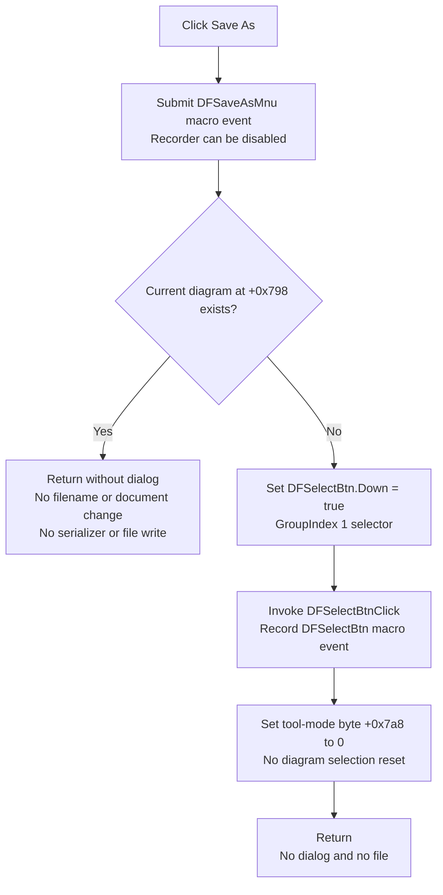

# Save &As...

> Analysis status: Recovered resource, unique handler, macro action, active-diagram and no-diagram branches, selection-tool fallback, native `.tdr` evidence, and relationship to the separate Save writer reviewed.

## Control

| Property | Recovered value |
| --- | --- |
| Form | DFWindow |
| Component path | DFWindow.DFMainMenu.DFFileMnu.DFSaveAsMnu |
| Control class | TMenuItem |
| Caption | Save &As... |
| Hint | Not present in the recovered resource. |
| Handler name | DFSaveAsMnuClick |
| Handler address | 01a7e680 |
| Graph node | `resource:dfm:DFWindow/DFWindow.DFMainMenu.DFFileMnu.DFSaveAsMnu` |
| Handler node | `function:01a7e680` |
| Graph layer | UI |

## What happens when clicked

In this recovered TINA 16 Demo binary, `TDFWindow.DFSaveAsMnuClick` does not
perform a Save As operation. It records the `DFSaveAsMnu` macro action when
macro recording is enabled, checks the current diagram pointer at form offset
`+0x798`, and then follows one of two no-file paths:

- When a diagram exists, the handler makes no further call. It does not show a
  dialog, choose a path, serialize the document, or write a file.
- When no diagram exists, it sets the `Down` state of the recovered Select
  speed button at form offset `+0xa90` and invokes
  `TDFWindow.DFSelectBtnClick`. That handler records its own `DFSelectBtn`
  macro action and clears the form's current tool-mode byte at `+0x7a8` to
  selection mode. Its diagram-selection reset is guarded by a non-null diagram
  pointer and therefore does not run from this no-diagram branch.

The Save As macro event is recorded before the diagram test. A recorded event
therefore does not prove that a save or any other document change occurred.

## Save dialog and filename state

The handler has no call that constructs or executes `TSaveDialog`. DFWindow's
recovered component tree also contains no `TSaveDialog` component. There is no
recovered dialog title, initial directory, default filename, filter, extension,
overwrite option, or selected filename for this click path.

The diagram document object at form offset `+0x7a0` stores its filename at
document offset `+0x48`. Its constructors and the Clear All path initialize
that field to `Noname`. `FUN_01a7e680` neither reads nor writes this field. It
also does not change the document's modified flag at document offset `+0x40`.

Consequently, clicking Save As cannot convert an unnamed document into a named
document in this recovered path. It also cannot replace the current path of an
already named document.

## Native diagram format and serialization scope

The native format is established by adjacent, separate paths rather than by
this handler:

- The Open command dynamically creates a file dialog with filter
  `Tina diagram (*.tdr)|*.tdr` and default mask `*.tdr`.
- The existing-path writer labels its structured output `Analysis result`,
  writes version `V1.00`, and describes the payload as
  `Analysis result & diagram viewer settings.` It then invokes the current
  document object's virtual serializer.

This evidence identifies `.tdr` as the native analysis-result and diagram-view
container. It does not make that writer part of Save As: `FUN_01a7e680` has no
call to the writer or to another serializer. The exact field-by-field content
of the virtual document serializer is outside this click handler and is not
invented here.

## Relationship to Save

The separate `TDFWindow.DFSaveMnuClick` handler owns normal Save behavior:

1. With no current diagram, it uses the same Select-button fallback as Save As.
2. With a diagram whose document filename is `Noname`, it calls this Save As
   handler. Because the diagram is non-null, Save As immediately takes its
   no-file branch. An unnamed diagram therefore remains unsaved through this
   recovered Save-to-Save-As route.
3. With a non-`Noname` filename, Save passes that existing path to
   `FUN_01155ce0`, which opens the target container and invokes the document
   serializer.

This split is important: the existing-path writer is reachable from Save, but
not from Save As. The Save handler and writer are coordinated with the separate
Save-control analysis and are evidence here, not annotations owned by this
article.

## Cancel, overwrite, error, and partial-file behavior

- There is no dialog in Save As, so there is no user Accept or Cancel result.
- There is no selected destination and no overwrite confirmation or existing
  file test.
- Save As opens no file, so this click cannot create, truncate, overwrite, or
  leave a partial file.
- The handler has no validation message, exception branch, retry loop, status
  result, or local error reporter.
- In the later existing-path Save route, the writer opens the supplied path
  directly with recovered mode `0xff00`, invokes the document serializer, and
  reports a nonzero archive status through its common error reporter. No
  temporary-file replacement or rollback is visible there, so atomic write
  behavior and recovery from a partial write are not proven.

## Click flow

## Handler and related evidence

- Save As handler: [FUN_01a7e680](../../../DecompiledSources/Tina16/functions/0000000001A7E680__FUN_01a7e680.c)
- Select-tool fallback: [FUN_01a794b0](../../../DecompiledSources/Tina16/functions/0000000001A794B0__FUN_01a794b0.c)
- Speed-button `Down` setter: [FUN_0082a6c0](../../../DecompiledSources/Tina16/functions/000000000082A6C0__FUN_0082a6c0.c)
- Separate Save handler: [FUN_01a846c0](../../../DecompiledSources/Tina16/functions/0000000001A846C0__FUN_01a846c0.c)
- Existing-path `.tdr` writer: [FUN_01155ce0](../../../DecompiledSources/Tina16/functions/0000000001155CE0__FUN_01155ce0.c)
- Native `.tdr` Open-dialog setup: [FUN_01a7e460](../../../DecompiledSources/Tina16/functions/0000000001A7E460__FUN_01a7e460.c)
- Document constructor and `Noname` state: [FUN_01cebb70](../../../DecompiledSources/Tina16/functions/0000000001CEBB70__FUN_01cebb70.c)
- Document clear and `Noname` reset: [FUN_01cec530](../../../DecompiledSources/Tina16/functions/0000000001CEC530__FUN_01cec530.c)
- Macro action builder: [FUN_01aee720](../../../DecompiledSources/Tina16/functions/0000000001AEE720__FUN_01aee720.c)
- Conditional macro recorder: [FUN_01aed550](../../../DecompiledSources/Tina16/functions/0000000001AED550__FUN_01aed550.c)
- Recovered form evidence: [ui-evidence.json](../../../DecompiledSources/Tina16/resources/dfm/ui-evidence.json)

## Direct calls

- `FUN_01aee720` and `FUN_01aed550` - Build and conditionally record the
  `DFSaveAsMnu` macro event.
- `FUN_0082a6c0` - Sets the Select speed button's `Down` state when no diagram
  exists.
- `FUN_01a794b0` - Selects the default diagram tool mode on the no-diagram
  branch.
- `FUN_00414480` - Finalizes the temporary Delphi UnicodeString.

## Resource evidence

- The menu caption is `Save &As...`; the ampersand supplies the menu mnemonic.
- The resource has no hint, action, shortcut, checked state, image-list entry,
  embedded glyph, or picture.
- DFWindow has no recovered `TSaveDialog` component.
- The related Select control is a `TSpeedButton` with hint `Select`,
  `GroupIndex = 1`, and an embedded glyph. Source calls, not this glyph, prove
  the fallback behavior.
- The separate Save menu item has shortcut `Ctrl+S`. Its paired Save toolbar
  button has hint `Save` and a two-state floppy-disk glyph, but those resources
  belong to `FUN_01a846c0`, not to Save As.

## Analysis limits

- The source proves the missing Save As implementation in this recovered demo
  binary. It does not prove whether another TINA edition contains the omitted
  dialog and writer path.
- The `.tdr` extension and high-level payload scope come from the separate Open
  and writer paths. No filename filter or serialization call is attributed
  directly to `FUN_01a7e680`.
- The exact archive mode flags and the complete virtual serializer schema are
  not recovered as named types. The article states only the visible strings,
  calls, state fields, and branch behavior.
