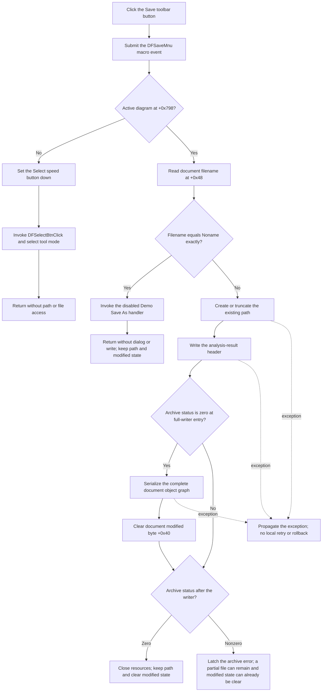

# Save current diagram from the toolbar

> Analysis status: Complete. The toolbar button directly uses the normal Save handler. It writes a named document to its current path, but an unnamed `Noname` document remains unsaved because Save As is disabled in this recovered Demo binary.

## Control

| Property | Recovered value |
| --- | --- |
| Form | DFWindow |
| Component path | DFWindow.DFToolPanel.DFSaveBtn |
| Control class | TSpeedButton |
| Caption | Not present in the recovered resource. |
| Hint | Save |
| Size | 25 by 25 |
| Embedded glyph | 40 by 20 PNG recovered from a 522-byte Delphi bitmap resource |
| Glyph states | 2 |
| Handler name | DFSaveMnuClick |
| Handler address | 01a846c0 |
| Graph node | `resource:dfm:DFWindow/DFWindow.DFToolPanel.DFSaveBtn` |
| Handler node | `function:01a846c0` |
| Graph layer | UI |

The extracted glyph contains blue and yellow floppy-disk states. Together with the `Save` hint, it identifies the intended toolbar action. The source is still required to establish which file is written and what happens when the document has no name.

The button binds its `OnClick` event directly to `DFSaveMnuClick`. It does not forward through the Save menu item. The menu item uses the same handler and supplies `Ctrl+S`, but the toolbar button has no recovered shortcut or action binding of its own.

## What happens when clicked

[`FUN_01a846c0`](../../../DecompiledSources/Tina16/functions/0000000001A846C0__FUN_01a846c0.c) first submits the macro action `DFSaveMnu` through the conditional macro recorder. This occurs for all branches, even when no file is written. It then tests the active diagram pointer at form offset `+0x798`.

### No active diagram

When the pointer is null, the handler sets the Select speed button at form offset `+0xA90` to its down state and invokes `DFSelectBtnClick`. That handler records its own macro action and changes the current tool-mode byte at `+0x7A8` to selection mode. Its diagram-selection reset is guarded by the same missing diagram and does not run.

This branch does not read a filename, create a stream, or access the document modified state. The visible effect is the switch to the Select tool.

### Unnamed `Noname` document

When a diagram exists, the handler reads the document filename from the document at form `+0x7A0`, field `+0x48`. It compares that UnicodeString with the exact, case-sensitive sentinel `Noname`.

For equality, it calls the separate `DFSaveAsMnuClick` handler. In this recovered Demo binary, that handler records `DFSaveAsMnu` and returns immediately because a diagram exists. It does not show a dialog, choose a path, serialize the document, or write a file. The filename stays `Noname`, and the modified byte at document `+0x40` remains unchanged.

This branch has no Accept or Cancel choice because no Save As dialog exists. The disabled behavior is documented in [`TIARA-diz.6.7.288`](dfsaveasmnu-39133e351b.md).

### Named document

For every filename other than exact `Noname`, the handler passes the stored path unchanged to [`FUN_01155ce0`](../../../DecompiledSources/Tina16/functions/0000000001155CE0__FUN_01155ce0.c). It does not test the modified byte first. A named document is therefore rewritten even when it is already clean.

The writer creates or truncates the target with recovered stream mode `0xFF00`. It has no existence test, overwrite prompt, backup, temporary file, rename, extension validation, or atomic replacement. Save keeps the existing document path and does not append an extension. The separate Open path establishes `.tdr` as the native analysis-result format; this click accepts the stored path as-is.

The writer emits the recovered `Analysis result` header, version `V1.00`, program-version and copyright data, and the description `Analysis result & diagram viewer settings.` It then invokes the current DFWindow document's full serializer. That serializer enters its object-graph branch only when the archive status is still zero. The matching writer at `FUN_01cedc70` rebuilds the dependency and complete-object lists, serializes the diagram pages and their object graphs, and clears document modified byte `+0x40` at the end of its entered write branch.

The canonical writer analysis and annotation belong to [`TIARA-diz.6.7.289`](dfsavemnu-26ab55f139.md). This toolbar article duplicates only the complete shared-handler annotation, as required for the second DFM binding.

## Click flow

## Errors and partial writes

- A file create or open failure raises through the Delphi file-stream constructor. The button handler and writer have no local catch, retry, alternate-path prompt, or user-message call.
- The destination is created or truncated before the header and object graph are complete. A later exception or serializer failure can leave an empty or partial file. The previous file is not restored.
- After serialization, the outer writer checks the archive status. It passes a nonzero code to the common archive-error latch, then destroys the serializer and stream. That helper stores the code; this call path does not display an error message.
- The full serializer clears modified byte `+0x40` before the outer status check. A nonzero status can therefore be latched after the document was marked clean.
- The Save handler receives no success value. It performs no later status, progress, path, caption, or other UI update.

## Recovered evidence

- Shared Save handler: [FUN_01a846c0](../../../DecompiledSources/Tina16/functions/0000000001A846C0__FUN_01a846c0.c)
- Canonical Save-menu and writer article: [TIARA-diz.6.7.289](dfsavemnu-26ab55f139.md)
- Existing-path writer: [FUN_01155ce0](../../../DecompiledSources/Tina16/functions/0000000001155CE0__FUN_01155ce0.c)
- Full-document serializer: [FUN_01cedc70](../../../DecompiledSources/Tina16/functions/0000000001CEDC70__FUN_01cedc70.c)
- Disabled Demo Save As handler: [FUN_01a7e680](../../../DecompiledSources/Tina16/functions/0000000001A7E680__FUN_01a7e680.c) and [TIARA-diz.6.7.288](dfsaveasmnu-39133e351b.md)
- Select-tool fallback: [FUN_01a794b0](../../../DecompiledSources/Tina16/functions/0000000001A794B0__FUN_01a794b0.c)
- File-stream create and error path: [FUN_004b9860](../../../DecompiledSources/Tina16/functions/00000000004B9860__FUN_004b9860.c) and [FUN_004b9910](../../../DecompiledSources/Tina16/functions/00000000004B9910__FUN_004b9910.c)
- Archive-error latch: [FUN_00b047e0](../../../DecompiledSources/Tina16/functions/0000000000B047E0__FUN_00b047e0.c)
- Extracted toolbar glyph: [0082_DFWindow_DFWindow_DFToolPanel_DFSaveBtn_Glyph_Data.png](../../../glyph/0082_DFWindow_DFWindow_DFToolPanel_DFSaveBtn_Glyph_Data.png)
- Recovered form evidence: [ui-evidence.json](../../../DecompiledSources/Tina16/resources/dfm/ui-evidence.json)

## Analysis limits

- The source proves direct replacement of the current path but does not recover the native creation-disposition constant by name.
- The full serializer is identified from the document class's virtual write slot and matching object-graph implementation. The writer call remains indirect in the decompiled source.
- No live file write or UI test was performed. Error and partial-output behavior comes from the recovered create, serializer, status, and cleanup paths.
