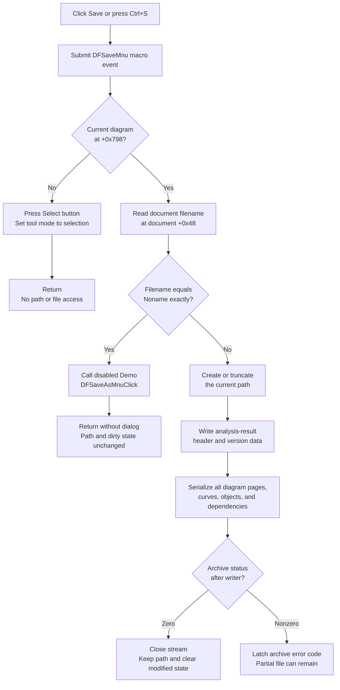

# &Save

> Analysis status: Complete. Save writes the current named document path directly. An unnamed `Noname` document delegates to the disabled Save As handler and remains unsaved in this recovered Demo binary.

## Control

| Property | Recovered value |
| --- | --- |
| Form | DFWindow |
| Component path | DFWindow.DFMainMenu.DFFileMnu.DFSaveMnu |
| Control class | TMenuItem |
| Caption | &Save |
| Shortcut | Ctrl+S (`16467`) |
| Handler name | DFSaveMnuClick |
| Handler address | 01a846c0 |
| Graph node | `resource:dfm:DFWindow/DFWindow.DFMainMenu.DFFileMnu.DFSaveMnu` |
| Handler node | `function:01a846c0` |
| Graph layer | UI |

The same handler is bound to `DFWindow.DFToolPanel.DFSaveBtn.OnClick`. The toolbar button has the hint `Save`, a 522-byte embedded image, and `NumGlyphs = 2`. The menu item has no hint or image.

## What happens when clicked

[`FUN_01a846c0`](../../../DecompiledSources/Tina16/functions/0000000001A846C0__FUN_01a846c0.c) first submits the macro action `DFSaveMnu` through the conditional command-recording path. It then checks the current diagram pointer at `form + 0x798`.

If no diagram exists, Save presses the Select speed button at `form + 0xA90`, invokes `DFSelectBtnClick`, and returns. The Select handler records its own macro action and sets tool-mode byte `form + 0x7A8` to selection mode. It cannot reset a diagram selection because the diagram pointer is null. This branch does not inspect a path, create a file, or change the clipboard.

With a diagram, Save reads the document filename from `form + 0x7A0`, document offset `+0x48`. The document constructors initialize this UnicodeString to the exact sentinel `Noname`. The comparison is an ordinal, case-sensitive UnicodeString comparison.

| Filename state | Result |
| --- | --- |
| Exactly `Noname` | Call the separate `DFSaveAsMnuClick` handler. In this Demo binary that handler logs `DFSaveAsMnu` and returns because a diagram exists. It does not open a dialog or write a file. The path remains `Noname`. |
| Any other string | Pass the existing string unchanged to `FUN_01155ce0` and save directly to that path. The handler does not ask for a replacement name. |

The handler does not test the document modified byte at document offset `+0x40`. A named document is therefore serialized again even when that byte is already clear.

## Existing-path writer and file replacement

[`FUN_01155ce0`](../../../DecompiledSources/Tina16/functions/0000000001155CE0__FUN_01155ce0.c) receives only the current filename. It constructs a file-backed stream with recovered create mode `0xFF00`. The file-stream constructor takes its native create branch, opens for read/write access, attaches the returned handle, and raises an exception if the handle is invalid.

There is no file-existence test, overwrite question, backup name, temporary file, rename, or atomic replacement. The create path replaces or truncates an existing file before serialization starts. The writer does not assign document field `+0x48`, so a successful normal Save keeps the current path unchanged.

The native extension is established by the separate Open command, which uses filter `Tina diagram (*.tdr)|*.tdr` and mask `*.tdr`. Save itself accepts the current string as stored and does not append or validate an extension.

## Serialization scope

The writer creates the application binary serializer in write mode. It writes a header record containing these recovered values:

- `Analysis result`
- `V1.00`
- `02/09/96 17:00 CET`
- `Analysis result & diagram viewer settings.`
- `TINA ` followed by the recovered program-version string
- the recovered copyright text and a zero value

It then obtains the document object from the process-wide current `DFWindow` pointer and calls its full-document virtual writer. The matching class writer is [`FUN_01cedc70`](../../../DecompiledSources/Tina16/functions/0000000001CEDC70__FUN_01cedc70.c). It rebuilds two serialization lists:

- a dependency list for objects referenced by curves; and
- a complete object list that walks every recovered diagram page, its curve groups, curve collections at offsets `+0x70`, `+0x78`, `+0x80`, and `+0x88`, the additional collection at `+0xE0`, and optional objects at `+0xF0` and `+0xF8`.

The writer normalizes object identifiers and references, writes the combined object count, and dispatches every listed object's virtual serializer. This is the full analysis result and diagram-view state, not the selected-object subset used by Copy. The recovered binary format is application-private; the source does not expose a public byte-level schema or text encoding.

## Dirty and path state

Document byte `+0x40` is the modified state. The document constructor clears it, result insertion sets it, and the Clear All command tests it before deciding whether to ask about unsaved work.

The full writer clears this byte at the end of its entered write branch. Save does not read it before calling the writer. The normal outcomes are therefore:

- named document and completed serialization: current path stays unchanged and modified state becomes clear;
- unnamed `Noname` document: Save As returns without a file, the path stays `Noname`, and modified state is not changed by either handler;
- no diagram: only the tool mode changes; no document path or modified state is accessed.

The serializer writer checks that archive status is zero before it begins, but it does not check the status again before it clears the modified byte. The outer writer checks the status after the virtual call. A nonzero status recorded during serialization can therefore be reported after the document modified byte was cleared.

## Cancel, overwrite, errors, and partial output

- There is no dialog on the named-path branch, so there is no Cancel choice. The current file is replaced without a prompt.
- The `Noname` branch delegates to Save As, but that recovered Demo handler has no dialog. It has neither Accept nor Cancel and performs no write.
- File create/open failure raises through the Delphi file-stream constructor. `DFSaveMnuClick` and `FUN_01155ce0` have no local catch, retry, alternate path, or user-message call.
- After the virtual writer returns, a nonzero serializer status is copied to the common global archive-error latch by `FUN_00b047e0`. This helper records the code; it does not display a message in this call path.
- The destination is created or truncated before the header and object graph are written. A later exception or serializer failure can leave an empty or partial destination file, normally a `.tdr`. No rollback restores the previous file.
- On the non-exception status-error path, the file stream and serializer are destroyed after the error is latched. The handler receives no success result and performs no additional path or UI update.

## Save flow

## Recovered evidence

- Save handler: [`FUN_01a846c0`](../../../DecompiledSources/Tina16/functions/0000000001A846C0__FUN_01a846c0.c)
- Existing-path writer: [`FUN_01155ce0`](../../../DecompiledSources/Tina16/functions/0000000001155CE0__FUN_01155ce0.c)
- Disabled Demo Save As handler: [`FUN_01a7e680`](../../../DecompiledSources/Tina16/functions/0000000001A7E680__FUN_01a7e680.c) and its [control article](dfsaveasmnu-39133e351b.md)
- Select-tool fallback: [`FUN_01a794b0`](../../../DecompiledSources/Tina16/functions/0000000001A794B0__FUN_01a794b0.c)
- File-stream wrapper and create/error constructor: [`FUN_004b9860`](../../../DecompiledSources/Tina16/functions/00000000004B9860__FUN_004b9860.c) and [`FUN_004b9910`](../../../DecompiledSources/Tina16/functions/00000000004B9910__FUN_004b9910.c)
- Header writer: [`FUN_01d318b0`](../../../DecompiledSources/Tina16/functions/0000000001D318B0__FUN_01d318b0.c)
- Full-document serializer: [`FUN_01cedc70`](../../../DecompiledSources/Tina16/functions/0000000001CEDC70__FUN_01cedc70.c), with list builders [`FUN_01cecd80`](../../../DecompiledSources/Tina16/functions/0000000001CECD80__FUN_01cecd80.c) and [`FUN_01ced500`](../../../DecompiledSources/Tina16/functions/0000000001CED500__FUN_01ced500.c)
- Modified-state producer and consumer: [`FUN_01cec150`](../../../DecompiledSources/Tina16/functions/0000000001CEC150__FUN_01cec150.c) and [`FUN_01a83f90`](../../../DecompiledSources/Tina16/functions/0000000001A83F90__FUN_01a83f90.c)
- Archive-error latch: [`FUN_00b047e0`](../../../DecompiledSources/Tina16/functions/0000000000B047E0__FUN_00b047e0.c)
- Native `.tdr` Open dialog: [`FUN_01a7e460`](../../../DecompiledSources/Tina16/functions/0000000001A7E460__FUN_01a7e460.c)
- Resource evidence: [`ui-evidence.json`](../../../DecompiledSources/Tina16/resources/dfm/ui-evidence.json)

## Analysis limits

- The virtual target is identified from the document class's full-write slot, its same-class use in the stream writer, and the matching full-graph implementation at `01cedc70`. The decompiled call itself remains indirect.
- The source establishes the create/replace path and absence of an overwrite prompt. It does not expose the final native creation-disposition constant by name.
- No live file write or UI test was performed. The conclusions use the DFM bindings, read-only graph, recovered file-stream constructor, serializer producer and consumer paths, and state-field cross-references.
