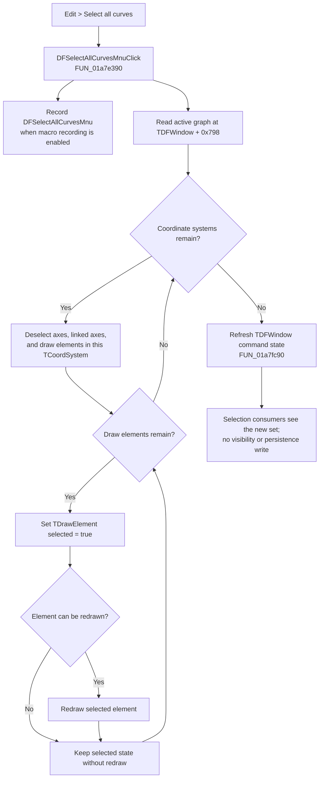

# Select all curves

> Analysis status: Reviewed from the recovered handler, resolved Delphi VMT slots, and downstream selection-state consumers.

## Control

| Property | Recovered value |
| --- | --- |
| Form | `DFWindow` (`TDFWindow`) |
| Component path | `DFWindow.DFMainMenu.DFEditMnu.DFSelectAllCurvesMnu` |
| Menu path | **Edit > Select all curves** |
| Control class | `TMenuItem` |
| Caption | `&Select all curves` |
| Handler name | `DFSelectAllCurvesMnuClick` |
| Handler address | `01a7e390` |
| Graph node | `resource:dfm:DFWindow/DFWindow.DFMainMenu.DFEditMnu.DFSelectAllCurvesMnu` |
| Handler node | `function:01a7e390` |
| Graph layer | UI |

The DFM supplies no hint, image, glyph, checked state, or modal result. The behavior below comes from the code path, not from the caption alone.

## What the command selects

`FUN_01a7e390` reads the active graph object from `TDFWindow + 0x798` and passes it to `FUN_01ad0aa0`. The latter visits every object in the graph collection at `+0xd8`. Recovered VMT metadata identifies these objects as `TCoordSystem`; its virtual slot `+0x160` resolves to `FUN_01ce2b70`.

For each coordinate system, `FUN_01ce2b70` performs replacement selection:

1. It calls `FUN_01ce2600`, which deselects selected axes, linked axis objects, and selected draw elements in that coordinate system.
2. It then visits every item in the coordinate-system list at `+0x80`, casts each item to `TDrawElement`, and calls its selection method.
3. The resolved `TDrawElement` method `FUN_01d2b0a0` always sets the recovered selected byte at `+0x10` to true. It redraws the element only when the element's two availability/drawability conditions pass.

The exact eligibility boundary is therefore every `TDrawElement` in every active-graph `TCoordSystem + 0x80` list. The loop does not filter by subtype, visibility, previous selection, or drawability before it sets the selected state. The recovered class name is broader than “curve”; the menu command treats the complete list as its curve set.

## UI and state effects

The selection and deselection methods redraw affected elements when their drawability predicate passes. After the replacement is complete, the handler calls `FUN_01a7fc90`, the shared `TDFWindow` command-state refresh owned by analysis item `TIARA-diz.6.7.270`. That routine queries the current selection and updates menu and command availability/check state.

This call path does not update a cursor value or a numeric readout. It also does not change the recovered visibility/availability bytes: the selection setter changes only the selected byte at `TDrawElement + 0x10`. No document, settings, or file serializer is called. The handler can append a `DFSelectAllCurvesMnu` command to the active macro recorder, but that records the command, not the plot selection as persistent document state.

## Repeated, empty, and failure behavior

- A repeated click has the same final selection set, but it is not an early no-op. The code deselects the current objects, selects all draw elements again, can redraw them twice, refreshes command state, and can record another macro command.
- An active graph with no coordinate systems makes the selection loop a no-op. The handler still performs macro recording when enabled and refreshes command state.
- A coordinate system with no draw elements still has its selected axes and linked axis objects cleared; there are then no draw elements to select.
- The handler and helpers have no confirmation, exception handler, recovery branch, or rollback. A failure during an iteration can therefore leave a partially replaced selection and partial redraw.
- `FUN_01ad0aa0` has no null guard for the active graph. The normal menu-state routine disables graph-dependent commands when no active graph exists, but direct invocation outside that enabled UI route is not protected by this handler.

## Click flow

## Evidence

- [Click handler `FUN_01a7e390`](../../../DecompiledSources/Tina16/functions/0000000001A7E390__FUN_01a7e390.c) records the macro command, invokes the active-graph selector, and refreshes command state.
- [Graph-wide selector `FUN_01ad0aa0`](../../../DecompiledSources/Tina16/functions/0000000001AD0AA0__FUN_01ad0aa0.c) iterates the `TCoordSystem` collection and invokes virtual slot `+0x160` for each entry.
- [Coordinate-system select-all method `FUN_01ce2b70`](../../../DecompiledSources/Tina16/functions/0000000001CE2B70__FUN_01ce2b70.c) first invokes the clear-selection slot and then selects every `TDrawElement` in the `+0x80` list.
- [Coordinate-system clear-selection method `FUN_01ce2600`](../../../DecompiledSources/Tina16/functions/0000000001CE2600__FUN_01ce2600.c) clears selected axes, linked axis objects, and draw elements.
- [Draw-element selection method `FUN_01d2b0a0`](../../../DecompiledSources/Tina16/functions/0000000001D2B0A0__FUN_01d2b0a0.c) sets selection and conditionally redraws.
- [Draw-element selection setter `FUN_01d2b010`](../../../DecompiledSources/Tina16/functions/0000000001D2B010__FUN_01d2b010.c) writes only byte `+0x10`.
- [TDFWindow command-state refresh `FUN_01a7fc90`](../../../DecompiledSources/Tina16/functions/0000000001A7FC90__FUN_01a7fc90.c) guards graph-dependent commands and queries current selection; its annotation belongs to `TIARA-diz.6.7.270`.

## Analysis limits

- The recovered sources do not give a field name for `TCoordSystem + 0x80`; RTTI and VMT evidence prove that its entries are `TDrawElement` objects.
- The recovered code proves conditional redraw, but it does not provide names for the two drawability/availability bytes used by the predicate.
- No direct cursor/readout refresh is present, so this article does not infer one from the menu caption or nearby UI.
