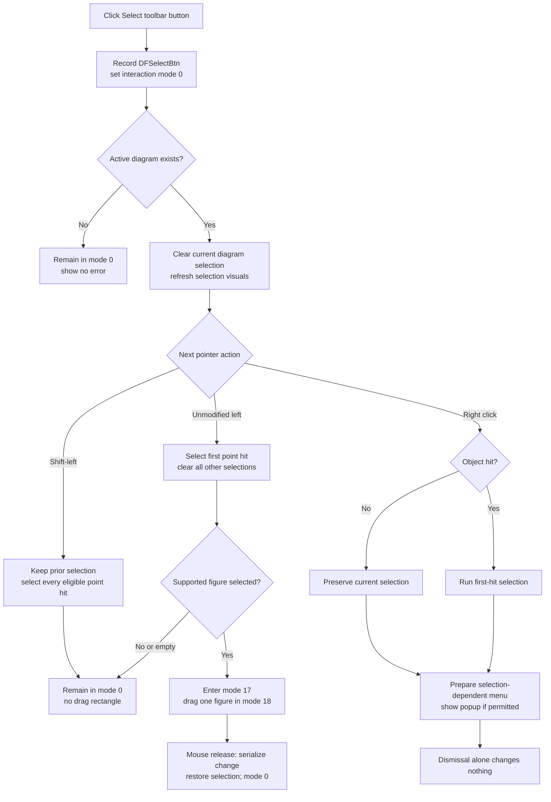

# Select toolbar button

> Analysis status: Complete from recovered resource, handler, selection, mouse-state, and popup-menu evidence.

## Control

| Property | Recovered value |
| --- | --- |
| Form | DFWindow |
| Component path | DFWindow.DFToolPanel.ToolNoteBook.Diagram.DFSelectBtn |
| Control class | TSpeedButton |
| Caption | Not present in the recovered resource. |
| Hint | Select |
| Group index | 1 |
| Handler name | DFSelectBtnClick |
| Handler address | 01a794b0 |
| Graph node | `resource:dfm:DFWindow/DFWindow.DFToolPanel.ToolNoteBook.Diagram.DFSelectBtn` |
| Handler node | `function:01a794b0` |
| Graph layer | UI |

## What happens when clicked

`DFSelectBtnClick` activates DFWindow's default selection mode. It records command name `DFSelectBtn`, writes `0` to the form's interaction-mode byte at `+0x7A8`, and tests the active-diagram field at `+0x798`.

- If an active diagram exists, it clears the current interactive selection across the diagram's coordinate systems, figure collection, and optional cursor objects. The called virtual methods remove the selected state and update the affected drawing regions.
- If no active diagram exists, the handler stops after setting mode `0`. It does not show an error or dereference the null diagram.

The click does not select an object under the pointer. Selection starts with later mouse events.

## Single and multiple selection

An unmodified left-button press in mode `0` calls the single-point selection helper. The helper checks the diagram's direct objects, figure collection, optional cursor objects, and coordinate-system contents in a fixed order. It accepts the first hit and clears selection from the remaining candidates. A press on empty diagram space clears the current selection and leaves mode `0` active.

After a hit, DFWindow classifies the resulting selection. Cursor objects enter their cursor-move modes. Supported diagram figures enter mode `17`; movement changes this to mode `18`. Other selection categories remain in mode `0` unless their dedicated branch changes it.

A Shift-modified left press has a separate path, and it runs only while mode `0` is active. It does not clear the current selection. Instead, it invokes point selection for every eligible figure and coordinate-system child at the pointer position. More than one selected object can therefore remain selected. The recovered source does not prove whether a selected object's virtual point method toggles that object off or leaves it selected.

## Rectangle behavior

Select has no recovered marquee or drag-rectangle selection path. A left press on empty space remains in mode `0`; the mode-`0` mouse-move and mouse-up paths do not create or finalize a rectangle.

The source does use a stored rectangle after a supported figure is selected. Modes `17` and `18` move that one figure by the pointer delta and update its existing bounds. Mouse release restores the selected state, records the object change through the diagram serializer, and returns to mode `0`. This is object movement, not selection of all objects inside a rectangle.

## Button and existing-tool state

The DFM places Select in speed-button group `1` with the other diagram tools. Its embedded glyph is a black arrow pointer. The click handler does not write the button's `Down` property; normal VCL speed-button group handling supplies the visible pressed state before `OnClick`. Other tool handlers and completion paths explicitly put this button down before they call the Select handler.

Selecting this button is not the same as pressing Escape. The handler changes the mode and clears diagram selection, but it does not destroy or clear a pending tool object stored in DFWindow. For example, an uninserted circle at `+0xFE8` is destroyed by the mode-`7` Escape branch, while `DFSelectBtnClick` does not read that field. Directly changing to Select can therefore leave a staged object stored after its interaction mode is no longer active. No finalization or rollback occurs in this handler.

Clicking Select again keeps mode `0` but still records the command and clears any active selection. It is a no-op only for the model when no objects are selected.

## Right-click and context commands

Right-button mouse-down uses DFWindow's shared context path. If the point hits an object, the form runs the same first-hit selection helper before it prepares the popup menu. If the point does not hit an object, this step does not replace the current selection.

The form then prepares selection-dependent popup state and opens the popup at converted screen coordinates when the diagram state permits it. A popup dismissal without a menu choice does not call a command handler, change mode `0`, or modify the diagram. Disabled or hidden menu items are controlled by the shared popup-state helpers; Select itself does not enable, disable, or execute those items.

## Errors and persistence

The handler and the selection paths have no local exception handler, error dialog, rollback, or returned failure test. A virtual selection or redraw failure can propagate to higher-level Delphi handling.

Selection and popup preparation do not call a file writer, create an explicit undo entry, or mark the document modified. Moving a selected figure is different: its mode-`17`/`18` mouse-up path calls the recovered diagram serializer before it returns to Select. The toolbar click itself does not save or persist any state.

## Click and selection flow

## Evidence

- [DFSelectBtnClick](../../../DecompiledSources/Tina16/functions/0000000001A794B0__FUN_01a794b0.c) records `DFSelectBtn`, writes mode `0`, tests the active-diagram pointer, and calls the diagram-wide selection reset only for a non-null diagram.
- [The diagram-wide reset](../../../DecompiledSources/Tina16/functions/0000000001AD0970__FUN_01ad0970.c) visits every coordinate system and figure plus both optional cursor objects. [The recovered base deselection method](../../../DecompiledSources/Tina16/functions/0000000001A5F350__FUN_01a5f350.c) clears object byte `+0x11` and redraws its region.
- [DFWindow mouse-down](../../../DecompiledSources/Tina16/functions/0000000001A730E0__FUN_01a730e0.c) separates Shift-left, unmodified left, and right-button paths. Its mode-`0` branch classifies the selection and starts cursor or supported-figure movement modes.
- [The single-point helper](../../../DecompiledSources/Tina16/functions/0000000001ACF0C0__FUN_01acf0c0.c) accepts the first hit, deselects later or missed objects, scans coordinate-system contents, and refreshes the result. [The Shift-point helper](../../../DecompiledSources/Tina16/functions/0000000001ACF730__FUN_01acf730.c) visits all eligible figures and coordinate-system children without a prior deselection pass.
- [DFWindow mouse-move](../../../DecompiledSources/Tina16/functions/0000000001A74A50__FUN_01a74a50.c) moves the selected figure in modes `17` and `18`; it has no mode-`0` rectangle branch. [DFWindow mouse-up](../../../DecompiledSources/Tina16/functions/0000000001A77260__FUN_01a77260.c) finalizes that move, calls the diagram serializer, and resets mode `0`.
- [Escape handling](../../../DecompiledSources/Tina16/functions/0000000001A7D1A0__FUN_01a7d1a0.c) destroys the pending circle in mode `7`, unlike the Select handler. This comparison fixes the cleanup boundary.
- [The right-click hit test](../../../DecompiledSources/Tina16/functions/0000000001ACE170__FUN_01ace170.c) decides whether right-click first runs point selection. [Popup preparation](../../../DecompiledSources/Tina16/functions/0000000001AD7F60__FUN_01ad7f60.c) derives menu state from the classified selection. The canonical [DFWindow menu-state updater](../../../DecompiledSources/Tina16/functions/0000000001A7FC90__FUN_01a7fc90.c) runs after the mouse-down path.
- The recovered DFM identifies `DFSelectBtnClick`, hint `Select`, group index `1`, and a 290-byte embedded glyph. The [extracted glyph](../../../glyph/0085_DFWindow_DFWindow_DFToolPanel_ToolNoteBook_Diagram_DFSelectBtn_Glyph_Data.png) shows the arrow-pointer tool.

## Ownership and limits

- This Bead owns only the `FUN_01a794b0` Select toolbar handler annotation.
- Diagram-wide deselection, point selection, mouse events, popup preparation, and menu-state functions are shared behavior and remain evidence-only here.
- Original Delphi field, enum, and method names are not available. Offset and mode labels describe proven use in the recovered sources.
