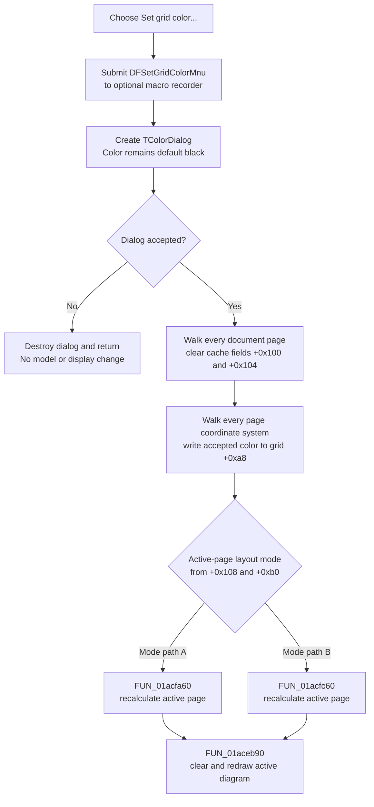

# Set the grid color on every diagram page

> Analysis status: Complete. The recovered handler opens an unseeded color dialog, writes an accepted color to every coordinate system on every document page, invalidates page render caches, recalculates the active page, and redraws it.

## Control

| Property | Recovered value |
| --- | --- |
| Form | DFWindow |
| Component path | DFWindow.DFMainMenu.DFViewMnu.DFSetgridcolorMnu |
| Control class | TMenuItem |
| Caption | `Set grid color...` |
| Hint | Not present in the recovered resource. |
| Handler name | DFSetgridcolorMnuClick |
| Handler address | 01a83d70 |
| Graph node | `resource:dfm:DFWindow/DFWindow.DFMainMenu.DFViewMnu.DFSetgridcolorMnu` |
| Handler node | `function:01a83d70` |
| Graph layer | UI |

The DFM supplies no action, shortcut, checked state, image, or glyph for this menu item.

## Color dialog initialization

[`FUN_01a83d70`](../../../DecompiledSources/Tina16/functions/0000000001A83D70__FUN_01a83d70.c) first submits the `DFSetGridColorMnu` command to the optional macro recorder. It then creates a temporary `TColorDialog` owned by the application-global object and executes it.

The handler does not copy a current page's grid color into the dialog. It also does not set a title, custom-color list, or an options value after construction. The recovered constructor chain does not assign the dialog's `Color` field at offset `+0xd0`; the freshly allocated Delphi object leaves that zero-initialized. Color value `0` is Delphi `clBlack`. Therefore, each click starts from black, not from the current grid color. Other recovered color-dialog callers explicitly write their current color to this same field, which confirms that this omission is specific to this handler.

This dialog default differs from a new coordinate system's model default. [`FUN_01cdf400`](../../../DecompiledSources/Tina16/functions/0000000001CDF400__FUN_01cdf400.c) initializes a new coordinate system's grid-color field at `+0xa8` to `0xc0c0c0`, a light gray. Opening this menu and accepting the untouched dialog therefore changes a default light-gray grid to black.

## Accepted color and affected objects

The color-dialog Execute result is the only decision gate:

- A false Execute result, normally Cancel, destroys the temporary dialog and returns. It does not change a page, axis, grid, cache, or display. Dialog construction is outside this Boolean result path; a construction exception does not become a false Execute result in this handler.
- A true result reads the accepted 32-bit Delphi color value from dialog offset `+0xd0`.

The accepted branch walks the complete page collection at document container `DFWindow +0x7a0`, offset `+0x10`. For each page it:

1. Clears the two page render-cache fields at offsets `+0x100` and `+0x104`.
2. Walks the page's coordinate-system collection at offset `+0xd8`.
3. Writes the same accepted color to each coordinate system's grid-color field at offset `+0xa8`.

This is a document-wide change. It includes coordinate systems on inactive pages and every coordinate system on a page with multiple plots. It is not limited to the selected curve, selected axis, active coordinate system, or current page.

The command changes the grid-color field only. It does not write the coordinate systems' X-axis or Y-axis collections, axis-line colors, label colors, curve colors, page background, or window background. The later layout and paint calls can redraw those objects, but they do not make them share the new grid color. [`FUN_01cdf670`](../../../DecompiledSources/Tina16/functions/0000000001CDF670__FUN_01cdf670.c) reads coordinate-system offset `+0xa8` through the recovered color conversion path, which confirms that this field supplies the rendered grid color.

## Layout and redraw

After every page model has been updated, the handler reads the active diagram from `DFWindow +0x798`. It selects one of two common layout-refresh paths from active-diagram fields `+0x108` and `+0xb0`:

- [`FUN_01acfa60`](../../../DecompiledSources/Tina16/functions/0000000001ACFA60__FUN_01acfa60.c) recalculates the active rectangle and attached plot objects for one recovered view mode.
- [`FUN_01acfc60`](../../../DecompiledSources/Tina16/functions/0000000001ACFC60__FUN_01acfc60.c) recalculates the active rectangle and attached objects through the alternate path.

The original Delphi names of these two internal modes are not recovered, so this article does not invent them. Both paths update the active diagram's coordinate systems and related display objects.

The handler then calls [`FUN_01aceb90`](../../../DecompiledSources/Tina16/functions/0000000001ACEB90__FUN_01aceb90.c) with its clear-background flag set. When the diagram bounds are nonempty, this clears the active drawing area to white and redraws the registered coordinate systems, curves, annotations, and overlays. The active page therefore shows the new grid color immediately. Inactive pages are not painted by this click, but their model field and page caches have already changed; they use the new color when they are shown later.

## Click flow

## Cancel, repeated, and error behavior

- The macro event is submitted before the dialog opens. A recorded event does not prove that the user accepted a color.
- Cancel does not copy the dialog's default black value. It skips the complete page loop and all layout and redraw calls.
- Every invocation creates a new dialog and again starts from black. The last accepted grid color is not used as the next initial dialog color.
- The accepted path has no equality test. Accepting the current effective color still rewrites every coordinate-system field, clears every page's two cache fields, recalculates the active page, and requests a redraw.
- A document with pages but no coordinate systems still has both cache fields cleared on every page. No grid field is written. The active page is still recalculated and redrawn.
- The handler has no null guard for `DFWindow +0x7a0` or the active diagram at `+0x798`. This function assumes both objects exist; the recovered handler does not prove that command-state handling prevents an invalid invocation.
- There is no local exception handler, retry, message, or rollback. A failure during the nested loops can leave earlier pages or coordinate systems with the new color and later ones with the old color.
- A failure after all model writes but before the redraw can leave the active page showing old pixels until another repaint. Inactive pages already hold the new model value.
- The common painter returns without drawing when its display rectangle has zero width or height. The color still remains changed in the document model.

## Persistence boundary

The accepted color is stored on every in-memory coordinate-system object. The page cache invalidation and active repaint are also in-memory operations. This handler does not call the `.tdr` serializer, Save, Save As, a settings writer, a file API, or an undo-registration helper.

Consequently, the new color affects the live document immediately but is not written to disk by this click. A later document-save path can serialize the then-current diagram object graph, but this handler does not prove the exact grid-color field encoding in that file. Cancel causes no document-model change. Macro recording, when enabled, is a separate external record of the command attempt.

## Recovered evidence

- Main handler: [`FUN_01a83d70`](../../../DecompiledSources/Tina16/functions/0000000001A83D70__FUN_01a83d70.c) records the command attempt, creates and executes the color dialog, gates all state changes on acceptance, walks pages and coordinate systems, writes `+0xa8`, clears page cache fields, selects the active layout path, and redraws.
- Color dialog construction: [`FUN_00724d70`](../../../DecompiledSources/Tina16/functions/0000000000724D70__FUN_00724d70.c) creates the `TColorDialog` and its custom-color string list. [`FUN_00722380`](../../../DecompiledSources/Tina16/functions/0000000000722380__FUN_00722380.c) is its common-dialog constructor. Neither assigns Color at `+0xd0`; this handler also makes no such assignment before Execute.
- Grid default and rendering value: [`FUN_01cdf400`](../../../DecompiledSources/Tina16/functions/0000000001CDF400__FUN_01cdf400.c) initializes coordinate-system grid color `+0xa8` to `0xc0c0c0`; [`FUN_01cdf670`](../../../DecompiledSources/Tina16/functions/0000000001CDF670__FUN_01cdf670.c) reads that field through the display-color mapping helper.
- Active layout and paint: [`FUN_01acfa60`](../../../DecompiledSources/Tina16/functions/0000000001ACFA60__FUN_01acfa60.c) and [`FUN_01acfc60`](../../../DecompiledSources/Tina16/functions/0000000001ACFC60__FUN_01acfc60.c) are the two accepted-path layout updates. [`FUN_01aceb90`](../../../DecompiledSources/Tina16/functions/0000000001ACEB90__FUN_01aceb90.c) clears and paints the active diagram when its bounds are valid.
- Document-page relationship: [`FUN_01cec530`](../../../DecompiledSources/Tina16/functions/0000000001CEC530__FUN_01cec530.c) and the page-selection paths establish document `+0x10` as the owned diagram-page collection and `DFWindow +0x798` as the active page pointer.
- Macro path: [`FUN_01aee720`](../../../DecompiledSources/Tina16/functions/0000000001AEE720__FUN_01aee720.c) builds the command string and [`FUN_01aed550`](../../../DecompiledSources/Tina16/functions/0000000001AED550__FUN_01aed550.c) writes it only when macro recording is enabled.
- UI resource evidence: [`ui-evidence.json`](../../../DecompiledSources/Tina16/resources/dfm/ui-evidence.json) binds `DFSetgridcolorMnuClick` to `01a83d70` and supplies the menu caption.

## Analysis limits

- The recovered source names the control and handler but not the private Delphi names of page cache fields `+0x100` and `+0x104`. Their clearing before layout and painting proves invalidation behavior, but not their original names.
- The internal names of the active-diagram modes that select `FUN_01acfa60` or `FUN_01acfc60` are not recovered.
- Color value `0` and model default `0xc0c0c0` are exact recovered `TColor` values. The operating system's color dialog appearance and palette can vary.
- No proprietary UI action was executed. The findings use the DFM binding, read-only graph, recovered constructors, handler data flow, document relationship, and rendering callers.
