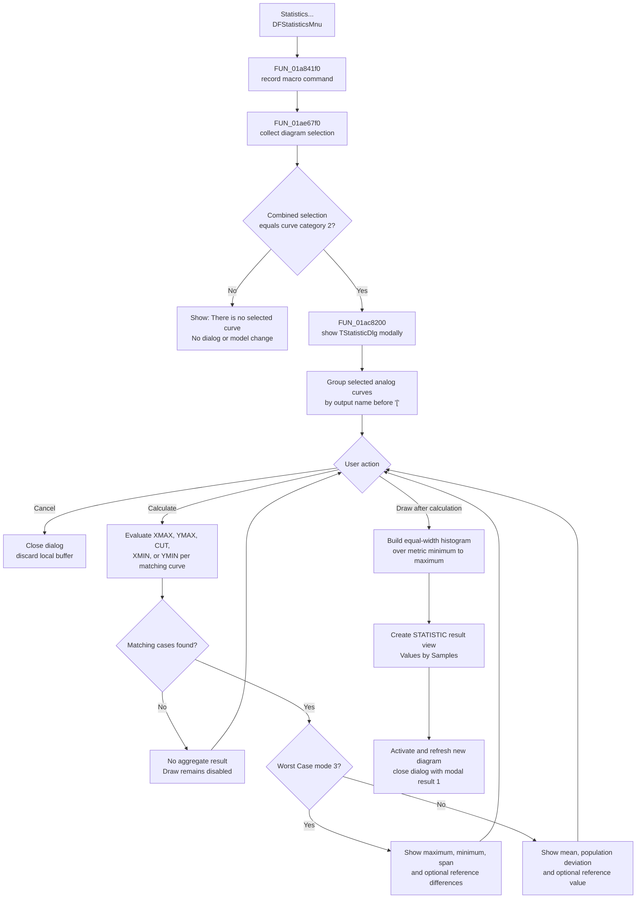

# Statistics...

> Analysis status: Complete. This command validates a curve-only selection and opens `TStatisticDlg`, where tolerance-case values can be calculated and optionally published as a histogram result view.

## Control

| Property | Recovered value |
| --- | --- |
| Form | DFWindow |
| Component path | DFWindow.DFMainMenu.DFProcessingMnu.DFStatisticsMnu |
| Control class | TMenuItem |
| Caption | Statistics... |
| Hint | Not present in the recovered resource. |
| Handler name | DFStatisticsMnuClick |
| Handler address | 01a841f0 |
| Graph node | `resource:dfm:DFWindow/DFWindow.DFMainMenu.DFProcessingMnu.DFStatisticsMnu` |
| Handler node | `function:01a841f0` |
| Graph layer | UI |

## What happens when clicked

`DFStatisticsMnuClick` first builds and records the `DFStatisticsMnu` macro command when macro recording is enabled. It then passes the active diagram at `DFWindow + 0x798` to `FUN_01ae67f0`.

The shared launcher calls the canonical diagram-selection collector and requires its combined category to equal exactly `2`, the recovered curve category. A pure curve selection can contain one or more curves. Axis, text, other, empty, and mixed selections do not pass this test. On failure, the launcher shows the common recovered message `There is no selected curve.` and does not construct the statistics dialog.

For an accepted selection, `FUN_01ac8200` creates `TStatisticDlg` with the application-global owner and the temporary selected-curve list. It shows the form modally, ignores the final modal result, destroys the form, and returns. The launcher then destroys the selected-curve list. No selected curve is copied or removed by this opening path.

## Dialog inputs and initial state

Recovered RTTI identifies the form as `TStatisticDlg`. Its DFM caption is `Tolerance Analysis - Statistics`. The form contains:

- an `OutputSelectorCB` drop-down;
- an `OptionRG` radio group with `XMAX`, `YMAX`, `CUT`, `XMIN`, and `YMIN`;
- a `CutEdit` floating-point editor that is enabled only for `CUT`;
- a default `Calculate` button;
- a result grid in a lower panel;
- a bar-count spin editor and an initially disabled `Draw` button;
- built-in Cancel and Help buttons.

On creation, the dialog examines every selected curve. It accepts only an underlying `TAnalogCurve` whose internal byte `+0x08` is clear. It reads that curve's name, removes the first `[` and everything after it, and adds the remaining output name to the drop-down if it is not already present. This groups tolerance cases that share one displayed output while removing a bracketed unit suffix from the selector text.

On show, the dialog hides the lower result panel and reduces the form height. It selects radio item `0` (`XMAX`), selects output item `0`, and sets `CutEdit` to zero. Changing the output, option, or cut value hides any previous result and disables Draw. Selecting `CUT` enables `CutEdit`; all other options disable it.

## Calculate behavior

The button captioned `Calculate` runs `FUN_01ac7740`. It does not close the dialog. The handler uses a byte at form `+0x759` as an input-error and re-entry guard. A floating-point parse error is routed through the dialog error helper and prevents calculation for that attempt.

For a valid attempt, the handler shows the result panel, reads the selected output text, and scans the selected curves again. A curve participates only when it is the supported analog type and its name before `[` exactly matches the selected output. The selected radio index chooses one provider operation for each participating curve:

| Option | Recovered per-curve operation |
| --- | --- |
| `XMAX` | Provider's X maximum operation at virtual offset `+0x80` |
| `YMAX` | Provider's Y maximum operation at virtual offset `+0x70` |
| `CUT` | Provider's CUT operation at virtual offset `+0x48`, after selecting the curve data and passing the `CutEdit` value |
| `XMIN` | Provider's X minimum operation at virtual offset `+0x78` |
| `YMIN` | Provider's Y minimum operation at virtual offset `+0x68` |

The resulting double values are stored in a dialog-owned array at `+0x730`. An underlying curve byte at `+0x39` marks a distinguished reference case. When more than one matching curve exists and such a case is present, its value is stored at array index `0` and excluded from the sample range. The other case values occupy the remaining entries. With only one matching curve, the reference flag is forced off so that the one value remains a sample.

The result grid depends on the current shared analysis-mode byte:

| Analysis mode | Grid values |
| --- | --- |
| Worst Case, mode `3` | Maximum, minimum, and maximum minus minimum across the sample range. When a reference case exists, the grid also shows the reference value, maximum minus reference, and minimum minus reference. |
| Other recovered modes | Arithmetic mean and population standard deviation across the sample range. When a reference case exists, the grid also shows the reference value. |

The mean divides the sum by the number of included samples. The standard-deviation helper divides the sum of squared differences by that same count and then takes the square root; it therefore computes population, not sample, standard deviation. A temporary `TMessageBoxDlg` with localized resource `0x110` is displayed during the scan and destroyed afterward. The exact localized text is not recovered.

When more than one matching curve was found, Calculate enables Draw. Calculate does not change the source curves, the current diagram, or application settings.

## Domain, range, and units

All aggregate values use the selected per-curve metric. The sample domain is the collected case index range, excluding array index `0` when a separate reference case is present. The computed numeric range is the minimum through maximum of those metric values.

The source values are used without conversion. `XMAX` and `XMIN` return the provider's X values; `YMAX` and `YMIN` return its Y values. The source does not recover a semantic name for the CUT provider operation beyond its radio caption and input value. The drop-down deliberately removes the bracketed unit suffix, and the grid formatter appends no unit text. The numbers therefore retain their provider units, but the dialog does not display those units beside the result.

## Draw and output behavior

Draw reads the requested bar count and builds a histogram from the same sample range used for the grid. `FUN_01ac7fd0` divides the numeric interval from minimum to maximum into equal-width bins, counts each sample in one 16-bit bin, and creates a `TCurveWriter` with one point at each bin's lower boundary. It appends a final point at the maximum with a sample count of zero.

`FUN_013e0ed0` publishes that curve as a new application result view. The recovered view has:

- a generated title `STATISTIC` followed by a counter;
- X-axis label `Values`;
- Y-axis label `Samples`;
- coordinate-system entry name `Analysis Result 1`.

Publication creates and activates a new diagram, registers it with the result manager, applies the normal result-view layout, and refreshes the main application view. It then sets the statistics dialog's modal result to `1`, which closes the dialog. The histogram is session model state; this path does not save it to disk or write a registry or INI preference.

## Guards, no-op paths, and errors

- The common `DFWindow` command-state refresh normally disables the Processing parent when there is no usable active diagram. The menu handler itself does not check `DFWindow + 0x798` before the selection collector dereferences it.
- A selection category other than exact curve category `2` shows `There is no selected curve.` and creates no dialog.
- A curve-only selection that supplies no supported analog output can still open the dialog. Calculate then finds zero matching cases and performs no aggregate calculation. It supplies no second message and leaves Draw disabled.
- Invalid `CutEdit` text shows the float-editor error, skips the attempt, and leaves the dialog open for correction.
- Changing an input after Calculate hides the result panel and disables Draw. Repeating Calculate frees the old numeric buffer before it allocates and fills a new one.
- Cancel closes the modal dialog and discards the buffer. Form destruction frees that buffer. It creates no histogram and changes no source model state.
- The recovered calculation path has no local exception handler or rollback. It also does not explicitly reject a zero bar count or a zero-width minimum-to-maximum interval before histogram division. The spin editor can impose UI constraints, but its recovered DFM does not expose a minimum, maximum, or default value.
- The command never redraws or changes the active diagram merely by opening the dialog or calculating grid values. Main-view creation and redraw occur only after Draw.

## Click flow

## Recovered evidence

- [`FUN_01a841f0`](../../../DecompiledSources/Tina16/functions/0000000001A841F0__FUN_01a841f0.c) records the main-menu macro token and delegates the active diagram to the shared statistics launcher.
- [`FUN_01ae67f0`](../../../DecompiledSources/Tina16/functions/0000000001AE67F0__FUN_01ae67f0.c) requires selection category `2`, opens the dialog for that selection list, or shows the common selection error.
- [`FUN_01ac8200`](../../../DecompiledSources/Tina16/functions/0000000001AC8200__FUN_01ac8200.c) constructs `TStatisticDlg`, calls `ShowModal`, destroys it, and ignores its modal result.
- [`FUN_01ac70f0`](../../../DecompiledSources/Tina16/functions/0000000001AC70F0__FUN_01ac70f0.c) builds unique analog-output choices, strips bracketed suffixes, and creates the mode-specific grid labels.
- [`FUN_01ac7510`](../../../DecompiledSources/Tina16/functions/0000000001AC7510__FUN_01ac7510.c) hides the result panel and establishes XMAX, output zero, and cut value zero as the initial state.
- [`FUN_01ac7740`](../../../DecompiledSources/Tina16/functions/0000000001AC7740__FUN_01ac7740.c) is the Calculate handler. It collects metric values, computes the grid, manages the temporary progress dialog, and enables Draw for more than one match.
- [`FUN_01ac5e20`](../../../DecompiledSources/Tina16/functions/0000000001AC5E20__FUN_01ac5e20.c) selects the per-curve provider operation from the radio index and separates reference and sample values.
- [`FUN_01ac6150`](../../../DecompiledSources/Tina16/functions/0000000001AC6150__FUN_01ac6150.c), [`FUN_01ac5d40`](../../../DecompiledSources/Tina16/functions/0000000001AC5D40__FUN_01ac5d40.c), and [`FUN_01ac5da0`](../../../DecompiledSources/Tina16/functions/0000000001AC5DA0__FUN_01ac5da0.c) compute sample bounds, arithmetic mean, and population standard deviation.
- [`FUN_01ac8190`](../../../DecompiledSources/Tina16/functions/0000000001AC8190__FUN_01ac8190.c) is the Draw handler. It builds the histogram and closes the dialog with modal result `1` after publication.
- [`FUN_01ac7fd0`](../../../DecompiledSources/Tina16/functions/0000000001AC7FD0__FUN_01ac7fd0.c) bins the values and constructs the histogram `TCurveWriter`.
- [`FUN_013e0ed0`](../../../DecompiledSources/Tina16/functions/00000000013E0ED0__FUN_013e0ed0.c) creates, registers, activates, lays out, and refreshes the `STATISTIC` result view.
- [`FUN_01acff30`](../../../DecompiledSources/Tina16/functions/0000000001ACFF30__FUN_01acff30.c) is the canonical selected-object collector whose exact category `2` is independently established as curves.
- UI resource evidence: [`ui-evidence.json`](../../../DecompiledSources/Tina16/resources/dfm/ui-evidence.json)

## Resource evidence and limits

The menu resource supplies only `Statistics...` and the `OnClick` binding. It has no hint, action, image index, or glyph. The dialog DFM supplies the form and control captions used above. The behavior comes from the handler, modal wrapper, dialog lifecycle, and numerical functions rather than from the menu caption.

- RTTI identifies `TStatisticDlg`, `TAnalogCurve`, `TCurveWriter`, and `TMessageBoxDlg`. Private fields without published names remain documented by offset.
- The exact localized grid-row strings and progress text are not recovered. The numerical operations that populate those rows are recovered and documented directly.
- The source does not name the semantic meaning of the CUT provider's input beyond the control caption and virtual call. This article does not infer whether it is a coordinate, threshold, or another domain-specific value.
- A live UI calculation was not performed. The DFM, RTTI, graph neighborhood, selection path, numerical helpers, and result-publication path agree on the documented behavior.
