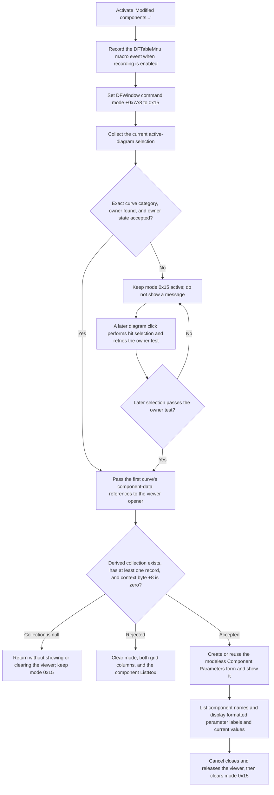

# Open the modified-component parameter viewer

> Analysis status: Source reviewed and behavior traced.

## Control

| Property | Recovered value |
| --- | --- |
| Form | DFWindow |
| Component path | DFWindow.DFPopupMnu.DFTableMnu |
| Control class | TMenuItem |
| Caption | Modified components... |
| Visible | `false` in the recovered DFM resource |
| Hint | Not present in the recovered resource. |
| Handler name | DFTableMnuClick |
| Handler address | 01a847f0 |
| Graph node | `resource:dfm:DFWindow/DFWindow.DFPopupMnu.DFTableMnu` |
| Handler node | `function:01a847f0` |
| Graph layer | UI |

## What happens when clicked

`FUN_01a847f0` records the `DFTableMnu` command when macro recording is
enabled. It then writes command code `0x15` to `DFWindow +0x7A8` and passes the
active diagram at `DFWindow +0x798` to `FUN_01ad6200`.

The launch coordinator builds the current diagram selection and requires its
combined category to equal exactly `2`, the recovered curve category. It uses
the first selected curve and searches the diagram's coordinate-system
collection for the first owner whose member collection contains that curve.
The owner must also pass the recovered state test at owner offset `+0x58`.
Only then does the coordinator pass the curve fields at `+0xE0` and `+0xC8`
to the component-parameter viewer opener.

If the current selection does not pass these tests, the coordinator returns
without a message. It does not clear command code `0x15`. The DFWindow mouse
dispatcher recognizes this code. A later diagram mouse-down makes a fresh hit
selection, finds its owner, applies the same owner-state test, and can call the
same viewer opener. The menu command therefore supports both an immediate
open from the current selection and a deferred open after the user selects a
suitable curve in the diagram.

## Command and launch flow

## Viewer construction and inputs

`FUN_010f2ba0` creates `TComponentParamsDlg` only when its cached global form
pointer is null. The application owns the form. Later calls reuse the cached
instance. The opener replaces two borrowed form references on every call:

- Form field `+0x6E0` receives a component-record collection derived from the
  second input object.
- Form field `+0x6E8` receives the first input object as its associated context.

The opener accepts the data only when the derived collection is non-null, its
record count is at least one, and the context byte at `+8` is zero. On the
accepted path it calls the VCL modeless `Show` routine and requests an initial
grid rebuild. It does not call `ShowModal`, inspect a modal result, or wait for
the viewer to close.

The recovered DFM calls the destination form `Component Parameters`. It has a
component ListBox, a `TViewGrid`, Cancel, and Help. It has no OK or Apply
control.

## Table data and formatting

When the viewer is first shown, `FormShow` enumerates the borrowed collection.
It adds each component-record name to the ListBox and accumulates the record
widths. `FormActivate` selects ListBox item 0 and calculates the base position
for the collection's value stream.

The initial and later ListBox refresh handler clears grid columns 0 and 1. It
uses the selected component index and the widths of earlier records to seek to
that component's value slice. For every parameter descriptor, it reads the
current value, obtains the localized label or description, formats the value,
and writes the pair to the two grid columns. Some descriptors can produce more
than one row. The detailed extraction and bounds behavior are documented in
the [ComponentParamsDlg ListBox analysis](../componentparamsdlg/listbox-a0b6631a61.md).

This path reads component names, descriptors, and current values. It does not
write a parameter value. No recovered handler reads the generated grid cells
back into the borrowed collection.

## No-op, retry, and error paths

- An empty, non-curve, mixed, or otherwise ineligible current selection does
  not show a message. The handler leaves mode `0x15` active for a later diagram
  click.
- If no coordinate-system owner contains the first selected curve, or the
  owner does not pass the state test at `+0x58`, the immediate launch is a
  silent no-op and the mode remains active.
- If the opener derives a null collection, it returns without showing the
  viewer, clearing the controls, or resetting the mode. A cached viewer can
  therefore keep its existing displayed text.
- If the collection is empty or the context byte at `+8` is nonzero, the
  opener resets the command mode and clears both grid columns and the ListBox.
  It does not close a viewer that is already visible.
- A repeated command reuses the cached viewer, replaces its borrowed input
  references, calls modeless `Show`, and requests a grid refresh. The opener
  does not contain a separate re-entry guard.
- The click handler does not test the active-diagram pointer before the launch
  coordinator dereferences it. A null or invalid pointer can fail after the
  macro event and mode write have occurred.
- The handler, coordinator, and opener have no local exception recovery.
  Allocation, collection access, modeless-show, and grid-formatting failures
  propagate through their callers and can leave the viewer only partly
  updated.
- The ListBox renderer has its own bounds-checked record access. An invalid
  selection can raise the recovered `TClassCollection: List index error` after
  the grid columns have been cleared.

## Close, document, and persistence boundaries

Cancel uses the shared VCL close pipeline, requests deferred release, destroys
the viewer's form-owned temporary list, and clears the cached form pointer.
It also clears the controller command byte. The borrowed component collection
and context remain owned by their caller. See the
[ComponentParamsDlg Cancel analysis](../componentparamsdlg/cancelbtn-0f4f71be9b.md).

The viewer is read-only in the recovered application path. This command does
not add, remove, or edit a curve; change axes or layout; redraw the diagram;
write a document; export a table; or save a setting. Its only output beyond
transient UI state is the command event sent to an enabled macro recorder. The
mode byte and all ListBox and grid contents are transient UI state.

## Evidence

- [Menu handler `FUN_01a847f0`](../../../DecompiledSources/Tina16/functions/0000000001A847F0__FUN_01a847f0.c)
  records the macro command, writes mode `0x15`, and launches against the
  active diagram.
- [Current-selection coordinator `FUN_01ad6200`](../../../DecompiledSources/Tina16/functions/0000000001AD6200__FUN_01ad6200.c)
  requires exact selection category `2`, finds the first selected curve's
  coordinate-system owner, tests its state, and calls the viewer opener.
- [Modeless viewer opener `FUN_010f2ba0`](../../../DecompiledSources/Tina16/functions/00000000010F2BA0__FUN_010f2ba0.c)
  creates or reuses the form, assigns borrowed data, handles rejected data,
  calls modeless `Show`, and starts the grid refresh.
- [DFWindow mouse dispatcher `FUN_01a730e0`](../../../DecompiledSources/Tina16/functions/0000000001A730E0__FUN_01a730e0.c)
  handles mode `0x15`, performs a new hit selection and owner lookup, and calls
  the same opener for an accepted target.
- [Form show population `FUN_010f1f60`](../../../DecompiledSources/Tina16/functions/00000000010F1F60__FUN_010f1f60.c)
  adds component names and accumulates their record widths.
- [Form activation `FUN_010f2040`](../../../DecompiledSources/Tina16/functions/00000000010F2040__FUN_010f2040.c)
  selects the first component and calculates the value-stream base position.
- [ListBox renderer `FUN_010f27c0`](../../../DecompiledSources/Tina16/functions/00000000010F27C0__FUN_010f27c0.c)
  locates the selected component values and builds the two-column display.
- [Parameter-row formatter `FUN_010f20b0`](../../../DecompiledSources/Tina16/functions/00000000010F20B0__FUN_010f20b0.c)
  maps parameter metadata and formats the current values.
- [Recovered UI evidence](../../../DecompiledSources/Tina16/resources/dfm/ui-evidence.json)
  identifies the hidden popup item, its caption and handler, and the
  Component Parameters form controls.

## Resource and analysis limits

- The recovered DFM sets this popup item to `Visible=false`. The recovered
  source does not show a path that makes it visible, so normal user access to
  this specific menu item is not established.
- The exact Delphi class and field names for the curve fields at `+0xE0` and
  `+0xC8`, the owner state at `+0x58`, and the controller mode byte at `+0x7A8`
  are not recovered. This article uses offsets and observed data flow.
- The caption says “Modified components...”, but the source does not test a
  separate modified flag in each component record. The verified eligibility
  tests are the curve selection, owner membership and state, collection count,
  and context byte described above.
- The resource has no hint, image reference, or extracted glyph. The caption
  supports the feature name but not the detailed behavior by itself.

## Annotation scope

This Bead owns the unique menu handler `FUN_01a847f0`, the shared
current-selection launch coordinator `FUN_01ad6200`, and the shared modeless
viewer opener `FUN_010f2ba0`. The ComponentParamsDlg ListBox Bead owns
`FUN_010f27c0` and `FUN_010f20b0`; the Cancel Bead owns `FUN_010f2b80`.
Shared selection, VCL, grid, string, and macro-recording helpers remain linked
without duplicate annotations.
