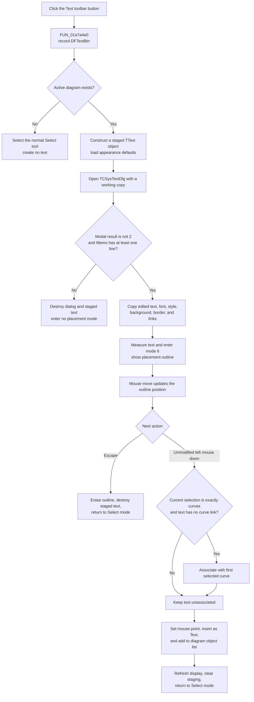

# Create and place diagram text from the toolbar

> Analysis status: Evidence-backed source review complete.

## Control

| Property | Recovered value |
| --- | --- |
| Form | DFWindow |
| Toolbar path | DFToolPanel > ToolNoteBook > Diagram > DFTextBtn |
| Component path | DFWindow.DFToolPanel.ToolNoteBook.Diagram.DFTextBtn |
| Control class | TSpeedButton |
| Caption | Not present in the recovered resource. |
| Hint | Text |
| Handler name | DFTextBtnClick |
| Handler address | 01a7a4a0 |
| Graph node | `resource:dfm:DFWindow/DFWindow.DFToolPanel.ToolNoteBook.Diagram.DFTextBtn` |
| Handler node | `function:01a7a4a0` |
| Graph layer | UI |

The `Diagram` toolbar button is 25×25 pixels, belongs to tool group `1`, shows the hint `Text`, and has a 20×20 embedded glyph with a letter `T`. The popup-menu `TextMnu` wrapper selects this same toolbar tool and calls `DFTextBtnClick`; this article is the canonical explanation of the shared toolbar handler.

## What happens when clicked

`DFTextBtnClick` records the command token `DFTextBtn`, then reads the active diagram at `DFWindow +0x798`.

If there is no active diagram, it selects `DFSelectBtn`, invokes the Select-tool handler, and returns. It does not create a text object or open the editor.

With an active diagram, `FUN_01a5d940` constructs a new `TText` diagram object and stores it as the staged object at `DFWindow +0xff0`. The handler enables the nested rendered-text state, loads the form's shared font/style collection, and applies the recovered `Background`, `BgndColor`, and `Border` defaults.

It then creates `TCSysTextDlg`, loads a working copy of the new object into the dialog, and calls `ShowModal`. The dialog provides a memo editor, rendered preview, font chooser, background and border controls, link tools, and built-in OK and Cancel buttons. Its `OnClose` handler synchronizes the memo, font, mode, and related options into the dialog's internal staged object before control returns to `DFTextBtnClick`.

The toolbar handler accepts the staged result only when the modal result is not `2` and the memo lines collection has at least one item. The DFM defines the built-in Cancel button as `bkCancel`; its modal result is `2`. A result of `2`, or zero memo lines, destroys both the new object and dialog and clears `DFWindow +0xff0`. No placement mode starts.

## Accepted text staging

For an accepted dialog result, the handler copies the complete dialog working object back into the new `TText` object. This includes rendered text, font, mode, geometry, color, background, border, and recovered link fields. It adds the text object's font state to the form's shared collection at `+0x1038`.

The handler places the object temporarily at `(-100, -100)`, measures its width and height on the current canvas, associates it with the active diagram, recalculates its layout and display scale, and draws an off-screen placement outline. It then sets the DFWindow interaction byte at `+0x7a8` to mode `6`.

At this point, the dialog is closed and destroyed, but the text is not yet a member of the diagram. The new object remains owned through the staged pointer at `+0xff0` until the user places or cancels it.

## Mouse placement and optional curve association

In mode `6`, `DFWindow.FormMouseMove` erases the old outline, updates the stored preview origin to the current form mouse coordinates, and draws the text-sized outline at the new position.

The next unmodified left-button `DFWindow.FormMouseDown` commits the placement. The recovered branch requires button code `0` and a clear low shift-state bit:

1. It collects the selection again at placement time.
2. If the selection category is exactly curve-only category `2` and the staged text has no existing association at `+0xa8`, it links the text to item zero from that selection and registers the text with that curve. Other, mixed, or empty selections leave the text unassociated.
3. It sets the text position from the mouse-down X and Y values, assigns the active diagram, recalculates layout, and updates display scaling.
4. It inserts the object into the diagram's named `Text` collection and adds it to the diagram object list if it is not already present.
5. It erases the preview, refreshes diagram object display state, clears the staged pointer without destroying the inserted object, selects the normal Select tool, and returns interaction mode to `0`.

The mouse-up event is not the commit boundary for mode `6`; insertion occurs in `FormMouseDown`.

## Interaction flow

## Cancel, no-op, and error behavior

- No active diagram selects the Select tool and stops before construction.
- Dialog Cancel has modal result `2`; it discards the new object and starts no placement mode.
- A dialog result other than `2` still requires at least one memo line. A zero-line memo is discarded. The source does not trim whitespace or prove that a line contains visible characters.
- Escape during placement erases the preview, destroys the staged text at `+0xff0`, clears mode `6`, returns to the Select tool, and refreshes the active diagram.
- A placement with no exact curve-only selection still succeeds as standalone diagram text.
- The handler and later mouse commit have no local exception handler, transaction, or rollback. If construction, dialog synchronization, collection insertion, curve association, or redraw raises an exception, the recovered code does not prove that all staged or partially inserted state is undone.
- Collection insertion and refresh calls do not return a result that this path checks. There is no local user-facing error message for an insertion failure.

## Model state, redraw, and serialization

Before mouse-down, the object is in staged state only. After mouse-down, it is in the active diagram's `Text` collection and general object list. The refresh path recalculates and redraws diagram objects, including the new text, then clears the temporary selection list used during the update.

The class pointer used by `FUN_01a5d940` is registered as serialized type `0x408`. The recovered diagram loader also recognizes `Figure.Type = TText`, constructs this class, and loads its saved properties. Insertion therefore makes the object available to the normal diagram Copy and save serialization paths. This click and placement path does not itself write a file, database, registry value, or INI value, and it does not prove when the containing document is marked modified or added to an undo history.

## Recovered evidence

- [`FUN_01a7a4a0`](../../../DecompiledSources/Tina16/functions/0000000001A7A4A0__FUN_01a7a4a0.c) is the canonical toolbar handler. It constructs and configures the staged object, shows the text dialog, applies the accept and zero-line checks, prepares the preview, and enters mode `6`.
- [`FUN_01a5d940`](../../../DecompiledSources/Tina16/functions/0000000001A5D940__FUN_01a5d940.c) constructs the recovered `TText` object and its nested rendered-text state with default appearance and association fields.
- [`FUN_0146a9a0`](../../../DecompiledSources/Tina16/functions/000000000146A9A0__FUN_0146a9a0.c) loads a source text object into `TCSysTextDlg` staging and editor controls. Its canonical annotation belongs to `TIARA-diz.6.7.123`.
- [`FUN_0146ab60`](../../../DecompiledSources/Tina16/functions/000000000146AB60__FUN_0146ab60.c) synchronizes the editor into dialog staging on close. Its canonical annotation belongs to `TIARA-diz.6.7.123`.
- [`FUN_01a5eb60`](../../../DecompiledSources/Tina16/functions/0000000001A5EB60__FUN_01a5eb60.c) copies the complete recovered system-text state. Its canonical annotation belongs to `TIARA-diz.6.7.123`.
- [`FUN_01a74a50`](../../../DecompiledSources/Tina16/functions/0000000001A74A50__FUN_01a74a50.c) is `DFWindow.FormMouseMove`; its mode-`6` branch moves the placement outline.
- [`FUN_01a730e0`](../../../DecompiledSources/Tina16/functions/0000000001A730E0__FUN_01a730e0.c) is `DFWindow.FormMouseDown`; its mode-`6` branch applies the mouse point, optional curve link, and diagram insertion.
- [`FUN_01a7d1a0`](../../../DecompiledSources/Tina16/functions/0000000001A7D1A0__FUN_01a7d1a0.c) cancels active interaction mode `6`. `DFWindow.FormKeyDown` calls it for Escape.
- [`FUN_01a8dee0`](../../../DecompiledSources/Tina16/functions/0000000001A8DEE0__FUN_01a8dee0.c) adds the placed object to the diagram list only when it is absent.
- [`FUN_01ae5650`](../../../DecompiledSources/Tina16/functions/0000000001AE5650__FUN_01ae5650.c) refreshes the diagram objects after insertion.
- [`FUN_011569a0`](../../../DecompiledSources/Tina16/functions/00000000011569A0__FUN_011569a0.c) registers the `TText` class pointer as serialized type `0x408`.
- [`FUN_01adfeb0`](../../../DecompiledSources/Tina16/functions/0000000001ADFEB0__FUN_01adfeb0.c) recognizes `TText` while it loads saved diagram figures.
- [`FUN_01a7b8f0`](../../../DecompiledSources/Tina16/functions/0000000001A7B8F0__FUN_01a7b8f0.c) is the popup `TextMnu` wrapper that selects the toolbar button and delegates to the canonical toolbar handler.
- Extracted glyph: [`0098_DFWindow_DFWindow_DFToolPanel_ToolNoteBook_Diagram_DFTextBtn_Glyph_Data.png`](../../../glyph/0098_DFWindow_DFWindow_DFToolPanel_ToolNoteBook_Diagram_DFTextBtn_Glyph_Data.png)
- UI form and dialog evidence: [`ui-evidence.json`](../../../DecompiledSources/Tina16/resources/dfm/ui-evidence.json)

## Analysis limits

Private DFWindow and `TText` fields without published names remain documented by offsets or by observed use. The source proves that curve-only selection can create an association, but it does not recover the business meaning of the two large sentinel values stored with that link. The exact Delphi name of the low shift-state bit was not recovered. A live dialog and placement test was not performed.
