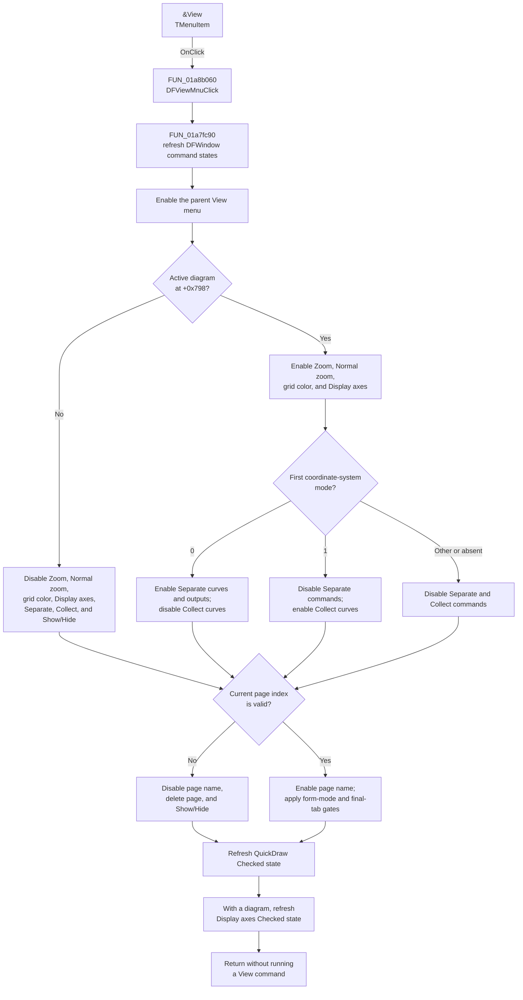

# &View

> Analysis status: Complete. Opening this menu recalculates View-command states from the current page, diagram, and first plot coordinate system. It does not execute a View command.

## Control

| Property | Recovered value |
| --- | --- |
| Form | DFWindow |
| Component path | DFWindow.DFMainMenu.DFViewMnu |
| Control class | TMenuItem |
| Caption | &View |
| Hint | Not present in the recovered resource. |
| Handler name | DFViewMnuClick |
| Handler address | 01a8b060 |
| Graph node | `resource:dfm:DFWindow/DFWindow.DFMainMenu.DFViewMnu` |
| Handler node | `function:01a8b060` |
| Graph layer | UI |

## What happens when opened

`DFViewMnuClick` at `01a8b060` only calls `FUN_01a7fc90`. This common `DFWindow` routine refreshes menu and toolbar states. The changes below are the subset that applies to `DFViewMnu` and its children.

The routine enables the parent `DFViewMnu` unconditionally. It then prepares these child commands:

| Command | State prepared when the menu opens |
| --- | --- |
| `PageNameMnu` — `Set page name ...` | Enabled when the tab set has a current page index. An index of `-1` disables it. |
| `DeletepageMnu` — `Delete page` | Enabled when a current page exists and form-mode byte `+0x1088` equals `1`. Otherwise, it is disabled. |
| `DFZoomMnu` — `Zoom` | Enabled when `form + 0x798` contains an active diagram. |
| `DFNormalzoomMnu` — `Normal zoom` | Enabled when an active diagram exists. The refresh does not test the current zoom scale or zoom history. |
| `DFSetgridcolorMnu` — `Set grid color...` | Enabled when an active diagram exists. |
| `DisplayAxesMnu` — `Display axes` | Enabled when an active diagram exists. Its Checked state is also refreshed from that diagram, as described below. |
| `SeparateCurvesMnu` — `Separate curves` | Enabled only when an active diagram has a first coordinate system and `FUN_01ce33d0` returns mode code `0` for it. |
| `SeparateOutputsMnu` — `Separate outputs` | Uses the same mode-code-`0` condition as `SeparateCurvesMnu`. |
| `CollectCurvesMnu` — `Collect curves` | Enabled only when an active diagram has a first coordinate system and `FUN_01ce33d0` returns mode code `1` for it. |
| `ShowHidecurvesMnu` — `Show/Hide curves ...` | Enabled only when an active diagram exists, the current tab is the final tab, and form-mode byte `+0x1088` equals `1`. |

If the first coordinate-system mode is neither `0` nor `1`, both the Separate commands and Collect curves are disabled. A missing diagram or empty coordinate-system collection also disables all three commands.

The same shared refresh applies the active-diagram gate to the Zoom, Normal zoom, Zoom out, and Show/Hide curves toolbar buttons. These toolbar writes do not run a zoom operation.

## Checked and visible states

- When an active diagram exists, `DisplayAxesMnu.Checked` receives the result of `FUN_01ae9120`. That helper scans the diagram's coordinate systems for the recovered class at `DAT_01cdd500` and reads its axes-display state through `FUN_01ce89e0`. If no matching coordinate system exists, it returns true. When no diagram exists, the command is disabled and this path does not replace its existing Checked value.
- `CurveAccelMnu.Checked` is refreshed from `TINA.INI`, section `Analysis Setup`, key `QuickDraw`, with false as the default. Its caption is `Curve drawing acceleration`.
- This opening path does not rewrite the Checked state of `KeepResultsMnu`, `FreqandslopeMnu`, `ScreenResolutionMnu`, the curve-width items, or the vector-label-style items. Their command handlers own those state changes.
- The refresh makes no Visible-property write to `DFViewMnu` or any child View item. It can hide other menus outside View when a separate global runtime flag is set, but that branch does not apply to this control tree.

## Page, plot, selection, and command boundaries

- The page-name and delete-page states use the current tab index. Show/Hide curves also requires the current tab to be the final tab.
- The Separate and Collect states use only the first coordinate system in the active diagram. The semantic Delphi name for its recovered mode byte is not available.
- The Display axes Checked state comes from a matching coordinate system in the active diagram.
- The shared routine queries selected diagram objects for Edit-menu and axis-command states. None of the View-menu branches above uses that selection result. View availability therefore does not depend on a selected curve or axis.
- Zoom and Normal zoom test only whether an active diagram exists. They do not test the selected object, magnification, zoom rectangle, or zoom history.
- The handler does not call any View child handler. It does not rename or delete a page, zoom, change grid color, separate or collect curves, change axes visibility, or change curve data.
- Except for reading `QuickDraw`, this path performs no settings persistence. It does not write `TINA.INI`.

Opening the menu again recalculates the states. `FUN_007e2da0` returns without invalidating the menu when an Enabled value already matches. The Checked and Visible setters used by the shared refresh are also change-aware.

## Menu-open flow

## Resource evidence

The resource gives the parent the caption `&View`. Its recovered direct commands include Zoom, Normal zoom, Display axes, Freq. and slope, Show/Hide curves, Draw curves in screen resolution, Separate curves, Separate outputs, Collect curves, Set grid color, Set page name, Delete page, Curve drawing acceleration, and Keep results. It also contains the Default curve width and Vector label style submenus. No View item has a recovered hint, action binding, glyph, or embedded image.

- UI resource evidence: [`ui-evidence.json`](../../../DecompiledSources/Tina16/resources/dfm/ui-evidence.json)

## Recovered evidence

- [`FUN_01a8b060`](../../../DecompiledSources/Tina16/functions/0000000001A8B060__FUN_01a8b060.c) is the DFM-bound `DFViewMnuClick` handler. It contains only a call to the shared refresh.
- [`FUN_01a7fc90`](../../../DecompiledSources/Tina16/functions/0000000001A7FC90__FUN_01a7fc90.c) reads the current page, form mode, active diagram, first coordinate system, axes-display state, and `QuickDraw` setting before it writes menu and toolbar states. It does not call a View command handler.
- [`FUN_007e2da0`](../../../DecompiledSources/Tina16/functions/00000000007E2DA0__FUN_007e2da0.c) is the change-aware `TMenuItem.Enabled` setter. It writes byte `+0x81` and invalidates the menu only when the requested value differs.
- [`FUN_007e2d20`](../../../DecompiledSources/Tina16/functions/00000000007E2D20__FUN_007e2d20.c) sets the Checked state used for Display axes and Curve drawing acceleration.
- [`FUN_01ae9120`](../../../DecompiledSources/Tina16/functions/0000000001AE9120__FUN_01ae9120.c) derives the Display axes Checked state from the active diagram's coordinate systems.
- [`FUN_01ce33d0`](../../../DecompiledSources/Tina16/functions/0000000001CE33D0__FUN_01ce33d0.c) returns the first coordinate system's recovered mode code used to choose Separate or Collect availability.
- [`FUN_00f06890`](../../../DecompiledSources/Tina16/functions/0000000000F06890__FUN_00f06890.c) reads `QuickDraw` from the `Analysis Setup` section of `TINA.INI`.
- Published `TDFWindow` RTTI maps the parent and direct View fields to the offsets used by `FUN_01a7fc90`, including `DFViewMnu` at `+0x808`, `PageNameMnu` at `+0x880`, `SeparateCurvesMnu` at `+0x888`, `DeletepageMnu` at `+0x890`, `CollectCurvesMnu` at `+0x918`, `DFZoomMnu` at `+0x920`, `DFNormalzoomMnu` at `+0x928`, `DFSetgridcolorMnu` at `+0x968`, `DisplayAxesMnu` at `+0x9E8`, `CurveAccelMnu` at `+0xA38`, `SeparateOutputsMnu` at `+0xA58`, and `ShowHidecurvesMnu` at `+0xBC0`.

## Errors and analysis limits

- The handler and shared refresh have no validation message, error result, local exception handler, or rollback. A query or VCL setter exception propagates. Because state writes occur in sequence, earlier UI-state changes can remain if a later operation fails.
- No model rollback is needed because this path does not change page, plot, selection, zoom, or curve data.
- The recovered names for form fields `+0x798` and `+0x1088`, and the semantic name of the coordinate-system mode returned by `FUN_01ce33d0`, are not published. This article describes only the observed tests and effects.
- A live UI test was not performed. The DFM binding, published-field offsets, graph neighborhood, and recovered handler path agree on this menu-preparation behavior.
