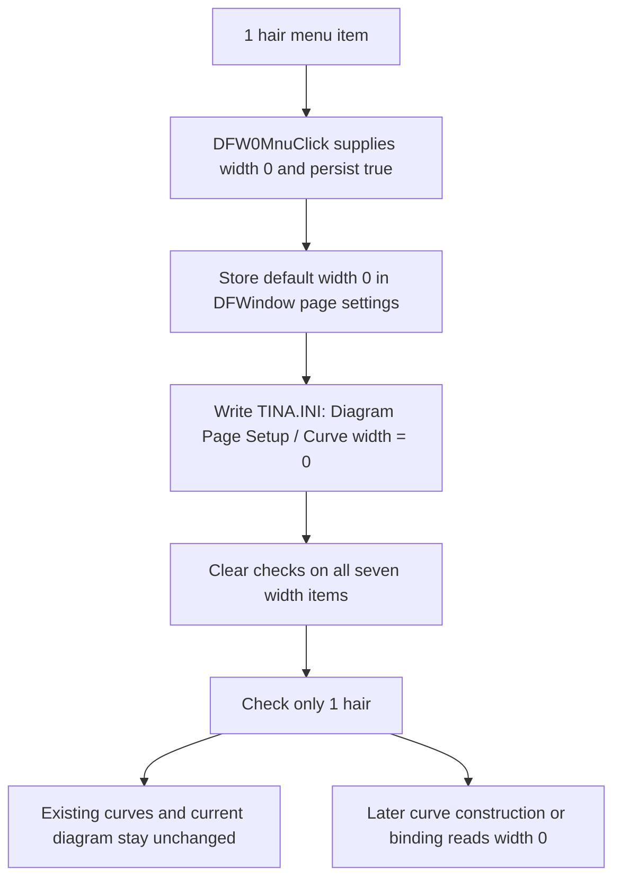

# Use a hairline as the default curve width

> Analysis status: Source reviewed through default storage, menu-state
> synchronization, INI persistence, curve consumers, and failure bounds.

## Control

| Property | Recovered value |
| --- | --- |
| Form | DFWindow |
| Component path | DFWindow.DFMainMenu.DFViewMnu.Defaultcurvewidth1.DFW0Mnu |
| Control class | TMenuItem |
| Caption | 1 (hair) |
| Hint | Not present in the recovered resource. |
| Text | Not present in the recovered resource. |
| Handler name | DFW0MnuClick |
| Handler address | 01a87af0 |
| Graph node | `resource:dfm:DFWindow/DFWindow.DFMainMenu.DFViewMnu.Defaultcurvewidth1.DFW0Mnu` |
| Handler node | `function:01a87af0` |
| Graph layer | UI |

## What happens when clicked

This command makes the hairline option the default width for curves that are
created or attached later. `FUN_01a87af0` passes width value `0` and persistence
flag `1` to the shared width helper `FUN_01a87970`.

The stored value is intentionally one less than the number at the start of the
menu caption:

| Menu caption | Stored pen width |
| --- | ---: |
| `1 (hair)` | `0` |
| `2 (single)` | `1` |
| `3 (double)` | `2` |
| `4 (triple)` | `3` |
| `5 (4 point)` | `4` |
| `6 (5 point)` | `5` |
| `7 (6 point)` | `6` |

For this item, `0` is the actual width written to the page-settings field and
later supplied to the recovered VCL pen-width setter. The resource caption
identifies that zero-width setting as the hairline choice. The handler does not
convert it to `1` before storage or use.

## Stored setting and checked menu

`FUN_01a87970` writes the zero-extended byte value to offset `0x50` of the
DFWindow page-settings object at form offset `0x7a0`. It then clears the Checked
state of all seven `DFW0Mnu` through `DFW6Mnu` items and checks only
`DFW0Mnu`.

The helper performs these calls explicitly instead of relying only on a radio
group side effect. The shared VCL checked-state setter updates the native menu
when a state changes. Clicking an already selected hairline option still writes
the setting and the INI value again; the helper first requests all seven items
unchecked and then requests `DFW0Mnu` checked. The VCL setter itself skips a
native update when a requested state already matches.

## Existing and future curves

The click path does not enumerate current curves, set a current curve's pen,
invalidate a diagram, or request a redraw. Existing curves therefore keep
their stored widths after this click.

The recovered consumers establish the setting as a default:

- `FUN_01ab2610` constructs a sampled curve and initializes its pen from the
  current DFWindow setting. It uses width `2` only when no current DFWindow is
  available.
- `FUN_01ab6b60` does the same for the alternate recovered curve class.
- `FUN_01ab28d0` and `FUN_01ab6ed0` apply the owning DFWindow's default when a
  curve object is attached to a compatible diagram owner. A non-DFWindow owner
  uses width `1` instead.

Thus a later curve creation or compatible owner-binding sees value `0` and
sets that curve's pen to the hairline width. A curve can still receive an
individual width later through curve-properties editing; this menu does not
override such existing per-curve values in place.

## Persistence and restoration

Because the wrapper passes persistence flag `1`, `FUN_01a87970` calls the
shared integer-setting writer with:

- file: `TINA.INI`;
- section: `Diagram Page Setup`;
- key: `Curve width`; and
- value: `0`.

The write happens immediately during the click; it is not deferred to diagram
save or application shutdown. It is an application page-setup preference, not
part of the active diagram's curve data.

During DFWindow construction, `FUN_01cebd00` reads the same key with fallback
value `2`. `FUN_01a72620` then calls `FUN_01a87970` with the loaded byte and
persistence flag `0`. This restores the in-memory default and matching check
mark without writing the INI file again. The fallback therefore corresponds to
the `3 (double)` menu option when the key is absent.

## Guards, errors, and partial state

The `DFW0Mnu` wrapper supplies constant value `0`, so there is no selection,
dialog, curve, or range guard and no normal cancel path. The shared helper also
does not compare the requested width with the previous default before it writes
the preference.

There is no local exception handling or rollback. The helper changes the
in-memory page setting before it writes `TINA.INI`, and it updates menu checks
after that write. An INI-write failure can therefore leave width `0` active in
memory while the prior menu checks remain visible and the persisted value stays
unchanged. A later menu-update failure can leave only some check states updated.

No curve is partly restyled by this command because the click does not touch
existing curve objects. A newly constructed curve can still fail later while
it applies the default; that failure belongs to the separate construction path.

## Click flow

## Handler evidence

- Source: [FUN_01a87af0](../../../DecompiledSources/Tina16/functions/0000000001A87AF0__FUN_01a87af0.c)
- Recovered role: Selects stored width `0` as the persistent default curve
  width.
- Input evidence: The wrapper passes constants `0` and `1` to
  `FUN_01a87970`; it does not read Sender or current selection state.
- State evidence: The shared helper writes page-settings offset `0x50`, writes
  the INI key, clears all seven check marks, and checks offset `0x9a8`, which is
  `DFW0Mnu`.
- Consumer evidence: Both recovered curve constructors and both compatible
  owner-binding functions pass page-settings offset `0x50` to the VCL pen-width
  setter.
- Complexity: simple
- Distinct outgoing calls: 1

## Relevant calls

- [`FUN_01a87970`](../../../DecompiledSources/Tina16/functions/0000000001A87970__FUN_01a87970.c)
  stores and optionally persists a width value, then synchronizes the seven
  width-menu checks.
- [`FUN_00f069f0`](../../../DecompiledSources/Tina16/functions/0000000000F069F0__FUN_00f069f0.c)
  writes an integer under `Diagram Page Setup` in `TINA.INI`.
- [`FUN_007e2d20`](../../../DecompiledSources/Tina16/functions/00000000007E2D20__FUN_007e2d20.c)
  changes a VCL menu item's Checked state and updates its native-menu state when
  needed.
- [`FUN_01ab2610`](../../../DecompiledSources/Tina16/functions/0000000001AB2610__FUN_01ab2610.c)
  initializes a newly constructed sampled curve's pen from the current default.
- [`FUN_01ab6b60`](../../../DecompiledSources/Tina16/functions/0000000001AB6B60__FUN_01ab6b60.c)
  initializes the alternate recovered curve class from the same default.
- [`FUN_01cebd00`](../../../DecompiledSources/Tina16/functions/0000000001CEBD00__FUN_01cebd00.c)
  reads the persisted default with fallback value `2` during page-settings
  construction.
- [`FUN_01a72620`](../../../DecompiledSources/Tina16/functions/0000000001A72620__FUN_01a72620.c)
  restores the width and menu checks without rewriting the INI key.

## Resource evidence

- The parent menu caption is **Default curve width**.
- This item has caption **1 (hair)**. Its six siblings are the ordered width
  choices from **2 (single)** through **7 (6 point)**.
- The item has no recovered hint, action, image reference, embedded glyph, or
  initial Checked property. The checked item is established at runtime from the
  loaded setting.

## Analysis limits

- The Delphi names of the page-settings class and the two curve classes are not
  recovered.
- The source proves that `0` reaches the pen-width property and that the UI
  calls it a hairline. It does not expose the final graphics-driver rasterization
  rule or physical display thickness.
- The source does not establish how an invalid manually edited INI value above
  `6` is shown. The restore helper stores such a byte but checks none of the
  seven menu items.
