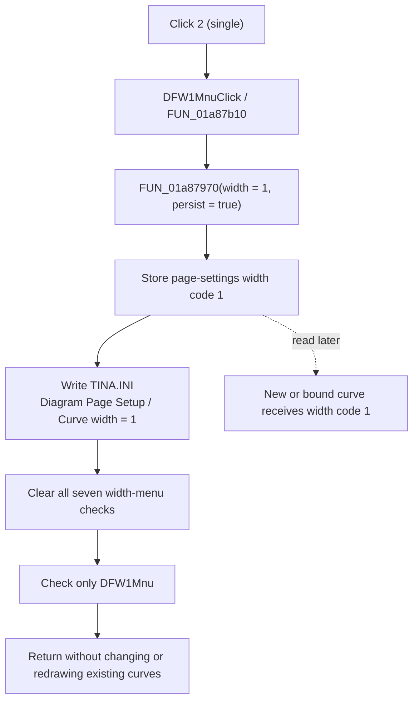

# 2 (single)

> Analysis status: Complete from recovered resource, handler, shared-helper, initialization, and curve-construction evidence.

## Control

| Property | Recovered value |
| --- | --- |
| Form | DFWindow |
| Component path | DFWindow.DFMainMenu.DFViewMnu.Defaultcurvewidth1.DFW1Mnu |
| Control class | TMenuItem |
| Parent menu | Default curve width |
| Caption | 2 (single) |
| Handler name | DFW1MnuClick |
| Handler address | 01a87b10 |
| Graph node | `resource:dfm:DFWindow/DFWindow.DFMainMenu.DFViewMnu.Defaultcurvewidth1.DFW1Mnu` |
| Handler node | `function:01a87b10` |

## What happens when clicked

The click selects **2 (single)** as the default width for curves that DFWindow creates or binds later. The short handler passes internal width value `1` and persistence enabled to the shared default-width helper.

The visible width and stored value use different numbering. The seven menu captions run from `1 (hair)` through `7 (6 point)`, while their handlers pass values `0` through `6`. This item has visible width `2` and stored value `1`.

The shared helper performs these operations:

1. It stores `1` in the current DFWindow page-settings object at field offset `+0x50`.
2. It writes integer `1` to `TINA.INI`, section `Diagram Page Setup`, key `Curve width`.
3. It clears the checked state of all seven width items.
4. It checks only `DFW1Mnu`, the item at DFWindow field offset `+0x9B0`.

The recovered DFM does not contain a static checked value or radio-group property for this item. The helper sets the exclusive checked state at run time.

## Existing and new curves

This click changes a default. It does not change an existing curve. The click path has no curve iteration, pen-width update, modified-state update, or redraw request.

Later curve constructors and binding paths read the same page-settings field and pass it to the curve pen-width setter. New or newly bound curves can therefore receive internal width `1`. Separate curve-properties code changes existing selected curves and requests a redraw; this menu handler does not call that path.

## Persistence and initialization

The setting is saved immediately in the application INI file. It is not a diagram-document save operation, and the handler does not mark the open diagram as modified.

During later DFWindow initialization, the page-settings constructor reads `Diagram Page Setup / Curve width`. The form then calls the same helper with persistence disabled. This restores the checked menu item without writing the setting again. If the INI key is absent, the recovered constructor uses fallback value `2`; that fallback is separate from this item's stored value `1`.

## Repeated clicks and errors

A repeated click is not a complete no-op. The handler stores `1` and writes the INI value again. The low-level menu setter skips native menu work when the checked state is already correct.

The handler has no input validation, result test, local exception handler, or error message. The shared path does not report a failed INI write. No normal cancel branch exists for this menu command.

## Click flow

## Evidence

- [DFW1MnuClick](../../../DecompiledSources/Tina16/functions/0000000001A87B10__FUN_01a87b10.c) calls `FUN_01a87970(param_1, 1, 1)` and returns. It does not inspect `Sender`.
- [The shared default-width helper](../../../DecompiledSources/Tina16/functions/0000000001A87970__FUN_01a87970.c) stores the width, optionally persists it, clears seven menu checks, and selects the item for values `0` through `6`.
- [The INI integer writer](../../../DecompiledSources/Tina16/functions/0000000000F069F0__FUN_00f069f0.c) writes under section `Diagram Page Setup`; this call supplies key `Curve width` and value `1`.
- [DFWindow initialization](../../../DecompiledSources/Tina16/functions/0000000001A72620__FUN_01a72620.c) reads the stored page-settings value and calls the helper with persistence disabled.
- [The page-settings constructor](../../../DecompiledSources/Tina16/functions/0000000001CEBD00__FUN_01cebd00.c) reads `Curve width` from the INI file with fallback value `2` and stores it at offset `+0x50`.
- [One curve-construction path](../../../DecompiledSources/Tina16/functions/0000000001AB2610__FUN_01ab2610.c) and [a second curve-construction path](../../../DecompiledSources/Tina16/functions/0000000001AB6B60__FUN_01ab6b60.c) read that field for the new object's pen width.
- [One curve-binding path](../../../DecompiledSources/Tina16/functions/0000000001AB28D0__FUN_01ab28d0.c) and [a second curve-binding path](../../../DecompiledSources/Tina16/functions/0000000001AB6ED0__FUN_01ab6ed0.c) also copy the page-settings width into the bound object's pen state.
- The recovered resource identifies the parent caption `Default curve width`, this item caption `2 (single)`, and handler `DFW1MnuClick`. It has no hint, text, glyph, or image resource.

## Limits

- The recovered code proves the internal values and their menu captions. It does not define a physical unit for every width code.
- The direct click path does not expose an INI-write success result, so the source does not prove how an external file-system failure is presented.
