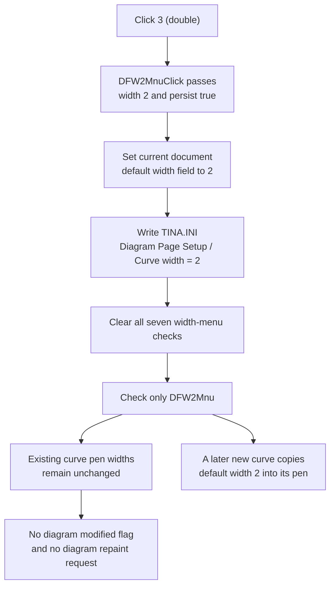

# Set the default curve-width value to 2

> Analysis status: Evidence-backed from the recovered menu handler, shared width helper, INI access, and curve constructors.

## Control

| Property | Recovered value |
| --- | --- |
| Form | DFWindow |
| Menu path | View > Default curve width > 3 (double) |
| Component path | DFWindow.DFMainMenu.DFViewMnu.Defaultcurvewidth1.DFW2Mnu |
| Control class | TMenuItem |
| Caption | 3 (double) |
| Hint | Not present in the recovered resource. |
| Handler name | DFW2MnuClick |
| Handler address | `01a87b30` |
| Graph node | `resource:dfm:DFWindow/DFWindow.DFMainMenu.DFViewMnu.Defaultcurvewidth1.DFW2Mnu` |
| Handler node | `function:01a87b30` |
| Graph layer | UI |

## What happens when clicked

[`FUN_01a87b30`](../../../DecompiledSources/Tina16/functions/0000000001A87B30__FUN_01a87b30.c) calls the shared default-width helper, [`FUN_01a87970`](../../../DecompiledSources/Tina16/functions/0000000001A87970__FUN_01a87970.c), with width value `2` and persistence enabled. It does not read `Sender` and has no conditional branch.

The caption starts with `3` because this is the third item in the recovered seven-item menu. The handler does not store `3`: it passes the zero-based value `2`. New-curve constructors pass this value unchanged to the recovered pen-width setter. The `double` caption therefore supplies the user-facing preset name, while integer `2` is the stored and consumed width value.

## Current setting and checked state

The helper first writes `2` to the current DFWindow document's default-curve-width field at document offset `+0x50`. It then writes integer key `Curve width = 2` under section `Diagram Page Setup` in `TINA.INI` through [`FUN_00f069f0`](../../../DecompiledSources/Tina16/functions/0000000000F069F0__FUN_00f069f0.c).

After the write, the helper calls the menu checked-state setter for all seven width items:

1. It clears `DFW0Mnu` through `DFW6Mnu`.
2. It checks only `DFW2Mnu`, the item for value `2`.

The DFM does not mark any width item as initially checked and does not expose a recovered radio-group property for these items. DFWindow initialization reads the saved default from the document and calls the same helper with persistence disabled. This initializes the one checked item without rewriting the INI file. When the key is absent, the recovered document constructors use value `2` as their default, so this `3 (double)` item is the default selection.

A repeated click performs the same document-field assignment and INI write again. The helper has no equality guard for the width value. The VCL checked-state setter itself skips a notification when an item's checked byte already has the requested value.

## Existing and new curves

This command changes a default. It does not change curve objects that already exist:

- The helper does not traverse the active diagram, coordinate systems, selected curves, or pen objects.
- It does not call the pen-width setter on an existing curve.
- It does not mark the diagram document modified and does not request a diagram repaint.

Therefore, existing curves keep their independently stored pen widths and remain visually unchanged after the click. Only the menu check mark can refresh through the VCL menu-item setter.

The default is consumed when later curve objects are initialized. [`FUN_01ab2610`](../../../DecompiledSources/Tina16/functions/0000000001AB2610__FUN_01ab2610.c) and [`FUN_01ab6b60`](../../../DecompiledSources/Tina16/functions/0000000001AB6B60__FUN_01ab6b60.c) read the current DFWindow document field at `+0x50` and pass it to [`FUN_005fd6d0`](../../../DecompiledSources/Tina16/functions/00000000005FD6D0__FUN_005fd6d0.c), the recovered pen-width setter. Their owner-assignment paths, [`FUN_01ab28d0`](../../../DecompiledSources/Tina16/functions/0000000001AB28D0__FUN_01ab28d0.c) and [`FUN_01ab6ed0`](../../../DecompiledSources/Tina16/functions/0000000001AB6ED0__FUN_01ab6ed0.c), also copy the owning DFWindow's current default. A new curve created or attached after this click therefore starts with stored pen width `2`. A later per-curve style change can replace that copied value without changing the default.

## Persistence and failure boundaries

- The click writes the application preference immediately to `TINA.INI`. It does not wait for a diagram Save command.
- [`FUN_01cebb70`](../../../DecompiledSources/Tina16/functions/0000000001CEBB70__FUN_01cebb70.c) and [`FUN_01cebd00`](../../../DecompiledSources/Tina16/functions/0000000001CEBD00__FUN_01cebd00.c) initialize a new document's `+0x50` field from the same `Diagram Page Setup / Curve width` setting, with fallback value `2`.
- The owner-aware constructor can read `MEAS.INI` for the recovered measurement-owner type. The click helper itself always calls the `TINA.INI` writer. The recovered source does not establish cross-file synchronization.
- The handler and helper do not show a confirmation, success message, or validation error. Values outside `0` through `6` are not possible from this wrapper.
- There is no local exception handler, retry, or rollback around the INI write. The helper changes the current document field before it writes the file and updates the check marks afterward. If the INI writer raises an exception, the recovered order can leave the in-memory default as `2` while the persisted value or menu checks are not fully updated. The final user-facing exception handling is outside this path.
- The helper dereferences the current document without a null check. Normal menu enablement and DFWindow lifetime are expected to supply it; this handler has no separate no-document no-op branch.

## Click flow

## Recovered function roles

- [`FUN_01a87b30`](../../../DecompiledSources/Tina16/functions/0000000001A87B30__FUN_01a87b30.c) is the `DFW2Mnu` click wrapper. It selects stored width `2` and enables persistence.
- [`FUN_01a87970`](../../../DecompiledSources/Tina16/functions/0000000001A87970__FUN_01a87970.c) applies, persists, and reflects a width value from `0` through `6`. Bead `.308` owns its canonical annotation.
- [`FUN_00f069f0`](../../../DecompiledSources/Tina16/functions/0000000000F069F0__FUN_00f069f0.c) writes the integer preference to `TINA.INI` under `Diagram Page Setup`.
- [`FUN_01a72620`](../../../DecompiledSources/Tina16/functions/0000000001A72620__FUN_01a72620.c) constructs DFWindow's document and calls the shared helper with the loaded width and persistence disabled.
- [`FUN_01ab2610`](../../../DecompiledSources/Tina16/functions/0000000001AB2610__FUN_01ab2610.c) and [`FUN_01ab6b60`](../../../DecompiledSources/Tina16/functions/0000000001AB6B60__FUN_01ab6b60.c) copy the current default into new curve pen objects.

## Resource evidence and limits

- The DFWindow DFM binds `DFW2Mnu.OnClick` to `DFW2MnuClick` at `01a87b30` and supplies caption `3 (double)`.
- The item has no recovered `Checked` value, hint, image, glyph, or same-parent label. The exclusive checked state comes from code.
- The original Delphi enum name and physical unit for stored width `2` are not recovered. The article does not convert the value to pixels or points.
- No live UI test was performed. The result uses the DFM binding, read-only graph, handler, settings writer, startup path, and curve-constructor consumers.
