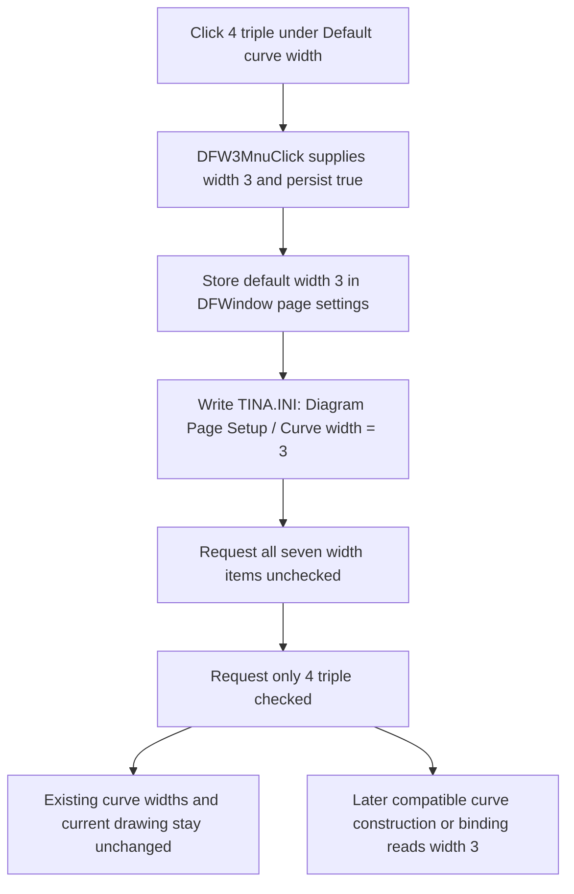

# Use the triple default curve width

> Analysis status: Source reviewed through default storage, menu-state synchronization, INI persistence, curve consumers, and failure bounds.

## Control

| Property | Recovered value |
| --- | --- |
| Form | DFWindow |
| Component path | DFWindow.DFMainMenu.DFViewMnu.Defaultcurvewidth1.DFW3Mnu |
| Control class | TMenuItem |
| Caption | 4 (triple) |
| Hint | Not present in the recovered resource. |
| Handler name | DFW3MnuClick |
| Handler address | 01a87b50 |
| Graph node | `resource:dfm:DFWindow/DFWindow.DFMainMenu.DFViewMnu.Defaultcurvewidth1.DFW3Mnu` |
| Handler node | `function:01a87b50` |
| Graph layer | UI |

## What happens when clicked

This command makes the `4 (triple)` choice the default width for curves that are created or attached later. `FUN_01a87b50` does not read `Sender`, the selected curves, or the current check state. It calls the shared default-width helper `FUN_01a87970` with stored width value `3` and persistence flag `1`.

The stored value is one less than the number at the start of each menu caption:

| Menu caption | Stored pen width |
| --- | ---: |
| `1 (hair)` | `0` |
| `2 (single)` | `1` |
| `3 (double)` | `2` |
| `4 (triple)` | `3` |
| `5 (4 point)` | `4` |
| `6 (5 point)` | `5` |
| `7 (6 point)` | `6` |

For this item, `3` is the value written to the page-settings field, saved in the INI file, and later supplied to the recovered VCL pen-width setter. The wrapper does not convert it to `4`. The resource caption supplies the user-facing `4 (triple)` description.

## Stored setting and checked state

The shared helper writes the zero-extended byte value `3` to offset `0x50` of the DFWindow page-settings object at form offset `0x7a0`. It then requests all seven `DFW0Mnu` through `DFW6Mnu` items unchecked and requests only `DFW3Mnu` checked. `DFW3Mnu` is the menu object at form offset `0x9c0`.

The VCL checked-state setter changes the stored Checked byte and updates the native menu when the requested state differs. The shared helper does not depend only on an automatic radio-group side effect.

Clicking an already selected `4 (triple)` item is not a no-op. The helper writes value `3` to memory and the INI file again, requests every width item unchecked, and then requests this item checked. The VCL setter can skip an individual native update when that requested state already matches.

## Existing and future curves

This click path does not enumerate the active diagram's curves, change a current curve pen, invalidate the diagram, or request a repaint. Existing curves keep their per-curve widths, and the current plot does not redraw because of this command alone.

The recovered consumers establish that value `3` is a default for later curve objects:

- `FUN_01ab2610` initializes a new sampled curve's pen from the current DFWindow default. It uses width `2` only when no current DFWindow exists.
- `FUN_01ab6b60` initializes the alternate recovered curve class from the same setting.
- `FUN_01ab28d0` and `FUN_01ab6ed0` apply the owning DFWindow's default when a compatible curve object is attached. A non-DFWindow owner uses width `1` instead.

Thus a compatible curve that is constructed or bound after the click receives raw pen-width value `3`. A curve can still receive its own width later through curve-properties editing. This menu does not overwrite an existing curve's individual width.

## Persistence and restoration

Because `FUN_01a87b50` passes persistence flag `1`, the shared helper writes the setting immediately as:

- file: `TINA.INI`;
- section: `Diagram Page Setup`;
- key: `Curve width`; and
- value: `3`.

The setting is an application page-setup preference. The click does not wait for a document save or application shutdown, and it does not store width `3` in each current curve.

During DFWindow construction, `FUN_01cebd00` reads the same key with fallback value `2`. `FUN_01a72620` passes the loaded byte to the same helper with persistence disabled. This restores the in-memory default and its check mark without another write. The fallback selects `3 (double)`, not this `4 (triple)` item, when the key is absent.

## Guards, errors, and partial state

The wrapper supplies constant value `3`. There is no selection, dialog, range guard, or cancel path. The shared helper also does not compare the requested width with the current default before it writes the preference.

There is no local exception handler or rollback. The shared helper changes the in-memory default before it writes `TINA.INI`, and it changes the menu checks after that write. An exception during the INI write can leave value `3` active in memory while the previous menu state and persisted value remain. An exception during menu synchronization can leave only part of the seven-item check state updated.

No curve is partly restyled by this click because existing curve objects are not touched. A later curve construction can fail while it applies the stored default, but that failure belongs to the separate construction path.

## Click flow

## Handler and helper evidence

- Wrapper and constant arguments: [FUN_01a87b50](../../../DecompiledSources/Tina16/functions/0000000001A87B50__FUN_01a87b50.c)
- Canonical default storage, persistence, and menu synchronization: [FUN_01a87970](../../../DecompiledSources/Tina16/functions/0000000001A87970__FUN_01a87970.c)
- Immediate `TINA.INI` integer writer: [FUN_00f069f0](../../../DecompiledSources/Tina16/functions/0000000000F069F0__FUN_00f069f0.c)
- VCL checked-state setter: [FUN_007e2d20](../../../DecompiledSources/Tina16/functions/00000000007E2D20__FUN_007e2d20.c)
- Sampled-curve default-width consumer: [FUN_01ab2610](../../../DecompiledSources/Tina16/functions/0000000001AB2610__FUN_01ab2610.c)
- Alternate-curve default-width consumer: [FUN_01ab6b60](../../../DecompiledSources/Tina16/functions/0000000001AB6B60__FUN_01ab6b60.c)
- Compatible-owner width application: [FUN_01ab28d0](../../../DecompiledSources/Tina16/functions/0000000001AB28D0__FUN_01ab28d0.c) and [FUN_01ab6ed0](../../../DecompiledSources/Tina16/functions/0000000001AB6ED0__FUN_01ab6ed0.c)
- Page-settings restoration: [FUN_01cebd00](../../../DecompiledSources/Tina16/functions/0000000001CEBD00__FUN_01cebd00.c) and [FUN_01a72620](../../../DecompiledSources/Tina16/functions/0000000001A72620__FUN_01a72620.c)
- Recovered menu resources: [ui-evidence.json](../../../DecompiledSources/Tina16/resources/dfm/ui-evidence.json)

The canonical description for shared helper `FUN_01a87970` is owned by `TIARA-diz.6.7.308`. This control's annotation fragment does not redefine it.

## Resource and glyph evidence

- The parent menu caption is `Default curve width`.
- This item has caption `4 (triple)`. Its siblings cover the ordered `1 (hair)` through `7 (6 point)` choices.
- The item has no recovered hint, action, image reference, embedded glyph, shortcut, or initial Checked property. The application establishes the checked item at runtime from the stored setting.

## Analysis limits

- The Delphi names of the page-settings class and the two curve classes are not recovered.
- The source proves that raw value `3` reaches the pen-width property and that the UI calls this `4 (triple)`. It does not expose the final graphics-driver rasterization rule or physical display thickness.
- The source does not show an explicit validation of a manually edited INI value. The restore helper stores an out-of-range byte but checks none of the seven menu items.
