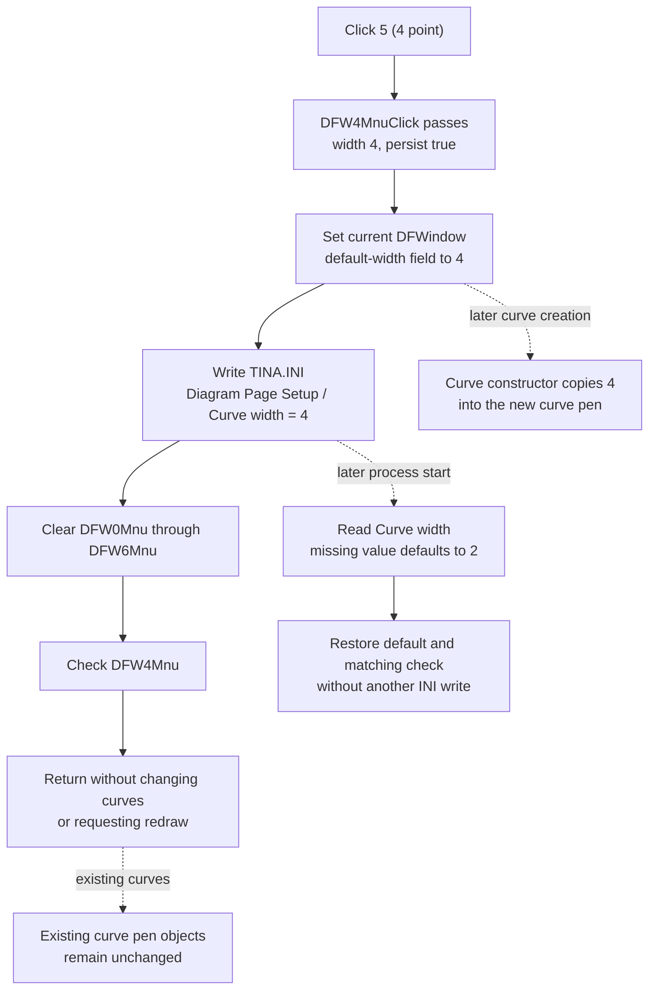

# 5 (4 point)

> Analysis status: Recovered resource, unique click handler, shared default-width setter, checked-state synchronization, INI persistence, curve-construction consumers, redraw boundary, and repeated-click and error behavior reviewed.

## Control

| Property | Recovered value |
| --- | --- |
| Form | DFWindow |
| Component path | DFWindow.DFMainMenu.DFViewMnu.Defaultcurvewidth1.DFW4Mnu |
| Control class | TMenuItem |
| Caption | 5 (4 point) |
| Hint | Not present in the recovered resource. |
| Handler name | DFW4MnuClick |
| Handler address | 01a87b70 |
| Graph node | `resource:dfm:DFWindow/DFWindow.DFMainMenu.DFViewMnu.Defaultcurvewidth1.DFW4Mnu` |
| Handler node | `function:01a87b70` |
| Graph layer | UI |

## What happens when clicked

`TDFWindow.DFW4MnuClick` selects the four-point default curve width. The
handler has no branch. It calls the common default-width setter with the
literal width `4` and a true persistence flag.

The common setter performs these operations in order:

1. It writes `4` to offset `+0x50` of the current DFWindow diagram-setup
   object, which the form holds at offset `+0x7a0`.
2. It writes integer value `4` to `TINA.INI` under
   `[Diagram Page Setup] Curve width`.
3. It clears the checked state of all seven width choices, from `DFW0Mnu`
   through `DFW6Mnu`.
4. It checks `DFW4Mnu` because the selected stored value is `4`.

The click does not open a dialog and does not depend on a selected curve,
axis, or diagram object.

## Caption and stored-value semantics

The DFM lists seven choices in this sequence:

- `1 (hair)` stores `0`;
- `2 (single)` stores `1`;
- `3 (double)` stores `2`;
- `4 (triple)` stores `3`;
- `5 (4 point)` stores `4`;
- `6 (5 point)` stores `5`; and
- `7 (6 point)` stores `6`.

Thus, the leading `5` identifies the fifth menu choice. The parenthetical
resource text describes that choice as `4 point`, and the handler stores the
integer `4`. No unit conversion or arithmetic occurs in this handler or the
shared setter.

## Existing and later curves

The recovered click path changes a default, not every curve's current pen.
Two recovered curve-object constructors read the current DFWindow setup value
at `+0x50` and copy it into the new object's pen through `FUN_005fd6d0`. This
establishes that curve objects created after the click can start with width
`4`.

Existing curve objects hold their own pen objects. Neither the click handler
nor the shared setter enumerates curves, changes one of those pen objects, or
calls a curve-property update. The click therefore does not change the width
of curves that already exist.

The click also does not invalidate the window, repaint the diagram, recalculate
data, or mark the diagram modified. Existing pixels remain unchanged. The new
default becomes visible when a later operation creates and draws a curve that
uses it.

## Reload and persistence

For the standard DFWindow path, the diagram-setup constructor reads
`[Diagram Page Setup] Curve width` from `TINA.INI`. A missing value defaults to
`2`. During DFWindow initialization, `FUN_01a72620` passes the loaded value to
the shared setter with persistence disabled. This restores the in-memory
default and the matching check mark without writing the value again.

The click itself writes only the page-setup INI value. It does not invoke a
diagram serializer or write the current diagram file. No separate Save command
is required for the INI preference.

## Repeated-click, no-op, and error behavior

- Every click selects value `4`; it does not toggle between widths.
- A repeated click still calls the INI writer. Checked-state updates that are
  already correct are no-ops in the common VCL menu setter.
- The handler has no range check because it always supplies the valid literal
  `4`.
- There is no local message, retry, status result, or rollback path.
- The current setup field changes before the INI write. The check marks change
  after the write. If the INI operation raises an error, the exception can
  leave the runtime default at `4` while the prior check mark remains visible.
- If a lower-level writer fails without reporting an error, this handler cannot
  detect that the preference was not persisted.
- A failure during a later check-state update would occur after both the
  runtime field and INI value have changed. The handler contains no recovery
  for such partial state.

## Click, reload, and later-curve flow

## Handler and call-path evidence

- Unique click handler: [FUN_01a87b70](../../../DecompiledSources/Tina16/functions/0000000001A87B70__FUN_01a87b70.c)
- Shared default-width and menu-state setter: [FUN_01a87970](../../../DecompiledSources/Tina16/functions/0000000001A87970__FUN_01a87970.c)
- Diagram Page Setup integer writer: [FUN_00f069f0](../../../DecompiledSources/Tina16/functions/0000000000F069F0__FUN_00f069f0.c)
- Diagram Page Setup integer reader: [FUN_00f06b50](../../../DecompiledSources/Tina16/functions/0000000000F06B50__FUN_00f06b50.c)
- DFWindow initializer and checked-state restore: [FUN_01a72620](../../../DecompiledSources/Tina16/functions/0000000001A72620__FUN_01a72620.c)
- DFWindow diagram-setup constructor: [FUN_01cebd00](../../../DecompiledSources/Tina16/functions/0000000001CEBD00__FUN_01cebd00.c)
- Recovered curve-object constructor using the default: [FUN_01ab2610](../../../DecompiledSources/Tina16/functions/0000000001AB2610__FUN_01ab2610.c)
- Second recovered curve-object constructor using the default: [FUN_01ab6b60](../../../DecompiledSources/Tina16/functions/0000000001AB6B60__FUN_01ab6b60.c)
- Pen-width setter used by those constructors: [FUN_005fd6d0](../../../DecompiledSources/Tina16/functions/00000000005FD6D0__FUN_005fd6d0.c)
- Canonical VCL checked-state setter: [FUN_007e2d20](../../../DecompiledSources/Tina16/functions/00000000007E2D20__FUN_007e2d20.c)
- Recovered form evidence: [ui-evidence.json](../../../DecompiledSources/Tina16/resources/dfm/ui-evidence.json)

## Direct calls

- `FUN_01a87970` - Stores default width `4`, persists it because the flag is
  true, and makes `DFW4Mnu` the checked width choice.

## Resource evidence

- The menu caption is `5 (4 point)` under `Default curve width`.
- The seven sibling captions and their seven wrapper constants establish the
  exact display-to-stored-value mapping from `0` through `6`.
- The resource has no hint, action, initial checked-state property, image-list
  entry, embedded glyph, or picture.
- Runtime code, not a DFM `Checked` property, selects the menu item that matches
  the loaded or newly chosen default.
- No nearby label applies to this menu item.

## Analysis limits

- `4 point` is recovered UI text. The binary proves that integer `4` reaches
  the pen-width setter, but it does not perform or expose a physical-unit
  conversion in this path.
- Recovered Delphi names for the diagram-setup field and the two curve-object
  classes are unavailable. Their default and pen roles follow from repeated
  writes and reads of the same field and the pen-width setter data flow.
- The shared width setter is canonically annotated by the `DFW0Mnu` analysis.
  This analysis owns only the unique `DFW4Mnu` click wrapper.
