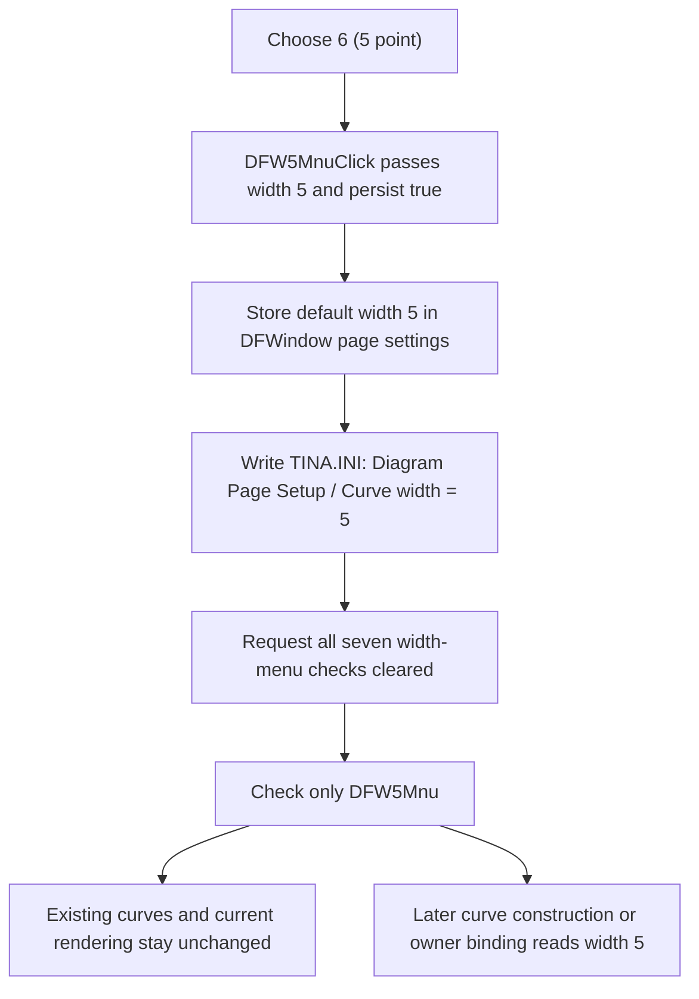

# Use 5 points as the default curve width

> Analysis status: Reviewed from the recovered wrapper, shared default-width helper, menu-state setter, INI persistence, curve consumers, and failure order.

## Control

| Property | Recovered value |
| --- | --- |
| Form | DFWindow |
| Component path | DFWindow.DFMainMenu.DFViewMnu.Defaultcurvewidth1.DFW5Mnu |
| Control class | TMenuItem |
| Caption | 6 (5 point) |
| Hint | Not present in the recovered resource. |
| Text | Not present in the recovered resource. |
| Handler name | DFW5MnuClick |
| Handler address | 01a87b90 |
| Graph node | `resource:dfm:DFWindow/DFWindow.DFMainMenu.DFViewMnu.Defaultcurvewidth1.DFW5Mnu` |
| Handler node | `function:01a87b90` |
| Graph layer | UI |

## What happens when clicked

`TDFWindow.DFW5MnuClick` is a one-call wrapper. It passes these constants to the shared default-width helper `FUN_01a87970`:

- stored curve-width value: `5`;
- persist setting: true.

The number at the start of the caption is the menu position, not the stored width. The seven items use this mapping:

| Menu caption | Stored pen width |
| --- | ---: |
| `1 (hair)` | `0` |
| `2 (single)` | `1` |
| `3 (double)` | `2` |
| `4 (triple)` | `3` |
| `5 (4 point)` | `4` |
| `6 (5 point)` | `5` |
| `7 (6 point)` | `6` |

Thus this item writes integer `5`. The recovered curve-construction paths later pass this integer to the VCL pen-width setter. The source does not add one to the stored value.

## Stored setting and checked state

The shared helper stores `5` at offset `+0x50` of the DFWindow page-settings object at form offset `+0x7a0`.

It then requests the Checked state be cleared for all seven menu items at DFWindow offsets `+0x9a8` through `+0x9d8`. For value `5`, it requests only the item at `+0x9d0`, `DFW5Mnu`, be checked.

The checked-state setter updates the native menu when a state changes. It also performs the VCL automatic-check behavior when the item belongs to such a group. The helper still clears all seven fields explicitly before it checks this item.

Clicking an already selected `6 (5 point)` item is not a no-op. The helper stores and persists value `5` again. It then requests all items unchecked and requests `DFW5Mnu` checked. The VCL setter skips only an individual native-menu update whose requested state already matches.

## Existing and later curves

This click path does not enumerate current curves, change a current curve's pen, invalidate the diagram, or call a redraw function. Existing curve objects therefore keep their per-curve widths, and the current rendered diagram does not change solely because this menu item was clicked.

The recovered consumers establish value `5` as a default for later use:

- `FUN_01ab2610` reads the current DFWindow default when it constructs one recovered curve class and applies it to that curve's pen.
- `FUN_01ab6b60` does the same for the alternate recovered curve class.
- `FUN_01ab28d0` and `FUN_01ab6ed0` read the owning DFWindow default when a compatible curve object is attached to a diagram owner.

A curve that is created or attached after this click can therefore receive pen width `5`. A curve can still have a different individual width. This menu command does not overwrite such existing per-curve state in place.

## Persistence and restoration

Because the wrapper enables persistence, the helper immediately calls the integer-setting writer with:

- file: `TINA.INI`;
- section: `Diagram Page Setup`;
- key: `Curve width`;
- value: `5`.

This is an application page-setup preference. It is not written through the active diagram serializer and does not wait for project save or application shutdown.

During DFWindow construction, the page-settings constructor reads the same key. Its fallback is value `2`, which corresponds to `3 (double)`. `FUN_01a72620` passes the loaded byte to the same shared helper with persistence disabled. This restores the in-memory default and checks the matching menu item without writing `TINA.INI` again.

The shared helper and its exact fields are canonically annotated by `TIARA-diz.6.7.308`. This article's annotation fragment adds only the width-5 wrapper.

## Click flow

## Guards, errors, and partial state

- The wrapper reads no Sender, active diagram, curve selection, or current curve. It has no dialog and no cancel path.
- The constant `5` is in the shared helper's handled range `0` through `6`; the target menu item therefore has a defined checked-state branch.
- The helper does not compare the new width with the prior default. A repeated click writes the same INI value again.
- There is no local exception handler, return-value check, retry, or rollback.
- The helper changes the in-memory default before it writes `TINA.INI`. If that write fails, value `5` can be active in memory while the previous menu check and persisted value remain.
- Menu updates occur after the INI write and in field order. A later menu-update failure can leave only part of the seven-item check state updated, while the in-memory and persisted width are already `5`.
- No existing curve can be partly restyled by this click because the path does not touch existing curve objects. A later curve-construction failure belongs to that separate construction path.

## Handler evidence

- Wrapper: [FUN_01a87b90](../../../DecompiledSources/Tina16/functions/0000000001A87B90__FUN_01a87b90.c) passes constants `5` and `1` to the shared helper and returns.
- Shared setting helper: [FUN_01a87970](../../../DecompiledSources/Tina16/functions/0000000001A87970__FUN_01a87970.c) stores the width, optionally persists it, clears all seven checks, and checks the item selected by the width value.
- INI writer: [FUN_00f069f0](../../../DecompiledSources/Tina16/functions/0000000000F069F0__FUN_00f069f0.c) writes the integer under `Diagram Page Setup` in `TINA.INI`.
- Checked-state setter: [FUN_007e2d20](../../../DecompiledSources/Tina16/functions/00000000007E2D20__FUN_007e2d20.c) changes a VCL menu item's Checked byte and updates the native menu when needed.
- Page-settings constructor: [FUN_01cebd00](../../../DecompiledSources/Tina16/functions/0000000001CEBD00__FUN_01cebd00.c) reads `Curve width` with fallback `2`.
- DFWindow initialization: [FUN_01a72620](../../../DecompiledSources/Tina16/functions/0000000001A72620__FUN_01a72620.c) applies the recovered setting without persistence.
- Curve constructor: [FUN_01ab2610](../../../DecompiledSources/Tina16/functions/0000000001AB2610__FUN_01ab2610.c) initializes a newly created curve pen from the current DFWindow default.
- Alternate curve constructor: [FUN_01ab6b60](../../../DecompiledSources/Tina16/functions/0000000001AB6B60__FUN_01ab6b60.c) initializes another recovered curve class from the same default.
- Curve owner binding: [FUN_01ab28d0](../../../DecompiledSources/Tina16/functions/0000000001AB28D0__FUN_01ab28d0.c) and [FUN_01ab6ed0](../../../DecompiledSources/Tina16/functions/0000000001AB6ED0__FUN_01ab6ed0.c) apply the compatible owning DFWindow's default when they attach their curve objects.
- Recovered component tree: [ui-evidence.json](../../../DecompiledSources/Tina16/resources/dfm/ui-evidence.json) supplies the caption and `DFW5MnuClick` binding.
- Complexity: simple; the graph records one distinct outgoing call from `FUN_01a87b90`.

## Resource evidence

- The parent menu caption is `Default curve width`.
- This item is captioned `6 (5 point)`.
- Its six siblings cover stored width values `0` through `4` and `6` in order.
- No initial Checked property is present in the recovered form resource. Runtime initialization establishes the checked item from the stored setting.
- The item has no hint, action, image reference, or extracted glyph.

## Analysis limits

- The Delphi names of the page-settings class and recovered curve classes are not available.
- The source proves that integer `5` reaches the recovered VCL pen-width setter. It does not prove the final device-specific raster thickness or whether the caption's word `point` means a physical typographic point in every output device.
- The source does not show how a manually edited INI value above `6` is represented. The restore path stores such a byte, but the shared helper checks none of these seven menu items for an unsupported value.
- This command does not redraw. A separate later action can redraw the diagram for another reason, but it does not cause existing curves to adopt this default.
