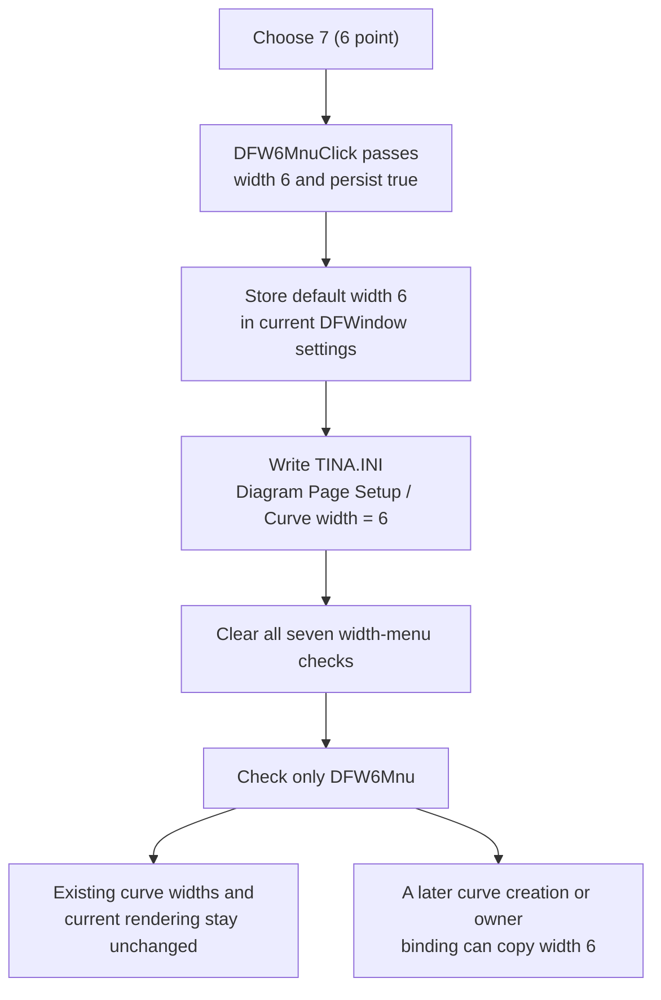

# Use 6 points as the default curve width

> Analysis status: Evidence-backed from the recovered wrapper, shared default-width helper, INI writer, checked-state setter, and curve constructors.

## Control

| Property | Recovered value |
| --- | --- |
| Form | DFWindow |
| Menu path | View > Default curve width > 7 (6 point) |
| Component path | DFWindow.DFMainMenu.DFViewMnu.Defaultcurvewidth1.DFW6Mnu |
| Control class | TMenuItem |
| Caption | 7 (6 point) |
| Hint | Not present in the recovered resource. |
| Text | Not present in the recovered resource. |
| Handler name | DFW6MnuClick |
| Handler address | `01a87bb0` |
| Graph node | `resource:dfm:DFWindow/DFWindow.DFMainMenu.DFViewMnu.Defaultcurvewidth1.DFW6Mnu` |
| Handler node | `function:01a87bb0` |
| Graph layer | UI |

## What happens when clicked

[`FUN_01a87bb0`](../../../DecompiledSources/Tina16/functions/0000000001A87BB0__FUN_01a87bb0.c) is a one-call wrapper. It passes stored width `6` and persistence enabled to [`FUN_01a87970`](../../../DecompiledSources/Tina16/functions/0000000001A87970__FUN_01a87970.c), the shared DFWindow default-width helper. The wrapper does not inspect `Sender` and has no conditional branch.

The caption starts with `7` because this is the seventh item in the recovered width menu. The handler does not store `7`: it passes the zero-based value `6`. The recovered curve constructors later pass this value unchanged to the pen-width setter. Thus, `6 point` is the user-facing preset text, and integer `6` is the stored and consumed value.

## Stored setting and checked state

The shared helper first writes `6` to the current DFWindow document's default-curve-width field at document offset `+0x50`. It then calls [`FUN_00f069f0`](../../../DecompiledSources/Tina16/functions/0000000000F069F0__FUN_00f069f0.c), which writes `Curve width = 6` under section `Diagram Page Setup` in `TINA.INI`.

After the INI write, the helper uses [`FUN_007e2d20`](../../../DecompiledSources/Tina16/functions/00000000007E2D20__FUN_007e2d20.c) to update the menu state:

1. It clears `DFW0Mnu` through `DFW6Mnu`.
2. It checks only `DFW6Mnu`, the item for stored value `6`.

The DFM does not give these items an initial `Checked` value or a recovered radio-group property. During DFWindow initialization, [`FUN_01a72620`](../../../DecompiledSources/Tina16/functions/0000000001A72620__FUN_01a72620.c) calls the same helper with the loaded setting and persistence disabled. This establishes one checked item without writing the INI file again. The recovered settings constructors use `2` as the fallback when the key is absent, so `7 (6 point)` is selected at startup only when the saved value is `6`.

A repeated click is not a full no-op. The helper writes value `6` to memory and to `TINA.INI` again. The checked-state setter can skip an individual update when that menu item's current state already matches the requested state.

## Existing and later curves

This command changes a default. It does not change curve objects that already exist:

- The wrapper and shared helper do not traverse the active diagram, coordinate systems, selected curves, or pen objects.
- They do not call the pen-width setter on an existing curve.
- They do not mark the diagram document as modified and do not request a diagram redraw.

Existing curves therefore keep their independent pen widths and remain visually unchanged after this click. Only the menu check state can change.

The new value is consumed by later curve initialization. [`FUN_01ab2610`](../../../DecompiledSources/Tina16/functions/0000000001AB2610__FUN_01ab2610.c) and [`FUN_01ab6b60`](../../../DecompiledSources/Tina16/functions/0000000001AB6B60__FUN_01ab6b60.c) read the current DFWindow default and pass it to [`FUN_005fd6d0`](../../../DecompiledSources/Tina16/functions/00000000005FD6D0__FUN_005fd6d0.c), the recovered pen-width setter. Their owner-assignment paths, [`FUN_01ab28d0`](../../../DecompiledSources/Tina16/functions/0000000001AB28D0__FUN_01ab28d0.c) and [`FUN_01ab6ed0`](../../../DecompiledSources/Tina16/functions/0000000001AB6ED0__FUN_01ab6ed0.c), also copy the owning DFWindow's current default. A compatible curve created or attached after this click can therefore start with stored pen width `6`. A later per-curve style change can replace the copied value without changing the default.

## Persistence and failure boundaries

- The click writes the application preference immediately to `TINA.INI`. It does not wait for a diagram Save command or application shutdown.
- [`FUN_01cebb70`](../../../DecompiledSources/Tina16/functions/0000000001CEBB70__FUN_01cebb70.c) and [`FUN_01cebd00`](../../../DecompiledSources/Tina16/functions/0000000001CEBD00__FUN_01cebd00.c) initialize the document field from `Diagram Page Setup / Curve width`, with fallback value `2`.
- The owner-aware constructor can read `MEAS.INI` for the recovered measurement-owner type. The click helper always uses the `TINA.INI` writer. The recovered source does not prove synchronization between these files.
- The handler has no dialog, confirmation, cancel path, success message, or validation error. Value `6` is within the shared helper's handled range of `0` through `6`.
- There is no local exception handler, return-value check, retry, or rollback. The helper changes the in-memory default before the INI write and updates the menu checks afterward. If the INI writer raises an exception, value `6` can already be active in memory while persistence and the menu state remain unchanged. If a later menu update fails, the in-memory and persisted values are already `6`, but the seven checks can be only partly updated.
- The helper dereferences the current document without a null check. Normal DFWindow lifetime and menu enablement are expected to supply it; this handler has no separate no-document no-op branch.

## Click flow

## Recovered function roles

- [`FUN_01a87bb0`](../../../DecompiledSources/Tina16/functions/0000000001A87BB0__FUN_01a87bb0.c) is the `DFW6Mnu` click wrapper. It selects stored width `6` and enables persistence.
- [`FUN_01a87970`](../../../DecompiledSources/Tina16/functions/0000000001A87970__FUN_01a87970.c) stores, persists, and reflects a width value from `0` through `6`. Bead `TIARA-diz.6.7.308` owns its canonical annotation.
- [`FUN_00f069f0`](../../../DecompiledSources/Tina16/functions/0000000000F069F0__FUN_00f069f0.c) writes the integer preference to `TINA.INI` under `Diagram Page Setup`.
- [`FUN_01a72620`](../../../DecompiledSources/Tina16/functions/0000000001A72620__FUN_01a72620.c) constructs DFWindow's document and applies its loaded width with persistence disabled.
- [`FUN_01ab2610`](../../../DecompiledSources/Tina16/functions/0000000001AB2610__FUN_01ab2610.c) and [`FUN_01ab6b60`](../../../DecompiledSources/Tina16/functions/0000000001AB6B60__FUN_01ab6b60.c) copy the current default into new curve pen objects.

## Resource evidence and limits

- The recovered component tree binds `DFW6Mnu.OnClick` to `DFW6MnuClick` at `01a87bb0` and supplies caption `7 (6 point)`.
- The item has no recovered `Checked` value, hint, action, image reference, glyph, or same-parent label. Code establishes the exclusive checked state.
- The original Delphi enum name is not recovered. The source proves that stored integer `6` reaches the recovered pen-width setter. It does not prove the device-specific raster thickness or that `point` is a physical typographic point for every output device.
- No live UI test was performed. The result uses the DFM binding, read-only graph, handler, settings writer, initialization path, and curve-constructor consumers.
