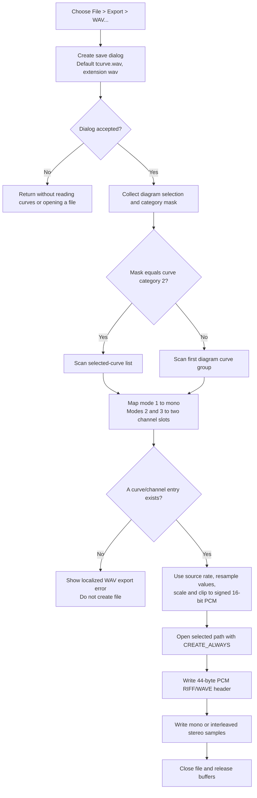

# Export diagram curves as a WAV file

> Analysis status: Complete. The recovered handler, curve-selection path, channel mapping, PCM sample pipeline, file dialog, and RIFF/WAVE writer establish the command behavior.

## Control

| Property | Recovered value |
| --- | --- |
| Form | DFWindow |
| Menu path | File > Export > WAV... |
| Component path | DFWindow.DFMainMenu.DFFileMnu.DFExportMnu.DFWAVMnu |
| Control class | TMenuItem |
| Caption | WAV... |
| Handler name | DFWAVMnuClick |
| Handler address | 01a88cd0 |
| Graph node | `resource:dfm:DFWindow/DFWindow.DFMainMenu.DFFileMnu.DFExportMnu.DFWAVMnu` |
| Handler node | `function:01a88cd0` |
| Graph layer | UI |

## File selection

`FUN_01a88cd0` creates a new save dialog for each click. It configures these values:

- Default extension: `wav`.
- Suggested file name: `tcurve.wav`.
- Filter: `WAV files (*.wav)|*.wav`.
- Title: `Save diagram to WAV`.

The handler does not set an initial directory or restore an application-owned last WAV path. The dialog and operating system select the folder. If the user cancels, the handler destroys the dialog and returns without checking curves, allocating PCM data, or opening a file.

The handler retrieves the accepted full path after it has built the sample buffer. The generic writer has a fallback to the application temporary directory as `temp.wav` when it receives an empty path, but an ordinary accepted save dialog supplies the selected path.

## Export eligibility and curve choice

After the dialog is accepted, `FUN_01acff30` collects the active diagram selection and returns its category mask. Category 2 is the curve category.

- For an exact category-2 result, the handler scans the helper's selected-curve list.
- For every other result, including no pure curve selection, it scans the first diagram curve group's list.

The handler must find at least one curve/channel entry in the chosen list. If it does not, it shows one localized error dialog and does not create the target file. It uses `DrawWind.WAVExportErrorCurve` for the selected-curve path and `DrawWind.WAVExportErrorAll` for the all-curves path.

Each candidate has a channel-mode byte at `+0x3b`. The same mapping is used by the recovered WAV playback setup:

| Mode | WAV mapping |
| --- | --- |
| 1 | Use this curve as a mono channel and stop the scan. |
| 2 | Use this curve as the first channel. A later mode-2 curve replaces it. |
| 3 | Use this curve as the second channel. A later mode-3 curve replaces it. |

When the two internal channel slots refer to the same mode-1 curve, the writer creates one channel. Otherwise, it creates two channels. A missing first or second channel contributes zero samples to that channel. For each data row, the curve field at `+0x154` selects the curve's value from the provider's sample vector.

## Sample rate and scaling

`FUN_016d6770` takes the source integer at `+0x4c` as the sample rate. It stores this value unchanged, and the resampler and WAV header both use it. The helper separately calculates `round(sampleRate * source[+0x40])` for its buffer threshold and raises that threshold to at least `0x3000`, or 12,288 sample frames. That minimum does not change the sample rate. The source field at `+0x40` affects buffer sizing, but its domain name is not established.

The data provider supplies time-stamped curve vectors. `FUN_016d6ca0` maps each timestamp to `round(time * sampleRate)` and fills the intervening uniform sample positions from the current and previous data points. The handler passes the selected first-channel value and second-channel value, or zero for a missing channel.

`FUN_016d6ae0` converts each output value as follows:

1. Multiply the curve value by 32,768.
2. Round it to an integer.
3. Clip it to the signed 16-bit range from -32,768 through 32,767.
4. Store one channel for mono, or interleave the first and second channels for stereo.

The export does not inspect the diagram's visible vertical scale and does not normalize the selected curves. A value of `1.0` clips to 32,767, a value of `-1.0` becomes -32,768, and values outside that range saturate.

## WAV header and file writes

`FUN_016d2470` starts from a 44-byte `RIFF`/`WAVE` template whose format tag is 1, uncompressed PCM. It writes these dynamic fields:

| Header field | Recovered value |
| --- | --- |
| Channels | 1 or 2 from the curve channel mapping |
| Sample rate | The source integer at `+0x4c`, stored unchanged |
| Bits per sample | 16 |
| Block alignment | `channels * 2` bytes |
| Byte rate | `sampleRate * channels * 2` |
| Data size | `stored sample values * 2` bytes |
| RIFF size | `data size + 36` bytes |

All curve reading, resampling, scaling, and buffer construction occur before the target file is opened. `FUN_016d6890` then opens the accepted path with the recovered `CREATE_ALWAYS` disposition, writes the 44-byte header, writes the complete PCM buffer, and closes the file. Thus, an existing file at an accepted path is truncated and replaced. The handler does not show a second application-specific overwrite confirmation after the save dialog.

The RTL checks the open, header write, data write, and close operations and raises a pending I/O error. The handler has no application-specific exception handler, retry, file deletion, or rollback. A sampling or allocation failure before the open leaves the target unchanged. A write failure after `CREATE_ALWAYS` can leave a truncated file containing only a header or a partial data block.

The handler shows no success message and does not store the chosen path or format in the diagram model.

## Click flow

## Evidence

- [WAV menu handler `FUN_01a88cd0`](../../../DecompiledSources/Tina16/functions/0000000001A88CD0__FUN_01a88cd0.c) configures the dialog, selects curve channels, reads the data provider, builds samples, and writes the chosen file.
- [Diagram selection classifier `FUN_01acff30`](../../../DecompiledSources/Tina16/functions/0000000001ACFF30__FUN_01acff30.c) collects selected objects and returns the combined category mask. Its existing graph annotation identifies category 2 as curves.
- [WAV accumulator setup `FUN_016d6770`](../../../DecompiledSources/Tina16/functions/00000000016D6770__FUN_016d6770.c) selects one or two channels, stores the source sample rate, calculates the buffer threshold, and allocates the sample buffer.
- [Time-grid resampler `FUN_016d6ca0`](../../../DecompiledSources/Tina16/functions/00000000016D6CA0__FUN_016d6ca0.c) maps source timestamps to sample indexes and emits intervening sample positions.
- [PCM sample appender `FUN_016d6ae0`](../../../DecompiledSources/Tina16/functions/00000000016D6AE0__FUN_016d6ae0.c) multiplies values by 32,768, rounds, clips to signed 16-bit range, and interleaves the second channel when present.
- [RIFF/WAVE header builder `FUN_016d2470`](../../../DecompiledSources/Tina16/functions/00000000016D2470__FUN_016d2470.c) fills the channel, rate, alignment, byte-rate, bit-depth, data-size, and RIFF-size fields in the 44-byte PCM header.
- [WAV output finalizer `FUN_016d6890`](../../../DecompiledSources/Tina16/functions/00000000016D6890__FUN_016d6890.c) writes the header and sample buffer to the selected file in offline mode.
- [RTL file opener `FUN_0040e550`](../../../DecompiledSources/Tina16/functions/000000000040E550__FUN_0040e550.c) passes creation disposition 2 (`CREATE_ALWAYS`) to the recovered file-create thunk.
- [Recovered playback setup `FUN_017d2fb0`](../../../DecompiledSources/Tina16/functions/00000000017D2FB0__FUN_017d2fb0.c) independently maps mode 1 to one shared channel source and modes 2 and 3 to the two separate channel slots.
- The recovered `DFWindow` resource binds `DFWAVMnu.OnClick` to `DFWAVMnuClick` at `01a88cd0` and supplies the `WAV...` menu caption.
- Recovered role: Export eligible diagram curves as a mono or stereo 16-bit PCM WAV file.
- Complexity: complex.
- Distinct outgoing calls: 20.

## Evidence limits

- The use of `+0x4c` as the sample rate is proven by the resampler and WAV header. The domain meaning of the `+0x40` buffer-sizing factor is not established.
- The handler does not reject a zero or otherwise invalid source sample rate. Normal diagram data is expected to supply a valid rate, but this click path has no separate validation or recovery branch for it.
- The handler does not implement its own overwrite question. The recovered sources do not establish whether the common save dialog displays a platform-owned overwrite prompt before it returns an accepted path.
- The second-channel interpolation expression in the recovered `FUN_016d6ca0` output uses the stored second-channel state in its ratio. This article preserves the recovered behavior and does not replace it with an assumed symmetric formula.
