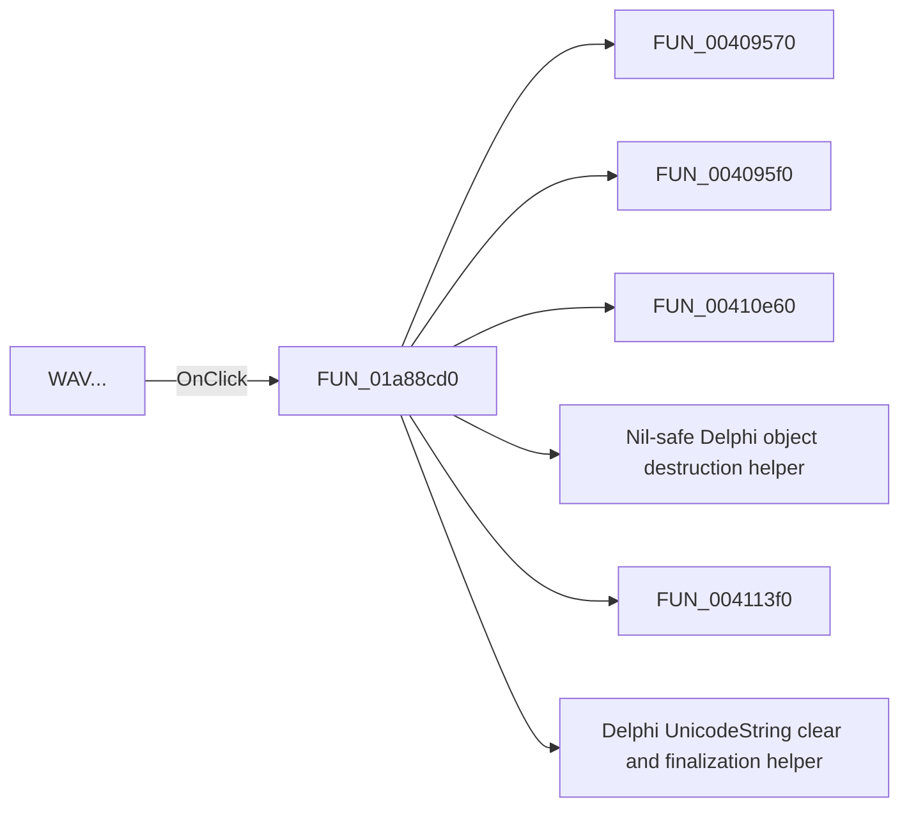

# WAV...

> Analysis status: Pending individual source review.

## Control

| Property | Recovered value |
| --- | --- |
| Form | DFWindow |
| Component path | DFWindow.DFMainMenu.DFFileMnu.DFExportMnu.DFWAVMnu |
| Control class | TMenuItem |
| Caption | WAV... |
| Hint | Not present in the recovered resource. |
| Text | Not present in the recovered resource. |
| Handler name | DFWAVMnuClick |
| Handler address | 01a88cd0 |
| Graph node | `resource:dfm:DFWindow/DFWindow.DFMainMenu.DFFileMnu.DFExportMnu.DFWAVMnu` |
| Handler node | `function:01a88cd0` |
| Graph layer | UI |

## What happens when clicked

Pending individual analysis. An agent must read the recovered handler source and its relevant callees before it replaces this text.

## Click flow

## Handler evidence

- Source: [DecompiledSources/Tina16/functions/0000000001A88CD0__FUN_01a88cd0.c](../../../DecompiledSources/Tina16/functions/0000000001A88CD0__FUN_01a88cd0.c)
- Recovered role: Not present in the recovered resource.
- Current graph summary: Handles 1 Delphi UI event: DFWindow.DFMainMenu.DFFileMnu.DFExportMnu.DFWAVMnu.OnClick.
- Current graph behavior: Not present in the recovered resource.
- Current graph evidence: Not present in the recovered resource.
- Complexity: complex
- Distinct outgoing calls: 20

## Direct calls

- `function:00409570` — FUN_00409570
- `function:004095f0` — FUN_004095f0
- `function:00410e60` — FUN_00410e60
- `function:00410f20` — Nil-safe Delphi object destruction helper
- `function:004113f0` — FUN_004113f0
- `function:00414480` — Delphi UnicodeString clear and finalization helper
- `function:00414560` — Delphi UnicodeString array finalization helper
- `function:00414ad0` — Delphi UnicodeString assignment helper
- `function:0041ddd0` — FUN_0041ddd0
- `function:004aeac0` — FUN_004aeac0
- `function:00723990` — FUN_00723990
- `function:00724270` — FUN_00724270
- `function:00724380` — FUN_00724380
- `function:0072d440` — FUN_0072d440
- `function:00b89270` — FUN_00b89270
- `function:00b8e650` — FUN_00b8e650
- `function:016d6770` — FUN_016d6770
- `function:016d6890` — FUN_016d6890
- `function:016d6ca0` — FUN_016d6ca0
- `function:01acff30` — FUN_01acff30

## Resource evidence

- Kind: Not present in the recovered resource.
- Modal result: Not present in the recovered resource.
- Checked state: Not present in the recovered resource.
- List items: Not present in the recovered resource.
- Image reference: Not present in the recovered resource.
- Extracted glyph: None.

## Nearby label candidates

Nearby labels are layout candidates only. They are not proof of behavior.

- No same-parent label candidate is available.

## Analysis limits

- Do not infer behavior from the control class, caption, hint, glyph, or nearby label alone.
- Do not replace the pending status until the handler source and relevant call path provide enough evidence.
