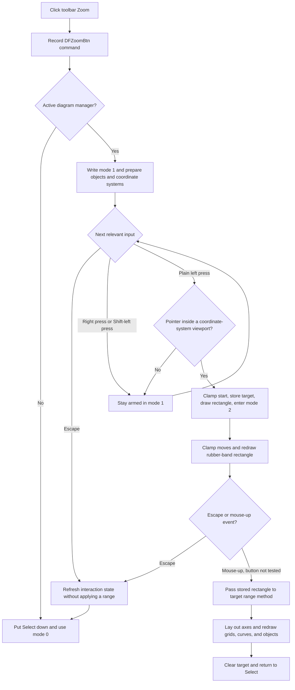

# Arm interactive rectangle zoom

> Analysis status: Evidence-backed source review complete.

## Control

| Property | Recovered value |
| --- | --- |
| Form | DFWindow |
| Component path | DFWindow.DFToolPanel.ToolNoteBook.Diagram.DFZoomBtn |
| Control class | TSpeedButton |
| Caption | Not present in the recovered resource. |
| Hint | Zoom |
| Group index | 1 |
| Glyph count | 2 |
| Handler name | DFZoomBtnClick |
| Handler address | 01a79570 |
| Graph node | `resource:dfm:DFWindow/DFWindow.DFToolPanel.ToolNoteBook.Diagram.DFZoomBtn` |
| Handler node | `function:01a79570` |
| Graph layer | UI |

## What happens when clicked

`FUN_01a79570` records the `DFZoomBtn` command and arms DFWindow interaction mode `1`. The click does not change an axis range. It prepares the active diagram for a later rectangle drag.

If form field `+0x798` does not contain an active diagram manager, the handler puts the Select speed button down and calls `DFSelectBtnClick`. This leaves DFWindow in normal selection mode `0`. It does not show an error.

If a diagram is active, the handler writes mode `1` to form field `+0x7a8` and calls `FUN_01ad0ba0`. That helper visits every drawing object in manager collection `+0xe0` and every coordinate system in collection `+0xd8`. It passes the current canvas at `+0x80` to their recovered virtual preparation methods. The exact original Delphi method names are not recovered.

Clicking **Zoom** again while it is armed writes mode `1` again and repeats this preparation. The handler has no toggle-off branch and does not zoom out.

## Rectangle interaction

The form mouse handlers consume the armed state:

1. While mode `1` is armed, mouse movement sets recovered cursor value `8`.
2. A plain left-button press scans the coordinate-system collection in order and selects the first viewport that contains the pointer. A Shift-modified left press does not enter this zoom-start branch.
3. If no viewport contains the point, DFWindow stays in mode `1`. It does not draw a rectangle, change an axis, or show a message.
4. If a viewport is found, the handler clamps the start point to its drawable bounds. It stores the target at form field `+0x1008`, stores the point as both rectangle corners, draws the initial rubber-band rectangle through target virtual slot `+0x140`, and changes to mode `2`.
5. In mode `2`, mouse movement clamps the new endpoint, erases and redraws the rubber-band rectangle through the same virtual slot, stores the endpoint, and selects recovered cursor value `0` or `8` from target feedback.
6. On mouse release, the handler calls target virtual slot `+0x148` with the four stored coordinates. It then recalculates the viewport and diagram layout, refreshes diagram objects, and redraws the result.
7. Completion puts Select down, calls `DFSelectBtnClick`, clears target field `+0x1008`, and returns to mode `0`. Rectangle zoom is a single-use tool.

The recovered cursor numbers are direct values. Their original Delphi cursor constant names are not available.

## Axis and persistence boundary

The first press selects a coordinate-system viewport. It does not select a curve or one named axis. The target owns the recovered X-axis collection at `+0x70` and Y-axis collection at `+0x78`. The later layout path visits both collections and their related grids, curves, and drawing objects.

The implementation behind target virtual slot `+0x148` is not resolved to a named source function. The source therefore does not prove the minimum accepted rectangle size, how reversed corners are normalized, or whether every rectangle changes both dimensions. It does prove that the rectangle is applied to the coordinate system under the first press.

The completed drag changes the live diagram view. This path contains no file, registry, INI, database, explicit undo-stack, or serializer call. A different save path can persist diagram state later, but that ownership is outside this interaction.

## Escape, right button, and capture boundaries

The DFWindow key handler routes Escape to `FUN_01a7d1a0`. In zoom modes `1` and `2`, that helper selects the normal tool, writes mode `0`, restores cursor value `0`, and refreshes diagram interaction state. It does not call target virtual slot `+0x148`, so Escape does not apply an axis-range change. This common cancellation path does not explicitly clear target field `+0x1008`; mode `0` stops the zoom handlers from using it.

A right-button press does not start a rectangle in armed mode `1`, and the tool stays armed after its matching release. The mode-`2` mouse-up branch does not test which button was released. Therefore, if a rectangle is already active and DFWindow receives a mouse-up event, a right-button release can finish the current stored rectangle in the same way as a left-button release.

No direct `SetCapture`, `ReleaseCapture`, or recovered application capture flag appears in this interaction path. The evidence does not prove that DFWindow requests mouse capture. It also does not prove what happens if the pointer is released outside the form and no form mouse-up event arrives.

## No-op and error behavior

- No active diagram: return to Select with no rectangle or message.
- Shift-modified left press or a right press while mode `1` is armed: do not start the zoom rectangle.
- Press outside all coordinate-system viewports: stay armed with no range change.
- Escape in mode `1` or `2`: cancel without calling the range-application method.
- Repeated Zoom click before a drag: re-arm mode `1`; do not toggle the tool off.
- Successful release: apply once, redraw, and return to Select.
- The recovered activation and mouse paths have no local exception handler or rollback transaction. A virtual-call, layout, or drawing failure can propagate to higher-level Delphi exception handling.

## Click and interaction flow

## Handler and state-machine evidence

- Zoom activation and active-diagram guard: [FUN_01a79570](../../../DecompiledSources/Tina16/functions/0000000001A79570__FUN_01a79570.c)
- Pre-zoom object and coordinate-system dispatch: [FUN_01ad0ba0](../../../DecompiledSources/Tina16/functions/0000000001AD0BA0__FUN_01ad0ba0.c)
- Mouse-down viewport hit, rectangle start, and mode transition: [FUN_01a730e0](../../../DecompiledSources/Tina16/functions/0000000001A730E0__FUN_01a730e0.c)
- Coordinate-system viewport hit test: [FUN_01ad08c0](../../../DecompiledSources/Tina16/functions/0000000001AD08C0__FUN_01ad08c0.c)
- Rectangle-coordinate clamping: [FUN_01ce2130](../../../DecompiledSources/Tina16/functions/0000000001CE2130__FUN_01ce2130.c)
- Mouse-move cursor and rubber-band updates: [FUN_01a74a50](../../../DecompiledSources/Tina16/functions/0000000001A74A50__FUN_01a74a50.c)
- Mouse-up range application, refresh, target clearing, and Select reset: [FUN_01a77260](../../../DecompiledSources/Tina16/functions/0000000001A77260__FUN_01a77260.c)
- Axis-collection layout and dependent-object refresh: [FUN_01ce4cd0](../../../DecompiledSources/Tina16/functions/0000000001CE4CD0__FUN_01ce4cd0.c) and [FUN_01ce3940](../../../DecompiledSources/Tina16/functions/0000000001CE3940__FUN_01ce3940.c)
- Escape dispatch and common mode cancellation: [FUN_01a7d460](../../../DecompiledSources/Tina16/functions/0000000001A7D460__FUN_01a7d460.c) and [FUN_01a7d1a0](../../../DecompiledSources/Tina16/functions/0000000001A7D1A0__FUN_01a7d1a0.c)
- Recovered form and control resources: [ui-evidence.json](../../../DecompiledSources/Tina16/resources/dfm/ui-evidence.json)

## Resource and glyph evidence

- `DFZoomBtn` is a `TSpeedButton` with hint `Zoom`, `GroupIndex = 1`, `ShowHint = true`, and `NumGlyphs = 2`. It has no recovered caption, action, modal result, image-list reference, or same-parent label candidate.
- The extracted 32 by 16 pixel PNG contains normal and disabled magnifying-glass images: [Zoom button glyph](../../../glyph/0086_DFWindow_DFWindow_DFToolPanel_ToolNoteBook_Diagram_DFZoomBtn_Glyph_Data.png).
- The hint and glyph support zoom intent. They do not prove rectangle, viewport, or axis behavior. The handler and form mouse state machine provide that evidence.

## Analysis limits

- The recovered virtual slots do not supply their original Delphi method names.
- The target range method's internal range calculation is not recovered as a named function.
- Application-level mouse capture, off-form release behavior, exact cursor shapes, and later save ownership are not proven.
- Shared mouse, hit-test, clamp, layout, redraw, and Escape helpers are evidence for this article. Their canonical function annotations remain with their shared owners.
