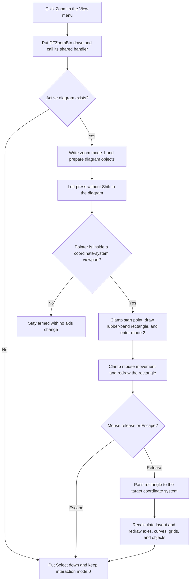

# Arm interactive rectangle zoom

> Analysis status: Evidence-backed source review complete.

## Control

| Property | Recovered value |
| --- | --- |
| Form | DFWindow |
| Component path | DFWindow.DFMainMenu.DFViewMnu.DFZoomMnu |
| Control class | TMenuItem |
| Caption | Zoom |
| Hint | Not present in the recovered resource. |
| Shortcut | Recovered value `16474` (`0x405A`, the Delphi Ctrl+Z encoding). |
| Handler name | DFZoomMnuClick |
| Handler address | 01a7e240 |
| Graph node | `resource:dfm:DFWindow/DFWindow.DFMainMenu.DFViewMnu.DFZoomMnu` |
| Handler node | `function:01a7e240` |
| Graph layer | UI |

## What happens when clicked

`FUN_01a7e240` puts the related `DFZoomBtn` speed button into its down state and calls that button's shared handler, `FUN_01a79570`. The shared handler records macro command name `DFZoomBtn` and arms DFWindow's interactive zoom mode. The menu command does not change an axis range immediately. A later mouse drag selects the zoom rectangle.

The related speed button has hint `Zoom`, uses radio group `1`, and contains a two-state magnifying-glass glyph. These resources support the relationship between the menu and toolbar commands. The recovered handler and mouse-event state machine prove the interaction.

## Activation and no-diagram behavior

When DFWindow has an active diagram at form offset `+0x798`, the shared handler writes interaction mode `1` at `+0x7a8`. It then visits the diagram's coordinate-system and drawing-object collections and invokes their recovered preparation methods with the current canvas.

When there is no active diagram, the shared handler does not arm zoom mode. It puts the Select speed button down and calls `DFSelectBtnClick`, which writes interaction mode `0`. No error dialog appears.

Clicking **Zoom** again does not toggle the command off. The menu wrapper sets the toolbar button down again, and the shared handler writes mode `1` again. Before a drag starts, this only re-arms the same mode; it does not zoom or modify axes.

## Mouse interaction sequence

DFWindow's form-level mouse handlers consume the armed state.

1. While mode `1` is armed, mouse movement sets the form cursor to recovered cursor value `8`.
2. A left-button press without Shift calls `FUN_01ad08c0`. This function scans the diagram's coordinate-system collection and returns the first coordinate-system rectangle that contains the pointer.
3. If no coordinate system contains the point, the handler stays in mode `1`. It creates no rectangle, changes no axis, and shows no message.
4. If it finds a coordinate system, `FUN_01ce2130` clamps the starting point to that system's drawable bounds. The handler stores the same point as both rectangle corners, draws the initial rubber-band rectangle through the coordinate-system virtual method at `+0x140`, stores the target object at form offset `+0x1008`, and advances to mode `2`.
5. During mode `2`, mouse movement asks the target coordinate system whether to use recovered cursor value `0` or `8`. It clamps the new endpoint, redraws the old rubber-band rectangle, stores the endpoint, and draws the new rectangle.
6. On mouse release, the handler removes or finalizes the displayed rectangle, passes its four coordinates to the target's virtual method at `+0x148`, recalculates the DFWindow viewport and diagram layout, refreshes diagram objects, and redraws the result.
7. The handler then puts the Select speed button down, calls `DFSelectBtnClick`, clears target field `+0x1008`, and returns to interaction mode `0`. Rectangle zoom is therefore a single-use tool.

The cursor numbers are direct recovered values. The source does not recover their original Delphi cursor constant names, so this article does not label value `8` as a specific cursor shape.

## Coordinate system and affected axes

The hit test selects one coordinate-system viewport from diagram collection `+0xd8`; it does not use the current curve or axis selection. The selected object owns the axis collections that other recovered functions establish as X axes at `+0x70` and Y axes at `+0x78`. The rectangle is passed to this selected coordinate system, and the downstream layout path visits both axis collections plus associated grids, curves, and diagram objects before repainting.

The direct implementation of the selected object's virtual `+0x148` rectangle-to-range method is not resolved as a named source function. Therefore, the evidence does not establish whether every possible rectangle changes both axis orientations, whether a narrow rectangle changes only one orientation, or which minimum rectangle size it accepts. The proven scope is the coordinate system under the initial press, followed by diagram-wide layout and render refreshes.

## Cancel, repeated use, and errors

Pressing Escape calls `FUN_01a7d1a0`. For zoom modes `1` and `2`, its common cancellation branch puts Select down, writes interaction mode `0`, restores cursor value `0`, and asks the active diagram to refresh its interaction state. It does not call the rectangle-application method at `+0x148`, so this path does not apply an axis change.

A completed drag exits zoom mode. The user must choose **Zoom** again for another rectangle. A repeated menu click while merely armed re-arms mode `1`; there is no toggle-off or zoom-out branch in this handler. **Zoom out** and **Normal zoom** are separate controls with separate handlers.

The activation, drag, and release paths have no local exception handler, validation message, or rollback transaction. Allocation, virtual-method, layout, or repaint failures can propagate to higher-level Delphi handling.

## Click and interaction flow

## Handler and state-machine evidence

- Menu wrapper and toolbar-state synchronization: [FUN_01a7e240](../../../DecompiledSources/Tina16/functions/0000000001A7E240__FUN_01a7e240.c)
- Shared Zoom-button activation and active-diagram guard: [FUN_01a79570](../../../DecompiledSources/Tina16/functions/0000000001A79570__FUN_01a79570.c)
- Coordinate-system preparation on activation: [FUN_01ad0ba0](../../../DecompiledSources/Tina16/functions/0000000001AD0BA0__FUN_01ad0ba0.c)
- Mouse-down hit test, rectangle start, and mode transition: [FUN_01a730e0](../../../DecompiledSources/Tina16/functions/0000000001A730E0__FUN_01a730e0.c)
- Coordinate-system viewport hit test: [FUN_01ad08c0](../../../DecompiledSources/Tina16/functions/0000000001AD08C0__FUN_01ad08c0.c)
- Rectangle-coordinate clamping: [FUN_01ce2130](../../../DecompiledSources/Tina16/functions/0000000001CE2130__FUN_01ce2130.c)
- Mouse-move cursor and rubber-band updates: [FUN_01a74a50](../../../DecompiledSources/Tina16/functions/0000000001A74A50__FUN_01a74a50.c)
- Mouse-up range application, refresh, and return to Select: [FUN_01a77260](../../../DecompiledSources/Tina16/functions/0000000001A77260__FUN_01a77260.c)
- Coordinate-system layout and axis-object redraw path: [FUN_01ce4cd0](../../../DecompiledSources/Tina16/functions/0000000001CE4CD0__FUN_01ce4cd0.c) and [FUN_01ce3940](../../../DecompiledSources/Tina16/functions/0000000001CE3940__FUN_01ce3940.c)
- Escape cancellation: [FUN_01a7d460](../../../DecompiledSources/Tina16/functions/0000000001A7D460__FUN_01a7d460.c) and [FUN_01a7d1a0](../../../DecompiledSources/Tina16/functions/0000000001A7D1A0__FUN_01a7d1a0.c)
- Shared DFWindow command-state refresh, with a canonical annotation outside this Bead: [FUN_01a7fc90](../../../DecompiledSources/Tina16/functions/0000000001A7FC90__FUN_01a7fc90.c)
- Recovered form and control resources: [ui-evidence.json](../../../DecompiledSources/Tina16/resources/dfm/ui-evidence.json)

## Resource and glyph evidence

- The menu item has caption `Zoom`, shortcut value `16474`, and no hint, action, image-list reference, embedded glyph, or same-parent label candidate.
- The associated `DFZoomBtn` has hint `Zoom`, `GroupIndex = 1`, `NumGlyphs = 2`, and a 32 by 16 pixel extracted PNG: [Zoom button glyph](../../../glyph/0086_DFWindow_DFWindow_DFToolPanel_ToolNoteBook_Diagram_DFZoomBtn_Glyph_Data.png).
- The glyph contains a normal and disabled magnifying-glass image. It supports zoom intent but does not prove the rectangle target or axis behavior; the source call path provides that evidence.

## Persistence limits

- The click only changes toolbar and interaction state. A completed rectangle changes the live diagram view and redraws it.
- No file-save, INI-write, database-write, explicit undo-stack, or serialization call is present in this click and rectangle-completion path. The source does not establish whether another document-saving path later stores the zoom view.
- Escape, a missed viewport hit, and the no-diagram fallback do not apply the rectangle or change axis ranges.
- `FUN_01a7fc90` participates in shared DFWindow command-state refresh after mouse interaction. It already has a canonical shared graph annotation and is not repeated in this control's annotation fragment.
- `FUN_01a79570` has its own toolbar-control article. This article uses it as call-path evidence but leaves its canonical function annotation to that control.
