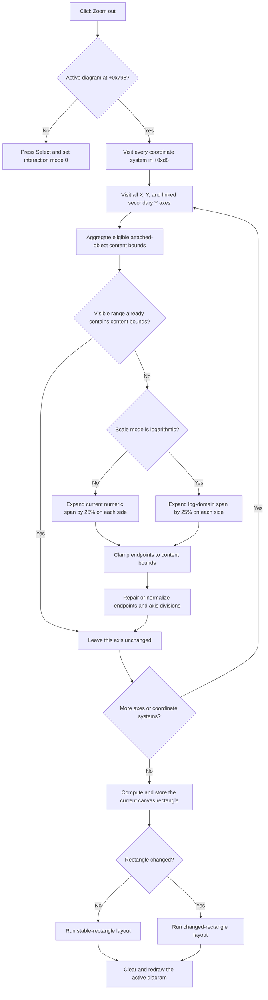

# Expand all active-diagram axis ranges toward their content bounds

> Analysis status: Recovered resource, unique handler, all-coordinate-system scope, linear and logarithmic expansion, range normalization, repeated-click behavior, layout, redraw, and persistence and error boundaries reviewed.

## Control

| Property | Recovered value |
| --- | --- |
| Form | DFWindow |
| Component path | DFWindow.DFToolPanel.ToolNoteBook.Diagram.DFZoomOutBtn |
| Control class | TSpeedButton |
| Caption | Not present in the recovered resource. |
| Hint | Zoom out |
| Handler name | DFZoomOutBtnClick |
| Handler address | 01a7e270 |
| Graph node | `resource:dfm:DFWindow/DFWindow.DFToolPanel.ToolNoteBook.Diagram.DFZoomOutBtn` |
| Handler node | `function:01a7e270` |
| Graph layer | UI |

## What happens when clicked

[`FUN_01a7e270`](../../../DecompiledSources/Tina16/functions/0000000001A7E270__FUN_01a7e270.c) immediately expands the visible ranges of all eligible axes in the active diagram. It does not arm a rectangle tool and does not wait for a mouse drag.

The handler has one model guard: DFWindow must have an active diagram at form offset `+0x798`. It does not inspect the selected object, selected axis, selected curve, current coordinate system, popup location, or `Sender` value.

With an active diagram, the handler walks the complete coordinate-system collection at diagram offset `+0xd8`. [`FUN_01ce1ae0`](../../../DecompiledSources/Tina16/functions/0000000001CE1AE0__FUN_01ce1ae0.c) visits, for each coordinate system:

- every X axis in collection `+0x70`;
- every Y axis in collection `+0x78`; and
- each linked secondary Y axis at axis offset `+0x118`.

The operation therefore affects all coordinate systems on the current active diagram. It does not change other pages or documents.

## Exact zoom-out factor and bounds

[`FUN_01cd3400`](../../../DecompiledSources/Tina16/functions/0000000001CD3400__FUN_01cd3400.c) first derives the lower and upper content bounds for one axis. It walks the axis's attached-object collection at `+0xf8`, accepts recovered curve and compatible-object types according to the axis orientation, and aggregates their minimum lower bound and maximum upper bound.

[`FUN_01cd3740`](../../../DecompiledSources/Tina16/functions/0000000001CD3740__FUN_01cd3740.c) compares those content bounds with the current visible endpoints at axis offsets `+0xb8` and `+0xc0`.

- If the current range already contains both content bounds, it returns without changing that axis.
- For Linear and Linear-dB scale modes, it calculates one quarter of the current span. It subtracts that value from the lower endpoint and adds it to the upper endpoint.
- For Logarithmic scale mode `2`, it converts both endpoints to the logarithmic domain, expands that interval by one quarter on each side, and converts the results back.
- Each provisional endpoint is clamped to the corresponding aggregate content bound. The range does not expand beyond the content bounds in this step.

Before later normalization, a range that is not clamped grows from span `S` to `S + S/4 + S/4`, or `1.5 × S`. A logarithmic range grows by the same factor in log space, not by multiplying each numeric endpoint by `1.5`.

The recovered axis resource lists scale items `Linear`, `Linear-dB`, and `Logarithmic` at indexes 0, 1, and 2. An internal scale value `3` follows the linear arithmetic branch. Values above `3` do not run an expansion branch, although the later orientation-specific normalization call can still run.

## Endpoint and division normalization

After it writes provisional endpoints, the axis helper applies an orientation-specific normalization path.

- [`FUN_01cd4340`](../../../DecompiledSources/Tina16/functions/0000000001CD4340__FUN_01cd4340.c) repairs nonpositive logarithmic endpoints on the simpler path.
- [`FUN_01cd43b0`](../../../DecompiledSources/Tina16/functions/0000000001CD43B0__FUN_01cd43b0.c) can round visible endpoints to usable tick boundaries, prevent a degenerate range, update the major-division count at `+0x74`, and update the division step at `+0x78`.

The final visible span can therefore be different from exactly `1.5 × S` after clamping and tick normalization. The zoom helper directly writes only the visible endpoint pair `+0xb8`/`+0xc0`. It does not copy these new endpoints to the second range pair `+0xc8`/`+0xd0`, clear stored axis options, or call the `.305` automatic-range reset and proportional-span helpers.

## Layout and redraw

After all coordinate systems are processed, the handler computes the current DFWindow canvas rectangle through [`FUN_01a782f0`](../../../DecompiledSources/Tina16/functions/0000000001A782F0__FUN_01a782f0.c). [`FUN_01acf9e0`](../../../DecompiledSources/Tina16/functions/0000000001ACF9E0__FUN_01acf9e0.c) compares that rectangle with the diagram's stored rectangle and writes the new value.

- An unchanged rectangle selects [`FUN_01acfc60`](../../../DecompiledSources/Tina16/functions/0000000001ACFC60__FUN_01acfc60.c).
- A changed rectangle selects [`FUN_01acfa60`](../../../DecompiledSources/Tina16/functions/0000000001ACFA60__FUN_01acfa60.c).

These paths recalculate the active diagram geometry. The handler then calls [`FUN_01aceb90`](../../../DecompiledSources/Tina16/functions/0000000001ACEB90__FUN_01aceb90.c) with its clear flag set. It clears and redraws the active diagram when the drawing rectangle is valid. Curves, axes, figures, annotations, and cursor overlays use the new scale immediately.

## Repeated clicks and no-op paths

Each click repeats the complete coordinate-system and axis walk.

- An axis that does not yet contain its aggregate content bounds grows toward those bounds in nominal 1.5× steps.
- Clamping makes the final step stop at the content bounds.
- After the visible interval contains the content bounds, later clicks leave that axis unchanged.
- Other axes can continue to expand during the same click until they also reach their bounds.

The handler always runs rectangle calculation, layout, and redraw when an active diagram exists. It does this even when all axes return early or the diagram has no coordinate systems.

If no active diagram exists, the handler presses the Select speed button and calls [`FUN_01a794b0`](../../../DecompiledSources/Tina16/functions/0000000001A794B0__FUN_01a794b0.c). The Select handler writes interaction mode zero. No range, layout, or paint operation occurs on this branch.

## Manual-scale storage, document state, and undo

This handler does not call the known `FUN_01add6f0` ManualScale option serializer. This differs from `.305` Normal Zoom, which runs the `Diagram Page Setup / ManualScale` check after it resets all automatic ranges.

Zoom Out changes live visible axis fields and redraws the active diagram, but this path does not:

- serialize the new ranges through `DiagOpt.tmp`, even when ManualScale is enabled;
- call a document Save command or settings writer;
- set a recovered document-modified flag; or
- register an undo or redo operation.

Later persistence by another command is outside this click path and is not proven here.

## Error and partial-state boundaries

- The handler and range helpers show no error dialog and contain no local exception handler or rollback.
- Axis ranges are updated one axis at a time before layout and redraw. A later failure can leave an earlier subset of axes changed while the display still has old or partly updated geometry.
- The content-bound aggregator has no separate `has data` result. When no compatible attached object is found, its outputs remain `0, 0`. An interval that already contains zero is unchanged; otherwise the recovered code can use zero as a clamp target. A stronger empty-axis invariant is not proven.
- The logarithmic branch calls logarithm functions on the current endpoints. The normal model requires positive logarithmic endpoints, but this helper does not first validate that invariant. Safe behavior for malformed nonpositive input is not established.
- Collection access and recovered casts assume valid diagram, coordinate-system, axis, and linked-axis objects. There is no per-item null or type-recovery fallback after the cast.
- Painting is a no-op when the recovered drawing rectangle is empty. The model ranges can still have changed before that paint guard.

## Comparison with related range controls

- `.368` **Zoom** arms interaction mode `1` and applies a later drag rectangle. Zoom Out is immediate and affects every axis.
- `.305` **Normal zoom** derives complete automatic ranges for all axes, clears selected stored axis options, applies proportional-span correction, and conditionally serializes ManualScale options.
- `.344` **Default ranges** applies automatic range calculation only to the first selected axis and uses a targeted refresh.
- Zoom Out does not require a selected axis. It expands each current visible range toward its existing content bounds and performs one common full-diagram redraw.

## Click flow

## Handler and call-path evidence

- Click handler: [FUN_01a7e270](../../../DecompiledSources/Tina16/functions/0000000001A7E270__FUN_01a7e270.c)
- Coordinate-system axis walker: [FUN_01ce1ae0](../../../DecompiledSources/Tina16/functions/0000000001CE1AE0__FUN_01ce1ae0.c)
- Single-axis zoom-out: [FUN_01cd3740](../../../DecompiledSources/Tina16/functions/0000000001CD3740__FUN_01cd3740.c)
- Attached-content bound aggregation: [FUN_01cd3400](../../../DecompiledSources/Tina16/functions/0000000001CD3400__FUN_01cd3400.c)
- Positive-log guard: [FUN_01cd4340](../../../DecompiledSources/Tina16/functions/0000000001CD4340__FUN_01cd4340.c)
- Tick and range normalization: [FUN_01cd43b0](../../../DecompiledSources/Tina16/functions/0000000001CD43B0__FUN_01cd43b0.c)
- Canvas rectangle calculation: [FUN_01a782f0](../../../DecompiledSources/Tina16/functions/0000000001A782F0__FUN_01a782f0.c)
- Rectangle comparison and update: [FUN_01acf9e0](../../../DecompiledSources/Tina16/functions/0000000001ACF9E0__FUN_01acf9e0.c)
- Diagram layout: [FUN_01acfc60](../../../DecompiledSources/Tina16/functions/0000000001ACFC60__FUN_01acfc60.c) and [FUN_01acfa60](../../../DecompiledSources/Tina16/functions/0000000001ACFA60__FUN_01acfa60.c)
- Full redraw: [FUN_01aceb90](../../../DecompiledSources/Tina16/functions/0000000001ACEB90__FUN_01aceb90.c)
- No-diagram Select fallback: [FUN_01a794b0](../../../DecompiledSources/Tina16/functions/0000000001A794B0__FUN_01a794b0.c)
- Related rectangle Zoom: [DFZoomBtn](dfzoombtn-2d1a30c9a4.md)
- Related all-axis automatic reset: [Normal zoom](dfnormalzoommnu-bd2c97619c.md)
- Related selected-axis automatic reset: [Default ranges](setdefaultsmnu-d7a98a6d49.md)
- Extracted glyph: [0095 DFZoomOutBtn Glyph](../../../glyph/0095_DFWindow_DFWindow_DFToolPanel_ToolNoteBook_Diagram_DFZoomOutBtn_Glyph_Data.png)

## Resource and graph evidence

- The recovered hint is `Zoom out`.
- The extracted 20-by-20 glyph is a magnifier with a minus mark. It supports the zoom-out affordance but does not establish the scope or factor.
- The graph places `FUN_01a7e270` in the `UI` layer. Its calls establish the active-diagram walk, axis expansion, rectangle-dependent layout, and redraw sequence.
- `.305` owns the automatic all-axis range helpers. `.344` owns the selected-axis automatic reset. `.368` owns the rectangle Zoom handler. This analysis owns only the unique Zoom Out handler and its zoom-out-specific bound and range helpers.

## Analysis limits

- The original Delphi names for the coordinate-system, axis, attached-object, scale-mode, and orientation types are not recovered.
- Content-bound eligibility is established from type and orientation tests, but several original enumeration labels are not available.
- This analysis does not infer ManualScale persistence, document Save behavior, or undo support where the traced path has no such call.
