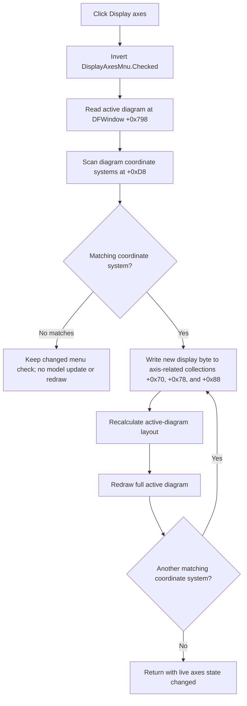

# Display axes

> Analysis status: Complete from the recovered DFM, handler, model-update path, and View-menu refresh path.

## Control

| Property | Recovered value |
| --- | --- |
| Form | DFWindow |
| Component path | DFWindow.DFMainMenu.DFViewMnu.DisplayAxesMnu |
| Control class | TMenuItem |
| Caption | Display axes |
| Hint | Not present in the recovered resource. |
| Handler name | DisplayAxesMnuClick |
| Handler address | 01a87bd0 |
| Graph node | `resource:dfm:DFWindow/DFWindow.DFMainMenu.DFViewMnu.DisplayAxesMnu` |
| Handler node | `function:01a87bd0` |
| Graph layer | UI |

## What happens when clicked

`DisplayAxesMnuClick` toggles the menu item's current `Checked` byte. It then passes the new Boolean value to the active diagram at `TDFWindow +0x798`. The diagram helper visits every coordinate-system object of the recovered class at `DAT_01cdd500`. For each match, it writes the value to the display flag at `+0x11` of every object in the coordinate system's three axis-related collections at `+0x70`, `+0x78`, and `+0x88`.

After it updates one matching coordinate system, the helper recalculates the active diagram's layout and requests a full redraw. The click therefore changes the axes of all matching plots in the active diagram. It does not use the selected curve, selected object, cursor selection, or current coordinate-system index.

## Checked state and synchronization

The DFM sets `DisplayAxesMnu.Checked` to true initially. The click handler does not query the model before it toggles the item. It negates the menu item's current checked byte, writes that value through the VCL checked-state setter, reads the resulting byte, and applies it to the diagram.

Opening the View menu runs a separate synchronization path. When an active diagram exists, [`FUN_01ae9120`](../../../DecompiledSources/Tina16/functions/0000000001AE9120__FUN_01ae9120.c) finds the first matching coordinate system and returns the display state of its first object in collection `+0x70`. The shared menu refresh writes that result back to `DisplayAxesMnu.Checked`. If the diagram has no matching coordinate system, this query returns true. Thus, the menu opening can restore the checked item to true after an empty or nonmatching diagram produced no model update.

The menu refresh also disables the command when there is no active diagram. The click handler itself has no equivalent guard.

## Diagram, curve, and cursor effects

The command uses only the active diagram at `TDFWindow +0x798`. It does not enumerate the document page collection at `TDFWindow +0x7a0`, switch pages, or copy the setting to inactive pages.

The axis-state setter writes only the display byte on the objects in the three axis-related collections. It does not change axis limits, scale, units, grid color, curve data, curve visibility, cursor positions, or curve-to-cursor associations. The later full redraw traverses the active diagram's normal coordinate-system, curve, overlay, and cursor drawing paths. Curves and cursors can therefore be repainted in the new layout, but this click does not change their model state.

## Repeated, empty, and partial paths

- Every normal repeated click selects the opposite state and runs the same update path. There is no explicit same-value no-op branch in the application handler.
- An empty coordinate-system list, or a list with no object of the required recovered class, leaves the diagram unchanged and requests no layout or redraw. The menu check has already changed on this path.
- With more than one matching coordinate system, the helper recalculates and redraws the complete active diagram after each matching item. The recovered code does not combine these updates into one final redraw.
- The handler assumes that `DisplayAxesMnu` and the active diagram exist. A programmatic call with no active diagram can fail after the menu check changes. Normal UI preparation prevents this by disabling the item when the diagram pointer is null.

## Persistence and errors

The click writes the live in-memory axis-display flags. It does not call the diagram serializer, document-save command, INI or registry writer, dirty-state setter, or undo service. The recovered click path therefore proves the current-session effect only. It does not prove whether a later document save includes these flags.

There is no local validation message, exception handler, retry, or rollback. A failure while an axis collection is being updated can leave earlier objects changed and later objects unchanged. A later layout or redraw failure can leave the model changed while the display is stale. The menu check changes before all diagram work, so it can also remain changed after a later failure.

## Click flow

## Recovered evidence

- [`FUN_01a87bd0`](../../../DecompiledSources/Tina16/functions/0000000001A87BD0__FUN_01a87bd0.c) is the DFM-bound click handler. It negates menu field `TDFWindow +0x9e8`, then passes the resulting checked byte and active-diagram field `+0x798` to the update helper.
- [`FUN_007e2d20`](../../../DecompiledSources/Tina16/functions/00000000007E2D20__FUN_007e2d20.c) is the change-aware VCL checked-state setter. It writes menu-item byte `+0x80` and updates the owning native menu only when the requested value differs.
- [`FUN_01ae9060`](../../../DecompiledSources/Tina16/functions/0000000001AE9060__FUN_01ae9060.c) enumerates diagram collection `+0xd8`, filters by the recovered coordinate-system class, applies the state, and calls the layout and redraw routines after each match.
- [`FUN_01ce88c0`](../../../DecompiledSources/Tina16/functions/0000000001CE88C0__FUN_01ce88c0.c) enumerates the coordinate system's collections at `+0x70`, `+0x78`, and `+0x88` and writes the supplied byte to object field `+0x11`.
- [`FUN_01acfa60`](../../../DecompiledSources/Tina16/functions/0000000001ACFA60__FUN_01acfa60.c) recalculates the active rectangle and propagates the current drawing surfaces and geometry to the diagram's coordinate systems and overlays.
- [`FUN_01aceb90`](../../../DecompiledSources/Tina16/functions/0000000001ACEB90__FUN_01aceb90.c) redraws the active rectangle, coordinate systems, overlays, and cursor objects when its rectangle is valid.
- [`FUN_01a7fc90`](../../../DecompiledSources/Tina16/functions/0000000001A7FC90__FUN_01a7fc90.c) is the shared DFWindow menu-state refresh. It disables `DisplayAxesMnu` without an active diagram and otherwise assigns the result of `FUN_01ae9120` to its checked state.
- UI resource evidence: [`ui-evidence.json`](../../../DecompiledSources/Tina16/resources/dfm/ui-evidence.json) binds `DisplayAxesMnuClick`, supplies caption `Display axes`, and records the initial checked state as true.

## Analysis limits

The recovered class names for `DAT_01cdd500`, `DAT_01ccbf00`, and `PTR_FUN_01cd9128` are not published. Their use in the click, state-query, and render paths establishes the axis-display responsibility, but not the original Delphi type or property names.
