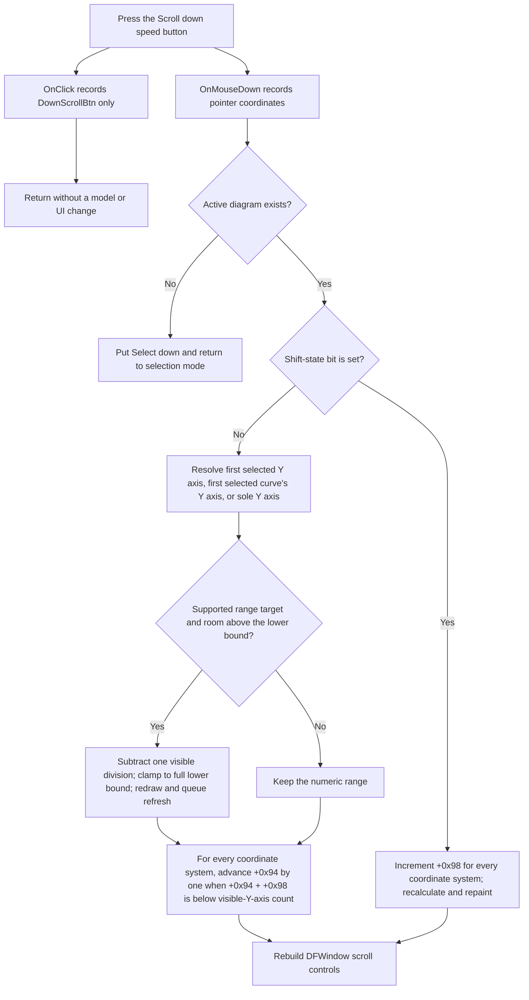

# Scroll the DFWindow vertical view down

> Analysis status: Complete. Scrolling is implemented by the control's `OnMouseDown` handler, not by its `OnClick` handler. An unmodified press moves an applicable Y-axis range down and advances the visible-Y-axis window where possible. Shift changes the visible-axis span instead.

## Control

| Property | Recovered value |
| --- | --- |
| Form | DFWindow |
| Component path | DFWindow.DFToolPanel.ToolNoteBook.Diagram.DownScrollBtn |
| Control class | TSpeedButton |
| Caption | Not present in the recovered resource. |
| Hint | Scroll down |
| Size | 22 by 14 |
| Glyph | 9 by 9 down-arrow image recovered from a 194-byte Delphi bitmap resource |
| OnClick | DownScrollBtnClick at `01a7a0b0` |
| OnMouseDown | DownScrollBtnMouseDown at `01a858e0` |
| Graph node | `resource:dfm:DFWindow/DFWindow.DFToolPanel.ToolNoteBook.Diagram.DownScrollBtn` |
| Graph layer | UI |

The `Scroll down` hint and down-arrow glyph give strong direction evidence. The two event bindings explain an important split: `OnMouseDown` changes the diagram view, while the later `OnClick` path only records the button command.

## OnClick records the command only

[`FUN_01a7a0b0`](../../../DecompiledSources/Tina16/functions/0000000001A7A0B0__FUN_01a7a0b0.c) formats `DownScrollBtn`, submits it through the conditional macro recorder, clears its temporary UnicodeString, and returns. It has no diagram read, selection check, scale calculation, repaint, scrollbar update, serializer, or file call.

A keyboard or programmatic activation that emits only `OnClick` therefore does not scroll in this recovered path. A normal pointer press can also emit `OnMouseDown`, which owns the behavior below.

## OnMouseDown guard and input handling

[`FUN_01a858e0`](../../../DecompiledSources/Tina16/functions/0000000001A858E0__FUN_01a858e0.c) records the mouse action and screen-relative coordinates before it tests the active diagram at form offset `+0x798`.

- With no active diagram, it puts the Select speed button down, invokes `DFSelectBtnClick`, and returns to selection mode. No axis or coordinate-system field changes.
- With a diagram, it chooses the unmodified or Shift path from recovered Shift-state bit `1`.

The handler does not inspect its recovered mouse-button parameter. A left, right, or middle mouse-down event that reaches this handler follows the same model path for the same Shift state.

## Unmodified press: move the Y-axis view down

The first helper, [`FUN_01ae35c0`](../../../DecompiledSources/Tina16/functions/0000000001AE35C0__FUN_01ae35c0.c), collects the current selection and finds a Y-axis target as follows:

| Selection state | Axis-range target |
| --- | --- |
| Exact category `1` | The first selected axis, but only when its recovered axis-type mask accepts the vertical scroll operation. |
| Exact category `2` | The first selected curve is resolved to its coordinate system, then the curve's linked Y axis is used. Two recovered coordinate-system layouts select curve field `+0x100` or `+0xF0`. |
| Empty category `0` | The sole Y axis, but only when the diagram has exactly one coordinate system and that system has exactly one Y axis. |
| Mixed or other category | No selected-axis range shift. |

The helper does not use the pointer location to choose an axis. With more than one selected curve or axis, only the first selection item supplies the range target.

For a supported ordinary scale, the down-step function subtracts

`(visible maximum at +0xC0 - visible minimum at +0xB8) / division count at +0x74`

from both visible bounds. It preserves the visible span and clamps at the full lower bound at `+0xC8`. Recovered scale type `2` performs the same one-division move in transformed scale space before it stores the new bounds. Other recovered scale types can reject the numeric move.

When the range changes, the helper recalculates and redraws the axis, queues the affected axis and related objects, and redraws the first recovered Y/grid object of the owning coordinate system. It then resets a 500 ms timer. The timer callback disables itself and processes the queued diagram refresh. It is a deferred repaint, not a recovered automatic scroll-repeat loop.

## Unmodified press: advance the visible-Y-axis window

After the selected-axis helper, the shared all-coordinate-system helper [`FUN_01ad1550`](../../../DecompiledSources/Tina16/functions/0000000001AD1550__FUN_01ad1550.c) iterates every coordinate system in diagram collection `+0xD8`.

For each system, it increments field `+0x94` by one only when

`current offset + visible span at +0x98 < count of visible Y axes in +0x78`.

The later scrollbar refresh uses `+0x94` as its position and `visible Y-axis count - +0x98` as its maximum. This establishes `+0x94` as the recovered visible-axis window offset and `+0x98` as its span, although the original Delphi field names are not available.

Each successful offset change recalculates that coordinate system and redraws its visible axes. If any system changes, the helper also redraws cursor A and cursor B when present. This all-system step is independent of the selected-axis range step: an invalid or mixed selection can still advance an axis window, while a system already at its offset limit stays unchanged.

Canonical ownership of this shared down-offset helper belongs to sibling Bead `.371` for `DownScrollCSBtn`.

## Shift press: increase the visible-axis span

With Shift, the mouse handler skips both unmodified helpers and calls [`FUN_01ad1620`](../../../DecompiledSources/Tina16/functions/0000000001AD1620__FUN_01ad1620.c). It increments field `+0x98` by one for every coordinate system, then recalculates the full diagram layout and requests a full repaint.

This path does not inspect selection and does not change numeric axis bounds. The function has no local upper-bound check against the number of Y axes. Repeated Shift presses can therefore keep increasing `+0x98` in the recovered source. Later layout or control code can impose constraints, but that normalization is not established here.

Both modified and unmodified paths finish with [`FUN_01a89e80`](../../../DecompiledSources/Tina16/functions/0000000001A89E80__FUN_01a89e80.c), which clears and rebuilds the relevant DFWindow scroll controls. For an eligible single-coordinate-system layout, it derives the vertical scrollbar range from the visible Y-axis count, offset `+0x94`, and span `+0x98`.

## Control flow

## Repeat, no-op, error, and persistence boundaries

- Repeated unmodified presses move the supported numeric window one division at a time until its lower bound. The per-coordinate-system offset also advances one at a time until `offset + span` reaches the visible-Y-axis count.
- When both the numeric range and all offsets are at their limits, the press still records mouse and click events, resets the deferred-refresh timer, and refreshes the scroll controls, but it has no proven model change.
- The recovered code contains no press-and-hold repeat loop. The 500 ms timer performs one deferred queued refresh. Repetition requires more mouse-down events.
- The range calculation has no local validation for a zero division count, inverted bounds, invalid object ownership, or failed virtual draw call. These fields are treated as model invariants. The path has no local exception handler, error message, retry, transaction, or rollback.
- The unmodified path changes the numeric range before it advances all coordinate-system offsets. A later failure can retain the earlier change. The Shift path changes systems sequentially before global recalculation, so it can also leave partial state if an exception interrupts the loop.
- No handler in this control path calls the conditional `ManualScale` option serializer `FUN_01add6f0`, sets the recovered document-modified byte directly, invokes Save, or writes a file.
- The normal axis writer [`FUN_01cd8e40`](../../../DecompiledSources/Tina16/functions/0000000001CD8E40__FUN_01cd8e40.c) serializes visible bounds `+0xB8/+0xC0` and full bounds `+0xC8/+0xD0`. The coordinate-system writer [`FUN_01ce6660`](../../../DecompiledSources/Tina16/functions/0000000001CE6660__FUN_01ce6660.c) serializes `+0x94/+0x98`. A later normal document save can therefore persist these view fields, but this control does not perform that save.

## Recovered evidence

- Command-only OnClick handler: [FUN_01a7a0b0](../../../DecompiledSources/Tina16/functions/0000000001A7A0B0__FUN_01a7a0b0.c)
- Actual DownScrollBtn mouse handler: [FUN_01a858e0](../../../DecompiledSources/Tina16/functions/0000000001A858E0__FUN_01a858e0.c)
- Selected or sole Y-axis resolver and redraw coordinator: [FUN_01ae35c0](../../../DecompiledSources/Tina16/functions/0000000001AE35C0__FUN_01ae35c0.c)
- Shared range-decrease wrapper and step calculation: [FUN_01cd3ef0](../../../DecompiledSources/Tina16/functions/0000000001CD3EF0__FUN_01cd3ef0.c) and [FUN_01cd3cd0](../../../DecompiledSources/Tina16/functions/0000000001CD3CD0__FUN_01cd3cd0.c)
- Shared all-coordinate-system down-offset helper: [FUN_01ad1550](../../../DecompiledSources/Tina16/functions/0000000001AD1550__FUN_01ad1550.c)
- Per-system bounded offset update: [FUN_01ce63e0](../../../DecompiledSources/Tina16/functions/0000000001CE63E0__FUN_01ce63e0.c)
- Shift span update: [FUN_01ad1620](../../../DecompiledSources/Tina16/functions/0000000001AD1620__FUN_01ad1620.c)
- Scroll-control refresh: [FUN_01a89e80](../../../DecompiledSources/Tina16/functions/0000000001A89E80__FUN_01a89e80.c)
- Deferred queued refresh callback: [FUN_01ae5d60](../../../DecompiledSources/Tina16/functions/0000000001AE5D60__FUN_01ae5d60.c)
- Axis and coordinate-system writers: [FUN_01cd8e40](../../../DecompiledSources/Tina16/functions/0000000001CD8E40__FUN_01cd8e40.c) and [FUN_01ce6660](../../../DecompiledSources/Tina16/functions/0000000001CE6660__FUN_01ce6660.c)
- Extracted down-arrow glyph: [0091_DFWindow_DFWindow_DFToolPanel_ToolNoteBook_Diagram_DownScrollBtn_Glyph_Data.png](../../../glyph/0091_DFWindow_DFWindow_DFToolPanel_ToolNoteBook_Diagram_DownScrollBtn_Glyph_Data.png)
- Recovered form evidence: [ui-evidence.json](../../../DecompiledSources/Tina16/resources/dfm/ui-evidence.json)

## Analysis limits and annotation ownership

- The original Delphi names for axis type values, scale modes, coordinate-system fields `+0x94/+0x98`, and the first object in collection `+0x88` are not recovered.
- This Bead owns canonical annotations for `FUN_01a7a0b0`, `FUN_01a858e0`, `FUN_01ae35c0`, and `FUN_01ad1620`. Bead `.371` owns the shared all-coordinate-system down helper. The range-decrease, selection, scrollbar, redraw, and serializer helpers remain evidence for the left, right, up, and coordinate-system scroll siblings.
- No live pointer, Shift, boundary, exception, or save-and-reload test was performed.
