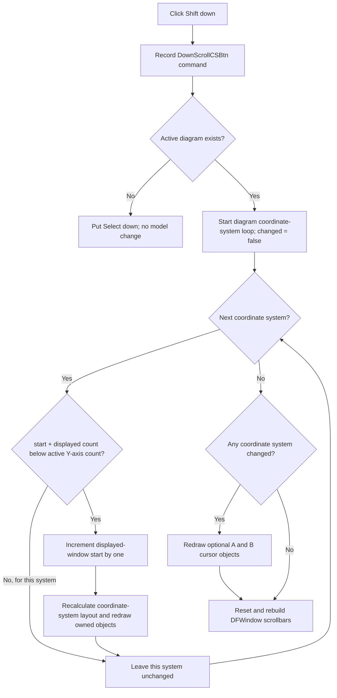

# Shift every coordinate system down by one displayed Y-axis position

> Analysis status: Evidence-backed source review complete.

## Control

| Property | Recovered value |
| --- | --- |
| Form | DFWindow |
| Component path | DFWindow.DFToolPanel.ToolNoteBook.Diagram.DownScrollCSBtn |
| Control class | TSpeedButton |
| Caption | Not present in the recovered resource. |
| Hint | Shift down |
| Text | Not present in the recovered resource. |
| Handler name | DownScrollCSBtnClick |
| Handler address | 01a7a3a0 |
| Graph node | `resource:dfm:DFWindow/DFWindow.DFToolPanel.ToolNoteBook.Diagram.DownScrollCSBtn` |
| Handler node | `function:01a7a3a0` |
| Graph layer | UI |

## What happens when clicked

`DownScrollCSBtn` moves the displayed Y-axis window of every coordinate system in the active diagram down by one position. It does not move one selected axis and does not change an axis's numeric minimum or maximum.

`FUN_01a7a3a0` first records command name `DownScrollCSBtn` in the recovered macro-command path. If DFWindow field `+0x798` has no active diagram, the handler puts the Select speed button down and calls the Select handler. No coordinate-system state changes.

With an active diagram, `FUN_01ad1550` visits every coordinate system in diagram collection `+0xd8`. For each system, `FUN_01ce63e0` compares:

- the current displayed-window start at coordinate-system offset `+0x94`;
- the displayed Y-axis count at `+0x98`; and
- the count of Y axes whose virtual active query returns true.

The system can move only when `start + displayed count < active Y-axis count`. A successful step increments `+0x94` by exactly one. This changes which consecutive Y-axis entries take part in the coordinate-system layout. It does not add, remove, reorder, select, or edit the range values of an axis.

## Whole-coordinate-system scope

The outer helper does not read a selected curve, selected axis, pointer position, or active coordinate-system index. It applies the same one-position attempt to each coordinate system in the active diagram. One click can therefore change several coordinate systems. Systems can reach the lower boundary at different times: a system at its boundary stays unchanged while another system can still advance.

This is narrower than [Scroll down](downscrollbtn-a4c47423e3.md). The recovered `DownScrollBtn` click wrapper (`FUN_01a7a0b0`) only records its command, but its `OnMouseDown` handler performs the view operation. Without Shift, that mouse path first tries to move a selected or sole Y axis's numeric range down by one division and then calls the same all-coordinate-system `FUN_01ad1550` helper. With Shift, it increases displayed-count field `+0x98` instead. `DownScrollCSBtn` does not run either of those range or span operations. Its `OnClick` invokes only the one-position displayed-window-start step before scrollbar refresh.

## Layout, redraw, and scrollbar state

After it increments one coordinate system, `FUN_01ce63e0` calls the coordinate-system layout path and then redraws the system's owned diagram objects. The layout code rebuilds which Y axes are marked for display from `+0x94` and `+0x98`, and recalculates their rectangles. Thus the change is visible immediately; it is not only a toolbar-state update.

`FUN_01ad1550` ORs the per-system changed results. If at least one coordinate system moved, it also redraws the two optional diagram cursor objects at `+0xf0` and `+0xf8`. If all systems are already at the boundary, it skips those cursor redraws.

The click handler finally calls `FUN_01a89e80` to rebuild DFWindow's vertical and horizontal scrollbar controls. That routine always resets both controls first. It configures the coordinate-system vertical scrollbar only when the active diagram has exactly one coordinate system and the recovered layout mode supports the displayed-axis window. In that case the vertical position comes from `+0x94`, and its upper value is `active Y-axis count - displayed count`. With multiple coordinate systems, the handler still shifts each system, but this shared scrollbar refresh does not expose one system's position as the window scrollbar.

## Repeated clicks, boundaries, and errors

- Each accepted click advances each eligible coordinate system by one position. It does not jump by the displayed-axis count.
- A coordinate system does not change when `start + displayed count` is equal to or greater than its active Y-axis count. No message is displayed for this boundary.
- When no coordinate system changes, the handler still refreshes the scrollbar controls. It does not run the per-system layout, object redraw, or optional cursor redraw paths.
- A diagram with an empty coordinate-system collection performs no model change and then refreshes the scrollbars.
- The handler has no local confirmation, returned-error test, exception handler, retry, transaction, or rollback. The outer loop changes systems in order. A failure after an earlier system changed can therefore leave a partial live update.
- The direct handler does not test the speed button's enabled state. Normal VCL dispatch prevents a disabled control from producing the click, but a direct programmatic call can bypass that UI boundary.

## Persistence boundary

The click path changes live coordinate-system field `+0x94`. It records the command for macro replay, but it does not call the diagram serializer, a project-save routine, a file writer, an undo helper, or an explicit document-modified setter.

The recovered coordinate-system archive writer `FUN_01ce6660` writes both `+0x94` and `+0x98`, and loader `FUN_01ce6500` restores them. A later normal diagram save can therefore preserve the displayed-axis window. This control does not perform that save immediately. A failure before a later save can leave only the live in-memory shift.

## Shift-down flow

## Handler and model evidence

- Direct click handler and active-diagram fallback: [FUN_01a7a3a0](../../../DecompiledSources/Tina16/functions/0000000001A7A3A0__FUN_01a7a3a0.c)
- Whole-diagram coordinate-system loop and changed-result aggregation: [FUN_01ad1550](../../../DecompiledSources/Tina16/functions/0000000001AD1550__FUN_01ad1550.c)
- One-position lower-bound guard and state mutation: [FUN_01ce63e0](../../../DecompiledSources/Tina16/functions/0000000001CE63E0__FUN_01ce63e0.c)
- Active Y-axis count: [FUN_01ce3400](../../../DecompiledSources/Tina16/functions/0000000001CE3400__FUN_01ce3400.c)
- Coordinate-system relayout: [FUN_01ce4cd0](../../../DecompiledSources/Tina16/functions/0000000001CE4CD0__FUN_01ce4cd0.c) and [FUN_01ce3940](../../../DecompiledSources/Tina16/functions/0000000001CE3940__FUN_01ce3940.c)
- Owned-object redraw: [FUN_01ce0100](../../../DecompiledSources/Tina16/functions/0000000001CE0100__FUN_01ce0100.c)
- DFWindow scrollbar refresh: [FUN_01a89e80](../../../DecompiledSources/Tina16/functions/0000000001A89E80__FUN_01a89e80.c)
- Coordinate-system load and save fields: [FUN_01ce6500](../../../DecompiledSources/Tina16/functions/0000000001CE6500__FUN_01ce6500.c) and [FUN_01ce6660](../../../DecompiledSources/Tina16/functions/0000000001CE6660__FUN_01ce6660.c)
- Per-axis click-wrapper contrast: [FUN_01a7a0b0](../../../DecompiledSources/Tina16/functions/0000000001A7A0B0__FUN_01a7a0b0.c)
- Recovered control resources: [ui-evidence.json](../../../DecompiledSources/Tina16/resources/dfm/ui-evidence.json)

## Resource and annotation limits

- The control has hint **Shift down**, no recovered caption, action, checked state, or same-parent label candidate.
- [The extracted 9 by 9 pixel glyph](../../../glyph/0094_DFWindow_DFWindow_DFToolPanel_ToolNoteBook_Diagram_DownScrollCSBtn_Glyph_Data.png) is a downward arrow. It supports direction only. The handler and model helpers prove the affected state and scope.
- The recovered source does not publish Delphi field names for offsets `+0x94` and `+0x98`. Their guard, layout, scrollbar, and archive uses establish the displayed Y-axis-window roles used here.
- This Bead owns canonical annotations for `FUN_01a7a3a0`, `FUN_01ad1550`, and `FUN_01ce63e0`. Shared layout, redraw, cursor, scrollbar, macro, Select-mode, and archive helpers remain evidence only. The opposite up-shift handler and helpers belong to the UpScrollCSBtn analysis.
