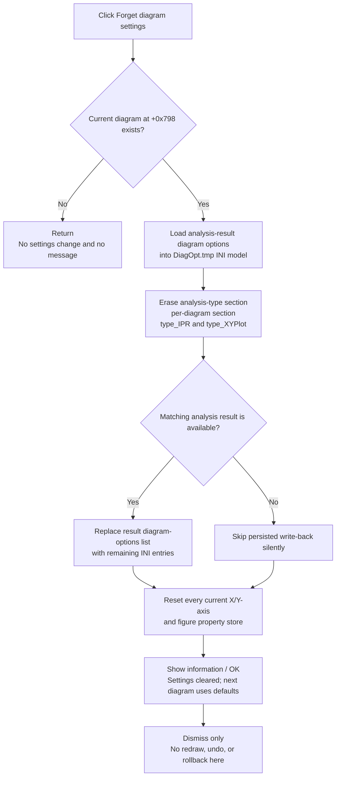

# Forget diagram settings

> Analysis status: Recovered resource, unique handler, exact information message, full-section erasure helper, analysis-result settings write-back, current axis and figure property resets, and no-diagram, empty, error, redraw, and rollback boundaries reviewed.

## Control

| Property | Recovered value |
| --- | --- |
| Form | DFWindow |
| Component path | DFWindow.DFMainMenu.DFFileMnu.ForgetdiagramsettingsMnu |
| Control class | TMenuItem |
| Caption | Forget diagram settings |
| Hint | Not present in the recovered resource. |
| Handler name | ForgetdiagramsettingsMnuClick |
| Handler address | 01a79760 |
| Graph node | `resource:dfm:DFWindow/DFWindow.DFMainMenu.DFFileMnu.ForgetdiagramsettingsMnu` |
| Handler node | `function:01a79760` |
| Graph layer | UI |

## What happens when clicked

`TDFWindow.ForgetdiagramsettingsMnuClick` first tests the current diagram
pointer at form offset `+0x798`.

- If there is no diagram, it returns without deleting settings and without
  showing a message.
- If a diagram exists, it calls `FUN_01adc240(diagram, 0, 0)`. The zero reset
  flags select full-section erasure, not the helper's narrower axis-range-only
  mode. After that helper returns, the handler shows an information dialog with
  an OK button and this recovered resource string:

  > Diagram settings are cleared. 
  > Next diagram will be generated with default settings.

The deletion happens before the dialog. The dialog is a completion notice, not
a confirmation. Clicking OK only dismisses the notice; there is no Cancel path
that can stop or reverse the deletion.

## Persisted settings that are removed

The reset helper loads the current analysis result's diagram-options text into
an INI-style model. With the flags used by this handler, it erases four complete
sections:

1. The base section named for the recovered analysis-type enum, such as an
   `AT_*` analysis type. If no analysis object is available, the fallback name
   is `noname`.
2. The per-diagram section formed from that analysis type, an underscore, and
   a normalized identifier derived from the diagram string at offset `+0x68`.
   The normalization removes decimal digits and converts unsupported filename
   characters before it applies the recovered disambiguating suffix.
3. `<analysis-type>_IPR`.
4. `<analysis-type>_XYPlot`.

This is not limited to axis minimum, maximum, and division values. The common
diagram serializer uses the per-diagram section for the complete recovered
viewer configuration, including:

- version and curve membership;
- plot-set count, type, proportional layout, Y-axis placement, and captions;
- X- and Y-axis counts, orientation, scale, caption, color, range, divisions,
  and custom property entries;
- twin-axis and figure settings.

`FUN_01adc240` contains a separate selective mode that matches axis keys and
the `min`, `max`, and `divs` suffixes. This click does not use it because the
handler passes zero. The four whole-section deletions above are the applicable
path.

## Storage target and file boundary

The helper uses `<settings folder>\DiagOpt.tmp` as the filename of its temporary
INI representation. It first imports the analysis result's current diagram
options into that model. After the section erasures, it serializes the remaining
INI entries and replaces the matched analysis result's diagram-options list at
result offset `+0x238`.

The authoritative write-back is therefore to the current in-memory analysis
result, not to the Windows registry or `TINA.INI`. A recovered `log`
command-line mode can also flush the temporary INI object to `DiagOpt.tmp`, but
that diagnostic file is not the application settings owner.

This click does not invoke the `.tdr` Save writer. A later document Save can
persist the changed analysis-result and diagram-viewer state; no project file
is written by this handler itself.

## Effect on the current diagram

After it writes back the reduced settings model, `FUN_01adc240` visits every
current plot set. It resets the auxiliary property store for:

- every X axis;
- every Y axis; and
- every figure, using the property-store field selected by the figure subtype.

The reset clears each property store's current entries and reapplies its
registered defaults. This affects live in-memory axis and figure configuration,
but it does not delete or recreate the diagram objects. The helper does not
remove curves, plot sets, axes, or figures, and it does not replace their main
object fields as a newly generated diagram would.

There is no direct layout recalculation, refresh-list registration, invalidate,
or redraw call in the handler or reset helper. The recovered message describes
the next diagram as the point where defaults are applied. An immediate complete
visual rebuild of the current diagram is therefore not proven.

## Empty, error, and rollback behavior

- Erasing a missing or already empty section is accepted. There is no section
  count or key count precondition, and the completion message is still shown.
- If the global analysis-results store or matching analysis record is absent,
  the write-back helper silently skips replacement. The live axis and figure
  property resets still run, and the handler still shows the completion
  message.
- The helper and handler return no status. The handler does not check whether a
  section was found or whether persistence changed.
- There is no local error dialog, exception handler, retry, undo record,
  snapshot, or rollback transaction.
- Because mutation precedes the information dialog, closing that dialog cannot
  restore the removed entries.
- No direct registry write, `TINA.INI` write, project Save, or explicit redraw
  occurs on this path.

## Click flow

## Handler and call-path evidence

- Menu handler: [FUN_01a79760](../../../DecompiledSources/Tina16/functions/0000000001A79760__FUN_01a79760.c)
- Section erasure and live-property reset: [FUN_01adc240](../../../DecompiledSources/Tina16/functions/0000000001ADC240__FUN_01adc240.c)
- Diagram-options INI model loader: [FUN_01ae9310](../../../DecompiledSources/Tina16/functions/0000000001AE9310__FUN_01ae9310.c)
- Analysis-type section-name builder: [FUN_01ae94a0](../../../DecompiledSources/Tina16/functions/0000000001AE94A0__FUN_01ae94a0.c)
- INI write-back coordinator: [FUN_01ae9240](../../../DecompiledSources/Tina16/functions/0000000001AE9240__FUN_01ae9240.c)
- Analysis-result diagram-options replacement: [FUN_01cc6990](../../../DecompiledSources/Tina16/functions/0000000001CC6990__FUN_01cc6990.c)
- Current property-store reset: [FUN_005dce70](../../../DecompiledSources/Tina16/functions/00000000005DCE70__FUN_005dce70.c)
- Property-entry clear and default restore: [FUN_005dc1a0](../../../DecompiledSources/Tina16/functions/00000000005DC1A0__FUN_005dc1a0.c)
- Diagram-settings serializer for scope comparison: [FUN_01add6f0](../../../DecompiledSources/Tina16/functions/0000000001ADD6F0__FUN_01add6f0.c)
- Information-dialog wrapper: [FUN_0072d440](../../../DecompiledSources/Tina16/functions/000000000072D440__FUN_0072d440.c)
- Resource-string loader: [FUN_0041ddd0](../../../DecompiledSources/Tina16/functions/000000000041DDD0__FUN_0041ddd0.c)
- Recovered form evidence: [ui-evidence.json](../../../DecompiledSources/Tina16/resources/dfm/ui-evidence.json)

## Direct calls

- `FUN_01adc240` - Erases the stored diagram-option sections, writes the
  remaining options back, and resets live axis and figure property stores.
- `FUN_0041ddd0` - Loads resource string ID `64151` used by the completion
  notice.
- `FUN_0072d440` - Shows that notice as an information dialog with an OK button.
- `FUN_00414480` - Finalizes the temporary Delphi UnicodeString.

## Resource evidence

- The menu caption is `Forget diagram settings`.
- The resource has no hint, shortcut, action, checked state, image-list entry,
  embedded glyph, or picture.
- Resource string ID `64151`, referenced immediately after the reset call,
  states that settings are cleared and the next diagram uses defaults.
- No nearby label applies to this menu item. The exact source mutations and
  message resource, not the caption alone, establish the behavior.

## Analysis limits

- Recovered Delphi field names are unavailable for the diagram pointer,
  analysis-result key, and property stores. Their roles follow from repeated
  serializer, lookup, and reset data flow.
- The normalized per-diagram section suffix is generated by recovered
  sanitizing and hashing helpers. Its original Delphi identifier is unknown.
- The source has no explicit redraw. A later UI message loop or unrelated
  refresh can repaint changed live properties, but that is outside this click
  path.
- The handler cannot distinguish full persisted success from a skipped
  analysis-result write-back because every called operation is status-free on
  this path.
