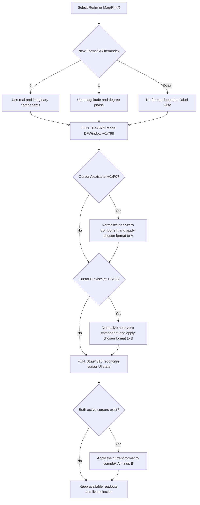

# Select the Nyquist cursor value format

> Analysis status: Source reviewed and behavior traced.

## Control

| Property | Recovered value |
| --- | --- |
| Form | DFWindow |
| Component path | DFWindow.CursorPanel.Notebook1.Nyquist.FormatRG |
| Control class | TRadioGroup |
| Caption | Format |
| Items | `Re/Im`, `Mag/Ph (°)` |
| Hint | Not present in the recovered resource. |
| Handler name | FormatRGClick |
| Handler address | 01a797f0 |
| Graph node | `resource:dfm:DFWindow/DFWindow.CursorPanel.Notebook1.Nyquist.FormatRG` |
| Handler node | `function:01a797f0` |
| Graph layer | UI |

This radio group changes the representation of complex cursor values in the
Nyquist readout. The resource item order and the numeric branches establish the
following exact mapping.

| ItemIndex | Resource item | First value position | Second value position |
| ---: | --- | --- | --- |
| 0 | Re/Im | Real component | Imaginary component |
| 1 | Mag/Ph (°) | Magnitude | Phase in degrees |

For index 1, the formatter constructs a complex number from the two stored
components. It calculates the magnitude and multiplies the calculated phase by
`57.29577951308232`, which converts radians to degrees.

## What happens when clicked

The VCL radio group has already changed its `ItemIndex` when
`FUN_01a797f0` runs. The handler uses the current `DFWindow` instance to read
the cursor manager at offset `+0x798`. It then does the following work in
order:

1. It reads cursor A at manager offset `+0xF0`. If the pointer is not null, it
   calls `FUN_01abfbd0` for that cursor.
2. It reads cursor B at manager offset `+0xF8`. If the pointer is not null, it
   calls the same formatter for that cursor.
3. It always calls `FUN_01ae4310` for the manager.

For the recovered complex Nyquist cursor-data path, `FUN_01abfbd0` reads the
`ItemIndex` from the `DFWindow` radio group at form offset `+0xCF0`. Index 0
writes cursor fields `+0x78` and `+0x80` directly. Index 1 writes their
magnitude and degree-phase values. The target labels are the fixed value
positions in these resource groups:

- `A`: `AXPos` and `AYPos`.
- `B`: `BXPos` and `BYPos`.
- `A - B`: `ABXDif` and `ABYDif`.

The common refresh calls `FUN_01ad1740` when its normal live-cursor path reaches
the final refresh stage. That helper subtracts B's two components from A's two
components. Index 0 shows the real and imaginary component differences. Index
1 constructs the complex A-minus-B value, then shows its magnitude and phase
in degrees.

The format selection does not choose a separate real/imaginary or
magnitude/phase page. It rewrites the two labels in each fixed group. The
common refresh can select the overall cursor notebook page from the recovered
cursor-data type. This page selection is independent of the `FormatRG` item.

## Click flow

## Data and state effects

The main effect is an immediate label refresh. The handler does not move either
cursor, change the selected curve, or recalculate analysis data.

The shared per-cursor formatter does make one small data change. Before it
checks the display and active-cursor guards, it tests the absolute value of
cursor field `+0x80`. When the value is below `1e-13`, it writes zero back to
that field. Thus, this click can normalize a near-zero second component for A,
B, or both before it formats the text.

The format-dependent label writes require the recovered global display object,
the cursor active byte at `+0x91`, an associated data object at `+0x58`, and the
recovered complex data subtype. A non-null cursor that fails these conditions
does not receive the Nyquist pair rewrite through this branch. Other parts of
the common refresh can still update visibility, enabled state, and the active
cursor page.

## Missing cursors, repeated clicks, and invalid indexes

- If A is absent, the A formatter call is skipped. The same rule applies to B.
- If both are absent, both formatter calls are skipped. The common refresh
  enters its no-cursor path, clears or disables cursor controls, and returns
  before the A-minus-B calculation. It does not invent readout values.
- If only one cursor exists, its individual values can refresh. The A-minus-B
  helper requires both active cursor objects, so the difference pair is not
  recalculated.
- The handler has no unchanged-selection test. If VCL delivers another
  `OnClick` for the selected item, the same refresh sequence runs again.
- The DFM supplies only indexes 0 and 1. The recovered format consumers have no
  value-writing branch for another index. For an unsupported index, the
  format-dependent pairs retain their previous text while other common UI
  updates can still run.
- For one recovered complex data subtype with a nested flag equal to 1, the
  common refresh programmatically sets `FormatRG.ItemIndex` to 0. This happens
  after the handler's direct A and B formatter calls and before the final
  A-minus-B refresh. The source does not establish a domain name for this flag.

## Runtime state and persistence

The selection is held in the live `TRadioGroup.ItemIndex`. The click handler
does not copy it to a second model field. The recovered references to the
control at `DFWindow +0xCF0` either read the item index, change its enabled
state, or apply the special index-0 override. No recovered reference stores the
selection in a file, registry, database, or preferences object.

The click therefore applies immediately for the live form. Persistence after
form destruction or application restart is not established.

## Comparison with CursorWindow.FormatRG

The separate `CursorWindow.Notebook1.TPage.FormatRG` resource binds
`FUN_00f10240`. Its recovered body has the same sequence of two null-checked
`FUN_01abfbd0` calls followed by `FUN_01ae4310`. The difference is how it gets
the manager:

- `FUN_01a797f0` reads `+0x798` from the `DFWindow` instance passed to the
  event handler.
- `FUN_00f10240` reads `+0x798` from the global active window pointer used by
  these shared cursor routines.

Both paths therefore refresh the same A, B, and A-minus-B representations
through the shared helpers. Neither handler contains its own complex-number
conversion. The recovered `CursorWindow` handler also does not copy its own
radio-group index in this body. This comparison is limited to the proven
handler code and does not assume that the two resource controls share VCL
component state.

## Error and partial-update behavior

`FUN_01a797f0` has no local exception handler, error dialog, or rollback. It
refreshes A before B and runs the common refresh last. If formatting or a UI
setter raises an exception, the surrounding Delphi/VCL exception path receives
it. A's component normalization or label changes can already be complete while
B and the A-minus-B group still contain earlier values. The same partial-state
rule applies if the common refresh fails after both individual refreshes.

## Evidence

- [DFWindow format handler `FUN_01a797f0`](../../../DecompiledSources/Tina16/functions/0000000001A797F0__FUN_01a797f0.c)
  reads the instance cursor manager, null-checks A and B, and always calls the
  common refresh.
- [Per-cursor formatter `FUN_01abfbd0`](../../../DecompiledSources/Tina16/functions/0000000001ABFBD0__FUN_01abfbd0.c)
  reads `FormatRG.ItemIndex`, implements both conversion branches, and
  normalizes the near-zero second component.
- [Common cursor refresh `FUN_01ae4310`](../../../DecompiledSources/Tina16/functions/0000000001AE4310__FUN_01ae4310.c)
  handles missing cursors, control state, cursor-page selection, the special
  index-0 override, and the A-minus-B refresh call.
- [A-minus-B formatter `FUN_01ad1740`](../../../DecompiledSources/Tina16/functions/0000000001AD1740__FUN_01ad1740.c)
  subtracts the two cursor component pairs and applies the same rectangular or
  polar mapping.
- [CursorWindow format handler `FUN_00f10240`](../../../DecompiledSources/Tina16/functions/0000000000F10240__FUN_00f10240.c)
  provides the source-backed comparison with the global-manager path.
- [Recovered UI evidence](../../../DecompiledSources/Tina16/resources/dfm/ui-evidence.json)
  provides the radio-group items and the A, B, and A-minus-B label names.

## Resource evidence and limits

- The resource supplies the caption and two items. It has no hint, action,
  image, or extracted glyph.
- The cursor object and cursor manager field names are not recovered. Their A
  and B meanings are established by the surrounding DFWindow controls and the
  fixed A, B, and A-minus-B resource groups.
- Shared helpers have responsibilities beyond this radio group. The annotation
  fragment therefore owns only the unique DFWindow `FormatRGClick` handler.
