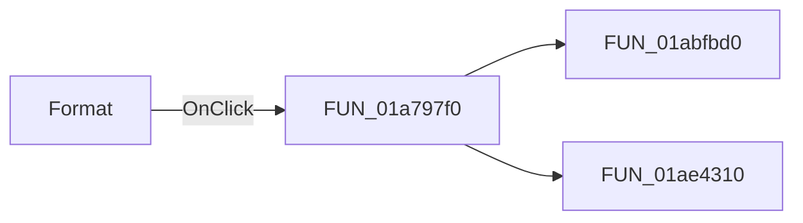

# Format

> Analysis status: Pending individual source review.

## Control

| Property | Recovered value |
| --- | --- |
| Form | DFWindow |
| Component path | DFWindow.CursorPanel.Notebook1.Nyquist.FormatRG |
| Control class | TRadioGroup |
| Caption | Format |
| Hint | Not present in the recovered resource. |
| Text | Not present in the recovered resource. |
| Handler name | FormatRGClick |
| Handler address | 01a797f0 |
| Graph node | `resource:dfm:DFWindow/DFWindow.CursorPanel.Notebook1.Nyquist.FormatRG` |
| Handler node | `function:01a797f0` |
| Graph layer | UI |

## What happens when clicked

Pending individual analysis. An agent must read the recovered handler source and its relevant callees before it replaces this text.

## Click flow

## Handler evidence

- Source: [DecompiledSources/Tina16/functions/0000000001A797F0__FUN_01a797f0.c](../../../DecompiledSources/Tina16/functions/0000000001A797F0__FUN_01a797f0.c)
- Recovered role: Not present in the recovered resource.
- Current graph summary: Handles 1 Delphi UI event: DFWindow.CursorPanel.Notebook1.Nyquist.FormatRG.OnClick.
- Current graph behavior: Not present in the recovered resource.
- Current graph evidence: Not present in the recovered resource.
- Complexity: moderate
- Distinct outgoing calls: 2

## Direct calls

- `function:01abfbd0` — FUN_01abfbd0
- `function:01ae4310` — FUN_01ae4310

## Resource evidence

- Kind: Not present in the recovered resource.
- Modal result: Not present in the recovered resource.
- Checked state: Not present in the recovered resource.
- List items: ("Re/Im", "Mag/Ph (°)")
- Image reference: Not present in the recovered resource.
- Extracted glyph: None.

## Nearby label candidates

Nearby labels are layout candidates only. They are not proof of behavior.

- No same-parent label candidate is available.

## Analysis limits

- Do not infer behavior from the control class, caption, hint, glyph, or nearby label alone.
- Do not replace the pending status until the handler source and relevant call path provide enough evidence.
