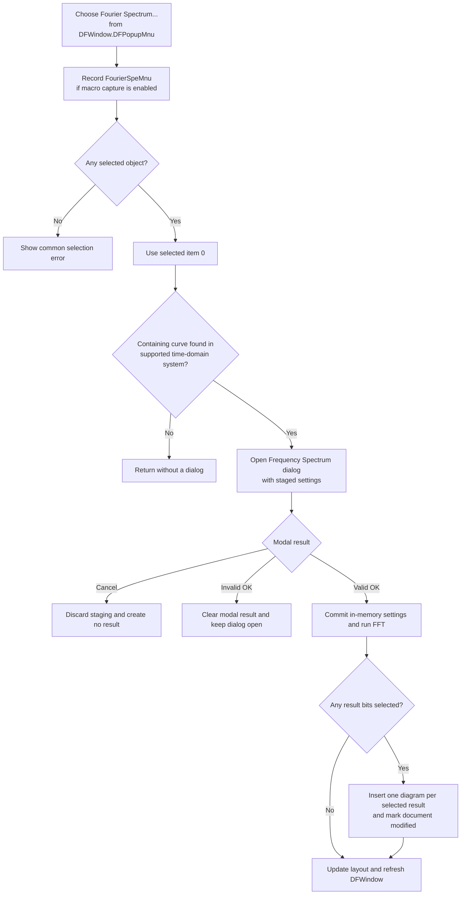

# Create a Fourier spectrum from the current selection through the popup menu

> Analysis status: Evidence-backed from the recovered popup resource, unique wrapper, shared dispatcher, Frequency Spectrum dialog, FFT path, and result insertion.

## Control

| Property | Recovered value |
| --- | --- |
| Form | DFWindow |
| Popup path | DFPopupMnu > Fourier Spectrum... |
| Component path | DFWindow.DFPopupMnu.FourierSpeMnu |
| Control class | TMenuItem |
| Caption | Fourier Spectrum... |
| Hint | Not present in the recovered resource. |
| Text | Not present in the recovered resource. |
| Handler name | FourierSpeMnuClick |
| Handler address | `01a7a8b0` |
| Graph node | `resource:dfm:DFWindow/DFWindow.DFPopupMnu.FourierSpeMnu` |
| Handler node | `function:01a7a8b0` |
| Handler graph layer | UI |

## Popup-specific route

The recovered form places this item directly under `DFWindow.DFPopupMnu`. Choosing it calls [`FUN_01a7a8b0`](../../../DecompiledSources/Tina16/functions/0000000001A7A8B0__FUN_01a7a8b0.c).

This wrapper is not the main-menu handler from Bead `.296`. It records macro token `FourierSpeMnu`; the main Processing-menu wrapper records `DFFourierSpectrumMnu`. Both wrappers then pass DFWindow's diagram model at form offset `+0x798` and literal mode `0` to [`FUN_01ad6030`](../../../DecompiledSources/Tina16/functions/0000000001AD6030__FUN_01ad6030.c). Mode `0` selects Frequency Spectrum instead of Fourier Series.

The popup wrapper does not inspect `Sender`, popup coordinates, or a clicked diagram object. The current diagram selection supplies the input. The recovered resource does not identify which visual surface opens `DFPopupMnu`, so this article does not assign it to a specific canvas or mouse button.

## Selection and domain checks

The `.295`-owned dispatcher rebuilds the selected-object list through [`FUN_01acff30`](../../../DecompiledSources/Tina16/functions/0000000001ACFF30__FUN_01acff30.c). It then uses only selected item `0`, even when more objects are selected.

The dispatcher scans the diagram's coordinate systems until it finds one whose curve-member collection contains this first object. It opens the spectrum dialog only when that containing coordinate system has type byte `0` at offset `+0x58`. The later code samples the curve across its X interval and treats X as time, which identifies this as the supported time-domain path. It passes the selected member's data reference at `+0xE0` and data provider at `+0xC8` to the dialog.

The initial no-result paths are:

- No selected objects: show the common localized selection error and return.
- First selected object not found in a curve collection: return without a dialog or message.
- Containing coordinate-system type not supported by this path: return without a dialog or message.

The wrapper receives no success result. Its macro-event attempt has already occurred before any of these checks.

## Frequency Spectrum dialog

[`FUN_0114e6b0`](../../../DecompiledSources/Tina16/functions/000000000114E6B0__FUN_0114e6b0.c) reads the selected curve's available X bounds, adjusts the saved sampling interval, creates `TFrequencySpectrumDlg`, and shows it modally. [`FUN_0114c7f0`](../../../DecompiledSources/Tina16/functions/000000000114C7F0__FUN_0114c7f0.c) initializes private staged settings and these recovered inputs:

| Setting | Recovered choices or use |
| --- | --- |
| Start and end time | Sampling interval within the selected curve's available X bounds. |
| Samples | `128` through `65536`, represented by exponent `7` through `16`. |
| Minimum and maximum frequency | Output FFT-bin interval. |
| Window | Uniform, Hanning, Flattop, Blackman, Hamming, or Bartlet. |
| Phase correction | Enables the recovered post-FFT correction. |
| Scale | Linear, Linear-dB, or Logarithmic. |
| Mode | Spectral density or Spectrum. |
| Result diagrams | Complex Amplitude, Phase, Real part, Imaginary part, Energy spectrum, and Amplitude. |

For this selected-curve route, the output selector is fixed to that curve and disabled. The transient-initial-condition control is also disabled. The dialog has no harmonic-count input; the sample count fixes the FFT size, and the frequency fields select the output bins.

## Accept, cancel, and validation

The built-in Cancel button closes the dialog without calling the OK handler. It does not commit the private staged settings, calculate a spectrum, insert a result diagram, or mark the document modified. The earlier popup macro event is not rolled back.

[`FUN_0114cc80`](../../../DecompiledSources/Tina16/functions/000000000114CC80__FUN_0114cc80.c) handles OK. It reads the controls into the private settings block and rebuilds the six-bit result mask. On a validation error, it clears the modal result, does not copy the staged block, does not start the transform, clears the error latch, and leaves the dialog open.

The recovered float-edit checks require a nonnegative start, an end after the start, sampling bounds within the selected curve's available interval, and an ordered nonnegative frequency range within the FFT limit. A maximum frequency above the calculated limit is clamped to that limit. Only an error-free OK copies the staged block to the shared in-memory Fourier settings and starts the calculation.

## Sampling, windowing, and FFT

[`FUN_0114d810`](../../../DecompiledSources/Tina16/functions/000000000114D810__FUN_0114d810.c) allocates `2^exponent` complex samples and interpolates the selected curve at uniform time intervals. It applies the selected window and runs the recovered in-place radix-2 FFT. When selected, it applies phase correction. [`FUN_0114d430`](../../../DecompiledSources/Tina16/functions/000000000114D430__FUN_0114d430.c) maps the requested frequency limits to FFT-bin indices, caps the output at `N / 2`, applies Spectrum or spectral-density normalization, and stores the resulting spectrum provider on the dialog.

The coordinator inserts results only when the modal result is `1`. Cancel and an invalid OK therefore cannot reach result insertion.

## Result diagrams and document state

On accepted OK, [`FUN_013d99f0`](../../../DecompiledSources/Tina16/functions/00000000013D99F0__FUN_013d99f0.c) examines the six-bit result mask. Each selected bit creates one incrementally named diagram:

- `Fourier - Complex AmplitudeN`
- `Fourier - PhaseN`
- `Fourier - Real partN`
- `Fourier - Imaginary partN`
- `Fourier - PowerN`
- `Fourier - AmplitudeN`

Each result receives an `Analysis Result 1` curve, the generated spectrum provider, and current display and axis attributes. [`FUN_01cec150`](../../../DecompiledSources/Tina16/functions/0000000001CEC150__FUN_01cec150.c) inserts each diagram and sets the document modified byte at offset `+0x40` to `1`. After the requested diagrams are processed, the result helper updates the page layout and refreshes DFWindow.

If all six output boxes are clear, a valid OK can commit the settings and complete the transform without inserting a diagram. In that case this path does not call the insertion helper and therefore does not set the modified byte through this route. Repeated accepted runs can add more diagrams and advance the recovered name counters.

## Persistence and failure boundaries

- Accepted dialog settings are copied to a shared in-memory Fourier settings block for later spectrum sessions. This click path does not write those settings to an INI file.
- Inserted diagrams change the live analysis-result document and set its modified flag. The path does not call a document or file serializer; a later Save command is required for file persistence.
- Macro recording, when enabled, records `FourierSpeMnu` before selection validation. It is not an undo record and does not prove that a result was created.
- There is no local exception handler, retry, or rollback around calculation or insertion. An allocation or FFT error can occur after settings commit. An insertion error can leave some requested diagrams inserted and the document marked modified while later results are missing.
- The exact final presentation of an unhandled calculation or insertion exception is outside the recovered path.

## Click flow

## Recovered function roles

- [`FUN_01a7a8b0`](../../../DecompiledSources/Tina16/functions/0000000001A7A8B0__FUN_01a7a8b0.c) is the unique popup wrapper. It records `FourierSpeMnu` and selects Spectrum mode `0`.
- [`FUN_01ad6030`](../../../DecompiledSources/Tina16/functions/0000000001AD6030__FUN_01ad6030.c) selects the first supported current curve member and dispatches Series or Spectrum. Bead `.295` owns its canonical annotation.
- [`FUN_0114e6b0`](../../../DecompiledSources/Tina16/functions/000000000114E6B0__FUN_0114e6b0.c), [`FUN_0114c7f0`](../../../DecompiledSources/Tina16/functions/000000000114C7F0__FUN_0114c7f0.c), [`FUN_0114cc80`](../../../DecompiledSources/Tina16/functions/000000000114CC80__FUN_0114cc80.c), [`FUN_0114d810`](../../../DecompiledSources/Tina16/functions/000000000114D810__FUN_0114d810.c), and [`FUN_0114d430`](../../../DecompiledSources/Tina16/functions/000000000114D430__FUN_0114d430.c) implement the canonical Spectrum dialog and calculation path documented by Bead `.296`.
- [`FUN_013d99f0`](../../../DecompiledSources/Tina16/functions/00000000013D99F0__FUN_013d99f0.c) creates the selected result diagrams, and [`FUN_01cec150`](../../../DecompiledSources/Tina16/functions/0000000001CEC150__FUN_01cec150.c) inserts them and marks the document modified.

## Resource evidence and limits

- `DFWindow.DFPopupMnu.FourierSpeMnu` has caption `Fourier Spectrum...` and binds `OnClick` to `FourierSpeMnuClick` at `01a7a8b0`.
- The main Processing-menu control has the same caption but resolves to unique wrapper `01a84600`.
- The popup item has no recovered hint, action, checked state, image reference, glyph, or same-parent label candidate.
- `DFPopupMnu` has no recovered `OnPopup` handler. The available evidence does not prove which surface opens it or whether another path changes this item's enabled or visible state before display.
- The original Delphi enum names and exact localized error strings are not recovered. The article uses observed offsets and data flow where names are unavailable.
- No live UI test was performed.
