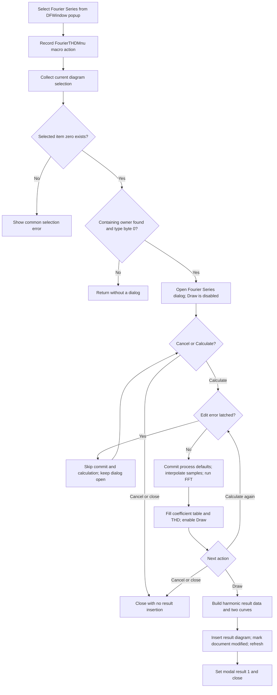

# Calculate a Fourier Series from the first supported selected curve

> Analysis status: Source reviewed through the popup handler, shared selection
> dispatcher, Fourier Series dialog, calculation, Draw insertion, and
> persistence boundaries.

## Control

| Property | Recovered value |
| --- | --- |
| Form | DFWindow |
| Component path | DFWindow.DFPopupMnu.FourierTHDMnu |
| Control class | TMenuItem |
| Caption | Fourier Series... |
| Hint | Not present in the recovered resource. |
| Text | Not present in the recovered resource. |
| Handler name | FourierTHDMnuClick |
| Handler address | `01a7a800` |
| Graph node | `resource:dfm:DFWindow/DFWindow.DFPopupMnu.FourierTHDMnu` |
| Handler node | `function:01a7a800` |
| Graph layer | UI |

## What happens when selected

[`FUN_01a7a800`](../../../DecompiledSources/Tina16/functions/0000000001A7A800__FUN_01a7a800.c)
submits the macro action `FourierTHDMnu`. It then passes the current diagram at
DFWindow offset `0x798` and constant mode `1` to the shared Fourier dispatcher,
[`FUN_01ad6030`](../../../DecompiledSources/Tina16/functions/0000000001AD6030__FUN_01ad6030.c).
Mode `1` selects Fourier Series and harmonic-distortion analysis. The main-menu
handler documented by Bead `.295` uses the same dispatcher and mode, but records
the macro action `DFFourierSeriesMnu` instead.

This popup handler does not read `Sender`, the popup position, the mouse
position, or a popup-owned curve reference. The recovered `DFPopupMnu` resource
also has no `OnPopup` handler. The command acts on the diagram selection that
already exists when the menu item is selected. The recovered source does not
prove whether an earlier right-click changes that selection.

## Selection and domain guards

The shared dispatcher rebuilds the diagram's selected-object list through
[`FUN_01acff30`](../../../DecompiledSources/Tina16/functions/0000000001ACFF30__FUN_01acff30.c).
It uses only list item zero. It scans the diagram's curve-owner collection until
it finds an owner whose member collection contains that selected object. The
owner's type byte at offset `0x58` must be zero.

The guard results are:

- No selected object: show the common localized selection-error message and
  return.
- No curve owner contains selected item zero: return without a dialog.
- The containing owner's type byte is not zero: return without a dialog.
- A supported member is found: pass its data references at offsets `0xE0` and
  `0xC8` to the Fourier Series dialog wrapper.

Additional selected objects are ignored. The source does not recover the
symbolic names of the owner type or the two data fields.

## Dialog setup

[`FUN_011439c0`](../../../DecompiledSources/Tina16/functions/00000000011439C0__FUN_011439c0.c)
reads the selected data's independent-variable bounds and uses them to constrain
the initial sampling start and base frequency. It constructs
`THarmonicDistorsionDlg`, shows it modally, and destroys it after it closes.

The dialog caption is **Fourier Series**. Its recovered controls select:

- sampling start;
- base frequency;
- a power-of-two sample count from 128 through 65,536;
- the number of harmonics;
- a coefficient format;
- an output; and
- a transient initial-condition mode.

For this selected-curve entry path, the output list is populated from the
supplied curve data and selects item zero. The output selector and transient
initial-condition control are disabled. The user can change the sampling,
harmonic-count, and coefficient-format controls, but cannot redirect this
dialog instance to another output.

## Calculate

The default **Calculate** button calls
[`FUN_01140e30`](../../../DecompiledSources/Tina16/functions/0000000001140E30__FUN_01140e30.c).
It reads the controls into the dialog's working fields. When no edit error is
latched, it also copies the start, base frequency, sample exponent, harmonic
count, output, coefficient format, and initial-condition choice to the shared
Fourier settings. These settings become defaults for a later Fourier Series
dialog in the same process. This is not a file or document save.

For this selected-data path,
[`FUN_01142a60`](../../../DecompiledSources/Tina16/functions/0000000001142A60__FUN_01142a60.c)
interpolates the selected curve onto `N` equally spaced samples, where
`N = 2^sampleExponent` and the step is `1 / (N * baseFrequency)`.
[`FUN_0113edb0`](../../../DecompiledSources/Tina16/functions/000000000113EDB0__FUN_0113edb0.c)
then runs the in-place radix-2 complex Fourier transform.

[`FUN_011423a0`](../../../DecompiledSources/Tina16/functions/00000000011423A0__FUN_011423a0.c)
normalizes the complex coefficients by `N`, fills the DC and requested harmonic
rows, applies the selected coefficient format, and updates the harmonic
distortion label. The recovered distortion calculation is:

`100 * sqrt(sum(amplitude[k]^2, k >= 2)) / amplitude[1]`

When the fundamental amplitude is zero, it writes a resource placeholder
instead of dividing by zero. A successful calculation leaves the dialog open
and enables **Draw**. Calculate alone does not insert a curve or diagram.

## Draw and document changes

[`FUN_01142fd0`](../../../DecompiledSources/Tina16/functions/0000000001142FD0__FUN_01142fd0.c)
handles **Draw**. It builds result samples for harmonic numbers zero through the
requested count and their normalized complex coefficients. It formats the base
frequency and sends the result, format, and axis text to
[`FUN_013db650`](../../../DecompiledSources/Tina16/functions/00000000013DB650__FUN_013db650.c).

The result helper creates one new diagram with two curves. The selected format
chooses these recovered names:

| Format | Diagram title base | Curve names |
| --- | --- | --- |
| `D * cos(kwt + fi)` | `FourierTHD - Amplitude (D)/Phase` | `Analysis Result 1`, `Analysis Result 2` |
| `C * exp(j * (kwt + fi))` | `FourierTHD - Amplitude (C)/Phase` | `Analysis Result 3`, `Analysis Result 4` |
| `A * cos(kwt) + B * sin(kwt)` | `FourierTHD - Real/Imaginary` | `Analysis Result 5`, `Analysis Result 6` |
| `RMS, fi` | `FourierTHD - Amplitude (rms)/Phase` | `Analysis Result 7`, `Analysis Result 8` |
| `Aeff, Beff` | `FourierTHD - Real (rms)/Imaginary (rms)` | `Analysis Result 9`, `Analysis Result 10` |

An incrementing number is appended to the title base. The result insertion path
attaches the new diagram to the current document, registers its two curves,
updates its layout, and refreshes DFWindow.
[`FUN_01cec150`](../../../DecompiledSources/Tina16/functions/0000000001CEC150__FUN_01cec150.c)
sets the document modified byte to one during insertion. Draw then sets modal
result `1`, which closes the dialog.

If the result-data pointer passed to `FUN_013db650` is null, that helper returns
without inserting a diagram. The Draw handler still sets modal result `1` and
closes. A normal result build is expected to return a nonnull object or raise an
exception; the source does not show a normal user-selectable path to null.

## Cancel, validation, and failure paths

- The Cancel button has VCL kind `bkCancel`. In this selected-data mode, its
  explicit handler does no extra work. Cancel closes the dialog without a
  result insertion.
- Calculate can update the shared Fourier defaults before a later Cancel.
  Cancel does not restore the prior defaults.
- Start-time and base-frequency validation keep values in the selected data
  domain. A float-edit error latches an error flag. Calculate with that flag
  skips the settings commit and calculation, resets the flag, and leaves the
  dialog open.
- No recovered handler in this path writes `TINA.INI` or serializes a document.
  The Fourier defaults are process state. A Draw result is an unsaved document
  modification until a separate Save command persists it.
- The selection, FFT, and insertion paths have no local exception handler,
  retry, transaction, or rollback. The recovered source does not prove how an
  unexpected error is presented or whether a partly inserted result is removed.

## Click flow

## Handler evidence

- Source: [`FUN_01a7a800`](../../../DecompiledSources/Tina16/functions/0000000001A7A800__FUN_01a7a800.c)
- Recovered role: Opens Fourier Series analysis for the current eligible
  DFWindow curve selection from the popup menu.
- Input evidence: The handler reads only DFWindow's active diagram field and
  passes mode `1`; it does not read a popup target or mouse coordinates.
- Shared-dispatch evidence: Its call to `FUN_01ad6030` matches the main-menu
  Fourier Series handler except for the recorded macro action name. Bead `.295`
  owns the canonical dispatcher annotation.
- Complexity: complex
- Distinct outgoing calls: 4

## Relevant calls

- [`FUN_01ad6030`](../../../DecompiledSources/Tina16/functions/0000000001AD6030__FUN_01ad6030.c)
  is the `.295`-owned selection and Fourier Series/Spectrum dispatcher.
- [`FUN_011439c0`](../../../DecompiledSources/Tina16/functions/00000000011439C0__FUN_011439c0.c)
  constrains the selected-data domain and manages the modal Fourier Series
  dialog lifetime.
- [`FUN_01140e30`](../../../DecompiledSources/Tina16/functions/0000000001140E30__FUN_01140e30.c)
  accepts valid Calculate inputs, updates the process defaults, and starts the
  coefficient calculation.
- [`FUN_01142fd0`](../../../DecompiledSources/Tina16/functions/0000000001142FD0__FUN_01142fd0.c)
  builds the Draw result, requests diagram insertion, and closes the dialog.
- [`FUN_013db650`](../../../DecompiledSources/Tina16/functions/00000000013DB650__FUN_013db650.c)
  creates the format-specific Fourier result diagram and two curves.
- [`FUN_01cec150`](../../../DecompiledSources/Tina16/functions/0000000001CEC150__FUN_01cec150.c)
  inserts the diagram and marks the document modified.

## Resource evidence

- `DFWindow.DFPopupMnu.FourierTHDMnu` has caption **Fourier Series...** and
  binds `OnClick` to `FourierTHDMnuClick` at `01a7a800`.
- The menu item has no hint, action, image reference, embedded glyph, explicit
  checked state, or same-parent label candidate.
- `HarmonicDistorsionDlg` has caption **Fourier Series**. Its default button is
  **Calculate**, its other action is **Draw**, and its Cancel button has VCL kind
  `bkCancel`.

## Analysis limits

- The symbolic names of the curve-owner type at `0x58` and selected-member
  fields at `0xE0` and `0xC8` are not recovered.
- The localized selection and float-edit error text is not present in the
  recovered function bodies.
- The source does not prove whether opening the popup menu itself changes the
  current selection.
- No live UI test was performed. The conclusions use the DFM binding, read-only
  graph, and recovered selection, dialog, calculation, and insertion paths.
