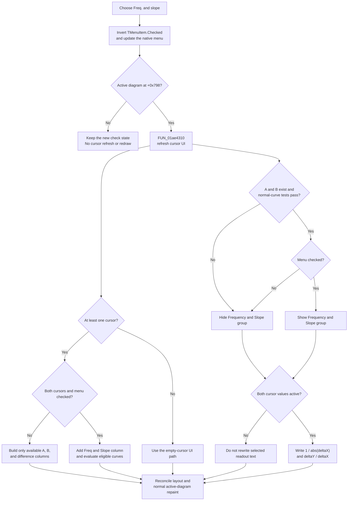

# Toggle frequency and slope cursor readouts

> Analysis status: Complete. The recovered handler toggles a live menu check and refreshes the active diagram's cursor panel. The check controls a selected-curve frequency and slope group and the corresponding column in the all-curves grid.

## Control

| Property | Recovered value |
| --- | --- |
| Form | DFWindow |
| Component path | DFWindow.DFMainMenu.DFViewMnu.FreqandslopeMnu |
| Control class | TMenuItem |
| Caption | `Freq. and slope` |
| Initial Checked state | `true` |
| Hint | Not present in the recovered resource. |
| Handler name | FreqandslopeMnuClick |
| Handler address | 01a8b0b0 |
| Graph node | `resource:dfm:DFWindow/DFWindow.DFMainMenu.DFViewMnu.FreqandslopeMnu` |
| Handler node | `function:01a8b0b0` |
| Graph layer | UI |

The DFM supplies no action, shortcut, image, or glyph for this item. The caption is not the basis for the recovered behavior. The handler data flow, cursor-panel controls, calculation helpers, and the separate slope image establish the effect.

## What the click changes

[`FUN_01a8b0b0`](../../../DecompiledSources/Tina16/functions/0000000001A8B0B0__FUN_01a8b0b0.c) reads the `TMenuItem` at `DFWindow +0xbc8` and passes the inverse of its current Checked byte at `+0x80` to [`FUN_007e2d20`](../../../DecompiledSources/Tina16/functions/00000000007E2D20__FUN_007e2d20.c). The VCL setter stores the new state and updates the owning native menu when it has a menu handle. Thus, each normal click changes checked to unchecked or unchecked to checked.

The handler then reads the active diagram or cursor manager at `DFWindow +0x798`:

- If the pointer is null, it returns after the menu check changes. No cursor-panel refresh or diagram redraw occurs in this handler.
- If the pointer is not null, it calls [`FUN_01ae4310`](../../../DecompiledSources/Tina16/functions/0000000001AE4310__FUN_01ae4310.c). This common routine reconciles cursor-page selection, control visibility, enabled state, readouts, the all-curves grid, layout, and the normal active-diagram repaint path.

The menu check is a display option. The click does not move cursor A or B, change a selected curve, change an axis, or recalculate the stored curve samples.

## Selected-curve frequency and slope group

The resource contains `DFWindow.CursorPanel.Notebook1.Normal.NormalPC.SelectedCurves.FreqSlopeGB`, captioned `Frequency and Slope`. It contains:

- `FrequencyLb`, preceded by the label `f:`.
- `SlopeLb`, preceded by a 16-by-16 arrow image that rises to the right.

The recovered published-field sequence maps the group to `DFWindow +0xca8`, `FrequencyLb` to `+0xcb8`, and `SlopeLb` to `+0xcc8`. The group is initially hidden in the DFM.

The common refresh shows this group only when all these conditions are true:

1. Cursor A exists at active-diagram offset `+0xf0`.
2. Cursor B exists at offset `+0xf8`.
3. Both cursors refer to an associated curve object at cursor offset `+0x58`.
4. Both associated objects pass the same recovered runtime-type test and their nested exclusion flags are clear.
5. The current diagram path is not one of the two special data types detected earlier in the refresh.
6. `FreqandslopeMnu.Checked` is true.

The Delphi names of the accepted curve class and the exclusion flags are not recovered. This article therefore calls this the eligible normal-curve path. A checked menu item does not by itself make the group visible.

[`FUN_01ad1740`](../../../DecompiledSources/Tina16/functions/0000000001AD1740__FUN_01ad1740.c) updates the selected-curve values when both cursor objects also have their active-value byte at `+0x91` set. It reads A and B coordinates from cursor fields `+0x78` and `+0x80` and calculates:

- `deltaX = B.x - A.x`
- `deltaY = B.y - A.y`
- `frequency = 1 / abs(deltaX)`
- `slope = deltaY / deltaX`

If `A.x` equals `B.x` exactly, this selected-curve path writes numeric zero to both `FrequencyLb` and `SlopeLb` instead of dividing by zero. Otherwise, it formats the two calculated numbers through the application's common numeric formatter and writes the label text.

The calculation helper does not test the menu check. When both active cursor values exist, it can update the two hidden labels even while the menu is unchecked. The check controls their visibility, not the cursor data or the underlying calculation inputs.

## All-curves grid

The same refresh rebuilds `MultiCurvesSG`, the string grid on the `All Curves` tab, through [`FUN_01ad31e0`](../../../DecompiledSources/Tina16/functions/0000000001AD31E0__FUN_01ad31e0.c). The column set depends on the available cursors:

- No cursor: the common refresh takes its empty-cursor path before the full grid-value rebuild. It does not invent an A, B, difference, frequency, or slope value.
- Only A or only B: the grid adds the available cursor column only.
- Both A and B: the grid adds A, B, and difference columns.
- Both A and B with this menu checked: it adds one more header, `Freq & Slope`.

For the last case, the extra header value is `1 / abs(B.x - A.x)`. Each eligible curve row evaluates that curve at both cursor X positions and writes `(yB - yA) / (B.x - A.x)` in the same extra column. It does not modify the curve.

This grid path treats `abs(B.x - A.x) < 1e-12` as undefined and writes a recovered placeholder string for frequency and per-curve slope. The exact placeholder text is not present in the exported source. This differs from the selected-curve group, which writes numeric zero only when the two X values are exactly equal.

## Units and formatting

The recovered code appends no literal `Hz`, seconds, volts, decibels, degrees, or other unit to `FrequencyLb`, `SlopeLb`, or the grid column. The numeric formatter can apply the application's engineering-number format, but the handler does not select a physical unit.

The displayed dimensions therefore follow the graph axes:

- Frequency has reciprocal X-axis units because it is `1 / abs(deltaX)`.
- Slope has Y-axis units per X-axis unit because it is `deltaY / deltaX`.

Calling the reciprocal value hertz is valid only when the X-axis values are times in seconds. The recovered handler does not prove that prerequisite for every eligible diagram.

## Click flow

## Repeated, missing, and error paths

- The handler always requests the inverse Checked value. A normal repeated click toggles the option again; it is not an unchanged-state no-op.
- With no active diagram, the new check state remains visible in the menu, but the cursor panel can keep its earlier layout until a later common refresh.
- With zero or one cursor, the selected frequency and slope group is hidden. The all-curves grid includes only the cursor columns that its rebuild can support.
- With two cursors on an excluded data type or curve class, the selected group remains hidden even when the menu is checked.
- If both cursor pointers exist but one active-value byte at `+0x91` is clear, the selected frequency and slope labels are not rewritten by `FUN_01ad1740`. Existing hidden text can remain.
- The handler has no local exception handler, error dialog, retry, or rollback. It changes Checked before it starts the common refresh. An exception in that refresh can therefore leave the menu in its new state while visibility, grid cells, labels, layout, or painting are only partly updated.
- The handler does not null-check the menu pointer at `+0xbc8`. It assumes that the DFM-created component exists.

## Redraw and persistence

The common refresh updates live VCL controls. Its normal diagram path recalculates layout and calls the common diagram painter with a clear-background request. This redraw is a consequence of the shared cursor refresh; the click handler does not call the painter directly. A recovered alternate embedded-view path refreshes that view instead.

The Checked byte and derived visibility are live form state. This handler does not call a document serializer, settings writer, registry API, database, Save command, or undo-registration helper. The DFM default is checked on a newly created form. Persistence after the form is destroyed or the application restarts is not established.

## Recovered evidence

- Main handler: [`FUN_01a8b0b0`](../../../DecompiledSources/Tina16/functions/0000000001A8B0B0__FUN_01a8b0b0.c) inverts the menu check and calls the common refresh only when an active diagram exists.
- VCL checked-state setter: [`FUN_007e2d20`](../../../DecompiledSources/Tina16/functions/00000000007E2D20__FUN_007e2d20.c) stores a changed Checked byte and publishes it to the native menu.
- Cursor UI refresh: [`FUN_01ae4310`](../../../DecompiledSources/Tina16/functions/0000000001AE4310__FUN_01ae4310.c) applies the cursor and curve prerequisites, controls `FreqSlopeGB` visibility, rebuilds cursor UI, and reaches layout and repaint.
- Selected readouts: [`FUN_01ad1740`](../../../DecompiledSources/Tina16/functions/0000000001AD1740__FUN_01ad1740.c) calculates the selected A-to-B frequency and slope and writes the two labels.
- All-curves grid: [`FUN_01ad31e0`](../../../DecompiledSources/Tina16/functions/0000000001AD31E0__FUN_01ad31e0.c) creates the cursor-dependent columns, adds `Freq & Slope`, and calculates the per-curve slope values.
- Window layout and repaint: [`FUN_01a77f90`](../../../DecompiledSources/Tina16/functions/0000000001A77F90__FUN_01a77f90.c) supplies the normal active-diagram layout and paint path used at the end of the refresh.
- [Recovered UI evidence](../../../DecompiledSources/Tina16/resources/dfm/ui-evidence.json) supplies the menu's initial check, `FreqSlopeGB`, `FrequencyLb`, `SlopeLb`, `MultiCurvesSG`, and their captions.
- [Extracted glyph manifest](../../../glyph/manifest.json) maps the 16-by-16 rising-arrow image to `FreqSlopeGB.Image1`.

## Analysis limits

- The private Delphi names of the cursor manager, accepted runtime type, and exclusion flags are not recovered. The article states their observed tests and does not assign domain names to them.
- The exact undefined-value placeholder in the all-curves grid is not recovered as text.
- The shared refresh and calculation helpers serve other cursor controls. The annotation fragment owns only the unique `FreqandslopeMnuClick` handler.
- No proprietary UI action was executed. The findings use the DFM binding, extracted image, read-only graph, recovered handler, data flow, and shared caller context.
