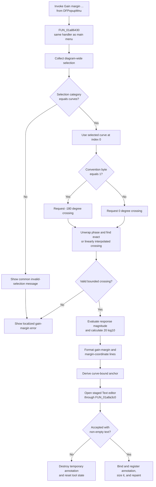

# Calculate and annotate gain margin from the popup menu

> Analysis status: Complete. This popup command uses the same handler and calculation path as the main-menu Gain Margin command.

## Control

| Property | Recovered value |
| --- | --- |
| Form | DFWindow |
| Component path | DFWindow.DFPopupMnu.GainmarginPuMnu |
| Control class | TMenuItem |
| Parent | DFWindow.DFPopupMnu (`TPopupMenu`) |
| Caption | Gain  margin ... |
| Hint | Not present in the recovered resource. |
| Handler name | DFGainMarginMnuClick |
| Handler address | 01a86430 |
| Graph node | `resource:dfm:DFWindow/DFWindow.DFPopupMnu.GainmarginPuMnu` |
| Handler node | `function:01a86430` |
| Graph layer | UI |

## Popup invocation

The DFM binds `GainmarginPuMnu.OnClick` directly to `DFGainMarginMnuClick` at `01a86430`. The [main-menu Gain Margin item](dfgainmarginmnu-68bff0c128.md) has the same handler. There is no popup-specific wrapper, action binding, or source flag. The handler therefore runs the same calculation, messages, and annotation editor for both menu items.

The parent `DFPopupMnu` has no recovered `OnPopup` or other DFM event. The popup resource does not prove which mouse action or owner control displays it. This article starts when the user invokes this menu item. The item has no explicit Enabled or Visible property in the recovered resource. Regardless of how the menu is opened or prepared, the click handler performs its own selected-curve checks before it calculates a result.

## Selected-curve guards

`FUN_01a86430` passes the active diagram at DFWindow field `+0x798` to `FUN_01ae6af0`. That wrapper clears both numeric outputs, collects selected diagram objects, and requires selection category `2`. Other DFWindow paths establish category `2` as the curve category.

- A mixed selection fails because the classifier ORs the categories of all selected objects.
- A category-`2` selection can contain more than one curve. The wrapper uses only selected-list index `0` and ignores later curves.
- The first selected object must have the recovered curve class.
- The selected curve must supply a usable requested-phase crossing.

When the category is not `2`, the wrapper shows the common invalid-selection message. It then returns false, so the handler also shows localized `DrawWind.GainMarginError`. This path can show two messages and creates no annotation.

A category-`2` selection with a wrong first-object class, or a curve without a valid crossing, does not show the common selection message. The handler still shows `DrawWind.GainMarginError` and creates no annotation.

## Phase crossing and interpolation

The handler chooses its target from a recovered application convention byte. Byte value `1` requests `-180` degrees. Every other value requests `0` degrees. The semantic name of this setting is not recovered.

The `.297` calculation chain uses `FUN_01abe9a0` and `FUN_01abe490`:

1. A temporary adapter exposes the selected curve's complex samples in provider order.
2. Each sample phase is converted to degrees.
3. Phase jumps greater than 180 degrees are unwrapped by a multiple of 360 degrees.
4. An exact target-phase sample returns its horizontal coordinate.
5. Otherwise, the scanner finds the first adjacent pair on opposite sides of the target.
6. It checks the bracket against the provider's recovered domain bounds and linearly interpolates the crossing coordinate.

The search returns the first accepted crossing. It does not ask the user to choose when more than one crossing exists. A missing exact or bounded bracketed crossing returns failure.

At the accepted coordinate, `FUN_01abe9a0` evaluates the complex response, calculates `sqrt(real^2 + imaginary^2)`, and calculates `20 * log10(magnitude)` for a positive magnitude. A non-positive magnitude uses the recovered zero fallback.

The handler does not negate this decibel result and does not calculate a reciprocal reserve. Thus the proven displayed number is the response magnitude in decibels at the requested phase crossing, although the UI labels it as gain margin.

## Result text and annotation

On success, the handler creates two localized lines:

- `DrawWind.GainMargin` followed by the calculated decibel value;
- `DrawWind.MFreqTxt` followed by the interpolated horizontal coordinate.

The source adds no explicit `Hz` suffix or frequency-unit conversion. The coordinate stays in the selected curve provider's horizontal-axis units.

The handler recollects selection index `0` and derives a curve-bound annotation anchor. In the normal provider branch, the crossing is the horizontal coordinate and the provider supplies the vertical coordinate. A special recovered provider class maps the crossing to both coordinates.

The `.293`-owned helper `FUN_01a8a3c0` creates a temporary system-text object and opens `CSysTextDlg`, the common **Text** editor, with staged text and style values.

- Cancel result `2` destroys the temporary object and resets the DFWindow tool-state byte to `0`.
- A non-Cancel result with no text lines has the same discard result.
- A non-Cancel result with text copies the staged values, binds the object to the selected curve and anchor coordinates, registers it in the active diagram, finalizes it, calculates its display size, repaints its rectangle, and sets the tool-state byte to `6`.

Each accepted invocation creates a new annotation. The handler does not find or replace an existing gain-margin annotation, so repeated popup use can add duplicate result annotations.

## Popup-command flow

## Document, no-op, and error boundaries

- Invalid selection, wrong first-object class, and a missing phase crossing do not create an annotation.
- Cancel and accepted empty text also leave the diagram without a new annotation.
- A successful result changes the live active diagram by adding one text object. This click path has no file-save, INI-write, database-write, or explicit document serialization call. A later normal document save can persist the object.
- There is no explicit undo-stack or rollback call. The recovered macro recorder is not called by this handler.
- The handler has no explicit active-diagram null guard before selection collection. Normal menu-state preparation can limit command use, but this handler does not rely on that state for correctness.
- The handler and calculation helpers have no local exception handler. An allocation, provider, calculation, dialog, or registration exception can propagate to higher-level Delphi handling. If registration fails after the temporary object or staged values change, the source has no transactional rollback.
- The popup parent has no recovered opening event, so no popup-specific error or cancel path exists before this OnClick handler.

## Recovered evidence

- Shared popup and main-menu handler: [`FUN_01a86430`](../../../DecompiledSources/Tina16/functions/0000000001A86430__FUN_01a86430.c) chooses the phase target, formats both result lines, derives the anchor, and invokes the shared annotation editor.
- `.297` curve-selection wrapper: [`FUN_01ae6af0`](../../../DecompiledSources/Tina16/functions/0000000001AE6AF0__FUN_01ae6af0.c) requires curve-selection category `2`, checks the first object, and returns calculation success.
- `.297` curve-data wrapper: [`FUN_01ab56b0`](../../../DecompiledSources/Tina16/functions/0000000001AB56B0__FUN_01ab56b0.c) passes the selected curve data to the gain-margin calculator.
- `.297` gain calculation: [`FUN_01abe9a0`](../../../DecompiledSources/Tina16/functions/0000000001ABE9A0__FUN_01abe9a0.c) evaluates response magnitude at the requested phase crossing and converts it to decibels.
- `.297` crossing scanner: [`FUN_01abe490`](../../../DecompiledSources/Tina16/functions/0000000001ABE490__FUN_01abe490.c) unwraps phase and finds an exact or interpolated bounded crossing.
- `.293` annotation owner: [`FUN_01a8a3c0`](../../../DecompiledSources/Tina16/functions/0000000001A8A3C0__FUN_01a8a3c0.c) stages, rejects, or commits the curve-bound system-text annotation.
- Selection classifier: [`FUN_01acff30`](../../../DecompiledSources/Tina16/functions/0000000001ACFF30__FUN_01acff30.c) collects all selected diagram objects and returns their combined category.
- Recovered component tree: [`ui-evidence.json`](../../../DecompiledSources/Tina16/resources/dfm/ui-evidence.json) confirms that both menu items bind to `DFGainMarginMnuClick` at `01a86430` and that `DFPopupMnu` has no event binding.

## Resource evidence and analysis limits

- The popup caption is `Gain  margin ...`, with two spaces and lowercase `margin`. The main-menu caption is `Gain Margin ...`. The ellipsis agrees with the proven Text-editor step, but the source path proves that behavior.
- The popup item has no hint, text, action, checked state, image-list reference, embedded glyph, or same-parent label candidate.
- The translated strings for `DrawWind.GainMargin`, `DrawWind.MFreqTxt`, `DrawWind.GainMarginError`, and the common invalid-selection message are not present in the recovered source.
- The recovered source does not name the phase-convention byte, curve data fields, horizontal-axis unit, or special provider class.
- A live popup-menu test was not performed. The DFM binding, graph neighborhood, and shared recovered call path agree on the result.
