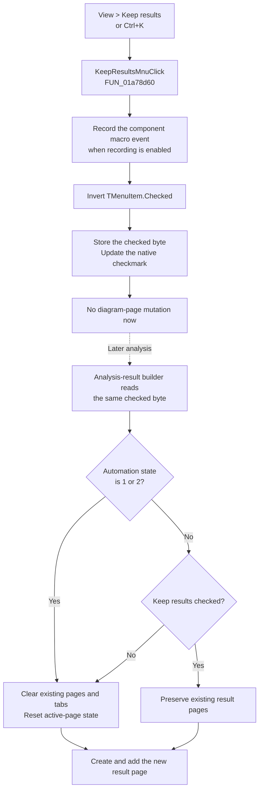

# Keep or replace analysis-result pages

> Analysis status: Complete. The recovered click handler, menu setter, form initialization, settings calls, page reset, and 23 downstream analysis-result builders establish the behavior.

## Control

| Property | Recovered value |
| --- | --- |
| Form | `DFWindow` (`TDFWindow`) |
| Component path | `DFWindow.DFMainMenu.DFViewMnu.KeepResultsMnu` |
| Menu path | **View > Keep results** |
| Control class | `TMenuItem` |
| Caption | `Keep results` |
| Initial checked state | `true` |
| Shortcut | `Ctrl+K` (`ShortCut = 16459`) |
| Handler name | `KeepResultsMnuClick` |
| Handler address | `01a78d60` |
| Graph node | `resource:dfm:DFWindow/DFWindow.DFMainMenu.DFViewMnu.KeepResultsMnu` |
| Handler node | `function:01a78d60` |
| Graph layer | UI |

The resource has no hint, action, glyph, or embedded image. The retention behavior below comes from the recovered code, not from the caption alone.

## What happens when clicked

`FUN_01a78d60` reads the `Checked` byte of the `KeepResultsMnu` object at `TDFWindow + 0x8a0`, inverts it, and passes the new value to the recovered `TMenuItem.Checked` setter `FUN_007e2d20`.

The setter stores the changed byte and updates the owning native menu when one exists. `KeepResultsMnu` is not a recovered radio item, so this command does not select one exclusive option from a group. Each successful click alternates the state:

- checked becomes unchecked;
- unchecked becomes checked.

Before it changes the checkmark, the handler builds the stable macro identifier for `KeepResultsMnu` and passes it to the shared macro-event recorder. The recorder emits a `MacroEvent(1100, ...)` entry only while macro recording is enabled. This is automation evidence, not settings persistence.

The handler does not inspect the current diagram, clear a page, add a page, run an analysis, select a tab, or request a repaint. Its immediate application effect is limited to the menu item's session-resident checked state and its native checkmark.

## Downstream result-retention policy

Twenty-three recovered analysis-result builders read this exact menu item through the global `TDFWindow` instance before they create a result group. The paths include transient and digital-transient results, poles-and-zeros results, XY plots, and other recovered result builders in the `013d2f60` through `013e5a30` range.

On their normal path:

- **Unchecked:** the builder calls `FUN_01cec530` before it creates the new result. That helper destroys every existing page in the primary diagram collection, clears the page tabs, sets the selected tab and document page index to `-1`, nulls the active diagram pointer, and resets the document name. The builder then creates and adds its new result page. Thus the new analysis replaces the existing result-page set.
- **Checked:** the builder normally skips that reset, creates a new result group, and adds it to the existing page collection. Existing result pages remain available while the new result is added.

The check is a retention policy, not a guarantee that every attempted analysis adds a page. A specific builder can return before it evaluates the setting, reuse an existing compatible result object, or fail later in its own analysis path.

## Automation override

The same 23 builders also read a one-byte state from the global macro/automation manager through `FUN_01aecdf0`. If this byte has value `1` or `2`, they clear the old result pages even when **Keep results** is checked. The recovered code establishes those two override values, but it does not give their Delphi enumeration names in this call path.

Therefore, checked means “retain results on the normal interactive builder path.” It does not override the two recovered automation states.

## Lifetime and persistence

The runtime target is the `TMenuItem.Checked` byte itself. The handler does not copy the value to the diagram document, an analysis object, an application-settings model, or an INI key. Downstream builders read the menu object directly.

The DFM resource initializes the item as checked. `TDFWindow.FormCreate` reads the `Vector style`, `WinWidth`, `WinHeight`, `WinLeft`, and `WinTop` settings, but it does not read a Keep Results value. `TDFWindow.FormDestroy` writes only the four window-geometry settings. No recovered `TDFWindow` settings call reads or writes `KeepResultsMnu` or a corresponding Boolean.

The choice therefore lasts for the lifetime of the current `TDFWindow` instance. A newly constructed form starts checked again from the DFM resource. The click does not write `TINA.INI`, the diagram document, or another persistent store.

## Repeated clicks and failures

- Repeated successful clicks alternate the checked state. The setter receives the inverse of the current value, so this handler has no unchanged-state branch during normal use.
- There is no confirmation and no disabled-state or missing-document guard in the handler. The VCL event dispatch is expected to supply a valid form and menu item.
- The handler has no local exception handler, error message, or rollback path.
- Macro identifier construction and recording run before the checked-state setter. An exception in that earlier path prevents the toggle.
- The menu setter stores the new checked byte before it publishes the change to a native menu. The recovered caller does not inspect a return value or perform a repair if publication fails.
- Changing the checkmark after an analysis has completed does not remove or restore any current page. The new value is consumed only by a later result-builder path.

## Click and later-analysis flow

## Evidence

- [Click handler `FUN_01a78d60`](../../../DecompiledSources/Tina16/functions/0000000001A78D60__FUN_01a78d60.c) records the macro event and passes the inverse of the current checked byte to the menu setter.
- [Menu checked-state setter `FUN_007e2d20`](../../../DecompiledSources/Tina16/functions/00000000007E2D20__FUN_007e2d20.c) stores a changed `Checked` byte and publishes it to the native menu. Its canonical annotation belongs to `TIARA-diz.6.7.140`.
- [Macro component-identifier builder `FUN_01aee720`](../../../DecompiledSources/Tina16/functions/0000000001AEE720__FUN_01aee720.c) includes form identity and `KeepResultsMnu`; [macro-event recorder `FUN_01aed550`](../../../DecompiledSources/Tina16/functions/0000000001AED550__FUN_01aed550.c) constructs the event and sends it to the active recorder.
- [Transient result builder `FUN_013d2f60`](../../../DecompiledSources/Tina16/functions/00000000013D2F60__FUN_013d2f60.c), [poles-and-zeros builder `FUN_013e0a40`](../../../DecompiledSources/Tina16/functions/00000000013E0A40__FUN_013e0a40.c), and [XY result builder `FUN_013e5360`](../../../DecompiledSources/Tina16/functions/00000000013E5360__FUN_013e5360.c) show representative uses of the shared retention condition. A recovered-source search finds 23 builders with the same `KeepResultsMnu.Checked`, automation-state, and reset call path.
- [Automation-state reader `FUN_01aecdf0`](../../../DecompiledSources/Tina16/functions/0000000001AECDF0__FUN_01aecdf0.c) returns manager byte `+0x19`; the builders' bit test selects values `1` and `2` as reset overrides.
- [Document reset `FUN_01cec530`](../../../DecompiledSources/Tina16/functions/0000000001CEC530__FUN_01cec530.c) destroys the primary page collection and resets the document, tab, selection, and active-diagram state. Its canonical annotation belongs to `TIARA-diz.6.7.278`.
- [Form creation `FUN_01a72620`](../../../DecompiledSources/Tina16/functions/0000000001A72620__FUN_01a72620.c) shows the settings keys read by `TDFWindow`; [form destruction `FUN_01a72e30`](../../../DecompiledSources/Tina16/functions/0000000001A72E30__FUN_01a72e30.c) shows the settings keys written.
- DFM default, shortcut, event binding, component class, and caption: [ui-evidence.json](../../../DecompiledSources/Tina16/resources/dfm/ui-evidence.json).

## Analysis limits

- The two automation-state values are proven, but their original Delphi enumeration names are not recovered here.
- This article does not assign detailed analysis names to all 23 builders. Their shared checked-state and reset data flow is sufficient to establish the retention policy.
- A live UI test was not performed. The DFM resource, handler, VCL setter, form settings paths, page-reset helper, and repeated downstream readers agree on the documented behavior.
