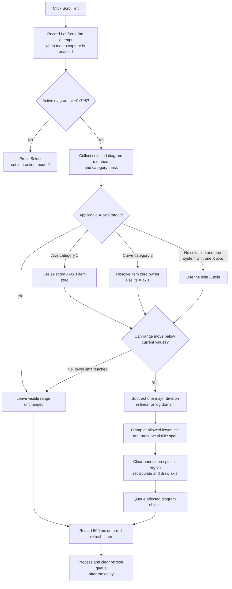

# Move the active X-axis view toward lower values

> Analysis status: Recovered resource, target-axis selection, exact linear and logarithmic step, lower-bound clamp, immediate and deferred redraw, repeat behavior, and persistence and error boundaries reviewed.

## Control

| Property | Recovered value |
| --- | --- |
| Form | DFWindow |
| Component path | DFWindow.DFToolPanel.ToolNoteBook.Diagram.LeftScrollBtn |
| Control class | TSpeedButton |
| Caption | Not present in the recovered resource. |
| Hint | Scroll left |
| Text | Not present in the recovered resource. |
| Handler name | LeftScrollBtnClick |
| Handler address | 01a79e40 |
| Graph node | `resource:dfm:DFWindow/DFWindow.DFToolPanel.ToolNoteBook.Diagram.LeftScrollBtn` |
| Handler node | `function:01a79e40` |
| Graph layer | UI |

## What happens when clicked

[`FUN_01a79e40`](../../../DecompiledSources/Tina16/functions/0000000001A79E40__FUN_01a79e40.c) records an attempted `LeftScrollBtn` macro event and then checks DFWindow's active-diagram field at `+0x798`.

When a diagram exists, it calls [`FUN_01ae2ab0`](../../../DecompiledSources/Tina16/functions/0000000001AE2AB0__FUN_01ae2ab0.c). This shared operation chooses an applicable X axis, decreases its visible interval, queues the affected diagram objects, and starts a 500 ms deferred refresh. The command does not translate curve sample data or move the diagram canvas object. It changes the live X-axis view.

The hint `Scroll left` and the 9-by-9 left-arrow glyph support the direction. The source proves that left means lower X values: both visible endpoints decrease by the same scale-aware step.

## Which X axis is affected

[`FUN_01acff30`](../../../DecompiledSources/Tina16/functions/0000000001ACFF30__FUN_01acff30.c) collects the current selection and returns its combined category mask. The shared scroll helper uses these exact cases:

- For a pure axis selection, category `1`, it scrolls item zero only when the axis orientation is one of the recovered X-axis orientations `0`, `4`, or `6`. A selected Y-axis orientation does not pass this test.
- For a pure curve selection, category `2`, [`FUN_01ad1090`](../../../DecompiledSources/Tina16/functions/0000000001AD1090__FUN_01ad1090.c) resolves the owning coordinate system. The helper then scrolls that curve's X-axis object. The recovered object layout selects field `+0xf8` or `+0xe8` according to the coordinate-system type.
- With no selection, category `0`, the operation runs only when the diagram has exactly one coordinate system and that system has exactly one X axis in collection `+0x70`. It scrolls that sole X axis.
- Mixed selections and other category values do not select an axis in this function.

Multiple selected axes are not processed as a group. The category-1 path uses only selection item zero. Multiple selected curves can produce category `2`, but the recovered helper resolves its target from item zero rather than scrolling every selected curve's axis.

## Exact range step

[`FUN_01cd3ef0`](../../../DecompiledSources/Tina16/functions/0000000001CD3EF0__FUN_01cd3ef0.c) invokes [`FUN_01cd3cd0`](../../../DecompiledSources/Tina16/functions/0000000001CD3CD0__FUN_01cd3cd0.c) for the chosen axis. The axis fields are:

- visible lower endpoint at `+0xb8`;
- visible upper endpoint at `+0xc0`;
- allowed lower limit at `+0xc8`;
- scale mode at `+0x70`; and
- major-division count at `+0x74`.

For Linear, Linear-dB, and recovered internal mode `3`, the step is:

`step = (visible upper - visible lower) / major-division count`

The helper subtracts this step from both visible endpoints. The interval width therefore stays unchanged.

For Logarithmic mode `2`, the helper converts both endpoints to the logarithmic domain, subtracts one divided log-span, and converts the results back. The visible ratio stays unchanged rather than the numeric difference.

If the provisional lower endpoint would cross the allowed lower limit, the helper sets the visible lower endpoint to that limit and moves the upper endpoint by the same effective amount. When the lower endpoint is already at the limit, another click produces zero movement. The range helper does not update the allowed limit pair at `+0xc8`/`+0xd0`, the division count, curve data, or a recovered automatic-range option.

## Drawing and repeated clicks

When the range moves, `FUN_01cd3ef0` clears an orientation-specific display rectangle with white, then calls the axis recalculation and drawing methods. This gives an immediate axis update without a full diagram redraw on every click.

`FUN_01ae2ab0` adds the target X axis and, on the sole-axis fallback, the non-null cursor objects to the refresh queue without adding duplicates. When it resolves an owning coordinate system, it also redraws the first recovered grid/display member at `+0x88` when that member exists. The helper then disables the existing timer, sets its interval to 500 ms, installs [`FUN_01ae5d60`](../../../DecompiledSources/Tina16/functions/0000000001AE5D60__FUN_01ae5d60.c), and enables the timer again. The callback disables the timer and calls [`FUN_01ae5650`](../../../DecompiledSources/Tina16/functions/0000000001AE5650__FUN_01ae5650.c), which performs type-specific recalculation or redraw and clears the queue.

Each repeated click can therefore move the range by one more division until it reaches the lower limit. Each click also restarts the 500 ms delay, so a sequence of clicks postpones the deferred refresh until 500 ms after the last activation. The source does not show an automatic-repeat property on this speed button; repeated movement requires repeated click or keyboard events.

## No-diagram and no-op paths

If no active diagram exists, the handler presses DFWindow's Select speed button at `+0xa90` and calls [`FUN_01a794b0`](../../../DecompiledSources/Tina16/functions/0000000001A794B0__FUN_01a794b0.c). The Select handler sets interaction mode `+0x7a8` to zero. No axis range or display object is accessed on this branch.

With an active diagram, the following cases produce no proven range change:

- no selection when the diagram does not have exactly one coordinate system with exactly one X axis;
- a selected Y axis or another unsupported axis orientation;
- a mixed or unsupported selection category;
- an unresolved curve owner;
- a scale mode outside recovered values `0` through `3`; or
- an X-axis range that is already at its allowed lower limit.

The shared helper still resets the 500 ms timer after its selection branches. A no-range-change click can therefore still schedule an empty or previously queued deferred-refresh pass. Macro recording also occurs before these guards, so an attempted command can be recorded even when no range moves.

## Persistence, undo, and errors

The click path changes live axis endpoint fields. It does not call the known `FUN_01add6f0` ManualScale serializer, save the document, write settings, set a recovered modified flag, or register an undo operation. Persistence of this view change by a later command is not established.

The handler and helpers have no local exception handler, error dialog, or rollback. Range changes and immediate drawing occur before the deferred timer completes. A later drawing or queue-processing failure can therefore leave the new live range with incomplete display refresh. The range calculation also divides by the major-division count without a local zero check and applies logarithms without a local positive-endpoint check. The normal model is expected to supply valid divisions and positive logarithmic endpoints, but malformed-state behavior is not proven.

## Click flow

## Handler and call-path evidence

- Click handler: [FUN_01a79e40](../../../DecompiledSources/Tina16/functions/0000000001A79E40__FUN_01a79e40.c)
- Selection collector and category mask: [FUN_01acff30](../../../DecompiledSources/Tina16/functions/0000000001ACFF30__FUN_01acff30.c)
- Curve-to-coordinate-system resolver: [FUN_01ad1090](../../../DecompiledSources/Tina16/functions/0000000001AD1090__FUN_01ad1090.c)
- Shared target selection, queue, and timer setup: [FUN_01ae2ab0](../../../DecompiledSources/Tina16/functions/0000000001AE2AB0__FUN_01ae2ab0.c)
- One-axis left-scroll drawing operation: [FUN_01cd3ef0](../../../DecompiledSources/Tina16/functions/0000000001CD3EF0__FUN_01cd3ef0.c)
- Scale-aware visible-range decrease: [FUN_01cd3cd0](../../../DecompiledSources/Tina16/functions/0000000001CD3CD0__FUN_01cd3cd0.c)
- Deferred timer callback: [FUN_01ae5d60](../../../DecompiledSources/Tina16/functions/0000000001AE5D60__FUN_01ae5d60.c)
- Deferred queue processor: [FUN_01ae5650](../../../DecompiledSources/Tina16/functions/0000000001AE5650__FUN_01ae5650.c)
- No-diagram Select fallback: [FUN_01a794b0](../../../DecompiledSources/Tina16/functions/0000000001A794B0__FUN_01a794b0.c)
- Extracted glyph: [0089 LeftScrollBtn Glyph](../../../glyph/0089_DFWindow_DFWindow_DFToolPanel_ToolNoteBook_Diagram_LeftScrollBtn_Glyph_Data.png)

## Resource and graph evidence

- The DFM defines a `TSpeedButton` with hint `Scroll left`, size 13 by 21, and no caption, action, checked state, or group index.
- Its 9-by-9 BMP-derived glyph is a black triangle that points left. The image confirms the direction but does not establish the affected data or step.
- The DFM binds `LeftScrollBtn.OnClick` to `LeftScrollBtnClick` at `01a79e40`.
- The graph places the handler and shared scroll path in the UI layer. `.372` owns the handler, the shared left-scroll selector, and the range-decrease primitives. The right-direction counterparts are reserved for `.375`.

## Analysis limits

- Original Delphi names for the diagram, coordinate-system, axis, selection-category, scale-mode, timer, and queue types are not recovered.
- The source proves X-axis selection through collection `+0x70`, curve X-axis pointers, and recovered orientation tests. It does not recover user-facing names for orientations `0`, `4`, and `6`.
- The immediate region-clear and redraw calls plus deferred queue processing prove display refresh. They do not prove GPU use, animation, or a complete diagram repaint on each click.
- No later save or close path was attributed to this click. The article does not claim that the live view range is persisted.
