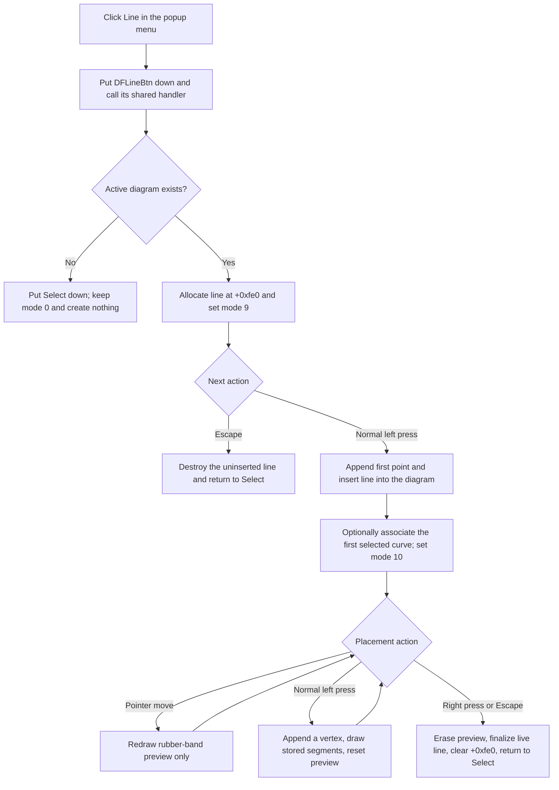

# Arm the Line drawing tool

> Analysis status: Evidence-backed source review complete.

## Control

| Property | Recovered value |
| --- | --- |
| Form | DFWindow |
| Component path | DFWindow.DFPopupMnu.LineMnu |
| Control class | TMenuItem |
| Caption | Line |
| Hint | Not present in the recovered resource. |
| Text | Not present in the recovered resource. |
| Handler name | LineMnuClick |
| Handler address | 01a7b920 |
| Graph node | `resource:dfm:DFWindow/DFWindow.DFPopupMnu.LineMnu` |
| Handler node | `function:01a7b920` |
| Graph layer | UI |

## What happens when clicked

`FUN_01a7b920` is a popup-menu wrapper for the paired `DFLineBtn` toolbar command. It puts that speed button into its down state and calls `FUN_01a7b4f0`, the same handler that the toolbar button uses. The menu wrapper does not inspect the selected objects, create a line, assign points, or modify the diagram itself.

The shared handler records command name `DFLineBtn`. If DFWindow has no active diagram at form offset `+0x798`, it puts the Select button down and calls the Select handler. The form stays in interaction mode `0`. No line object is allocated, no collection changes, and no error message appears.

With an active diagram, the shared handler allocates a line object through `FUN_00f10f20`, stores it at form offset `+0xfe0`, and writes interaction mode `9` at `+0x7a8`. This only arms the drawing tool. The menu click does not insert an object or use the coordinates where the popup menu was opened.

## Point entry and selection behavior

The form mouse-down handler consumes mode `9` only on its normal left-button path with the recovered Shift-state bit clear. It appends the pointer coordinate as the first point. It then calls `FUN_01ae4b90`, which inserts the object into the active diagram's `+0xe0` collection under name `Circle/Line`, assigns the active diagram at line field `+0x78`, initializes a zero-length rubber-band preview, and changes the form to mode `10`.

Selection is optional. The insertion helper collects the current selection. If its exact category is `2`, which other DFWindow paths establish as curves, it associates the line with the first selected curve at field `+0x80` and registers the line with that curve. Empty, mixed, and other selection categories leave this field empty and do not block insertion. The handler does not replace the current selection or require the selected curve to be under the pointer.

In mode `10`, each further normal left-button press appends another point. The handler removes the old rubber-band preview, draws the stored line through its normal virtual draw method, and starts a new preview from the last clicked point. Pointer movement does not append freehand samples. It only erases and redraws the rubber-band segment from the last vertex to the current pointer.

## Completion and geometry boundaries

A right-button press in mode `10` erases the rubber-band preview, calls the line object's finalization method, clears form field `+0xfe0`, puts Select down, and returns the form to mode `0`. The common Escape path performs the same finalization for mode `10` and then refreshes the active diagram. Mouse release has no mode-`9` or mode-`10` commit branch.

Escape before the first point has different behavior. In mode `9`, it destroys the uninserted object at `+0xfe0`, clears that field, returns to Select mode, resets the cursor, and refreshes the active diagram. It therefore cancels without a model change. Escape after the first point retains the line because insertion already occurred.

The point append helper grows its coordinate array in blocks of 50 points. It accepts repeated coordinates for the first three stored points; after that, it ignores a coordinate that exactly duplicates the current final point. The placement path does not require two distinct points. A line can therefore be finalized with only one stored point or with repeated early points.

## Style defaults and the separate Properties command

The constructor creates the line's pen object and reads application settings named `Line width`, `Line color`, and `Line style`. Their recovered fallback values are `2`, `0xff0000`, and `0`. The source does not recover a symbolic color name for the numeric color value.

`LineMnu` is a creation command, not an existing-line style command, and it opens no dialog. A separate shared Properties path recognizes the line class. That later command copies the selected line's pen into a modal style dialog. Modal result `2` returns without changing the line or the defaults. On acceptance, it copies the edited pen back to the selected line and stores the new values under `Line width`, `Line color`, and `Line style`. This later dialog does not run during the Line menu click or placement state machine.

## No-op and error boundaries

- A missing active diagram falls back to Select and reports no error.
- A Shift-modified left press does not enter the mode-`9` or mode-`10` line branches. A right press in mode `9` also does not insert or finalize the uninserted object. The tool remains armed unless another interaction changes its mode.
- When a line grows beyond its current point-array capacity, the append helper tries to expand the array by 50 points. If the recovered allocation limit rejects that growth, the helper restores the old count and capacity and returns without an error message. Its caller does not test whether the append succeeded, so placement continues with the points that were already stored.
- If the shared activation handler is invoked again while mode `9` is already armed, it allocates another line and overwrites form field `+0xfe0` without an explicit cleanup call. The speed-button group can affect whether the normal UI emits this repeated event, so the source does not prove that a user can reach this condition.
- The activation, insertion, drawing, and completion paths have no local exception handler or rollback transaction. Allocation, collection, drawing, and virtual-method failures can propagate to higher-level Delphi handling. A failure after the first-point insertion can leave a partial line in the live diagram.

## Redraw, modified state, and persistence

The line enters the live diagram model at the first point, not when placement finishes. The preview helper draws the temporary segment directly on the diagram canvas. Further left presses draw the stored line before they reset the preview. Right-click completion finalizes the object without a broad diagram refresh; Escape completion also calls the diagram interaction-refresh helper.

No explicit undo-record call, document-save call, or file write occurs in this path. The direct menu handler, shared activation handler, insertion helper, and mouse handlers also do not explicitly set DFWindow's recovered document-modified flag. The diagram collection can have an internal change notification, but this call path does not expose it. The source therefore does not prove whether insertion marks the document modified.

The line class is registered as archive type `0x407`. `FUN_00f11ef0` writes the point-array capacity and count, every stored coordinate, line flags, pen/style data, optional secondary coordinates, and the active-diagram and selected-curve object identifiers. `FUN_00f11cf0` restores those fields, resolves the owner references, re-registers the line with its selected curve when present, and adds it to the active diagram under name `Line`. This proves that a later normal diagram save can preserve the line. This control does not invoke the serializer.

## Click and drawing flow

## Handler and model evidence

- Popup-menu wrapper: [FUN_01a7b920](../../../DecompiledSources/Tina16/functions/0000000001A7B920__FUN_01a7b920.c)
- Shared toolbar activation and active-diagram guard: [FUN_01a7b4f0](../../../DecompiledSources/Tina16/functions/0000000001A7B4F0__FUN_01a7b4f0.c)
- Line construction and recovered style defaults: [FUN_00f10f20](../../../DecompiledSources/Tina16/functions/0000000000F10F20__FUN_00f10f20.c)
- First point, further vertices, right-click completion, and selection-mode boundaries: [FUN_01a730e0](../../../DecompiledSources/Tina16/functions/0000000001A730E0__FUN_01a730e0.c)
- Diagram insertion and optional selected-curve association: [FUN_01ae4b90](../../../DecompiledSources/Tina16/functions/0000000001AE4B90__FUN_01ae4b90.c)
- Rubber-band preview during pointer movement: [FUN_01a74a50](../../../DecompiledSources/Tina16/functions/0000000001A74A50__FUN_01a74a50.c)
- Point-array append and allocation-limit handling: [FUN_01d2c460](../../../DecompiledSources/Tina16/functions/0000000001D2C460__FUN_01d2c460.c)
- Escape dispatch and mode-specific cleanup: [FUN_01a7d460](../../../DecompiledSources/Tina16/functions/0000000001A7D460__FUN_01a7d460.c) and [FUN_01a7d1a0](../../../DecompiledSources/Tina16/functions/0000000001A7D1A0__FUN_01a7d1a0.c)
- Separate selected-line Properties dialog: [FUN_01ae4cc0](../../../DecompiledSources/Tina16/functions/0000000001AE4CC0__FUN_01ae4cc0.c)
- Archive registration: [FUN_011569a0](../../../DecompiledSources/Tina16/functions/00000000011569A0__FUN_011569a0.c)
- Line loading and serialization: [FUN_00f11cf0](../../../DecompiledSources/Tina16/functions/0000000000F11CF0__FUN_00f11cf0.c) and [FUN_00f11ef0](../../../DecompiledSources/Tina16/functions/0000000000F11EF0__FUN_00f11ef0.c)
- Recovered control resources: [ui-evidence.json](../../../DecompiledSources/Tina16/resources/dfm/ui-evidence.json)

## Resource and annotation limits

- `LineMnu` has caption `Line` and no recovered hint, action, image reference, embedded glyph, shortcut, or same-parent label candidate.
- The paired `DFLineBtn` is a `TSpeedButton` in radio group `1`. It has hint `Line` and a 20 by 20 pixel diagonal-line glyph: [Line toolbar glyph](../../../glyph/0102_DFWindow_DFWindow_DFToolPanel_ToolNoteBook_Diagram_DFLineBtn_Glyph_Data.png).
- The paired toolbar resources support the wrapper relationship. The handler and mouse-state source prove the line creation behavior; the glyph alone does not prove the target model or point-entry rules.
- This Bead owns only the direct popup wrapper annotation for `FUN_01a7b920`. Bead `.364` owns the shared toolbar handler and line constructor. Shared selection, insertion, point, mouse-event, properties, redraw, and serialization functions remain call-path evidence here.
