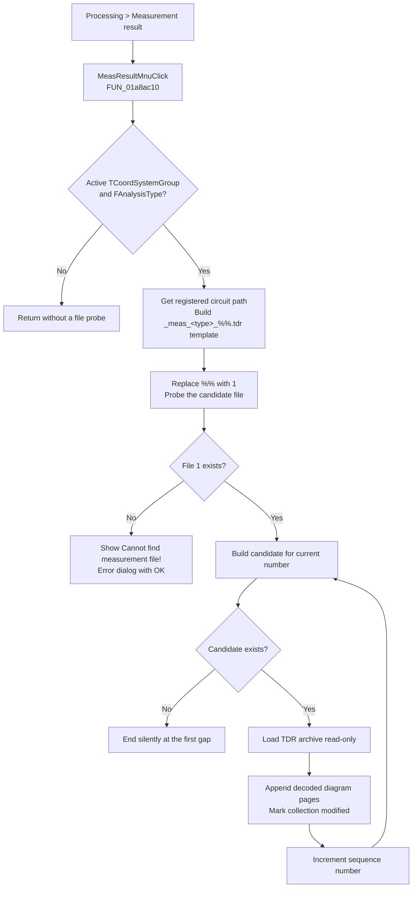

# Open saved measurement-result diagrams

> Analysis status: Complete. The recovered handler, string operations, file probes, TDR loader, resource string, and `TCoordSystemGroup` RTTI establish the behavior.

## Control

| Property | Recovered value |
| --- | --- |
| Form | `DFWindow` (`TDFWindow`) |
| Component path | `DFWindow.DFMainMenu.DFProcessingMnu.MeasResultMnu` |
| Menu path | **Processing > Measurement result** |
| Control class | `TMenuItem` |
| Caption | `Measurement result` |
| Handler name | `MeasResultMnuClick` |
| Handler address | `01a8ac10` |
| Graph node | `resource:dfm:DFWindow/DFWindow.DFMainMenu.DFProcessingMnu.MeasResultMnu` |
| Handler node | `function:01a8ac10` |
| Graph layer | UI |

The resource has no hint, image, action, or shortcut for this item. The caption identifies the command, but the file-loading behavior below comes from the recovered code.

## Result source

The command does not use the selected curve, cursor, or a result-table row. It reads two other sources:

1. `TDFWindow + 0x798` supplies the active `TCoordSystemGroup`. Recovered `TCoordSystemGroup` RTTI names the UnicodeString at group offset `+0x60` as `FAnalysisType`. The handler requires both the group pointer and this string to be non-null.
2. Application field `+0x2788` supplies the current circuit or document object. `FUN_019ac280` finds the matching application record and copies the record's registered name or path. The record lookup returns `noname` in a separate name-formatting caller when no record exists, which confirms that record offset zero is its name string. This handler receives an empty string when its own lookup fails.

The handler inserts `FAnalysisType` unchanged into a file-name template. It does not map the value through a menu selection or a unit table.

## File-name construction

The code concatenates this suffix template:

```text
_meas_<FAnalysisType>_%%.tdr
```

It then makes a case-sensitive replacement of the first `.tsc` in the registered circuit name or path with that suffix. For example, a registered path `C:\Work\Filter.tsc` and an `FAnalysisType` value `AC` produce this template:

```text
C:\Work\Filter_meas_AC_%%.tdr
```

For each candidate, the code replaces `%%` with the decimal sequence number. The first candidate is therefore `C:\Work\Filter_meas_AC_1.tdr`.

The handler does not normalize the path, search another folder, or open a file-selection dialog. The replacement flags are zero, so an uppercase `.TSC`, a missing extension, or an earlier lowercase `.tsc` in a directory name is not corrected. If the application record lookup produces an empty name, the first file probe fails.

## What happens when clicked

The handler first probes the number-one file through `FUN_00440a20`, the recovered Delphi file-existence check.

- If `_1.tdr` does not exist, it loads resource string `0xFA82` and shows an error-style message with an OK button: **Cannot find measurement file!** It does not try `_2.tdr` or change the diagram collection.
- If `_1.tdr` exists, it starts at sequence number one. It builds the candidate path, probes it, and passes each existing file to the shared TDR loader `FUN_01156520`. It increments the number after each load.
- The first missing file after `_1.tdr` ends the loop without another message. The numbering must therefore be contiguous. A missing `_2.tdr` prevents the command from checking `_3.tdr` and later files.

The shared loader opens each file read-only with deny-write sharing, reads the TDR archive header, and dispatches its objects to the global `TCoorSysGrpCollection`. Recovered coordinate-system groups are appended as diagram pages and page tabs. Existing pages are not cleared. The page-add path marks the collection modified.

The click handler does not calculate a measurement, select a result row, or extract one curve from the archive. It also does not select measurement units or convert values. Any axes, labels, units, curves, and other presentation state that appear come from the serialized TDR content and its object readers, not from this menu handler.

## Display and persistence effects

The handler has no direct repaint, page-selection, or command-state refresh call. The common archive reader activates page zero only when the collection has no active page. Normal use of this command already requires an active group at `TDFWindow + 0x798`, so loaded groups are appended while the existing page stays active. New tabs can appear, but this handler does not select them.

The appended pages are in-memory state. Adding them sets the collection's modified flag, so a later diagram save can persist them. This command does not write a TDR file, modify or delete the measurement-result files, write `TINA.INI`, or update another settings store.

Repeated clicks use the same source and start again at sequence number one. There is no duplicate check or collection clear, so the loader can append the same saved result pages again.

## Guards and failure behavior

- A null active group or a null `FAnalysisType` is a silent no-op. No file probe or message occurs.
- A missing number-one file shows **Cannot find measurement file!** and stops.
- A missing later file silently ends the contiguous sequence.
- `FUN_00440a20` confirms that a candidate is a file, but it does not validate the TDR format before the loader starts.
- The TDR loader copies a nonzero archive error to shared application error state. The click handler does not inspect that error, show an archive-specific message, or undo objects that were already appended. It can continue to the next numbered file after a normal loader return.
- The handler and loader have no local exception handler. A stream or deserialization exception can stop the sequence. Pages appended before that exception remain in the collection.

## Click flow



## Evidence

- [Click handler `FUN_01a8ac10`](../../../DecompiledSources/Tina16/functions/0000000001A8AC10__FUN_01a8ac10.c) checks the active group and `+0x60`, builds the template, probes numbered files, invokes the TDR loader, and owns the first-file message branch.
- [UnicodeString concatenation wrapper `FUN_00416cd0`](../../../DecompiledSources/Tina16/functions/0000000000416CD0__FUN_00416cd0.c) and [its implementation `FUN_004161c0`](../../../DecompiledSources/Tina16/functions/00000000004161C0__FUN_004161c0.c) join `_meas_`, `FAnalysisType`, and `_%%.tdr`.
- [String replacement wrapper `FUN_005b84f0`](../../../DecompiledSources/Tina16/functions/00000000005B84F0__FUN_005b84f0.c) delegates to [the recovered replacement implementation `FUN_00450070`](../../../DecompiledSources/Tina16/functions/0000000000450070__FUN_00450070.c). Flags zero make both replacements case-sensitive and single-occurrence.
- [Registered-name helper `FUN_019ac280`](../../../DecompiledSources/Tina16/functions/00000000019AC280__FUN_019ac280.c) resolves the application record and copies its name string. This shared helper remains unannotated here.
- [File probe `FUN_00440a20`](../../../DecompiledSources/Tina16/functions/0000000000440A20__FUN_00440a20.c) rejects missing paths and directories. This shared helper remains unannotated here.
- [Single-file TDR loader `FUN_01156520`](../../../DecompiledSources/Tina16/functions/0000000001156520__FUN_01156520.c) opens and reads one archive. Its canonical annotation belongs to `TIARA-diz.6.7.284`.
- [Collection archive reader `FUN_01ced260`](../../../DecompiledSources/Tina16/functions/0000000001CED260__FUN_01ced260.c) appends decoded coordinate-system groups and activates page zero only when no page is active.
- [Page-add helper `FUN_01cec150`](../../../DecompiledSources/Tina16/functions/0000000001CEC150__FUN_01cec150.c) adds a group and tab and sets the modified flag.
- The recovered main-module `RT_STRING` block maps resource ID `0xFA82` to `Cannot find measurement file!`. The same runtime RTTI maps `TCoordSystemGroup + 0x60` to `FAnalysisType`.
- UI binding and caption: [ui-evidence.json](../../../DecompiledSources/Tina16/resources/dfm/ui-evidence.json).

## Analysis limits

- The recovered source does not enumerate the possible `FAnalysisType` strings in this handler. This article does not assign a meaning to an unobserved value.
- The handler does not expose a unit choice. Unit interpretation belongs to the saved diagram objects and their readers.
- A live UI test was not performed. The DFM binding, recovered function body, runtime strings, RTTI fields, and archive-loader path agree on the documented behavior.
