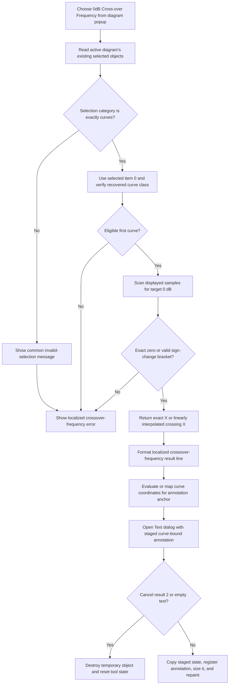

# Add a 0 dB crossover annotation from the diagram popup

> Analysis status: Reviewed from the recovered popup and Processing-menu bindings, curve-selection guard, crossing scanner, interpolation, anchor calculation, staged Text dialog, annotation commit, and failure boundaries.

## Control

| Property | Recovered value |
| --- | --- |
| Form | DFWindow |
| Component path | DFWindow.DFPopupMnu.N0dBCrossoverFrequencyPuMnu |
| Control class | TMenuItem |
| Caption | 0dB Cross-over Frequency ... |
| Hint | Not present in the recovered resource. |
| Text | Not present in the recovered resource. |
| Handler name | DFCrossoverFrequencyMnuClick |
| Handler address | 01a860e0 |
| Other binding | DFWindow.DFMainMenu.DFProcessingMnu.DFCrossoverFrequencyMnu |
| Graph node | `resource:dfm:DFWindow/DFWindow.DFPopupMnu.N0dBCrossoverFrequencyPuMnu` |
| Handler node | `function:01a860e0` |
| Graph layer | UI |

## Popup-specific selection context

The diagram popup item and the Processing-menu `0dB Cross-over Frequency ...` item resolve to the same `TDFWindow.DFCrossoverFrequencyMnuClick` handler.

The shared handler has no Sender parameter. It receives no popup position, hovered object, curve identifier, or popup owner. It asks the active diagram at DFWindow `+0x798` for its existing selected-object list.

Thus a right-click location alone does not select the analyzed curve in this recovered OnClick path. Any selection update that occurs before the popup opens is outside this handler. When several eligible curves are already selected, the calculation uses list item `0`; it does not calculate every selected curve.

## Curve eligibility

The shared selection classifier must return category `2`. Other diagram paths establish this as the curve category. A mixed selection fails because the classifier combines the selected-object category bits.

The crossover guard then checks that selected item `0` is the recovered curve class. It supplies that curve's data references at `+0xd0` and `+0xe0` to the calculation chain.

The failure messages depend on where eligibility fails:

- A selection whose combined category is not exactly `2` first gets the common invalid-selection message. The handler then also displays the localized crossover-frequency error.
- A curve-category selection whose first object fails the recovered curve-class check reaches the handler's crossover-frequency error.
- A valid first curve with no usable crossing also reaches only the crossover-frequency error path proved here.

No annotation object or Text dialog is created on these calculation-failure paths.

## Crossing search and interpolation

The calculation wrapper creates a temporary curve-data adapter and asks the scanner to find displayed value `0.0`.

The scanner reads samples in provider order:

- If a sample's displayed scalar is exactly zero, it returns that sample's horizontal coordinate.
- Otherwise, it looks for adjacent values on opposite sides of zero.
- It checks the recovered provider-domain bounds for that bracket.
- For a valid bracket, it calculates the horizontal crossing with linear interpolation:

`previousX + (currentX - previousX) * (0 - previousY) / (currentY - previousY)`

- If it finds no exact zero or valid bracket, it returns failure.

The scan stops at the first accepted result. If a curve crosses 0 dB more than once, this command does not show a choice list.

The handler formats the returned coordinate through the application numeric formatter and appends it to localized resource `DrawWind.CrossOverFrequency`. The source proves the zero target and formatted coordinate; the translated prefix itself is not embedded as readable handler text.

## Annotation anchor and Text dialog

After a successful crossing, the handler recalculates the selected curve's provider and clears two recovered global coordinate-work fields.

For the normal provider branch, it keeps the crossover frequency as the horizontal coordinate and evaluates the curve at that frequency for the vertical coordinate. For the special recovered provider class, it calls the provider's coordinate-mapping method, which returns both anchor coordinates.

The handler passes the generated result line, selected curve, and anchor coordinates to `FUN_01a8a3c0`. That helper creates a temporary system-text object, binds it to the curve and data coordinates, and opens `CSysTextDlg`, captioned `Text`, with a staged copy.

The staged dialog can change the generated text and system-text styling. Commit requires both conditions:

- the modal result is not `2`, the recovered Cancel result;
- the staged text contains at least one line.

Cancel or empty staged text destroys the temporary annotation, clears the current-object field, and resets the recovered DFWindow tool state to `0`.

Acceptance with non-empty text copies the staged values, preserves the selected curve and calculated coordinates, registers the text object with the active diagram, calculates its display dimensions, repaints its rectangle, and changes the recovered tool state to `6`.

## Document and undo boundaries

A successful commit adds one live curve-bound text object to the active diagram. The selected curve's samples and data references are not changed.

The click path has no document serializer, file Save command, INI writer, database writer, dirty-state write, or undo-stack registration. It does not prove that the project file is written at click time. A later normal diagram or document save can preserve the annotation.

The shared handler and its calculation and annotation helpers are canonically owned by `TIARA-diz.6.7.293`. This article's fragment duplicates only the required complete handler annotation.

## Click flow

## No-op, error, and partial-state behavior

- The handler has no active-diagram null guard. A direct or stale popup invocation without an active diagram can fail in selection collection.
- Invalid selection, an ineligible first object, and no accepted 0 dB crossing create no annotation.
- Cancel and empty staged text also create no annotation. These are normal rejection paths with explicit temporary-object destruction.
- The popup resource contains no separate target or enabled-state evidence. Any normal menu gating is outside this OnClick body.
- The handler and calculation helpers have no local exception handler, retry, or alternate-crossing branch.
- The annotation helper has explicit cleanup for Cancel and empty text, but no recovered transaction around accepted-object registration. An exception after allocation or during registration can leave partial in-memory state until higher-level Delphi cleanup runs.
- Error dialogs do not modify the selected curve. The recovered path does not store a failed numeric result.

## Handler and call-path evidence

- Shared popup and Processing-menu handler: [FUN_01a860e0](../../../DecompiledSources/Tina16/functions/0000000001A860E0__FUN_01a860e0.c) requests the crossing, formats the result, finds the first selected curve, calculates the anchor, and starts the annotation editor.
- Selection and crossover guard: [FUN_01ae69f0](../../../DecompiledSources/Tina16/functions/0000000001AE69F0__FUN_01ae69f0.c) requires curve-category selection, verifies item `0`, and obtains its 0 dB crossing. Its canonical annotation is owned by `TIARA-diz.6.7.293`.
- Selected-curve wrapper: [FUN_01ab5660](../../../DecompiledSources/Tina16/functions/0000000001AB5660__FUN_01ab5660.c) passes the first curve's data references into the crossing chain.
- Adapter and search wrapper: [FUN_01abe920](../../../DecompiledSources/Tina16/functions/0000000001ABE920__FUN_01abe920.c) constructs the temporary data adapter and requests target zero. Its canonical annotation is owned by `.293`.
- Crossing scanner: [FUN_01abe710](../../../DecompiledSources/Tina16/functions/0000000001ABE710__FUN_01abe710.c) returns an exact sample coordinate or a linearly interpolated bracket result. Its canonical annotation is owned by `.293`.
- Annotation editor and commit helper: [FUN_01a8a3c0](../../../DecompiledSources/Tina16/functions/0000000001A8A3C0__FUN_01a8a3c0.c) stages, rejects, or commits the curve-bound system-text object. Its canonical annotation is owned by `.293`.
- Shared selection classifier: [FUN_01acff30](../../../DecompiledSources/Tina16/functions/0000000001ACFF30__FUN_01acff30.c) builds the selected-object list and category.
- Text-dialog loader: [FUN_0146a9a0](../../../DecompiledSources/Tina16/functions/000000000146A9A0__FUN_0146a9a0.c) copies the temporary annotation into the staged `CSysTextDlg` controls.
- Recovered component tree: [ui-evidence.json](../../../DecompiledSources/Tina16/resources/dfm/ui-evidence.json) proves that the popup and Processing-menu resources share handler `01a860e0` and caption `0dB Cross-over Frequency ...`.
- Complexity: complex; the graph records fourteen distinct outgoing calls from `FUN_01a860e0`.

## Resource evidence

- This resource is `N0dBCrossoverFrequencyPuMnu` in the diagram popup menu.
- Its caption is `0dB Cross-over Frequency ...`.
- The Processing menu has a separate `DFCrossoverFrequencyMnu` item with the same caption and handler.
- The ellipsis agrees with the proven Text dialog, but the dialog call provides the behavioral proof.
- The popup item has no hint, action, image-list reference, embedded glyph, checked state, radio state, or nearby label candidate.

## Analysis limits

- The original Delphi enum name for selection category `2` is not recovered. The downstream class test and curve fields establish its curve use here.
- The source does not prove which pointer or keyboard action selected the first curve before the popup opened.
- It proves the first accepted crossing in provider order, not which visual crossing a user would prefer when several exist.
- The original curve variable names, translated result prefix, and final device-specific annotation position are not recovered.
- No project-save or undo behavior is visible in this call tree.
