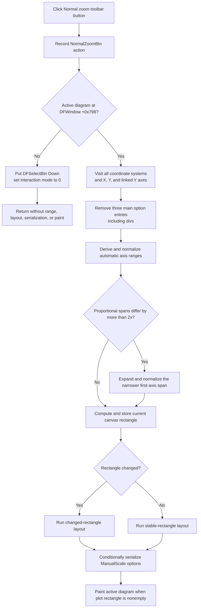

# Restore normal ranges for all axes in the active diagram

> Analysis status: Source reviewed through the active-diagram guard, automatic
> range calculation, option reset, layout, conditional serialization, repaint,
> and failure boundaries.

## Control

| Property | Recovered value |
| --- | --- |
| Form | DFWindow |
| Component path | DFWindow.DFToolPanel.ToolNoteBook.Diagram.NormalZoomBtn |
| Control class | TSpeedButton |
| Caption | Not present in the recovered resource. |
| Hint | Normal zoom |
| Text | Not present in the recovered resource. |
| Handler name | NormalZoomBtnClick |
| Handler address | 01a7a150 |
| Graph node | `resource:dfm:DFWindow/DFWindow.DFToolPanel.ToolNoteBook.Diagram.NormalZoomBtn` |
| Handler node | `function:01a7a150` |
| Graph layer | UI |

## What happens when clicked

`FUN_01a7a150` is an immediate all-axis automatic-range command. It does not
enter a zoom interaction mode, wait for a drag rectangle, restore a zoom
history entry, or target the current selection.

The handler first submits a macro/action record named `NormalZoomBtn`. It then
tests DFWindow's active-diagram field at offset `0x798`.

When an active diagram exists, the handler performs these operations:

1. Calls `FUN_01ad9580` with a null caption filter, stored-option reset
   enabled, and its internal redraw flag disabled.
2. Recalculates the available DFWindow canvas rectangle and stores it in the
   active diagram.
3. Selects one of two diagram layout paths according to whether that rectangle
   changed.
4. Requests diagram-option persistence.
5. Repaints the active diagram.

The command affects only the active diagram. It does not walk other pages or
diagram objects in the manager. It also does not clear the current object
selection, change the interaction-mode byte, or set a drawing cursor on the
active-diagram path.

## All-axis range reset

`FUN_01ad9580` walks every coordinate system in the active diagram. For each
coordinate system it visits:

- every X axis;
- every Y axis; and
- a linked secondary axis at Y-axis offset `0x118`, when present.

The null caption filter means that no axis is excluded by caption. The command
also has no selected-axis or selected-curve filter.

Before each resolvable axis range is derived, `FUN_01ad85f0` calls the
stored-option removal helper because this command supplies reset flag `1`.
That helper removes three entries from the axis option store's `main` section
when they exist. The recovered source names one key `divs`; the two other key
literals remain unresolved. Adjacent axis option code treats the corresponding
range option group as minimum, maximum, and division state, but this article
does not assign unreadable literals to the two unresolved addresses.

The lower calculator derives ranges from the data objects attached to each
axis. Its recovered type-specific branches include:

- minimum lower and maximum upper bounds across attached curves;
- a fixed range from `-1` through `1`;
- a symmetric range around zero from the largest absolute extent; and
- bounds from compatible diagram figures with ten-percent padding.

Eligible numeric branches expand degenerate or very narrow intervals, choose
usable endpoints, and calculate bounded axis divisions. The result is copied
to both recovered axis range pairs at offsets `0xB8`/`0xC0` and
`0xC8`/`0xD0`.

After it processes one coordinate system, the coordinator applies proportional
span correction. When the recovered `Proportional` flag is set and the first
X- and Y-axis spans differ by more than a factor of two, the helper expands
the narrower span around its midpoint and normalizes it again. It does not
shrink the wider span.

## Difference from Default ranges and the menu command

The popup command [Default ranges](setdefaultsmnu-d7a98a6d49.md) targets only
item zero of the current axis selection. It calls the same automatic-range
calculator with stored-option reset disabled, keeps the three option entries,
and performs a targeted coordinate-system refresh.

This **Normal zoom** toolbar command has a wider scope. It resets all X, Y, and
linked secondary axes, removes the three stored option entries, recalculates
the complete active-diagram layout, and repaints the diagram.

The [Normal zoom menu item](dfnormalzoommnu-bd2c97619c.md) is a wrapper for
this same toolbar action. The wrapper first puts `NormalZoomBtn` in its Down
state and then calls `FUN_01a7a150`. A direct toolbar click enters the shared
handler without that wrapper call. The handler does not read the speed
button's Down state, and the resource has no recovered `GroupIndex` or
`AllowAllUp` property. This is not a retained zoom tool.

## Layout, repaint, and persistence

After the range walk, `FUN_01a782f0` computes the canvas rectangle from the
current DFWindow panels and available client area. `FUN_01acf9e0` compares it
with the diagram's stored rectangle, writes the new rectangle, and returns
whether it changed.

A changed rectangle selects `FUN_01acfa60`; an unchanged rectangle selects
`FUN_01acfc60`. Both paths recalculate diagram geometry for coordinate
systems, axes, curves, figures, and related drawing objects. Their internal
layout details differ, but both prepare the same active diagram for repaint.

Before painting, `FUN_01add6f0` checks **Diagram Page Setup / ManualScale**.
When `ManualScale` is false, this call writes nothing. When it is true, it
serializes the current diagram options, including the new axis ranges, through
`DiagOpt.tmp` and copies them to the associated diagram-data object. The
handler does not call a document Save operation, set a recovered document
modified flag, or create an undo record.

`FUN_01aceb90` then paints the active diagram. Painting is a no-op when the
recovered plot rectangle has zero width or height.

A repeated click runs the full range, layout, conditional serialization, and
paint sequence again. There is no equality guard for an already-normal range.
An active diagram with no coordinate systems changes no axes, but still
reaches rectangle calculation, layout, the persistence check, and paint.

## No active diagram, errors, and partial changes

If no active diagram exists, the handler does not call any range, layout,
serialization, or paint helper. It puts `DFSelectBtn` in its Down state and
calls the Select handler, which records `DFSelectBtn` and sets DFWindow's
interaction-mode byte at `0x7A8` to `0`.

The shared DFWindow command-state updater normally disables both the toolbar
button and the Normal zoom menu item when there is no active diagram. The
handler still has the null branch above, so a direct or stale call remains
safe from null diagram access. It has no selected-object, zoom-scale, or zoom-
history guard.

An axis that cannot be resolved to its owning diagram objects is left
unchanged. Some type-specific range branches assume that required attached
collections contain item zero. The handler does not add a structural check for
malformed coordinate systems.

No dialog, confirmation, user-facing error message, local exception handler,
retry, transaction, or rollback is recovered. Axis option entries and range
fields change before layout, serialization, and painting. If a later call
raises an exception, some axes can therefore have new in-memory ranges while
the display or stored ManualScale options remain old.

## Click flow

## Handler and downstream evidence

- [Direct toolbar handler](../../../DecompiledSources/Tina16/functions/0000000001A7A150__FUN_01a7a150.c)
  owns the macro record, active-diagram guard, all-axis call, layout choice,
  persistence request, and repaint sequence.
- [`FUN_01ad9580`](../../../DecompiledSources/Tina16/functions/0000000001AD9580__FUN_01ad9580.c)
  walks every coordinate system and its X, Y, and linked secondary axes. Its
  canonical annotation belongs to Bead `.305`.
- [`FUN_01ad85f0`](../../../DecompiledSources/Tina16/functions/0000000001AD85F0__FUN_01ad85f0.c)
  derives one axis's automatic range and receives reset flag `1` here. Its
  canonical annotation also belongs to `.305`.
- [`FUN_01cd7300`](../../../DecompiledSources/Tina16/functions/0000000001CD7300__FUN_01cd7300.c)
  removes the three stored `main` option entries when present.
- [`FUN_01ce27e0`](../../../DecompiledSources/Tina16/functions/0000000001CE27E0__FUN_01ce27e0.c)
  expands the narrower first-axis span for proportional coordinate systems.
- [`FUN_01a782f0`](../../../DecompiledSources/Tina16/functions/0000000001A782F0__FUN_01a782f0.c)
  computes the available DFWindow canvas rectangle.
- [`FUN_01acf9e0`](../../../DecompiledSources/Tina16/functions/0000000001ACF9E0__FUN_01acf9e0.c)
  compares and stores the active diagram rectangle.
- [`FUN_01add6f0`](../../../DecompiledSources/Tina16/functions/0000000001ADD6F0__FUN_01add6f0.c)
  conditionally serializes diagram options when `ManualScale` is enabled.
- [`FUN_01aceb90`](../../../DecompiledSources/Tina16/functions/0000000001ACEB90__FUN_01aceb90.c)
  repaints the active diagram when its plot rectangle is nonempty.
- [`FUN_01a794b0`](../../../DecompiledSources/Tina16/functions/0000000001A794B0__FUN_01a794b0.c)
  selects interaction mode `0` on the no-active-diagram branch.

## Resource and glyph evidence

- The control is a `TSpeedButton` with hint **Normal zoom**. It has no recovered
  caption, action, image-list reference, checked state, group index, or
  same-parent label candidate.
- [The extracted 20 by 20 pixel glyph](../../../glyph/0096_DFWindow_DFWindow_DFToolPanel_ToolNoteBook_Diagram_NormalZoomBtn_Glyph_Data.png)
  shows a magnifier marked `100`. This supports a normal or full-scale intent;
  the all-axis reset and layout calls prove the exact behavior.

## Analysis limits

- The Delphi enum names for axis orientation and coordinate-system type values
  are not recovered. This article reports only their proven range branches.
- Two option-key literals removed with `divs` are unresolved in
  `FUN_01cd7300`. They are not assigned speculative names here.
- The exact semantic difference between the two rectangle-dependent layout
  helpers is not recovered. Their shared geometry-update effects are proven.
- The helper roles owned by `.305` and `.344` remain evidence only in this
  article. This Bead annotates only the unique toolbar handler.
