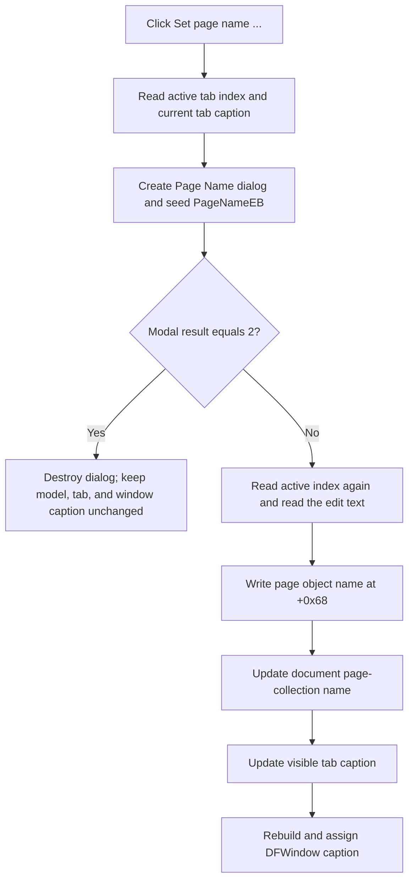

# Rename the active page

> Analysis status: Evidence-backed source review complete.

## Control

| Property | Recovered value |
| --- | --- |
| Form | DFWindow |
| Component path | DFWindow.DFMainMenu.DFViewMnu.PageNameMnu |
| Control class | TMenuItem |
| Caption | Set page name ... |
| Hint | Not present in the recovered resource. |
| Text | Not present in the recovered resource. |
| Handler name | PageNameMnuClick |
| Handler address | 01a79c00 |
| Graph node | `resource:dfm:DFWindow/DFWindow.DFMainMenu.DFViewMnu.PageNameMnu` |
| Handler node | `function:01a79c00` |
| Graph layer | UI |

## What happens when clicked

`FUN_01a79c00` opens the modal `TPageNameDlg` for the active DFWindow page. Before it shows the dialog, it reads the active tab index and copies that tab's current caption into `PageNameEB`. The dialog resource identifies this edit with label `Enter page name::`. It supplies built-in `bkOK` and `bkCancel` bit buttons and has no custom validation event.

If the modal result is `2`, the handler destroys the dialog and changes nothing. This value matches the dialog's recovered `bkCancel` button. Every other modal result takes the rename path. The built-in `bkOK` button supplies the normal accepted result, but the recovered handler itself checks only for result `2`.

## Rename target and state changes

On acceptance, the handler reads the active tab index again and reads the edit text without trimming or normalization. It passes the document model, this index, the new text, and the tab control to `FUN_01cec3f0`. This helper performs three ordered writes:

1. It obtains the page object at the active index and writes the new name to that object's Unicode string field at offset `+0x68`.
2. It updates the name at the same index in the document's page collection.
3. It updates the same index in the tab control's strings collection, which changes the visible tab caption.

After the helper returns, the handler reads the updated active tab caption. It combines the document name or path at document offset `+0x48`, a recovered literal separator, and the page caption, then assigns the result to the DFWindow caption. It does not change the active page index or the diagram contents.

The dialog is created with the application's recovered global owner value, not with the clicked menu item. The decompilation does not recover a symbolic name for that owner.

## Accepted names and cancellation

- An empty string is accepted. It becomes the page object's name, the collection entry, and the visible tab caption. The window title then ends with the recovered separator and an empty page name.
- A duplicate name is accepted. The handler does not scan sibling pages or compare names. Page selection and the update remain index-based.
- Leading and trailing spaces and letter case are preserved. No trim or case conversion is present.
- The current name is accepted again. There is no equality test, so the three stores and the window caption are written again.
- Result `2` is the only explicit no-change branch. The source does not define special handling for another modal result.

## Redraw, dirty state, undo, and persistence

The visible tab text and the DFWindow caption update immediately through their VCL string setters. The handler does not call a diagram redraw, layout, or repaint helper. It also does not add an undo record or preserve the old name for rollback.

The document field at offset `+0x40` is a modified-state flag: other DFWindow code checks it before prompting to save, and the recovered page-add helper sets it to `1`. Neither this click handler nor `FUN_01cec3f0` writes that flag. Therefore, this rename path does not mark the document as modified.

The page serializer `FUN_01ae6130` writes the page object's name field at `+0x68`, and `FUN_01ae5fa0` reads it. A later document save can therefore persist the renamed model value. This click does not call either serializer or any save routine. Because it does not set the modified flag, the recovered path does not prove that a save prompt will appear for this rename alone.

## Error and partial-update boundaries

There is no guard for an invalid active-tab index and no local exception handler. The first indexed tab-text read occurs before the dialog opens, so an invalid index can fail before user input. The handler reads the index again after the modal dialog. Thus, the accepted name applies to the index that is active at acceptance, although normal modal ownership prevents direct interaction with the owner window.

`FUN_01cec3f0` writes the page object, collection, and tab strings in that order. It has no transaction or rollback. If an indexed lookup, virtual collection method, or string assignment raises an exception, earlier writes can remain while later stores and the window caption remain unchanged. The recovered code shows no user-facing error message for these failures.

## Click flow

## Handler and model evidence

- Dialog creation, initial name, modal-result branch, rename call, and window-caption update: [FUN_01a79c00](../../../DecompiledSources/Tina16/functions/0000000001A79C00__FUN_01a79c00.c)
- Ordered page-object, collection, and tab-caption synchronization: [FUN_01cec3f0](../../../DecompiledSources/Tina16/functions/0000000001CEC3F0__FUN_01cec3f0.c)
- Page-object name-field assignment at `+0x68`: [FUN_01ae5ef0](../../../DecompiledSources/Tina16/functions/0000000001AE5EF0__FUN_01ae5ef0.c)
- Active tab selection through native tab message `TCM_GETCURSEL`: [FUN_006d5120](../../../DecompiledSources/Tina16/functions/00000000006D5120__FUN_006d5120.c)
- Tab strings collection access: [FUN_006d6380](../../../DecompiledSources/Tina16/functions/00000000006D6380__FUN_006d6380.c)
- Page-name serialization and deserialization: [FUN_01ae6130](../../../DecompiledSources/Tina16/functions/0000000001AE6130__FUN_01ae6130.c) and [FUN_01ae5fa0](../../../DecompiledSources/Tina16/functions/0000000001AE5FA0__FUN_01ae5fa0.c)
- Modified-flag consumer and page-add producer: [FUN_01a83f90](../../../DecompiledSources/Tina16/functions/0000000001A83F90__FUN_01a83f90.c) and [FUN_01cec150](../../../DecompiledSources/Tina16/functions/0000000001CEC150__FUN_01cec150.c)
- Recovered menu and `TPageNameDlg` resources: [ui-evidence.json](../../../DecompiledSources/Tina16/resources/dfm/ui-evidence.json)

## Resource evidence and limits

- The main-menu item has caption `Set page name ...`. The popup item `Set page name...` uses the same handler.
- The menu item has no recovered hint, action, image-list reference, embedded glyph, or same-parent label candidate.
- `TPageNameDlg` is centered and has caption `Page Name`. `PageNameEB` has no recovered `MaxLength`, change handler, exit handler, or validation handler.
- `OKBtn` has `Kind = bkOK`; `CancelBtn` has `Kind = bkCancel`. Neither button has a custom click handler.
- The recovered source does not establish a maximum accepted name length, a uniqueness rule, an undo facility, or higher-level exception handling.
