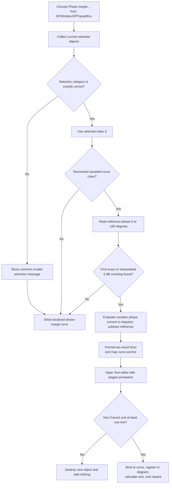

# Add a phase-margin annotation from the DFWindow popup menu

> Analysis status: Evidence-backed from the recovered popup resource, shared handler, selection guard, crossing calculator, and annotation editor.

## Control

| Property | Recovered value |
| --- | --- |
| Form | DFWindow |
| Popup path | DFPopupMnu > Phase margin ... |
| Component path | DFWindow.DFPopupMnu.PhasemarginPuMnu |
| Control class | TMenuItem |
| Caption | Phase margin ... |
| Hint | Not present in the recovered resource. |
| Text | Not present in the recovered resource. |
| Handler name | DFPhaseMarginMnuClick |
| Handler address | `01a86890` |
| Graph node | `resource:dfm:DFWindow/DFWindow.DFPopupMnu.PhasemarginPuMnu` |
| Handler node | `function:01a86890` |
| Handler graph layer | UI |

## Popup-specific route

The recovered form places this item directly under `DFWindow.DFPopupMnu`. Choosing it calls [`FUN_01a86890`](../../../DecompiledSources/Tina16/functions/0000000001A86890__FUN_01a86890.c), the same handler used by the main Processing-menu `Phase Margin ...` item.

The handler does not inspect `Sender`, popup coordinates, or an object under the popup pointer. It uses the diagram's current selection. The recovered resource does not identify which visual surface opens `DFPopupMnu`, so this article does not assign it to a specific canvas or mouse button.

## What happens when clicked

The handler calculates the phase margin of the first eligible selected curve at its first accepted 0 dB magnitude crossing. On success, it formats two localized lines:

- the phase-margin value from `DrawWind.PhaseMargin`;
- the crossing coordinate from `DrawWind.MFreqTxt`.

It then derives an anchor on the selected curve and opens the common Text editor with a new staged system-text annotation. The user can edit, accept, cancel, or empty this text before an object is registered in the diagram.

## Selection and eligibility

[`FUN_01ae6c10`](../../../DecompiledSources/Tina16/functions/0000000001AE6C10__FUN_01ae6c10.c), owned by `.298`, rebuilds the selected-object list through [`FUN_01acff30`](../../../DecompiledSources/Tina16/functions/0000000001ACFF30__FUN_01acff30.c). The combined selection category must equal `2`, which other DFWindow call sites establish as the curve category. A mixed selection does not pass this exact comparison.

The helper then uses only selected index `0` and verifies that it has the recovered sampled-curve class. Several selected curves can pass, but only the first curve is analyzed and linked to the result.

The failure messages depend on the guard:

- Category other than `2`: show the common invalid-selection message, then the handler also shows the localized phase-margin error.
- Category `2` but unsupported first object: show only the phase-margin error.
- Eligible curve but no accepted crossing or calculation failure: show only the phase-margin error.

No staged annotation is created on these failure paths.

## Reference phase and calculation

The handler reads the configured **Gain & phase margin reference phase (degrees)** option. The recovered choices are `0` and `-180`. It passes `-180` when the stored option byte equals `1`; otherwise it passes `0`.

[`FUN_01abeac0`](../../../DecompiledSources/Tina16/functions/0000000001ABEAC0__FUN_01abeac0.c), owned by `.298`, creates a complex-response adapter and asks `.293`'s canonical [`FUN_01abe710`](../../../DecompiledSources/Tina16/functions/0000000001ABE710__FUN_01abe710.c) to find target `0` in the displayed magnitude data:

- An exact 0 dB sample supplies its horizontal coordinate directly.
- Otherwise, the scanner finds the first adjacent pair on opposite sides of 0 dB, checks provider bounds, and linearly interpolates the crossing coordinate in horizontal-coordinate/dB space.
- It returns failure when it finds no exact value or valid bounded sign-change pair.

The calculator evaluates the complex response at that coordinate, obtains its phase angle, converts radians to degrees with factor `57.29577951308232`, and subtracts the configured reference:

`reported phase margin = phase angle in degrees - configured reference phase`

For reference `-180`, this adds 180 degrees to the phase angle. For reference `0`, it reports the raw angle in degrees. The crossing coordinate keeps the curve's horizontal-axis units; this handler does not force a unit such as hertz. When several crossings exist, the scanner uses the first accepted one in provider order.

## Annotation anchor and editor

The handler refreshes the selected curve's provider before it maps the annotation anchor. In the normal provider branch, it uses the crossing coordinate as X and evaluates the curve there for Y. A special recovered provider class supplies both mapped coordinates through its mapping method.

The `.293`-owned [`FUN_01a8a3c0`](../../../DecompiledSources/Tina16/functions/0000000001A8A3C0__FUN_01a8a3c0.c) then creates a temporary system-text object, loads the two generated lines, copies it into `CSysTextDlg`, and shows the editor modally.

The editor result controls insertion:

- Modal result `2` (Cancel): destroy the new object, clear the current-object field, reset tool state to `0`, and add no annotation.
- Non-Cancel with zero text lines: reject and clean up in the same way.
- Non-Cancel with at least one text line: copy the edited text and style, bind the object to the selected curve and anchor coordinates, register and finalize it in the active diagram, calculate its display size, repaint its rectangle, and set tool state to `6`.

The helper performs no phase-margin annotation lookup before creation. Repeated accepted clicks can therefore create separate staged annotations. Automatic merging or duplicate suppression is not proven.

## Click flow

## Document and persistence boundaries

- Failed selection or calculation creates no staged annotation and performs no result repaint.
- Cancel or empty edited text destroys only the new temporary object and leaves the diagram without that annotation.
- Accepted non-empty text changes the live diagram by registering and repainting a curve-bound system-text object.
- Neither the handler nor the canonical annotation helper explicitly writes the recovered document modified byte at `+0x40`. The registration path contains virtual calls whose internal dirty-state effect is not proven here. This article therefore does not claim that the command explicitly marks the document modified.
- This path has no file-save, INI-write, database-write, or explicit undo-stack call. A later general document Save can persist the registered object, but that serialization is outside this click path.
- There is no local exception handler, retry, or transactional rollback. An exception during text-object creation, curve binding, or diagram registration can leave partial in-memory state until outer Delphi cleanup runs.
- The selection helper receives the active diagram without a local null guard. The later annotation helper checks its own diagram field, but this does not protect the earlier selection call. Normal UI lifetime and enablement are outside the recovered handler.

## Handler and helper evidence

- Shared click handler, reference choice, result formatting, and anchor mapping: [FUN_01a86890](../../../DecompiledSources/Tina16/functions/0000000001A86890__FUN_01a86890.c)
- Selection and first-curve guard: [FUN_01ae6c10](../../../DecompiledSources/Tina16/functions/0000000001AE6C10__FUN_01ae6c10.c), canonically annotated by `.298`
- Selected-curve data wrapper: [FUN_01ab5700](../../../DecompiledSources/Tina16/functions/0000000001AB5700__FUN_01ab5700.c)
- Crossing, phase conversion, and reference subtraction: [FUN_01abeac0](../../../DecompiledSources/Tina16/functions/0000000001ABEAC0__FUN_01abeac0.c), canonically annotated by `.298`
- Exact and linearly interpolated crossing: [FUN_01abe710](../../../DecompiledSources/Tina16/functions/0000000001ABE710__FUN_01abe710.c), canonically annotated by `.293`
- Result text editing and diagram registration: [FUN_01a8a3c0](../../../DecompiledSources/Tina16/functions/0000000001A8A3C0__FUN_01a8a3c0.c), canonically annotated by `.293`
- Recovered form and menu resources: [ui-evidence.json](../../../DecompiledSources/Tina16/resources/dfm/ui-evidence.json)

## Resource and evidence limits

- `DFWindow.DFPopupMnu.PhasemarginPuMnu` has caption `Phase margin ...` and binds `OnClick` to `DFPhaseMarginMnuClick` at `01a86890`.
- The main Processing-menu item has caption `Phase Margin ...` and resolves to the same handler.
- The popup item has no recovered hint, action, shortcut, checked state, image reference, glyph, or same-parent label candidate.
- `DFPopupMnu` has no recovered `OnPopup` handler. The available evidence does not prove whether another path changes this item's enabled or visible state before display.
- The magnitude-to-dB helper returns fallback value `0` when magnitude is not positive. The scanner can therefore treat such a sample as an exact target; the source does not prove whether upstream data excludes this case.
- The original Delphi enum names, translated result prefixes, and any later duplicate-merging policy are not recovered.
- No live UI test was performed.
